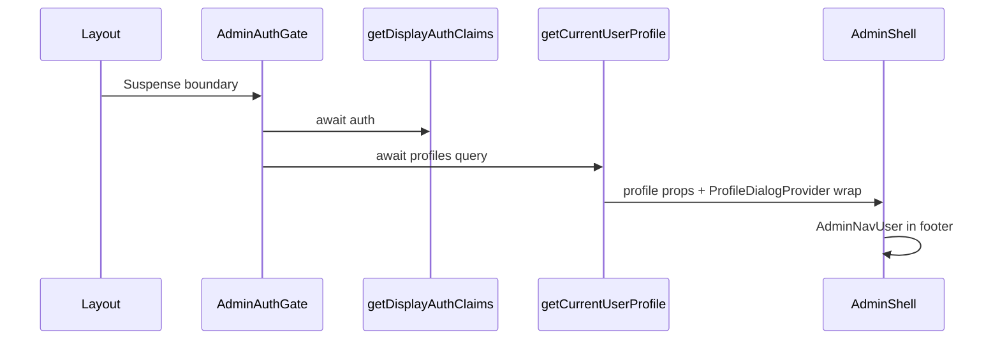
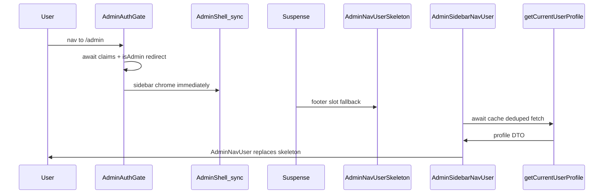

# Restructure admin sidebar nav loading (mirror app header split)

## Problem recap

Today [`admin-auth-gate.tsx`](src/app/admin/_components/admin-auth-gate.tsx) is an **async** server component that `await`s both `getDisplayAuthClaims()` (auth — correct) **and** [`getCurrentUserProfile()`](src/app/(app)/_lib/get-current-user-profile.ts) (profile display — the bottleneck) before rendering [`AdminShell`](src/app/admin/_components/admin-shell.tsx). The layout wraps the entire gate in Suspense ([`layout.tsx`](src/app/admin/layout.tsx) → [`AdminShellSkeleton`](src/app/admin/_components/admin-shell-skeleton.tsx)), but that full-shell fallback **does not reliably appear on client-side navigation** — same class of issue the (app) header had before its fix. Users see a blank/late sidebar footer user button instead of a skeleton-then-content transition.

**Current blocking chain:**



**Target chain** (auth stays blocking; profile streams):



## Key difference from (app) header

[`AppShell`](src/app/(app)/_components/app-shell.tsx) is a **sync server component** — it can import [`AppHeaderAccountNavSlot`](src/app/(app)/_components/app-header-account-nav-slot.tsx) directly.

[`AdminShell`](src/app/admin/_components/admin-shell.tsx) is a **`'use client'`** component (SidebarProvider interactivity). Client components **cannot** import async server children. The Suspense slot must be **composed in the server parent** ([`AdminAuthGate`](src/app/admin/_components/admin-auth-gate.tsx)) and passed into the client tree as a `ReactNode` prop (standard RSC slot pattern).

## Auth vs profile responsibilities

| Concern | Stays in `AdminAuthGate` | Moves to async child |
|--------|--------------------------|----------------------|
| `getDisplayAuthClaims()` | Yes — blocking | No |
| `isAdmin(claims)` + `redirect(APP_HOME)` | Yes — blocking | No |
| `cookies()` + `parseSidebarOpenCookie` | Yes — fast, shell layout | No |
| `getCurrentUserProfile()` | **Remove** | `AdminSidebarNavUser` |
| Profile props on shell/sidebar | **Remove** | Derived in async child |
| `ProfileDialogProvider` on shell | **Remove** | Wraps `AdminNavUser` only |

`getCurrentUserProfile` is already `cache()`'d — do **not** modify it. The deferred fetch still dedupes within a request if called elsewhere.

## `useProfileDialog()` audit

Only [`admin-nav-user.tsx`](src/app/admin/_components/admin-nav-user.tsx) calls `useProfileDialog()` under `/admin/**`. No admin page content in `SidebarInset` uses it. Safe to move `ProfileDialogProvider` off the shell wrapper into the async nav child only.

**Today** (shell-level provider wraps everything):

```
ProfileDialogProvider
├── SidebarProvider
│   ├── AdminSidebar → AdminNavUser (uses useProfileDialog)
│   └── SidebarInset → {children}
└── ProfileSettingsDialog
```

**After** (provider only in async footer child):

```
AdminShell (no provider)
└── SidebarProvider
    ├── AdminSidebar → footer: Suspense → AdminSidebarNavUser
    │   └── ProfileDialogProvider → AdminNavUser + ProfileSettingsDialog
    └── SidebarInset → {children}
```

## Implementation

### 1. Slim `AdminAuthGate` to auth + cookie only

Edit [`admin-auth-gate.tsx`](src/app/admin/_components/admin-auth-gate.tsx):

- Keep `getDisplayAuthClaims()` → `isAdmin()` → `redirect(APP_HOME)` unchanged.
- Keep `cookies()` / `parseSidebarOpenCookie` / `defaultSidebarOpen`.
- **Remove** `getCurrentUserProfile` import and await.
- **Remove** profile-derived props (`userId`, `email`, `displayName`, `bio`, `avatarUrl`, `profileLoadFailed`, email fallback).
- Pass server-composed slot into shell:

```tsx
<AdminShell
  defaultSidebarOpen={defaultSidebarOpen}
  navUserSlot={<AdminSidebarNavUserSlot />}
>
  {children}
</AdminShell>
```

### 2. Unwrap `AdminShell` from profile concerns

Edit [`admin-shell.tsx`](src/app/admin/_components/admin-shell.tsx):

- **Remove** `ProfileDialogProvider` import and wrapper — render `SidebarProvider` as the root.
- **Remove** profile-related props from `AdminShellProps`.
- Add `navUserSlot: React.ReactNode`.
- Pass `navUserSlot` to [`AdminSidebar`](src/app/admin/_components/admin-sidebar.tsx) (e.g. `navUserSlot` prop).

### 3. Update `AdminSidebar` footer to accept slot

Edit [`admin-sidebar.tsx`](src/app/admin/_components/admin-sidebar.tsx):

- **Remove** `email`, `displayName`, `avatarUrl` props and direct `AdminNavUser` import.
- Add `navUserSlot: React.ReactNode`.
- In `SidebarFooter`, render `{navUserSlot}` instead of inline `<AdminNavUser … />`.

Sync chrome (logo, nav items, rail) renders immediately; only the footer slot suspends.

### 4. Add async nav component

**New file:** [`src/app/admin/_components/admin-sidebar-nav-user.tsx`](src/app/admin/_components/admin-sidebar-nav-user.tsx)

Mirror [`app-header-account-nav.tsx`](src/app/(app)/_components/app-header-account-nav.tsx):

- Async server component.
- `const profile = await getCurrentUserProfile()`.
- `const email = profile.email || 'Signed-in user'` (relocate email fallback from gate).
- Return `ProfileDialogProvider` (same props shape as today’s shell-level provider) wrapping `AdminNavUser` with `displayName`, `avatarUrl`, `email`.

### 5. Add sync Suspense slot wrapper

**New file:** [`src/app/admin/_components/admin-sidebar-nav-user-slot.tsx`](src/app/admin/_components/admin-sidebar-nav-user-slot.tsx)

Mirror [`app-header-account-nav-slot.tsx`](src/app/(app)/_components/app-header-account-nav-slot.tsx):

```tsx
<Suspense fallback={<AdminNavUserSkeleton />}>
  <AdminSidebarNavUser />
</Suspense>
```

Single footer instance (unlike the app header’s desktop + mobile dual slots).

### 6. Add `AdminNavUserSkeleton`

**New file:** [`src/app/admin/_components/admin-nav-user-skeleton.tsx`](src/app/admin/_components/admin-nav-user-skeleton.tsx)

Reuse the **approach** from [`app-nav-user-skeleton.tsx`](src/app/(app)/_components/app-nav-user-skeleton.tsx) (`disabled` control, `aria-busy`, `aria-label`, hidden `Skeleton`) — **not** its circular icon-button shape.

Match [`AdminNavUser`](src/app/admin/_components/admin-nav-user.tsx) footer dimensions:

- `SidebarMenu` / `SidebarMenuItem` / `SidebarMenuButton size="lg"` (disabled)
- `Skeleton` `h-8 w-8 rounded-lg` (avatar area)
- `Skeleton` text line for account label (`h-3` / `flex-1` truncate area)
- Optional small skeleton or `aria-hidden` spacer for chevron column (`size-4`)

`aria-label="Loading account menu"` (parallel to app skeleton copy).

### 7. Remove redundant layout Suspense / full-shell fallback

Edit [`layout.tsx`](src/app/admin/layout.tsx):

- Remove outer `<Suspense>` and `AdminShellSkeleton` import.
- Render `<AdminAuthGate>{children}</AdminAuthGate>` directly (mirror post-fix [`(app)/layout.tsx`](src/app/(app)/layout.tsx)).

Delete [`admin-shell-skeleton.tsx`](src/app/admin/_components/admin-shell-skeleton.tsx) — nested footer Suspense replaces its role.

### 8. Tests

| File | Action |
|------|--------|
| [`admin-auth-gate.integration.test.tsx`](src/app/admin/_components/admin-auth-gate.integration.test.tsx) | Update: non-admin path still redirects **without** calling `getCurrentUserProfile`. Admin path renders shell with **no** profile props; assert `navUserSlot` passed (mock shell to capture prop) or mock slot component. Remove profile-attribute assertions on shell. |
| [`admin-shell.unit.test.tsx`](src/app/admin/_components/admin-shell.unit.test.tsx) | Update: shell does **not** render `ProfileDialogProvider`. Pass mock `navUserSlot`; assert sidebar receives it. Remove profile props from test setup. |
| [`admin-sidebar.unit.test.tsx`](src/app/admin/_components/admin-sidebar.unit.test.tsx) | Update: pass `navUserSlot` mock node instead of profile props; assert footer renders slot. |
| **New** `admin-sidebar-nav-user.unit.test.tsx` | Mirror [`app-header-account-nav.unit.test.tsx`](src/app/(app)/_components/app-header-account-nav.unit.test.tsx): mock `getCurrentUserProfile`; assert `AdminNavUser` + `ProfileDialogProvider` props; include email-fallback case (`''` → `'Signed-in user'`). |
| **New** `admin-nav-user-skeleton.unit.test.tsx` | Mirror app skeleton test: disabled loading control, `aria-busy`, hidden skeleton element. |
| [`admin-nav-user.unit.test.tsx`](src/app/admin/_components/admin-nav-user.unit.test.tsx) | Keep unchanged (still tests dropdown behavior with mocked provider). |

Per [`testing.mdc`](.cursor/rules/testing.mdc): no render-only test for deleted `AdminShellSkeleton`; no Suspense-boundary smoke test for the slot wrapper.

### 9. Quality gate

```bash
pnpm type-check && pnpm lint && pnpm format-check && pnpm test:ci
```

## Files touched (expected)

| File | Action |
|------|--------|
| [`admin-auth-gate.tsx`](src/app/admin/_components/admin-auth-gate.tsx) | Edit — auth + cookie only; compose `navUserSlot` |
| [`admin-shell.tsx`](src/app/admin/_components/admin-shell.tsx) | Edit — remove provider + profile props; accept `navUserSlot` |
| [`admin-sidebar.tsx`](src/app/admin/_components/admin-sidebar.tsx) | Edit — footer slot prop |
| [`admin-sidebar-nav-user.tsx`](src/app/admin/_components/admin-sidebar-nav-user.tsx) | Add — async profile + nav |
| [`admin-sidebar-nav-user-slot.tsx`](src/app/admin/_components/admin-sidebar-nav-user-slot.tsx) | Add — Suspense + skeleton |
| [`admin-nav-user-skeleton.tsx`](src/app/admin/_components/admin-nav-user-skeleton.tsx) | Add — footer-sized skeleton |
| [`layout.tsx`](src/app/admin/layout.tsx) | Edit — remove outer Suspense |
| [`admin-shell-skeleton.tsx`](src/app/admin/_components/admin-shell-skeleton.tsx) | Delete |
| [`admin-auth-gate.integration.test.tsx`](src/app/admin/_components/admin-auth-gate.integration.test.tsx) | Edit |
| [`admin-shell.unit.test.tsx`](src/app/admin/_components/admin-shell.unit.test.tsx) | Edit |
| [`admin-sidebar.unit.test.tsx`](src/app/admin/_components/admin-sidebar.unit.test.tsx) | Edit |
| `admin-sidebar-nav-user.unit.test.tsx` | Add |
| `admin-nav-user-skeleton.unit.test.tsx` | Add |

**Unchanged:** [`get-current-user-profile.ts`](src/app/(app)/_lib/get-current-user-profile.ts), [`admin-nav-user.tsx`](src/app/admin/_components/admin-nav-user.tsx), [`profile-dialog-provider.tsx`](src/app/(app)/_components/profile/profile-dialog-provider.tsx), (app) header files.

## Manual test checklist

1. Signed in as admin → navigate to `/admin` — sidebar logo + Users link appear immediately; footer shows **sidebar-shaped skeleton** (not blank); then correct avatar/initials + display name.
2. Client-side nav from `/admin/users` → `/admin` — same skeleton → content transition (no full-shell flash).
3. User with display name — skeleton only, then correct initials (never stale email-based initials during load).
4. User with profile photo + DevTools slow 3G — skeleton → initials → photo (Radix `UserAvatar` loading unchanged).
5. Keyboard — Tab through sidebar during load: skeleton control skipped (`disabled`); after load, footer menu button focusable; Enter/Space opens dropdown; arrow keys navigate items; Profile opens settings dialog.
6. Profile menu → change display name — dialog saves; footer label updates (provider scoped to nav child still works).
7. Non-admin session — `/admin/**` still redirects to `/home` before shell renders (auth gate unchanged).
8. Collapsed sidebar (icon mode) — skeleton and loaded nav user respect `size="lg"` button footprint; no layout jump.
9. No duplicate `id` / `htmlFor` issues — only one footer slot mounts (single provider/dialog instance).

## Out of scope

- Profile warming / sessionStorage cache
- `prefetch={false}` tuning
- (app) header changes (already shipped)
- Avatar image optimization
- AGENTS.md / PRD update (unless requested)
