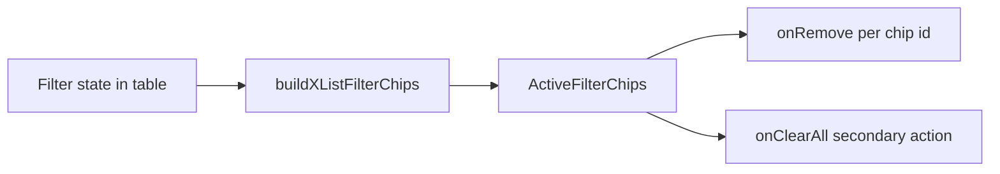

# Admin Console — Tooltip Policy & Cross-Page Fixes

UI-only scope. No schema, migrations, or AGENTS.md changes required unless you run `/sync-repo-docs` after merge to note Logs active-filter chips (Users chips are already documented).

---

## 1. Centralize tooltip defaults

**File:** [`src/components/ui/tooltip.tsx`](src/components/ui/tooltip.tsx)

- Change `TooltipProvider` default `delayDuration` from `0` to **`500`** (matches [`ui-accessibility.mdc` § Tooltips](.cursor/rules/ui-accessibility.mdc)).
- Export a named constant (e.g. `SUPPLEMENTARY_TOOLTIP_DELAY_MS = 500`) for callers that need to document the contrast with sidebar’s explicit `0`.
- Merge the stat-tile fade into **`TooltipContent` default `className`**: adopt the current stat-tile motion (`300ms` animation duration, `zoom-in-100` / `zoom-out-100`, `ease-in-out`, side-aware slide) so all supplementary tooltips share one motion profile. Keep the existing semantic colors and arrow.

**Nested 0ms provider stays untouched:** [`src/components/ui/sidebar/sidebar-provider.tsx`](src/components/ui/sidebar/sidebar-provider.tsx) already wraps sidebar content in `<TooltipProvider delayDuration={0}>` — collapsed-nav instant tooltips remain the deliberate exception.

**Strip redundant local overrides:**

| File | Remove |
| ---- | ------ |
| [`src/components/stat-tile.tsx`](src/components/stat-tile.tsx) | `STAT_TILE_TOOLTIP_DELAY_MS`, `STAT_TILE_TOOLTIP_FADE_CLASS`, `delayDuration={…}`, custom `TooltipContent` className |
| [`src/app/admin/logs/_components/logs-live-toggle.tsx`](src/app/admin/logs/_components/logs-live-toggle.tsx) | `delayDuration={500}` on `Tooltip` |
| [`src/app/admin/logs/_components/logs-toolbar.tsx`](src/app/admin/logs/_components/logs-toolbar.tsx) | `delayDuration={500}` on Mark-all `Tooltip` |

Root layout ([`src/app/layout.tsx`](src/app/layout.tsx)) can stay as bare `<TooltipProvider>` — it will inherit the new 500ms default.

---

## 2. Apply tooltip policy to existing controls

Per [ui-accessibility.mdc § Tooltips](.cursor/rules/ui-accessibility.mdc): default is **no tooltip**; add only for non-inferable icon-only controls or state-dependent behavior.

| Control | Action |
| ------- | ------ |
| Logs level / Unread stat tiles | **No change** — no tooltips (self-evident label + count) |
| Users / Logs refresh icon buttons | **No change** — keep `aria-label` only |
| Logs Live toggle | **Keep** tooltip (state-dependent pause/catch-up copy); inherits centralized delay/motion |
| Logs Total stat tile | **Keep** `"Clear all filters"` (action not obvious from “Total” alone) |
| Logs Mark-all | **Update disabled copy** in [`logs-table.tsx`](src/app/admin/logs/_components/logs-table.tsx): when `filteredUnreadCount === 0`, pass `"No unread logs in the current view."`; otherwise keep existing scoped action copy |
| Settings reset start time ([`banner-starts-at-field.tsx`](src/app/admin/settings/_components/banner-starts-at-field.tsx)) | **No tooltip** — X-in-field with `aria-label="Reset start time to now"` is self-evident; document this evaluation in the PR, no code change |

**Users stat tile tooltips** (Unverified / Banned / New): out of explicit scope — leave as-is for this pass.

### StatTile ARIA (corrected)

**File:** [`src/components/stat-tile.tsx`](src/components/stat-tile.tsx)

Do **not** remove tooltip text from what screen readers can access. Fix the label/description split per ui-accessibility § Tooltips (“tooltip supplements visible label — don’t duplicate near-identical text in both mechanisms”):

1. **`aria-label`** — visible name only, e.g. `"Total, 42"` (label + count). Do **not** concatenate tooltip copy into the label.
2. **`aria-describedby`** — when `tooltip` prop is set, point the button at the tooltip content element’s stable `id` so the hint is exposed as a **description**, not folded into the name.
3. **`TooltipContent` `id`** — generate a stable id per tile instance (e.g. `useId()` scoped inside `StatTile`) and pass it to both `TooltipContent` and the button’s `aria-describedby`.

This applies to **every** `StatTile` with a `tooltip` prop (Logs Total, Users Total, Users Unverified / Banned / New, any future caller) — all behavior lives in the shared component; no per-page overrides. Keep `aria-pressed` for selected state.

**Implementation sketch:**

- Button: `aria-label={`${label}, ${count}`}` + `aria-describedby={tooltipId}` when tooltip is set
- `TooltipContent`: `id={tooltipId}` wrapping the tooltip string

**Tests:** add `stat-tile.unit.test.tsx` — assert `aria-label` contains label + count but not tooltip text; assert `aria-describedby` references an element whose text content is the tooltip string.

---

## 3. Active-filter chips (Logs + Users parity)

### Shared primitive

Add [`src/components/active-filter-chips.tsx`](src/components/active-filter-chips.tsx):

- Props: `chips: { id: string; label: string }[]`, `onRemove(id)`, `onClearAll()`.
- Render when `chips.length > 0`: `"Active filters:"` label, dismissible secondary badges (label + X button with `aria-label` like `Remove Unverified filter`), and a secondary **Clear all** button (does not replace per-chip X).
- X hit area: use a minimum ~28–32px tap target inside the badge (matches admin a11y guidance without inventing a new primitive).

### Filter chip builders

**Users** — extend [`src/app/admin/users/_lib/user-list-filters.ts`](src/app/admin/users/_lib/user-list-filters.ts):

- Add `buildUserListFilterChips(filters)` returning stable ids: `unverified`, `banned`, `new30d`, `search`.
- Reuse existing label strings from `buildUserListFilterLabels` (or derive labels from one shared helper to avoid drift).

**Logs** — extend [`src/app/admin/logs/_lib/log-list-filters.ts`](src/app/admin/logs/_lib/log-list-filters.ts):

- Add `buildLogListFilterChips(filters)` returning one chip per active filter:
  - Each selected level → `level:debug` / `level:info` / etc. with capitalized label
  - `unread` → `"Unread"`
  - `tag` → `"Tag: {tag}"` (truncate long tags like Users email chip)
  - `search` → `"Search: {term}"` (truncate like Users)

### Wire-up

**Users** — refactor [`users-active-filters.tsx`](src/app/admin/users/_components/users-active-filters.tsx) to render `ActiveFilterChips`. In [`users-table.tsx`](src/app/admin/users/_components/users-table.tsx), add `handleRemoveFilterChip(id)`:

| Chip id | Handler |
| ------- | ------- |
| `unverified` / `banned` / `new30d` | Toggle off that tile filter (existing toggle handlers) |
| `search` | Clear search input + debounced search; reset page to 1 |

`onClearAll` → existing `handleResetFilters`.

**Logs** — add [`logs-active-filters.tsx`](src/app/admin/logs/_components/logs-active-filters.tsx) (thin wrapper like Users). In [`logs-table.tsx`](src/app/admin/logs/_components/logs-table.tsx):

- Add `handleRemoveFilterChip(id)` mapping to existing state setters + `resetCursorStack`.
- Place chip row **below `LogsToolbar`**, inside a new `flex flex-col gap-2` wrapper grouping stat tiles + toolbar + chips (mirror Users layout in [`users-table.tsx`](src/app/admin/users/_components/users-table.tsx) lines 334–358).

---

## 4. Logs stat tile loading skeleton

**Files:** [`logs-stat-tiles.tsx`](src/app/admin/logs/_components/logs-stat-tiles.tsx), [`logs-table.tsx`](src/app/admin/logs/_components/logs-table.tsx)

- Destructure `isLoading` from [`useAdminLogStats`](src/app/admin/logs/_lib/use-admin-log-stats.ts) (already exposed; currently unused in table).
- Pass `isLoading={isStatsLoading}` into `LogsStatTiles`.
- When loading: render **6** skeleton tiles (`h-[3.625rem] rounded-xl`, `aria-busy="true"`) matching the logs grid (`grid-cols-2 sm:grid-cols-3 lg:grid-cols-6`) — same pattern as [`users-stat-tiles.tsx`](src/app/admin/users/_components/users-stat-tiles.tsx).
- Add unit test in new or existing `logs-stat-tiles.unit.test.tsx` mirroring Users skeleton test.

---

## 5. Tests

| Area | File | Cases |
| ---- | ---- | ----- |
| StatTile a11y | `stat-tile.unit.test.tsx` (new) | Label = name + count; `aria-describedby` → tooltip id; tooltip text not in `aria-label` |
| Chip builders | `user-list-filters.unit.test.ts`, `log-list-filters.unit.test.ts` | One chip per active filter; stable ids; truncation for long search/tag |
| Users chips | `users-table.unit.test.tsx` | Extend existing active-filter test: per-chip remove clears that filter only; Clear all resets all |
| Logs chips | `logs-table.unit.test.tsx` | Show chips when search/tag/level/unread active; remove one chip; Clear all calls full reset |
| Mark-all disabled | `logs-table.unit.test.tsx` or toolbar test | When no unread in view, tooltip text is `"No unread logs in the current view."` |
| Logs skeleton | `logs-stat-tiles.unit.test.tsx` | 6 skeletons while loading; no stat buttons rendered |

Run quality bar: `pnpm type-check && pnpm lint && pnpm format-check && pnpm test:ci`

---

## Manual test checklist

1. Hover Total tile, Live toggle, Mark-all — 500ms delay, consistent fade; sidebar nav icons still instant when collapsed.
2. Mark-all disabled with zero unread — tooltip explains why.
3. Logs: apply search + tag + level + unread — chip row appears with individual X and Clear all; removing one chip updates list only for that filter.
4. Users: same chip remove / Clear all parity.
5. Hard refresh Logs — stat tiles show skeletons briefly, no zero flash.
6. Settings banner start-time X — no new tooltip; still operable via keyboard/screen reader.
7. VoiceOver/NVDA on any tooltip stat tile — name is label + count; supplementary hint read as description via `aria-describedby`, not duplicated in the name.
