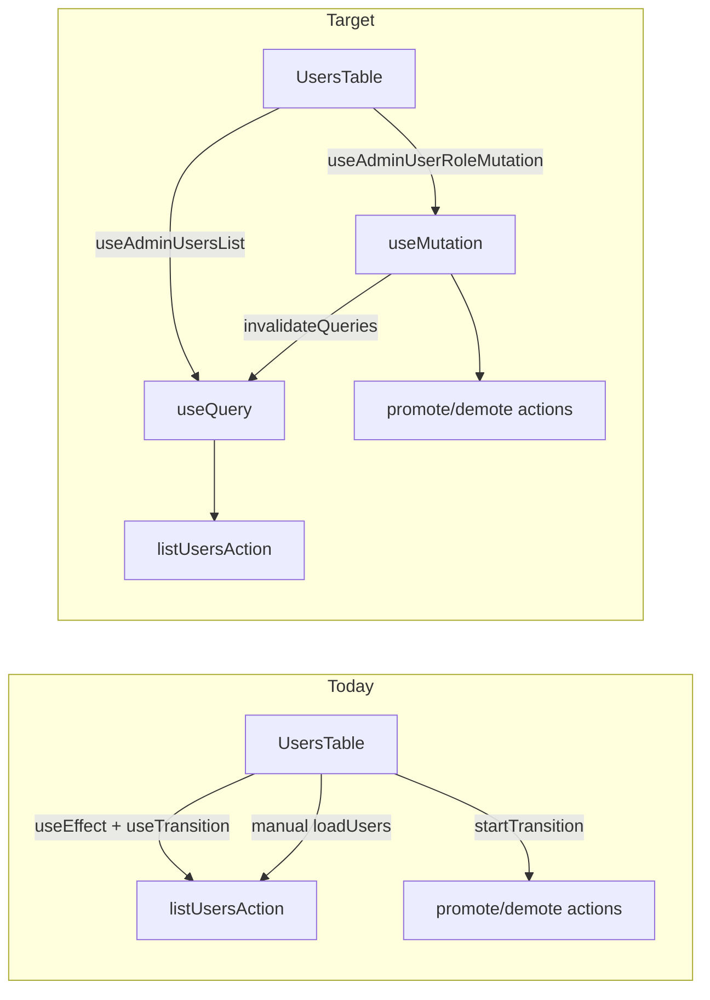

# Admin Users Table — TanStack Query Migration

## Goal

Replace the hand-rolled fetch loop in [`src/app/admin/users/_components/users-table.tsx`](src/app/admin/users/_components/users-table.tsx) with TanStack Query while keeping **Server Actions** as the only backend transport. No API routes, no optimistic updates (invalidate + refetch only, per your choice).

## Current vs target flow



## New files (route-scoped `_lib/`, matching profile's `use-blur-save-field` pattern)

### 1. Query keys — [`src/app/admin/users/_lib/admin-users-query-keys.ts`](src/app/admin/users/_lib/admin-users-query-keys.ts)

Small factory so list + mutation invalidation share one key shape:

- `adminUsersQueryKeys.all` → `['admin-users']`
- `adminUsersQueryKeys.list(page, emailFilter)` → `['admin-users', 'list', { page, emailFilter }]`

Use `emailFilter: string | undefined` (normalized trimmed string or `undefined`) so keys match what `listUsersAction` receives.

### 2. Envelope unwrap helper — [`src/app/admin/users/_lib/unwrap-users-action.ts`](src/app/admin/users/_lib/unwrap-users-action.ts)

Server Actions return `{ success, data } | { success: false, error }` — they don't throw. Query needs thrown errors to populate `isError`.

- `unwrapListUsersResult(result)` — returns `data` on success; throws `result.error` (typed `AppError`) on failure
- `unwrapRoleMutationResult(result)` — same for promote/demote

Keeps error `kind` / `code` intact for existing `InlineError` / `ErrorPanel` branching.

### 3. List hook — [`src/app/admin/users/_lib/use-admin-users-list.ts`](src/app/admin/users/_lib/use-admin-users-list.ts)

```typescript
useAdminUsersList({ page, emailFilter })
```

- `queryKey`: `adminUsersQueryKeys.list(page, emailFilter)`
- `queryFn`: calls `listUsersAction({ page, emailFilter })` → `unwrapListUsersResult`
- `placeholderData: keepPreviousData` (from `@tanstack/react-query`) — **first use in repo**; keeps stale rows visible during pagination/search refetch per [`data-tables.mdc`](.cursor/rules/data-tables.mdc)
- Kind-aware retry on the `useQuery` config (overrides global provider default for this query):

```typescript
retry: (failureCount, error) =>
  (error as AppError)?.kind === 'fault' && failureCount < 1,
```

Import `AppError` from [`src/types/app-error.ts`](src/types/app-error.ts). Operational envelopes (`kind: 'operational'`) must not retry; genuine faults retry once.

- Returns: `{ rows, hasNextPage, isLoading, isFetching, error }` derived from query state

**Loading semantics** (must match today + data-table rule):

| UI signal | Query mapping |
|-----------|---------------|
| Skeleton rows | `isLoading && rows.length === 0` |
| Disable pagination / `aria-busy` | `isFetching` |
| Keep stale rows on refetch | `keepPreviousData` |

### 4. Role mutation hook — [`src/app/admin/users/_lib/use-admin-user-role-mutation.ts`](src/app/admin/users/_lib/use-admin-user-role-mutation.ts)

```typescript
useAdminUserRoleMutation()
```

- `mutationFn`: `{ type: 'promote' \| 'demote', userId }` → calls the matching Server Action → `unwrapRoleMutationResult`
- `onSuccess`: `showSuccessToast(getRoleMutationToastMessage(...))` + `queryClient.invalidateQueries({ queryKey: adminUsersQueryKeys.all })`
- Exposes: `mutate`, `isPending`, `error`, `variables` (for per-row pending UI via `variables?.userId`)

## Refactor component — [`users-table.tsx`](src/app/admin/users/_components/users-table.tsx)

**Remove:** `rows`, `hasNextPage`, `error`, `isPending`, `useTransition`, `loadUsers`, fetch `useEffect`.

**Keep in component (UI-only state):**

- `searchInput` + debounced `emailFilter` via existing 300ms `useEffect` (reset `page` to 1 on debounce — same UX)
- `page` state
- `confirmAction` dialog state

**Wire up:**

- `useAdminUsersList({ page, emailFilter: debouncedSearch || undefined })`
- `useAdminUserRoleMutation()` in `handleConfirmMutation` — close dialog on settle
- `pendingUserId` → `mutation.isPending ? mutation.variables?.userId ?? null : null`
- Pass `rows` from query data (default `[]` when undefined) into `useDataTableShell`

### Error handling — separate render paths (required)

Do **not** merge list and mutation errors into a single `displayError` variable. Keep two independent branches:

**List query error** (from `useAdminUsersList`, table region):

- Render above the table shell, in place of or alongside the table when the list fetch fails
- `kind === 'fault'` → `ErrorPanel` (with copy affordance)
- `kind === 'operational'` → `InlineError`
- On list error, clear or omit table rows as today (empty table body is acceptable when there is no successful data)

**Role mutation error** (from `useAdminUserRoleMutation`, inline near table):

- Always render `InlineError` — **never** `ErrorPanel`, regardless of `kind` (including `fault`)
- Render in a dedicated slot near the table (e.g. between search and table, or directly above pagination) — separate from the list-error slot
- **Must not** replace, clear, or hide existing table rows; stale list data stays visible while the mutation error is shown
- Clear mutation error when the user opens a new promote/demote dialog (same as today's `setActionError(null)` on row action)

**No changes** to [`actions.ts`](src/app/admin/users/actions.ts), [`data-table-shell.tsx`](src/components/data-table-shell.tsx), or [`users-columns.tsx`](src/app/admin/users/_components/users-columns.tsx).

## Tests

### Update — [`users-table.unit.test.tsx`](src/app/admin/users/_components/users-table.unit.test.tsx)

Existing tests should pass with minimal changes because:

- [`test-utils.tsx`](src/test/test-utils.tsx) already wraps renders in `QueryClientProvider`
- Actions remain mocked at `../actions`

**Adjust if needed:**

- Promote test: still expect `listUsersAction` called more than once after mutation (invalidation refetch) — may need `waitFor` with slightly longer timeout for Query microtask timing
- Loading/skeleton test: never-resolving `listUsersAction` mock should still produce skeleton via `isLoading`
- **Add:** mutation failure with `kind: 'fault'` renders `InlineError` only (no copy button / `ErrorPanel`); existing row text remains in the document

### Optional (skip unless hook logic grows) — unit tests for `unwrap-users-action.ts`

One small H/I/B file if the unwrap helper is non-trivial; otherwise covered by existing component tests.

## Quality gate

```bash
pnpm test:file -- src/app/admin/users/_components/users-table.unit.test.tsx
pnpm type-check && pnpm lint && pnpm test:ci
```

## Doc sync (light touch)

After merge, one line in AGENTS.md **Implemented now → Admin console** noting the users table uses TanStack Query for client list fetch + mutation invalidation (via `/sync-repo-docs` or inline during PR). No rule changes required — [`react-tanstack-query.mdc`](.cursor/rules/react-tanstack-query.mdc) already describes this pattern; optionally add `users-table.tsx` to its Reference Examples in a follow-up.

## Manual test checklist

- `/admin/users` loads with skeleton, then rows
- Search debounces (~300ms); typing resets to page 1; filter passed at 3+ chars
- Next/Previous disabled correctly; stale rows stay visible while fetching next page
- List fault → `ErrorPanel` with copy; operational list error → `InlineError` (list-error slot only)
- Promote/demote: confirm dialog, success toast, table refreshes with updated role
- Mutation error (operational or fault) → `InlineError` only in mutation-error slot; table rows remain visible; no `ErrorPanel` for mutations
- Devtools (dev): query key updates on page/search change; invalidation after role change

## Out of scope

- Optimistic row updates
- Moving debounce into a shared util
- Migrating profile/auth surfaces
- New API routes or direct Supabase client reads
