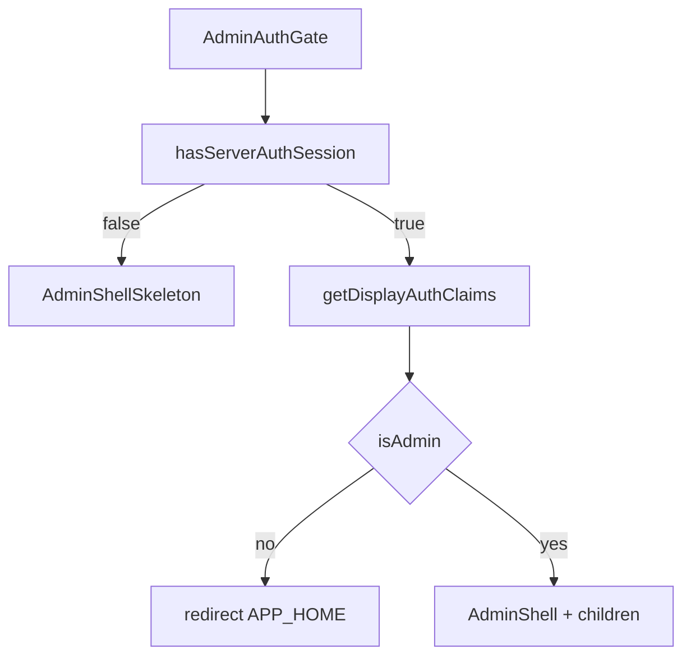

# AdminAuthGate cold-cache probe-first fix (revised)

## Problem

On a fresh `pnpm dev` start, Next.js Cache Components runs a **cold-cache staging pass** before request cookies are available. [`AdminAuthGate`](src/app/admin/_components/admin-auth-gate.tsx) currently calls `getDisplayAuthClaims()` unconditionally, which throws `DisplayAuthInvariantError('No authenticated session')` when no cookie is present. Next.js recovers on client re-render, but the error is logged every cold start.

Production is unaffected after the `src/proxy.ts` relocation — the proxy gates logged-out requests before RSC. The remaining no-session case here is **dev-only cold cache**.

## Why remove `connection()`

Git history shows `await connection()` was added to [`admin-auth-gate.tsx`](src/app/admin/_components/admin-auth-gate.tsx) in commit `f4c189c` (proxy-relocation) as an unexplained secondary line — no linked bug, ADR, or plan step. The original PPR-verification plan ([`proxy_sole_auth_authority_d037e93a.plan.md`](.cursor/plans/archive/proxy_sole_auth_authority_d037e93a.plan.md)) listed `connection()` only as an **escalation if build inspection showed unexpected static caching**, and judged that unlikely because the gate's existing `cookies()` reads already force per-request rendering.

Removing `connection()` restores the normal two-pass PPR flow (prerender → request-time stream) that the probe-first pattern depends on to self-heal — mirroring [`LandingAuthSlot`](src/app/(marketing)/_components/landing-auth-slot.tsx), which probes without calling `connection()`.

## Reference pattern

Follow the same probe-first split already used on public surfaces:

- [`LandingAuthSlot`](src/app/(marketing)/_components/landing-auth-slot.tsx) — `hasServerAuthSession()` first; branch without calling `getDisplayAuthClaims()`; **no `connection()`**
- [`LandingMobileHeaderChrome`](src/app/(marketing)/_components/landing-mobile-header-chrome.tsx) — same probe, then Suspense skeleton for the authenticated branch

(`AuthenticatedBannerSlotEntry` does not use this probe — it is not the model here.)

Both helpers live in [`require-auth.ts`](src/supabase/require-auth.ts):

- **`hasServerAuthSession()`** — same cookie + `getClaims(allowExpired: true)` path, returns `false` instead of throwing
- **`getDisplayAuthClaims()`** — throws `DisplayAuthInvariantError` on missing/invalid tokens (invariant for protected routes)

## Implementation (single file + tests)

### 1. Update [`admin-auth-gate.tsx`](src/app/admin/_components/admin-auth-gate.tsx)

**Remove:**

- The `await connection()` call (line 18)
- The `connection` import from `next/server`

**Add probe-first flow** (same structure as `LandingAuthSlot`):

1. Call `hasServerAuthSession()`
2. If `false` → **return `<AdminShellSkeleton />`** (same component already used as the Suspense fallback in [`admin/layout.tsx`](src/app/admin/layout.tsx))
3. If `true` → call `getDisplayAuthClaims()` and continue unchanged:
   - non-admin → `redirect(APP_HOME)`
   - admin → read sidebar cookie → render `AdminShell`

**Imports to add:** `hasServerAuthSession` from `@/supabase/require-auth`, `AdminShellSkeleton` from `./admin-shell-skeleton`.

**Out of scope (explicit):**

- Do not change `getDisplayAuthClaims()`, `getCurrentUserProfile`, or any other consumer
- Do not catch/suppress `DisplayAuthInvariantError` elsewhere
- When `hasServerAuthSession()` is `true`, `getDisplayAuthClaims()` still throws on invalid/malformed claims — invariant preserved
- Do not add `connection()` elsewhere as a substitute

### 2. Update [`admin-auth-gate.integration.test.tsx`](src/app/admin/_components/admin-auth-gate.integration.test.tsx)

Mirror the [`landing-auth-slot.integration.test.tsx`](src/app/(marketing)/_components/landing-auth-slot.integration.test.tsx) mock style:

- **Remove** the `next/server` mock for `connection` (lines 13–15) — no longer needed
- Add `mockHasServerAuthSession` and export it from the `@/supabase/require-auth` mock alongside `getDisplayAuthClaims`
- In `beforeEach`, default `mockHasServerAuthSession.mockResolvedValue(true)` so existing cases unchanged
- **New test (happy/boundary):** when probe returns `false`:
  - Renders skeleton (mock `AdminShellSkeleton` with `data-testid="admin-shell-skeleton"` for a clean assertion)
  - `getDisplayAuthClaims` **not** called
  - `redirect` **not** called
  - children not rendered
- Existing tests prove invariant paths still work:
  - non-admin with session → redirect (still calls `getDisplayAuthClaims`)
  - admin with session → full shell

No new tests needed in `require-auth.unit.test.ts` — that module is unchanged.

## Verification checklist

### Hard pass condition (cold start — non-negotiable)

| Step | Expected |
|------|----------|
| `rm -rf .next && pnpm dev`, sign in as admin, hard-navigate to `/admin/logs` on first load | **PASS only if:** (1) no `DisplayAuthInvariantError` in terminal, (2) no client-recovery error in browser console, **and (3) the skeleton clears on its own and the real admin page (logs table + data) appears without a manual refresh** |

**FAIL criteria (report explicitly):** If the terminal is clean but the page **stays stuck on the skeleton** and only loads after a manual refresh, the fix has **failed** — do not treat a clean terminal as success.

The probe-first + `connection()` removal is expected to let PPR's request-time pass stream the real `AdminShell` in behind the skeleton. This must be proven in the browser, not assumed.

### Build-output sanity check (non-negotiable)

| Step | Expected |
|------|----------|
| `pnpm build` — inspect route table for an admin route (e.g. `/admin/users`) | Route still shows as **dynamic** (`◐ Partial Prerender` or `ƒ Dynamic`) — confirms removing `connection()` did not cause admin routes to be statically prerendered |

This is the build inspection the original PPR plan recommended; it was the only legitimate trigger for adding `connection()` in the first place.

### Regression checks

| Step | Expected |
|------|----------|
| Same session — browse admin pages (users, logs, settings) | Loads and data fetches behave as before |
| `pnpm test:file -- src/app/admin/_components/admin-auth-gate.integration.test.tsx` | All cases pass, including new skeleton probe case |
| `pnpm test:ci` | Full suite green, coverage gates pass |

## Files touched

- [`src/app/admin/_components/admin-auth-gate.tsx`](src/app/admin/_components/admin-auth-gate.tsx) — remove `connection()`, add probe + skeleton branch
- [`src/app/admin/_components/admin-auth-gate.integration.test.tsx`](src/app/admin/_components/admin-auth-gate.integration.test.tsx) — remove `connection` mock, add probe mock + new test case

No doc sync required — behavior change is dev-only ergonomics; production auth boundary unchanged.
