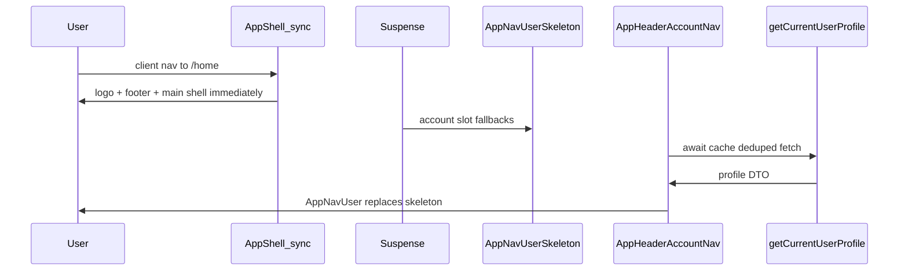

# Restructure app shell header loading (Option A)

## Problem recap

Today [`app-shell.tsx`](src/app/(app)/_components/app-shell.tsx) is an **async** server component that `await`s [`getCurrentUserProfile()`](src/app/(app)/_lib/get-current-user-profile.ts) before rendering anything. The layout wraps the entire shell in Suspense ([`layout.tsx`](src/app/(app)/layout.tsx) → [`AppShellFallback`](src/app/(app)/_components/app-shell-fallback.tsx)), but that fallback **does not reliably appear on client-side navigation** (especially with `/home` prefetch). Users see a blank account slot, then the avatar.

The skeleton work already shipped (`AppNavUserSkeleton`, fallback wiring) cannot help until the shell stops blocking on profile fetch.

## Target architecture

Follow the proven pattern in [`landing-header.tsx`](src/app/(marketing)/_components/landing-header.tsx): **sync chrome + nested Suspense per slot**.



**Key behavior:**
- Header logo and page chrome paint without waiting on the profiles query.
- Each account slot gets its **own** Suspense boundary and **its own** `<AppNavUserSkeleton />` instance (not a shared JSX reference).
- Profile fetch moves into a small async child; `getCurrentUserProfile` stays `cache()`'d so duplicate slot reads dedupe within one request.
- Skeleton → correct initials/avatar only (no claims-only email initials).

## Implementation

### 1. Make `AppShell` synchronous and unwrap children

Convert [`app-shell.tsx`](src/app/(app)/_components/app-shell.tsx) from `async` to a **sync** server component.

**Today**, the shell wraps everything in `ProfileDialogProvider`, which renders `{children}` (header, main, footer) plus `ProfileSettingsDialog` as a sibling:

```
ProfileDialogProvider
├── SiteHeader (AppNavUser in slots)
├── main → {children}
├── SiteFooter
└── ProfileSettingsDialog (sibling, inside provider)
```

**After**, `AppShell` must **not** wrap header/main/footer in `ProfileDialogProvider`. That provider (and its `ProfileSettingsDialog`) **moves entirely** into `AppHeaderAccountNav` — there is no shell-level provider to keep alongside header-local ones.

Concrete edits in `app-shell.tsx`:

- Remove top-level `await getCurrentUserProfile()`.
- **Remove** the shell-level `ProfileDialogProvider` import and wrapper — unwrap `SiteHeader`, `main`, and `SiteFooter` so they render as direct siblings (fragment or flat return), not as provider children.
- Keep `SiteHeader` / `main` / `SiteFooter` structure and props (`logoHref={APP_HOME}`, `showNav={false}`, footer `publicSiteLink`).
- Wire account slots through new slot wrappers (below) instead of inline `AppNavUser`.

`main` and `SiteFooter` never called `useProfileDialog()` — they were only inside the provider subtree for convenience. Unwrapping them is safe.

### 2. Add async account-nav component

**New file:** [`src/app/(app)/_components/app-header-account-nav.tsx`](src/app/(app)/_components/app-header-account-nav.tsx)

- Async server component.
- `const profile = await getCurrentUserProfile()`.
- Return `ProfileDialogProvider` (same props as today) wrapping a single `AppNavUser` with `displayName`, `avatarUrl`, `email`, `isAdmin` from profile.

This isolates the profile dependency to the account menu only.

### 3. Add sync Suspense slot wrapper

**New file:** [`src/app/(app)/_components/app-header-account-nav-slot.tsx`](src/app/(app)/_components/app-header-account-nav-slot.tsx)

- Sync server component (matches `LandingHeader` slot helpers).
- Renders:

```tsx
<Suspense fallback={<AppNavUserSkeleton />}>
  <AppHeaderAccountNav />
</Suspense>
```

Used **twice** in `AppShell` (separate component invocations for `rightSlot` and `mobileNav`):

```tsx
rightSlot={<AppHeaderAccountNavSlot />}
mobileNav={<AppHeaderAccountNavSlot />}
```

Reuse [`app-nav-user-skeleton.tsx`](src/app/(app)/_components/app-nav-user-skeleton.tsx) as-is.

### 4. `ProfileDialogProvider` moves into the header (not duplicated at shell level)

`AppNavUser` calls `useProfileDialog()` and must be a descendant of `ProfileDialogProvider`. The provider **only** exists inside `AppHeaderAccountNav` after this change — Step 1 removes it from `AppShell`; Step 2 is where it lands.

Each `AppHeaderAccountNav` instance (one per Suspense slot) renders:

```
ProfileDialogProvider
├── AppNavUser
└── ProfileSettingsDialog (sibling, inside provider — unchanged provider internals)
```

Desktop and mobile slots each mount their own provider + `AppNavUser` + dialog; only one slot is visible at a breakpoint (`SiteHeader` already hides the other via CSS). This avoids restructuring [`site-header.tsx`](src/components/site-header.tsx) or refactoring the provider API.

**Do not** leave a shell-level `ProfileDialogProvider` in `AppShell` while also adding header-local ones — that would double-wrap and defeat the split.

Add a brief `// debt:` on the duplicate hidden provider/dialog (per-slot, not shell vs header) noting a future consolidation if desired (e.g. single provider wrapping both slots via a SiteHeader API extension).

**Out of scope:** splitting provider into context-only + lazy dialog load.

### 5. Remove redundant layout Suspense / fallback

Update [`layout.tsx`](src/app/(app)/layout.tsx):

- Remove outer `<Suspense>` and `AppShellFallback` import.
- Render `<AppShell>{children}</AppShell>` directly.

Delete [`app-shell-fallback.tsx`](src/app/(app)/_components/app-shell-fallback.tsx) — it becomes dead code. Nested slot Suspense replaces its role and fixes the shared-element footgun (`const headerAccountSlot = …` reused across both slots).

### 6. Tests

| File | Action |
|------|--------|
| [`app-shell.unit.test.tsx`](src/app/(app)/_components/app-shell.unit.test.tsx) | Update: `AppShell` is sync (no `await AppShell(...)`). Assert shell does **not** render `ProfileDialogProvider`. Mock `AppHeaderAccountNavSlot` to assert header/main/footer wiring; shell no longer calls `getCurrentUserProfile` directly. |
| **New** `app-header-account-nav.unit.test.tsx` | Mock `getCurrentUserProfile`; assert resolved nav renders `AppNavUser` with profile props and wraps `ProfileDialogProvider` (mock provider to inspect props). |
| [`app-nav-user-skeleton.unit.test.tsx`](src/app/(app)/_components/app-nav-user-skeleton.unit.test.tsx) | Keep unchanged. |

Per [`testing.mdc`](.cursor/rules/testing.mdc): no render-only fallback test for deleted `AppShellFallback`; no Suspense-boundary smoke test for the slot wrapper.

### 7. Quality gate

```bash
pnpm type-check && pnpm lint && pnpm format-check && pnpm test:ci
```

## Files touched (expected)

| File | Action |
|------|--------|
| `src/app/(app)/_components/app-shell.tsx` | Edit — sync shell, unwrap children (remove shell-level `ProfileDialogProvider`), slot wrappers |
| `src/app/(app)/_components/app-header-account-nav.tsx` | Add — async profile + nav |
| `src/app/(app)/_components/app-header-account-nav-slot.tsx` | Add — Suspense + skeleton |
| `src/app/(app)/layout.tsx` | Edit — remove outer Suspense |
| `src/app/(app)/_components/app-shell-fallback.tsx` | Delete |
| `src/app/(app)/_components/app-shell.unit.test.tsx` | Edit |
| `src/app/(app)/_components/app-header-account-nav.unit.test.tsx` | Add |

**Unchanged:** `app-nav-user-skeleton.tsx`, `app-nav-user.tsx`, `get-current-user-profile.ts`, admin shell, `site-header.tsx`.

## Manual test checklist

1. Signed in on `/` → **Open app** — logo immediate; circular skeleton in account slot; then correct avatar.
2. Login → `/home` — same skeleton → avatar transition.
3. User with display name — skeleton only, then correct initials (never email-based wrong initials).
4. User with profile photo + DevTools 3G — skeleton → correct initials → photo (Radix image loading unchanged).
5. Keyboard — Tab through header during load: skeleton skipped (`disabled`); after load, account menu focusable and operable.
6. Mobile viewport — skeleton appears in mobile header slot.

## Out of scope (per prompt)

- Profile warming / sessionStorage cache
- `prefetch={false}` on Open app
- Admin shell changes
- Avatar image optimization
- PRD update (unless requested)
