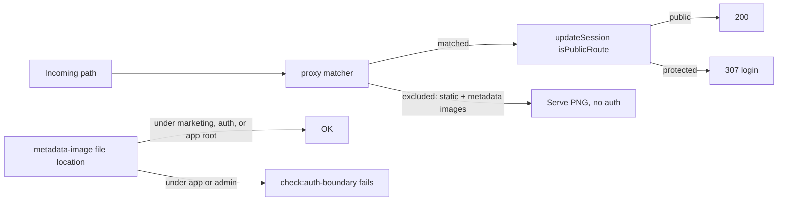

# Epic 3 — Close the auth-boundary matcher gaps (S012)

All three S012 gaps land together. Treating them separately is how one regression re-opens another.



**Not a hard-constraint list change.** Public routes stay `/`, `/auth/**`, `/terms`, `/privacy`, `/reference`, `/features`, `/workflow`, `/api/client-logs`. What changes is how that list is enforced: `/auth/**` becomes a real path segment (so `/authoring` is not public), hashed OG URLs skip the gate, and a file-location check backs the matcher carve-out.

## Why the hash is five or six characters

Next.js appends `djb2Hash(parentPathname).toString(36).slice(0, 6)` when a metadata image sits inside a route group. `slice(0, 6)` truncates — it does not pad. `djb2Hash` returns a uint32 (`hash >>> 0`), so a parent path whose hash lands below 36^5 renders as a **five**-character suffix — roughly 1.4% of route groups. The `/opengraph-image-[0-9a-z]{6}` string in Next's own source is an illustrative comment, not a guarantee; the code beside it contradicts it. A `{6}` bound would re-open F187 intermittently, and in a template that recurs per spinoff.

Bound the suffix `{5,6}`. The audit’s unbounded `(-[a-z0-9]+)?` would also match `/opengraph-image-evil` and `/admin/x/opengraph-image-anything`; `{5,6}` keeps both gated (4 and 8 characters). A four-character-or-shorter suffix (~0.04% of route groups) stays gated and cannot be admitted — four characters are indistinguishable from a word like `evil`. Mark that ceiling with a `// debt:` comment at the pattern naming the residual and the upgrade path, and comment the derivation and the Next.js source so a future upgrade that changes the hash is traceable.

**Prefix match is not an acceptable fix.** Do not use `opengraph-image.*`.

## Out of scope

- F104 (cookie attributes on redirect), F103, F141 (the other stale `// debt:` marker), F169
- The F187 aside that the homepage `<head>` may omit `og:image` while `/opengraph-image` returns 200
- Moving root [`src/app/opengraph-image.tsx`](src/app/opengraph-image.tsx) / [`src/app/icon.tsx`](src/app/icon.tsx) into `(marketing)` — they stay at app root; the location test allows that third slot
- Changing the AGENTS.md public-route list

## Preconditions

Branch must be `fix/security-audit-remediation-2026-08-28` — confirm before the first edit. `git status --porcelain --untracked-files=no` must be empty before the first implementation edit. Untracked plan files in `.cursor/plans/` are not a halt. [`SECURITY_AUDIT.md`](SECURITY_AUDIT.md) is currently modified — halt and ask to commit or stash if that is still true at implementation start. This epic must land as a single commit containing only this epic’s work.

## Step 1 — Matcher: hash suffix only at the image position

Edit the string literal in [`src/proxy.ts`](src/proxy.ts) and the canonical copy in [`src/utils/proxy-matcher.ts`](src/utils/proxy-matcher.ts) together (the existing sync test already requires they match).

On each of the six arms (`opengraph-image`, `twitter-image`, `icon`, each as root and nested), add an optional `(-[0-9a-z]{5,6})?` immediately before `$`. Keep the six-arm shape; do not collapse into a prefix. Comment the 5–6 character bound and the Next.js source (`getMetadataRouteSuffix` / `djb2Hash(…).toString(36).slice(0, 6)`), plus the `// debt:` marker for the ≤4-character residual.

[`src/utils/proxy-matcher.unit.test.ts`](src/utils/proxy-matcher.unit.test.ts):

- **Keep** `/opengraph-image-evil` and `/icon-evil` asserting the proxy still runs (`toBe(true)`). Do not modify those cases.
- **Add** a real route-group path: `/features/opengraph-image-959drp` is excluded (`toBe(false)`). One sibling (e.g. hashed `twitter-image` / `icon`) is enough to pin the other arms.
- **Add** a five-character suffix (e.g. `/features/opengraph-image-a1b2c`) excluded — that is the lower bound a `{6}` pin would have missed.
- **Add** a too-long suffix (`/opengraph-image-anything`) still gated — that is the unbounded-`+` miss this bound prevents.

Hashed paths under `/admin` will also be excluded by the matcher; that is inherent to a path-only regex. Step 3 is the compensating control.

## Step 2 — Export `isPublicRoute`; `/auth` is a segment

Extract the inline predicate in [`src/supabase/proxy.ts`](src/supabase/proxy.ts) to a named export `isPublicRoute(pathname: string)`. Rename the existing local `const isPublicRoute` inside `updateSession` to `isPublic` so the export is not shadowed, and update its three uses. Callers in `updateSession` keep using the already slash-normalized pathname.

Change `/auth` from `startsWith('/auth')` to the same segment form `/admin` already uses: `pathname === '/auth' || pathname.startsWith('/auth/')`. That is the `/authoring` fix.

Do not add a new util file. The test imports from the proxy, per S012.

## Step 3 — Auth-boundary tests import the predicate; discovery covers metadata files

[`src/supabase/proxy.unit.test.ts`](src/supabase/proxy.unit.test.ts):

- **Delete** the stale `// debt:` block (F140). `check:auth-boundary` is already a named pre-push and CI step.
- **Delete** the local `PUBLIC_EXACT` / `PUBLIC_PREFIXES` / `isDiscoveredPublicRoute` re-implementation. Import `isPublicRoute` from `./proxy`.
- Filter discovered routes through that import. **Assert the discovered-public set equals an explicit literal list** (today: `/`, the five marketing paths, `/api/client-logs`, and the eight `/auth/*` pages/handlers). Adding a public page without updating this list fails the check.
- **Add** `isPublicRoute('/authoring') === false` and an unauthenticated `updateSession('/authoring')` 307 to login — parallel to the existing `/administrative` admin-path case.
- **Add** a matcher-coverage assertion over the discovered routes: every **protected** route must match `PROXY_MATCHER_PATTERN` from [`src/utils/proxy-matcher.ts`](src/utils/proxy-matcher.ts). The `updateSession` matrix calls the gate directly and never exercises the matcher, so a protected route the matcher excludes — a segment shaped like a metadata image, or one ending in an image extension — passes today’s suite while being served unauthenticated in production. This is the route-shaped half of gap 1; the file walker below covers the file-shaped half.

Metadata-image location (gap 1): export `discoverMetadataImageFiles` from [`src/utils/discover-app-routes.ts`](src/utils/discover-app-routes.ts) alongside `discoverAppRoutes` — same file, covered by the existing colocated `discover-app-routes.unit.test.ts`; no new util file (walk `opengraph-image` / `twitter-image` / `icon` files with Next’s metadata extensions). Allowed homes: `(marketing)/`, `auth/`, or a **direct child of `src/app/`** (today’s root OG + icon). A file under `(app)` or `admin` fails.

Put the allowlist assertion in `proxy.unit.test.ts` so `pnpm check:auth-boundary` is what fails. A short colocated unit test on the walker is enough; do not feed metadata-image URLs into the `updateSession` matrix — they never reach that function.

Widen [`package.json`](package.json) `check:auth-boundary` to also run `src/utils/proxy-matcher.unit.test.ts`, so the named gate covers the regex, not only discovered pages.

## Step 4 — Docs and audit close-out

- [`seo.mdc`](.cursor/rules/seo.mdc) social-preview / favicon bullets: hashed route-group suffixes are part of the matcher exclusion; 5–6 character bound. Also add the new location rule to § New public page checklist — an `opengraph-image` / `twitter-image` / `icon` file may live only under `(marketing)/`, `auth/`, or directly in `src/app/`; anywhere else fails `check:auth-boundary`. Then `/sync-repo-docs` (rule-file edit; expect no README/DESIGN/index change).
- [`AGENTS.md`](AGENTS.md) § Hard constraints: the auth-boundary enforcement parenthetical reads “(discovered-route proxy tests)” and now under-describes the widened gate — extend it to cover the matcher tests. Descriptor only; the constraint text and the public-route list are unchanged, so this is not a change-protocol edit.
- [`SECURITY_AUDIT.md`](SECURITY_AUDIT.md): S012 → Resolved (2026-08-28). Open Low count 6 → 5. Delete the “stale comment… delete when S012 is fixed” follow-up bullet.
- [`TECH_DEBT_AUDIT.md`](TECH_DEBT_AUDIT.md): F187 and F140 → Resolved. Rewrite the exec-summary F187 hole; drop F187 from Top 5 (F103 becomes first). Update the exec-summary declared-marker bullet — with F140 resolved, one marker is stale (F141), not two. File a new Open finding for the deferred F187 aside (homepage `<head>` may omit `og:image` while `/opengraph-image` returns 200) so it is not lost when F187 closes. Last synced 2026-08-28.

No LEXICON.md edit.

## Step 5 — Quality bar and commit

`pnpm pre-push`. Stop on failure.

Authorized commit (same shape as Epic 2):

```
fix(auth): close auth-boundary matcher gaps

Epic: auth-boundary-matcher-gaps
```

Do not push. Do not offer `/mark-epic-complete` (ad hoc epic; no Active PRD).

## Manual-testing checklist (after commit, with dev server)

1. Signed out, open `/features`, `/privacy`, `/terms`, `/reference`, `/workflow`. Each page’s `og:image` URL (hashed) returns **200** `image/png`, not 307 to login. That is F187.
2. `/opengraph-image` and `/icon` still 200 (unhashed; no group).
3. Signed out, `/home` and `/admin/settings` still 307 to `/auth/login`.
4. `/authoring` is not a page; if you hit it, expect 307 to login, not a public 200.

No `db:push`.
