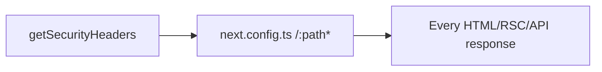

# Epic 4 — Baseline response headers (S010)

Add three headers to the existing [`getSecurityHeaders()`](src/utils/security-headers.ts) array. [`next.config.ts`](next.config.ts) already attaches that array to `/:path*` — no wiring change.



**Not a hard-constraint change.** No AGENTS.md list edit. No ADR. No LEXICON. Do not offer `/mark-epic-complete` (ad hoc epic; no Active PRD).

## Decision: HSTS stays on in development

Keep the current unconditional HSTS (`max-age=31536000; includeSubDomains`, no `preload`). Do not gate on `NODE_ENV`.

Why: browsers **must ignore** HSTS received over HTTP ([RFC 6797 §8.1](https://datatracker.ietf.org/doc/html/rfc6797#section-8.1)), so `http://localhost:3000` is a no-op. Vercel preview/production are HTTPS, where the header is the control we want. The `'unsafe-eval'` branch is gated because that directive is **harmful in production**; HSTS in development is not analogous. Gating would add a test branch for no security gain on a deployed preview.

The niche this does not cover: a custom local HTTPS hostname (not `localhost`) would get HSTS-pinned. That is not this template's setup. Document the keep-in-dev choice with a one-line comment on the HSTS entry so the next audit does not re-open the question.

Do not add `preload` — submitting to the HSTS preload list is irreversible and is a product/ops decision, not a header-module default.

## Permissions-Policy (restrictive, not kitchen-sink)

Pin this exact value:

`camera=(), microphone=(), geolocation=(), browsing-topics=(), payment=(), usb=(), bluetooth=(), display-capture=()`

That is the [Next.js docs trio](https://nextjs.org/docs/app/building-your-application/configuring/security-headers) (camera / microphone / geolocation) plus the next tier of powerful APIs this app does not use. `browsing-topics=()` is the FLoC successor.

**Do not disable `clipboard-write`.** [`use-copy-to-clipboard.ts`](src/hooks/use-copy-to-clipboard.ts) calls `navigator.clipboard.writeText`; an empty allowlist would break copy buttons. Also leave `fullscreen` and `publickey-credentials-get` unrestricted so a spinoff can add passkeys or fullscreen without first fighting the template.

A short comment on the Permissions-Policy entry records two things: the `clipboard-write` omission, and that `payment=()` is deliberately closed even though `fullscreen` and `publickey-credentials-get` are left open — a spinoff adding Stripe wallet buttons (Apple Pay / Google Pay) must allow `payment` here.

The other two headers are the audit's specified values:

- `Referrer-Policy: strict-origin-when-cross-origin` (Chromium default, pinned so older browsers and future framework defaults cannot weaken it)
- `X-Content-Type-Options: nosniff`

## Out of scope

- S004 / F053 (nonce `script-src`), F095 (`style-src 'unsafe-inline'`)
- F166 (W6 prose about `/features` and `'unsafe-eval'` — already corrected in the current audit text; do not close it here)
- Changing the `/:path*` source, adding `Feature-Policy` or `X-XSS-Protection`, Vercel dashboard headers
- Deploying a preview (human step after commit)

## Preconditions

Branch must be `fix/security-audit-remediation-2026-08-28`. Confirm before the first edit. `git status --porcelain --untracked-files=no` must be empty. Untracked plan files in `.cursor/plans/` are not a halt. This epic lands as a single commit containing only this epic's work.

## Step 1 — Headers

Edit [`src/utils/security-headers.ts`](src/utils/security-headers.ts) only. Append three entries to `getSecurityHeaders()` after HSTS. Add the HSTS keep-in-dev comment and the Permissions-Policy comment described above (clipboard omission plus the `payment=()` rationale). Do not extract helpers, constants, or a new file. Do not touch `buildCspDirectives`.

## Step 2 — Tests

Extend the existing `getSecurityHeaders` case in [`src/utils/security-headers.unit.test.ts`](src/utils/security-headers.unit.test.ts). Rename it so it describes the full baseline set rather than "frame and HSTS headers":

- Keep the "exactly one `Content-Security-Policy`, no Report-Only" assertions — that is the S010 CSP success criterion, pinned in CI.
- `toContainEqual` the three new headers with the exact strings above.
- Existing `X-Frame-Options` and HSTS assertions stay. No new `NODE_ENV` cases (HSTS is unconditional).

## Step 3 — Docs and audit close-out

- [`security.mdc`](.cursor/rules/security.mdc) § Security Headers: the "Configure CSP / XFO / HSTS" sentence and the shipped-pattern paragraph should name Referrer-Policy, nosniff, and Permissions-Policy too. Remaining gap stays strict `script-src`. Stay inside the rule's line budget — fold into those two sentences, do not add a third.
- [`audit-security` skill](.cursor/skills/audit-security/SKILL.md) W6 checklist line: add the three headers so the next pass verifies they remain. Leave "HSTS in production" as the production requirement (still true).
- [`SECURITY_AUDIT.md`](SECURITY_AUDIT.md): S010 → Resolved (2026-08-28), with the Resolved row carrying "Verification pending — the three headers on a deployed preview" in the same shape as the S007 / S016 rows. Open Low count 5 → 4. W6 verified-OK sentence lists the new headers and records that HSTS is emitted in development by design (RFC 6797 no-op on HTTP). Keep the human follow-up bullet, reworded to name the three headers on a deployed preview (the agent cannot complete that check).
- [`TECH_DEBT_AUDIT.md`](TECH_DEBT_AUDIT.md): move the F126 row out of § Open into § Resolved with the date 2026-08-28 (same change; S010 is a strict superset), and delete the `F126` line from § Quick wins. Last synced 2026-08-28.
- `/sync-repo-docs` (rule-file edit; expect no README / DESIGN / rules-index change).

## Step 4 — Quality bar and commit

`pnpm pre-push`. Stop on failure.

Authorized commit (same shape as Epic 3):

```
fix(security): add baseline response headers

Epic: baseline-response-headers
```

Do not push.

## Manual-testing checklist (after commit)

1. Local, with the dev server: response to `/` includes `Referrer-Policy: strict-origin-when-cross-origin`, `X-Content-Type-Options: nosniff`, the Permissions-Policy string above, `Content-Security-Policy` (enforced), and **no** `Content-Security-Policy-Report-Only`. HSTS may appear; browsers ignore it on HTTP localhost.
2. Copy a value that uses the shared copy hook (e.g. an admin table id) — clipboard still works. That is the `clipboard-write` omission.
3. **You, on a deployed preview in DevTools:** all three new headers present, CSP enforced, no Report-Only companion. That is the S010 success criterion; it cannot be done from this repo alone.

No `db:push`.
