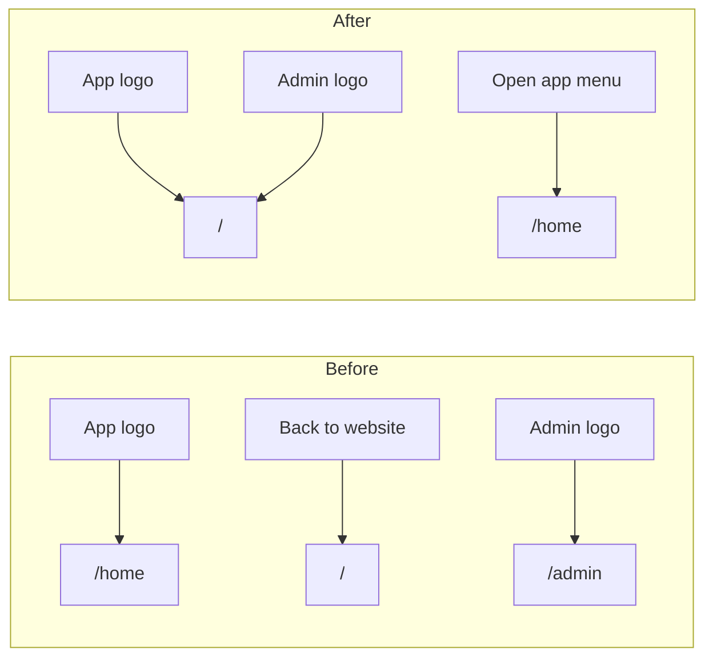

# Brand mark as universal "return to marketing" nav

## Current state

[`SeminovaLogo`](src/components/seminova-logo.tsx) already renders icon + site name as a single `Link` — the pattern is in place.

| Surface | Logo today | Escape hatch |
|---------|------------|--------------|
| Marketing header/footer | `/` (correct) | none |
| Auth layout | `/` (correct) | none |
| App shell header/footer | [`APP_HOME`](src/constants/app-paths.ts) (`/home`) | footer `publicSiteLink` → "Back to website" `/` |
| Admin sidebar header | [`ADMIN_HOME`](src/constants/admin-paths.ts) (`/admin`) | "Open app" in [`AdminNavUser`](src/app/admin/_components/admin-nav-user.tsx) dropdown (unchanged) |



## Implementation (minimal diff)

### 1. App shell — logo → `/`, drop footer link

**File:** [`src/app/(app)/_components/app-shell.tsx`](src/app/(app)/_components/app-shell.tsx)

- Remove `logoHref={APP_HOME}` from both `SiteHeader` and `SiteFooter` (defaults are already `'/'` in [`site-header.tsx`](src/components/site-header.tsx) and [`site-footer.tsx`](src/components/site-footer.tsx)).
- Remove `publicSiteLink={{ href: '/', label: 'Back to website' }}` from `SiteFooter`.
- Drop the unused `APP_HOME` import.

No changes to account nav — [`AppHeaderAccountNav`](src/app/(app)/_components/app-header-account-nav.tsx) / [`AppNavUser`](src/app/(app)/_components/app-nav-user.tsx) are unaffected.

### 2. Admin sidebar — logo → `/`

**File:** [`src/app/admin/_components/admin-sidebar.tsx`](src/app/admin/_components/admin-sidebar.tsx)

- Change `SeminovaLogo` `href` from `ADMIN_HOME` to `'/'`.
- Remove unused `ADMIN_HOME` import (`ADMIN_USERS` stays for nav items).

**No change** to [`AdminNavUser`](src/app/admin/_components/admin-nav-user.tsx) — "Open app" continues to link to `APP_HOME` (`/home`).

### 3. Remove dead `publicSiteLink` API

**File:** [`src/components/site-footer.tsx`](src/components/site-footer.tsx)

- Delete the `publicSiteLink` prop, its type, and the conditional anchor block (lines 19, 25, 66–73).
- App shell was the only caller; marketing footer never used it.

### 4. Tests

| File | Change |
|------|--------|
| [`src/app/(app)/_components/app-shell.unit.test.tsx`](src/app/(app)/_components/app-shell.unit.test.tsx) | Remove "Back to website" assertion; simplify `SiteFooter` mock (drop `publicSiteLink` handling) |
| [`src/components/site-footer.unit.test.tsx`](src/components/site-footer.unit.test.tsx) | Delete the `publicSiteLink` test case entirely |
| [`src/app/admin/_components/admin-sidebar.unit.test.tsx`](src/app/admin/_components/admin-sidebar.unit.test.tsx) | Update `SeminovaLogo` mock to render an anchor with `href`; assert logo links to `/` |

Optional low-value addition: assert in `site-footer.unit.test.tsx` that the logo link defaults to `/` when `logoHref` is omitted — only if it adds confidence beyond existing header tests.

### 5. Docs

Run `/sync-repo-docs` after implementation to note in AGENTS.md that shared chrome brand marks across app and admin link to marketing home (`/`), with app return via account menu ("Open app" on marketing/admin, no separate footer link). The admin and landing sections currently don't document logo href behavior explicitly.

**Out of scope (already correct):** [`landing-header.tsx`](src/app/(marketing)/_components/landing-header.tsx), [`landing-footer.tsx`](src/app/(marketing)/_components/landing-footer.tsx), [`auth/layout.tsx`](src/app/auth/layout.tsx).

**No hard-constraint changes** — `/` is already a public route in the auth boundary.

## Quality gate

```bash
pnpm type-check && pnpm lint && pnpm format-check && pnpm test:ci
```

## Manual test checklist

- **App (`/home`):** Click header logo → lands on `/`. Click footer logo → lands on `/`. Footer has no "Back to website" link; Terms/Privacy links still present.
- **Admin (`/admin`):** Click sidebar logo → lands on `/` (not `/admin`). Profile dropdown "Open app" → still lands on `/home`.
- **Marketing (`/`):** Logo behavior unchanged. Signed-in avatar menu "Open app" still works.
- **Keyboard:** Tab to logo on app/admin surfaces; Enter activates link to `/`.
