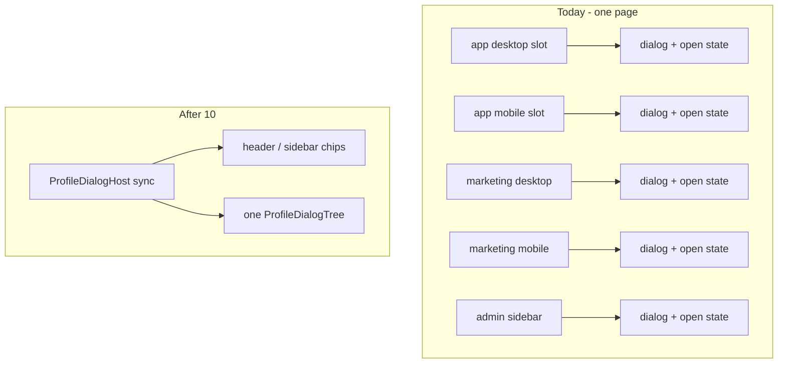

# Chat 10 — one profile dialog, not four

F061. Reopen trigger fired: four `AppHeaderAccountNav` mounts each wrap their own provider and dialog, and the admin sidebar is a fifth copy. Locked: admin joins the same hoist. No migrations. Do not commit.

Do **not** put the current provider (which awaits profile) back around the shell. That is the waterfall the [app shell header split](.cursor/plans/archive/app_shell_header_split_71b9d99a.plan.md) and [admin sidebar nav split](.cursor/plans/archive/admin_sidebar_nav_split_c44c7645.plan.md) removed — logo, page body, and admin chrome must keep painting while chips skeleton.

## Precondition

Before editing anything, run `git status` and record the working tree. Do not stash, revert, or clean.

Confirm 9b landed: [TECH_DEBT_AUDIT.md](TECH_DEBT_AUDIT.md) has F105 in § Resolved. If it is still Open, **stop**. Prior chats may still be uncommitted; name those files up front. `next dev` may have dirtied the `nextjs-agent-rules` block in [AGENTS.md](AGENTS.md).

## Why this shape, not a naive layout wrap

The provider today both (1) holds `open` and (2) renders `ProfileSettingsDialog` with profile props. Profile comes from [`getCurrentUserProfile`](src/app/(app)/_lib/get-current-user-profile.ts), which **throws** with no session — so it cannot run unconditionally on marketing. Awaiting it in a layout or shell also blocks chrome.

Split those two jobs:

- **Sync host** — context + `open` only. No fetch. Safe on logged-out marketing. App/admin shells stay synchronous.
- **One async tree** — session-gated fetch, then the dialog, bound to that context. Streams behind `Suspense fallback={null}`. Chips already cannot be clicked until their own slot resolves; both wait on the same `cache()`'d profile, so the dialog is ready when the menu is.

[`useProfileDialog`](src/app/(app)/_components/profile/profile-dialog-provider.tsx) stays `{ openProfile }` for the chips. Do not put display-name / avatar into context — chips keep receiving those as props from the existing slot fetches (`cache()` already dedupes).

## The three new pieces

All live under [`src/app/(app)/_components/profile/`](src/app/(app)/_components/profile/) — that folder is already the cross-group home (marketing and admin import from it today). Do not invent a fourth copy under `admin/` or `hooks/`.

1. **Provider shrinks** in [`profile-dialog-provider.tsx`](src/app/(app)/_components/profile/profile-dialog-provider.tsx): children only. Drops `userId` / `email` / `hasPassword` / `profileLoadFailed` / `defaultValues`. Keep `open` / `setOpen` in this module; export a binder (same file, not a public chip API) that reads them and renders [`ProfileSettingsDialog`](src/app/(app)/_components/profile/profile-settings-dialog.tsx) with the profile props. No second context.

2. **`profile-dialog-tree.tsx`** (async server): `hasServerAuthSession()` first — if false, return `null` (do not call `getCurrentUserProfile`). If true, fetch and render the binder. Same defaultValues mapping that is currently duplicated in the two nav wrappers. One place.

3. **`profile-dialog-host.tsx`** (sync server): provider, then `{children}`, then `Suspense` around the tree. Three shells import this instead of inlining the wrap.

## Three hosts, two wrappers lose the provider

| Surface | Wrap with host | Slot change |
| ---- | ---- | ---- |
| App | [`(app)/layout.tsx`](src/app/(app)/layout.tsx) — wrap the existing `<Suspense>`, so one host covers both the fallback shell and `ResolvedAppShell`. The layout renders `AppShell` twice; a host inside the shell would be two hosts, two providers, and two trees per request. | [`app-header-account-nav.tsx`](src/app/(app)/_components/app-header-account-nav.tsx): fetch + `AppNavUser` only. Delete the `// debt:` marker and add a one-line comment recording that this component now requires an ancestor `ProfileDialogHost`. |
| Marketing | [`(marketing)/layout.tsx`](src/app/(marketing)/layout.tsx) — sync wrap, no waterfall on page body | [`landing-auth-slot.tsx`](src/app/(marketing)/_components/landing-auth-slot.tsx) and [`landing-mobile-header-chrome.tsx`](src/app/(marketing)/_components/landing-mobile-header-chrome.tsx) keep their session branch; they already render `AppHeaderAccountNav`, which no longer wraps a provider |
| Admin | [`admin-auth-gate.tsx`](src/app/admin/_components/admin-auth-gate.tsx) success return only (not the skeleton / redirect paths) | [`admin-sidebar-nav-user.tsx`](src/app/admin/_components/admin-sidebar-nav-user.tsx): fetch + `AdminNavUser` only. Keep the `'Signed-in user'` email fallback on the **chip**. Do not put that fallback in the shared tree. |

[`AppShell`](src/app/(app)/_components/app-shell.tsx) and [`AdminShell`](src/app/admin/_components/admin-shell.tsx) both stay provider-free — each host sits in its layout-level parent (the app layout, the admin gate). Slot Suspense wrappers ([`app-header-account-nav-slot.tsx`](src/app/(app)/_components/app-header-account-nav-slot.tsx), [`admin-sidebar-nav-user-slot.tsx`](src/app/admin/_components/admin-sidebar-nav-user-slot.tsx)) stay. Auth layout is not wrapped.

After this, grep `ProfileDialogProvider` under `src/`: the definition, the host, and tests. Zero wraps left in the two nav files.

## Tests

- New colocated [`profile-dialog-tree.unit.test.tsx`](src/app/(app)/_components/profile/profile-dialog-tree.unit.test.tsx): signed-out → nothing; signed-in → binder gets profile props (mock `hasServerAuthSession` + `getCurrentUserProfile`; mock the binder/dialog, not the form).
- [`app-header-account-nav.unit.test.tsx`](src/app/(app)/_components/app-header-account-nav.unit.test.tsx): drop the provider mock and assertions; still assert chip props and `showOpenApp`. Wrap render with a passthrough host mock or the real sync provider so `useProfileDialog` does not throw — `AppHeaderAccountNav` itself no longer provides context, but `AppNavUser` still consumes it. Simplest: keep mocking `./app-nav-user` as today, then no provider is needed at all.
- [`admin-sidebar-nav-user.unit.test.tsx`](src/app/admin/_components/admin-sidebar-nav-user.unit.test.tsx): same — chip props + email fallback only; mock `./admin-nav-user`.
- [`app-shell.unit.test.tsx`](src/app/(app)/_components/app-shell.unit.test.tsx): leave the “no shell-level provider” assertion — still true; the host sits in the layout, not the shell.
- [`admin-shell.unit.test.tsx`](src/app/admin/_components/admin-shell.unit.test.tsx): leave the “no provider on AdminShell” assertion — still true.
- [`admin-auth-gate.integration.test.tsx`](src/app/admin/_components/admin-auth-gate.integration.test.tsx): mock the host as passthrough; success path still renders shell + nav slot; host is not on the skeleton / redirect paths.
- [`landing-mobile-header-chrome.integration.test.tsx`](src/app/(marketing)/_components/landing-mobile-header-chrome.integration.test.tsx): drop the unused `ProfileDialogProvider` mock; keep `useProfileDialog` mocked so the real `AppNavUser` can render.

Do not add marketing-layout or app-layout tests (layouts are coverage-excluded). Do not rewrite profile form integration tests.

## Out of scope

- **Chat 11 / F161** — `noUncheckedIndexedAccess`.
- **F128** — `emailFilter` validation. After 9b, still its own chat.
- **F170** — admin-layout revalidation after password stamp. Still a leftover-vs-load-bearing call; this hoist does not answer it. Both app and admin still mount a dialog tree, so today’s `revalidatePath('/(app)')` + `revalidatePath('/admin')` stays correct.
- **F109 / F119 / F180** — other Top 5 items. **F116** — also out of scope; not a Top 5 item.
- Putting chip fields on context, changing SiteHeader’s slot API, or merging desktop/mobile chips into one component.
- **AGENTS.md** — not a hard-constraint change.
- **Committing and opening a PR.** Do neither.

## Docs (audit)

After `CI=true pnpm pre-push` is green, in [TECH_DEBT_AUDIT.md](TECH_DEBT_AUDIT.md):

- Move F061 to § Resolved with today’s date (**2026-08-29**): one `ProfileDialogHost` per kept shell (app layout, marketing layout, admin gate); chips no longer wrap a provider; admin sidebar included; streaming split preserved (sync host, async tree).
- § Top 5: drop F061; the remaining four keep their order — **F128 / F119 / F109 / F180**. Do not promote a replacement into slot 5; that is `audit-tech-debt`'s call.
- Exec summary reopen-trigger bullet: all three triggers named there have now closed (F060 already, F089 in chat 8, F061 here). Rewrite the sentence to past tense / closed, same shape as the F089 clause chat 8 already added. Do not leave “four profile-dialog mounts” as current.
- `Last synced:` stays **2026-08-29**.

No README, DESIGN.md, AGENTS.md, or `/sync-repo-docs`.

## Quality bar

- Targeted: `pnpm test:file --` on the files this chat touches (nav unit tests, app-shell, admin-auth-gate, landing-mobile-header-chrome, new tree test, plus existing [`app-nav-user.integration.test.tsx`](src/app/(app)/_components/app-nav-user.integration.test.tsx) and [`admin-nav-user.integration.test.tsx`](src/app/admin/_components/admin-nav-user.integration.test.tsx) and a profile-dialog integration that still opens the modal — [`profile-modal-content.integration.test.tsx`](src/app/(app)/_components/profile/profile-modal-content.integration.test.tsx) if it covers open, otherwise the settings-form test).
- Then: `CI=true pnpm pre-push` (a bare `pnpm pre-push` aborts in a non-TTY agent shell).
- Grep: zero `ProfileDialogProvider` in the two nav wrappers; one `// debt:` marker gone from `app-header-account-nav.tsx`.
- Browser pass — this is UI on three kept shells.

## Manual test checklist

Signed-in user, then confirm **one** profile dialog (opening from desktop vs mobile does not leave a second form tree; one Escape closes it).

- `/home`: header chrome (logo) paints with chip skeleton, then avatar. Desktop account menu → Profile opens the dialog; save/blur paths untouched. Resize to mobile header: same dialog, not a second one.
- `/` signed in: desktop chip and mobile chip (hamburger + avatar) share one dialog. Signed out: auth CTAs, no dialog fetch error in the server log (`getCurrentUserProfile` must not run).
- `/admin/**` as admin: sidebar user → Profile opens the same dialog. Chip still shows “Signed-in user” if email is empty.
- Navigate `/` → `/home` → `/admin`: each shell has its own host (expected); no console `useProfileDialog must be used within ProfileDialogProvider`.
