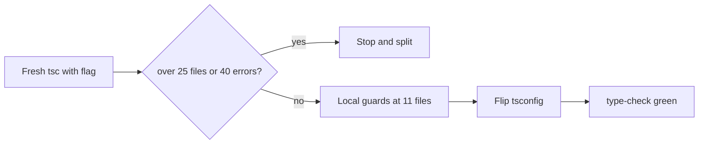

# Chat 11 — compiler catches missing index reads

F161. Repo-wide compiler-contract change. Locked: turn `noUncheckedIndexedAccess` on; leave `exactOptionalPropertyTypes` off. No migrations. Do not commit. Do not mix with a refactor.

A dry `tsc --noUncheckedIndexedAccess` on **2026-08-29** produced **20 errors in 11 TypeScript files**. That is a handful — finish it. The audit’s “regex match groups in check scripts” names real code but the wrong gate: check scripts are `.mjs` and are not in [`tsconfig.json`](tsconfig.json) `include` (`**/*.ts` / `**/*.tsx` only), so this flag never sees them. Do not convert them, do not add `checkJs`.

The guards are valid code with or without the flag, so they land **first**. That keeps `pnpm type-check` green at every point — an interrupted session never leaves an un-committable tree, and `.husky/pre-commit` (which runs `type-check`) stays passable throughout. The measuring command below already enumerates the error list without touching `tsconfig.json`, so flipping early buys nothing.



## Precondition

Before editing anything, run `git status` and record the working tree. Do not stash, revert, or clean.

Confirm 10 landed: [TECH_DEBT_AUDIT.md](TECH_DEBT_AUDIT.md) has F061 in § Resolved. If it is still Open, **stop**. Prior chats may still be uncommitted; name those files up front. `next dev` may have dirtied the `nextjs-agent-rules` block in [AGENTS.md](AGENTS.md).

## Measure first — then decide whether to continue

Run this **before** editing anything:

```bash
pnpm exec tsc --pretty false --noEmit --noUncheckedIndexedAccess
```

Compare to the 2026-08-29 baseline below. If the fresh list is **more than ~25 files or ~40 errors**, **stop and split** — do not grind every site in one sitting. If it matches (or is smaller), continue.

Baseline (11 files, 20 errors):

- [`src/supabase/read-auth-cookie.ts`](src/supabase/read-auth-cookie.ts)
- [`src/utils/parse-banner-message.ts`](src/utils/parse-banner-message.ts)
- [`src/utils/proxy-matcher.unit.test.ts`](src/utils/proxy-matcher.unit.test.ts)
- [`src/hooks/use-scrolled.ts`](src/hooks/use-scrolled.ts)
- [`src/app/admin/logs/_lib/list-app-log-stats.ts`](src/app/admin/logs/_lib/list-app-log-stats.ts)
- [`src/app/api/client-logs/_lib/cap-client-log-payload.ts`](src/app/api/client-logs/_lib/cap-client-log-payload.ts)
- [`src/config/landing-content.ts`](src/config/landing-content.ts) / [`src/app/(marketing)/_components/landing-proof-cta.tsx`](<src/app/(marketing)/_components/landing-proof-cta.tsx>)
- [`src/app/(marketing)/reference/_components/reference-section-nav.tsx`](<src/app/(marketing)/reference/_components/reference-section-nav.tsx>)
- [`src/app/(marketing)/workflow/_components/workflow-section-nav.tsx`](<src/app/(marketing)/workflow/_components/workflow-section-nav.tsx>)
- [`src/app/(marketing)/reference/_lib/reference-shipments.fixture.ts`](<src/app/(marketing)/reference/_lib/reference-shipments.fixture.ts>)
- [`src/app/auth/confirm/route.integration.test.ts`](src/app/auth/confirm/route.integration.test.ts)

Throwaway marketing files still have to compile. Fix them with the same local-guard style. Do **not** extract a shared scroll-spy (F117) or rewrite landing hrefs (F163).

## How to fix — guards, not assertions

The flag’s job is to make “maybe missing” visible. Prefer a local `if` / `??` / default destructure. Do **not** paper sites with `!` or `as`. Do **not** add a repo-wide `at()` / `pick()` helper in `src/utils/`.

| Site | Why it fails | Fix |
| ---- | ---- | ---- |
| [`read-auth-cookie.ts`](src/supabase/read-auth-cookie.ts) | `segments[1]` after `length !== 3` — the audit’s named example | Bind `const payloadSegment = segments[1]`; if missing, `return null` before `Buffer.from` |
| [`parse-banner-message.ts`](src/utils/parse-banner-message.ts) | `linkMatch[1]` / `[2]` after a successful `exec` | Bind label and href; if either is missing, take the existing text-segment fallback (same as a failed `isSafeUrlScheme`) |
| [`proxy-matcher.unit.test.ts`](src/utils/proxy-matcher.unit.test.ts) | `match[1]` after a truthy `match` | Bind the capture; throw the same “not found” error if the group is missing |
| [`use-scrolled.ts`](src/hooks/use-scrolled.ts) | Observer callback `[entry]` | If `entry` is missing, return; otherwise call `updateFromIntersection` |
| [`list-app-log-stats.ts`](src/app/admin/logs/_lib/list-app-log-stats.ts) | Only the `...LOG_LEVELS.map(...)` **tail** of the `Promise.all` widens to `number \| undefined` — the four errors are on the returned `debug` / `info` / `warn` / `error` fields. `total` and `unread` are explicit array entries before the spread and stay `number` | Keep the single parallel batch and `LOG_LEVELS` as source of truth. Default-destructure the tail only: `const [total, unread, debug = 0, info = 0, warn = 0, errorLevel = 0] = await Promise.all([...])`. Do **not** default `total` / `unread` — they are already typed, and a default there is dead code. Do not unroll four named `countWithFilter(client, 'debug')` calls — that drifts from `LOG_LEVELS` |
| [`cap-client-log-payload.ts`](src/app/api/client-logs/_lib/cap-client-log-payload.ts) | `keys[index]` as a computed delete key | Bind `const key = keys[index]`; `continue` if missing |
| Landing proof CTA | `proofCta.links` is `LandingProofCtaLink[]` because of `satisfies LandingProofCtaLink[]`, so the two-button destructure is possibly undefined | In [`landing-content.ts`](src/config/landing-content.ts) only: change that `satisfies` to a 2-tuple (`readonly [LandingProofCtaLink, LandingProofCtaLink]`). Add a one-line comment above `links` naming the invariant — the tuple is fixed at two because [`landing-proof-cta.tsx`](<src/app/(marketing)/_components/landing-proof-cta.tsx>) renders a primary and a secondary button — so an editor adding a third link sees why it fails to compile without opening the component. Leave the two href **literals** untouched (F163). The CTA file should then type-check with no edit |
| Two section navs | `intersecting.length > 0` does not narrow `[0]`; the fallback `LINKS[0].id` is unchecked | `?.` alone is not enough — `intersecting[0]?.target.id ?? LINKS[0]?.id` is still `string \| undefined` going into `setActiveId`, which takes `string`. Hoist a module-scope constant carrying the optional chain **and** the terminal string literal already on line 12 of each file (e.g. `const DEFAULT_ACTIVE_ID = REFERENCE_ANCHOR_LINKS[0]?.id ?? 'forms'`, and the workflow file’s own literal), then use it in both the `useState` initializer and the observer fallback. Do not introduce a second inline copy of the literal, and do not extract a hook |
| [`reference-shipments.fixture.ts`](<src/app/(marketing)/reference/_lib/reference-shipments.fixture.ts>) | **Two shapes, not one.** Line 64: plain `arr[index % arr.length]` reads (consignee, status, departs) widen to `T \| undefined` and fail assignment to `ReferenceShipment`. Line 68: a route pair is **destructured**, so the widened union has no `[Symbol.iterator]` and fails differently (TS2488) | One **file-local** generic `pick` that throws if the list is empty, covering both. It must be generic over the element type and return `T` — not widen to a union member or to `string` — so the readonly route-pair tuple survives and `const [from, to] = pick(ROUTE_PAIRS)` still destructures. Verify the line-68 site specifically after the edit; the line-64 sites passing does not prove it. Not a shared util |
| Confirm route test | `redirectMock.mock.calls[0][0]` | `const redirectedTo = redirectMock.mock.calls[0]?.[0]`; assert it is defined, then `not.toContain('Invalid token')`. Keep the existing `toHaveBeenCalledWith('/auth/error?source=confirm')` |

## Flip the flag

Once every site above is guarded: in [`tsconfig.json`](tsconfig.json) `compilerOptions`, add `"noUncheckedIndexedAccess": true` next to the existing `"strict": true`. Do not add `exactOptionalPropertyTypes`. Do not change `include` / `exclude` / `allowJs`.

ESLint does not use a typed `project` config, so `pnpm lint` will not re-report these. `pnpm type-check` is the gate.

After the flip, `pnpm exec tsc --pretty false --noEmit` must be zero errors. If a **new** file appears that was not in the baseline, fix it the same way — still inside the handful. If the remainder is a pile, stop and split.

**Exception — generated types.** `tsconfig.json` `include` covers `.next/types/**/*.ts` and `.next/dev/types/**/*.ts`. Those are Next.js build output, not hand-editable — an edit there is overwritten on the next build. If an error lands in either path, **stop and report it**; do not guard it.

## Docs

In [`.cursor/rules/typescript.mdc`](.cursor/rules/typescript.mdc): read the rule-authoring skill first. One clause on the existing “Strict mode is enabled” sentence — `noUncheckedIndexedAccess` is on; `exactOptionalPropertyTypes` is off (high churn, low value here). Do not add examples or a new section.

**Not AGENTS.md.** This is a compiler setting, not a hard constraint and not a `check:*` gate.

No README, DESIGN.md, or `/sync-repo-docs`. The rules-index blurb (“TypeScript strict mode conventions”) stays.

## Out of scope

- **`exactOptionalPropertyTypes`** — locked off.
- **Check scripts / `checkJs`** — `.mjs` files are not in this compile. Leave them.
- **F117 / F163 / F128 / F109 / F119 / F129 / F162** — do not start them. The landing `satisfies` edit is tuple-only; do not swap `/reference` and `/workflow` for the path constants.
- **A shared indexed-access helper.**
- **New tests whose only job is to prove TypeScript narrowed.** Existing tests stay; [testing.mdc](.cursor/rules/testing.mdc) says not to test the type system. [`read-auth-cookie.unit.test.ts`](src/supabase/read-auth-cookie.unit.test.ts) does not cover `readJwtExpFromAccessToken` today — do not add that case here.
- **Committing and opening a PR.** Do neither.

## Tests

No new test file. Targeted `pnpm test:file --` on the files whose behavior you touched:

- [`src/supabase/read-auth-cookie.unit.test.ts`](src/supabase/read-auth-cookie.unit.test.ts)
- [`src/utils/parse-banner-message.unit.test.ts`](src/utils/parse-banner-message.unit.test.ts)
- [`src/utils/proxy-matcher.unit.test.ts`](src/utils/proxy-matcher.unit.test.ts)
- [`src/hooks/use-scrolled.unit.test.ts`](src/hooks/use-scrolled.unit.test.ts)
- [`src/app/admin/logs/_lib/list-app-log-stats.unit.test.ts`](src/app/admin/logs/_lib/list-app-log-stats.unit.test.ts)
- [`src/app/api/client-logs/_lib/cap-client-log-payload.unit.test.ts`](src/app/api/client-logs/_lib/cap-client-log-payload.unit.test.ts)
- [`src/app/auth/confirm/route.integration.test.ts`](src/app/auth/confirm/route.integration.test.ts)

## Docs (audit)

After `CI=true pnpm type-check` is green and `CI=true pnpm pre-push` is green, in [TECH_DEBT_AUDIT.md](TECH_DEBT_AUDIT.md):

- Move F161 to § Resolved with today’s date (**2026-08-29**): flag on; `exactOptionalPropertyTypes` still off; 11 TypeScript files guarded (JWT payload index, regex groups, observer first-entry, `Promise.all` spread tail, landing 2-tuple, fixture pick). Record the check-script decision as a decision, not a correction: the finding’s `.mjs` regex observation describes real code, but check scripts are `.mjs` and outside the TypeScript compile, so this flag does not reach them — `checkJs` was considered and declined. Worded that way so a later pass does not refile it as new.
- § Open questions: delete the F161 bullet (decision landed).
- Leave § Top 5 alone (F161 is not in it). Remaining order stays **F128 / F119 / F109 / F180**.
- `Last synced:` stays **2026-08-29**.

No exec-summary rewrite required — there is no current F161 bullet there.

## Quality bar

- First: the measuring `tsc --noUncheckedIndexedAccess` (no file edits yet)
- After the guards, before the flip: `CI=true pnpm type-check` still clean
- After the flip: `CI=true pnpm type-check` must be clean
- Targeted tests above
- Then: `CI=true pnpm pre-push` (a bare `pnpm pre-push` aborts in a non-TTY agent shell)
- **If `test:ci` fails on coverage:** the guards add unreachable branches in `src/**`, which can move the global branch percentage. If a threshold trips, **stop and report the numbers**. Do not add filler tests and do not edit thresholds or the exclude set in `vitest.config.ts` — that is a PM decision per [testing.mdc](.cursor/rules/testing.mdc) § Coverage Requirements. The per-glob floors on `scripts/**` and `eslint-rules/**` were measured with no cushion, but this chat touches neither path.
- Grep: zero `exactOptionalPropertyTypes` added; zero new `!` on the files this chat touches
- No browser pass — types and existing tests only; runtime paths stay the same

## Manual test checklist

- Fresh `tsc --noUncheckedIndexedAccess` before any edit: ~11 files / ~20 errors, matching the baseline (or smaller).
- After the guards and before the flip: `pnpm type-check` is clean (the guards are valid code without the flag).
- After the flip: `pnpm type-check` is still clean. A deliberate `array[0]` use without a guard in a new scratch line should fail type-check (then revert the scratch).
- Existing unit tests above still pass — banner parse, log stats, client-log cap, confirm redirect (error URL still has no leaked token).
- Landing `/` still shows two proof-CTA buttons. No need to click through reference/workflow beyond type-check — those pages are throwaway; we only made them compile.
- Check-script `pnpm check:a11y-contrast` / `check:a11y-structure` unchanged (not in this compile).
