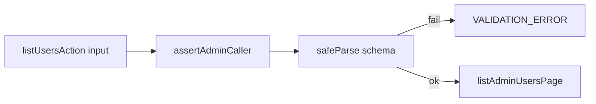

# Chat 12 — validate the last untrusted users-list input

F128. Top 5 #1. Unblocked by 9b. One action, one schema. No migrations. Do not commit.

Today [list-actions.ts](src/app/admin/users/_lib/list-actions.ts) hand-checks page, page size, sort, and the three booleans (~95 lines), then sends `emailFilter` straight to `.trim()`. A non-string throws and lands as `INTERNAL_ERROR`. There is no length cap. Logs already caps search at 200 ([log-list-filters.ts](src/app/admin/logs/_lib/log-list-filters.ts)); settings already `safeParse`s at the top ([settings/_lib/actions.ts](src/app/admin/settings/_lib/actions.ts)). This chat makes the users list match both.

## Precondition

Before editing anything, run `git status` and record the working tree. Do not stash, revert, or clean.

Confirm 9b landed: [TECH_DEBT_AUDIT.md](TECH_DEBT_AUDIT.md) has F105 in § Resolved. If it is still Open, **stop**. Prior chats may still be uncommitted (11’s `tsconfig` / index guards, 10’s dialog host, dirty `stat-tile` / logs tiles, `nextjs-agent-rules` in [AGENTS.md](AGENTS.md)). Name those files up front. Touch only this chat’s files plus the F128 audit rows.

## The schema

New sibling [src/app/admin/users/_lib/list-users-input-schema.ts](src/app/admin/users/_lib/list-users-input-schema.ts) — no `'use server'`. This is a one-surface validation boundary, same placement as [profile-form-schema.ts](src/app/(app)/_lib/profile/profile-form-schema.ts). Do **not** put it in `src/utils/` (not shared). Do **not** put it in the action file (that file is a server-action module; settings keeps its schema out of `'use server'`).

Add `USERS_EMAIL_FILTER_MAX_LENGTH = 200` next to `USERS_SEARCH_MIN_LENGTH` in [admin-user-row.ts](src/app/admin/users/_lib/admin-user-row.ts). Do **not** import `LOG_SEARCH_MAX_LENGTH` from logs.

Schema fields, with the **existing test-pinned messages** so [list-actions.unit.test.ts](src/app/admin/users/_lib/list-actions.unit.test.ts) does not churn:

| Field | Shape | Default | Message to keep |
| ---- | ---- | ---- | ---- |
| `page` | integer ≥ 1 | `1` | `Page must be a positive integer` |
| `perPage` | literal union built from `DATA_TABLE_PAGE_SIZE_OPTIONS` | `DATA_TABLE_DEFAULT_PAGE_SIZE` | `Page size must be 10, 15, 25, or 50` |
| `sortColumn` | `z.enum(USERS_SORT_COLUMNS)` | `'created_at'` | `Invalid sort column` |
| `sortDirection` | `z.enum(USERS_SORT_DIRECTIONS)` | `'desc'` | `Sort direction must be asc or desc` |
| `filterUnverified` / `filterBanned` / `filterNew30d` | boolean | `false` | existing “must be a boolean” strings |
| `emailFilter` | `z.string().trim().max(USERS_EMAIL_FILTER_MAX_LENGTH).optional()` | omitted | type: `Email filter must be a string`; length: `Email filter must be 200 characters or fewer` |

Zod is already `^4.4.3`. Match existing Zod 4 style: `{ error: '…' }` / second-arg message strings as in [sign-up/schema.ts](src/app/auth/_lib/sign-up/schema.ts) and [app-settings-schema.ts](src/utils/app-settings-schema.ts).

Three shape constraints on that table:

- **`page` messages attach to every check.** `Page must be a positive integer` must be set on the type, integer, and minimum checks — not just one. The pinned test passes `page: 0`, which trips the minimum; a message set only on `.int()` changes the returned string and breaks it.
- **`perPage` must preserve its literal type.** Build it as a literal union over `DATA_TABLE_PAGE_SIZE_OPTIONS` (e.g. `z.literal(DATA_TABLE_PAGE_SIZE_OPTIONS)`, or a union mapped from the constant) — **not** `z.number().refine(...)`, which widens `z.input`'s `perPage` from `DataTablePageSize` to `number` on a type the barrel exports publicly. Either way, derive from the constant; do not restate the four sizes as literals in the schema file.
- **The 200 cap applies to the trimmed value**, since `.trim()` runs before `.max()`. That is the intent; logs caps the raw value instead, and the difference is accepted here. It constrains the test strings — see § Tests.

Export `ListUsersActionInput` as `z.input<typeof listUsersActionInputSchema>` (caller-facing, all optional). Do **not** invent a `parseListUsersInput` wrapper — settings inlines `safeParse`.

## The action

In [list-actions.ts](src/app/admin/users/_lib/list-actions.ts):

1. Keep **auth first**, then parse. A non-admin with a bad payload must still get `FORBIDDEN`, not `VALIDATION_ERROR`. Settings does the same.
2. Change the parameter to `input: unknown = {}` (trust boundary, same as `saveAppSettingAction`).
3. Delete the seven hand-rolled blocks (page through the three booleans).
4. `safeParse`, then map `issues[0]?.message ?? 'Invalid input'` to `VALIDATION_ERROR` / `kind: 'operational'` — copy the shape of the settings validation-failure return, including the optional chain (F161 is on). **Scope that copy to the validation-failure return block only.** Do not restructure the rest of the action: the existing `try` stays wrapped around the RPC call, and the catch keeps returning `mapAdminActionFault(...)`. Do not adopt settings' whole-body try/catch or its hardcoded `INTERNAL_ERROR` return.
5. Pass `parsedInput.data` into `listAdminUsersPage`. Schema already trims `emailFilter`; do not trim again in the action. Leave the helper’s own trim + 3-char RPC gate in [list-admin-users.ts](src/app/admin/users/_lib/list-admin-users.ts) alone.

`getUserStatsAction` is unchanged. The barrel in [users/actions.ts](src/app/admin/users/actions.ts) already re-exports `ListUsersActionInput` — keep that name; only the definition moves to the schema file. Re-export it from `list-actions.ts` so the barrel path does not change, using a **type-only** re-export: `export type { ListUsersActionInput } from './list-users-input-schema'`. A value re-export fails the build in a `'use server'` module, where only async functions may be exported; the file's existing `export type { AdminUserStats } from './list-admin-user-stats'` is the pattern.

Because the parameter becomes `unknown`, the action no longer type-checks its caller. Restore that check at the one call site: in [use-admin-users-list.ts](src/app/admin/users/_lib/use-admin-users-list.ts), annotate the object passed to `listUsersAction` with `satisfies ListUsersActionInput` (imported from `../actions`). That is the only hook edit in scope — no other hook or toolbar change.

## Out of scope

- **F149 / F179** — do not collapse `run-*` files or delete result-type aliases.
- **F180 / F162** — do not start the mutation helper.
- **Logs list action** — still hand-rolled; not this chat.
- **Toolbar `maxLength`** — logs does not cap the input. Server cap only. A 201-character paste from the box becoming `VALIDATION_ERROR` is acceptable; do not expand into UI polish.
- **Client schema / search min-length** — the 3-character gate stays where it is (`appliedSearch` / RPC). Do not add a min on `emailFilter` in this schema (short strings are valid input; the helper no-ops them).
- **AGENTS.md, security.mdc, forms.mdc** — the pattern they describe is what this chat implements. No wording change.
- **Committing and opening a PR.** Do neither.

## Tests

Same file: [list-actions.unit.test.ts](src/app/admin/users/_lib/list-actions.unit.test.ts). No new test file. Existing message-pinned cases stay.

Add three cases only (the finding, plus one boundary):

- non-string `emailFilter` (e.g. `1` via `as unknown`) → `VALIDATION_ERROR` / `Email filter must be a string`; `listAdminUsersPage` not called
- `emailFilter` of length 201 → `VALIDATION_ERROR` / the max-length message; helper not called
- `emailFilter` of length 200 → success path; helper called with the 200-character string (trimmed)

Both length strings must be **non-whitespace** characters (e.g. `'a'.repeat(201)`). The cap runs after `.trim()`, so a 201-character string with trailing whitespace trims to 200 and passes, silently inverting the test.

Do not add a schema unit test. Do not re-test every existing rule through a second file. [testing.mdc](.cursor/rules/testing.mdc): this is the trust-boundary exception that justifies the two invalid cases; the 200-character case is the boundary, not a permutation.

Existing [users-table.integration.test.tsx](src/app/admin/users/_components/users-table.integration.test.tsx) mocks the action — no edit.

## Docs (audit)

After `CI=true pnpm type-check` is green and `CI=true pnpm pre-push` is green, in [TECH_DEBT_AUDIT.md](TECH_DEBT_AUDIT.md):

- Move F128 to § Resolved with today’s date (**2026-08-29**): Zod `safeParse` at the top of `listUsersAction` after `assertAdminCaller`; `emailFilter` is a string with max 200 (same cap as logs search); non-string no longer throws as `INTERNAL_ERROR`; hand-rolled checks deleted. Note F149 / F179 / F180 were not done here.
- § Top 5: drop F128; remaining order **F119 / F109 / F180**. Do not promote a replacement — the section already held four rows, not five, and leaving it at three is the decision here.
- Exec summary admin-contract bullet: F128 is closed; F149 and F179 remain on their own tracks.
- `Last synced:` stays **2026-08-29**.

No README, DESIGN.md, AGENTS.md, or `/sync-repo-docs`. Do not edit [tmp/tech-debt-quick-fix-chats.md](tmp/tech-debt-quick-fix-chats.md).

## Quality bar

- Targeted: `CI=true pnpm type-check` and `pnpm test:file --` on [list-actions.unit.test.ts](src/app/admin/users/_lib/list-actions.unit.test.ts)
- Then: `CI=true pnpm pre-push` (a bare `pnpm pre-push` aborts in a non-TTY agent shell)
- Grep: zero remaining `input.emailFilter?.trim()` in `list-actions.ts`; zero new imports from `logs/_lib`
- Confirm `ListUsersActionInput['perPage']` still resolves to `DataTablePageSize`, not `number` — hover or a scratch type assertion; a widened type means `perPage` was built as a refine on `z.number()`.
- **If `test:ci` fails on coverage:** stop and report the numbers. Do not add filler tests and do not edit thresholds. This chat only touches `src/**` (global 80%), not the `scripts/**` / `eslint-rules/**` floors.
- No browser pass required — happy-path search is unchanged. The two new failure modes cannot be produced by the typed toolbar.

## Manual test checklist

- Existing list-action unit tests still pass: missing session / non-admin → `FORBIDDEN`; `page: 0`, bad page size, bad sort, non-boolean filters → same `VALIDATION_ERROR` messages as today; success still defaults page 1 / perPage 15 / `emailFilter: undefined`.
- New: non-string `emailFilter` and 201-character `emailFilter` return `VALIDATION_ERROR` and never call the RPC helper. 200 characters still forwards.
- Optional smoke if the app is up: `/admin/users` as admin, type 3+ characters in email search — results still load. Do not need to paste 201 characters in the box.
