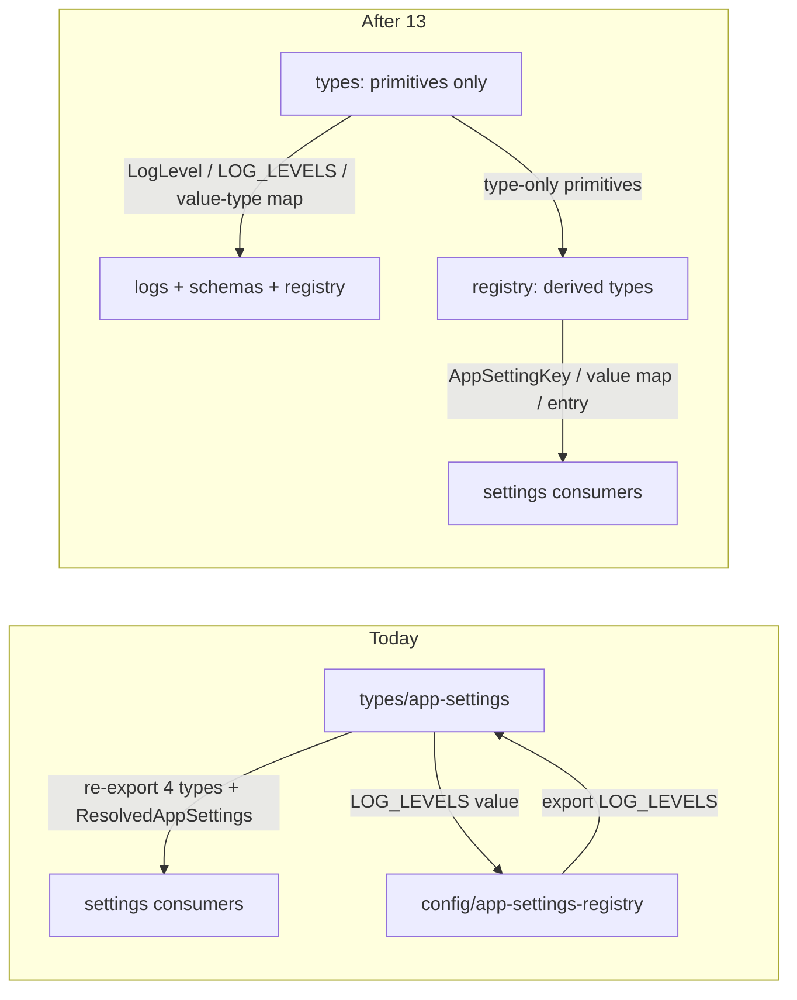

# Chat 13 — break the settings registry cycle

F109. Top 5 #2 (after 12 closed F128). Own chat. Adding a setting in the fork makes this worse — do it **before** F129/F132, which widen the same type module that currently cycles. No migrations. Do not commit.

Today [src/types/app-settings.ts](src/types/app-settings.ts) re-exports four registry-derived types and aliases `ResolvedAppSettings` to `AppSettingValueMap`. [src/config/app-settings-registry.ts](src/config/app-settings-registry.ts) imports the **runtime value** `LOG_LEVELS` from the types module and re-exports it. That is a value-carrying cycle (`madge --circular --ts-config` reports it). `LOG_LEVELS` has two import paths; `LogLevel` has three (types, the registry re-export of `LOG_LEVELS`, and the [src/types/app-logs.ts](src/types/app-logs.ts) convenience re-export). Every real `LOG_LEVELS` consumer already imports from types — the registry re-export has **no production importer**.

## Precondition

Before editing anything, run `git status` and record the working tree. Do not stash, revert, or clean.

Confirm 12 landed: [TECH_DEBT_AUDIT.md](TECH_DEBT_AUDIT.md) has F128 in § Resolved. If it is still Open, **stop**. Prior chats may still be uncommitted (11’s `tsconfig` / index guards, 10’s dialog host, 12’s users schema, dirty `stat-tile` / logs tiles, `nextjs-agent-rules` in [AGENTS.md](AGENTS.md)). Name those files up front. Touch only this chat’s files plus the F109 audit rows, the one typescript.mdc clause, and the one project-standards.mdc cross-reference line.

## The two module edits

**[src/types/app-settings.ts](src/types/app-settings.ts)** keeps only primitives:

- `LOG_LEVELS`, `LogLevel`, `AppSettingValueType`, `AppSettingValueByType`
- Delete the `export type { AppSettingKey, AppSettingRegistryEntry, AppSettingRegistryEntryFor, AppSettingValueMap }` block
- Delete the `import type { AppSettingValueMap }` and the `ResolvedAppSettings` alias

`AppSettingValueType` stays even though the finding’s parenthetical omitted it. It is a primitive (not derived from the registry array) and the registry already imports it. Do **not** move `LOG_LEVELS` into the registry — that inverts the cycle.

**Do not** leave a compatibility re-export (`export type { AppSettingKey, … } from '@/config/app-settings-registry'`). That is the cycle.

**[src/config/app-settings-registry.ts](src/config/app-settings-registry.ts):**

- Delete `import { LOG_LEVELS }` and `export { LOG_LEVELS }`. The registry does not use the value except to re-export it.
- Keep the type-only import of `AppSettingValueByType`, `AppSettingValueType`, and `LogLevel`.
- Add `export type ResolvedAppSettings = AppSettingValueMap` next to `AppSettingValueMap`. Same name, new home — four call sites change path only, not the identifier. Do **not** delete the alias and rename everyone to `AppSettingValueMap`.

After this, the only edge is registry → types (type-only). Types imports nothing from the registry.

## Repoint the eight consumers

Registry-derived names move to `@/config/app-settings-registry`. Primitives stay on `@/types/app-settings`. If a file already imports the registry, add the types to that import (or a sibling `import type`) — do not add a third module.

Files that must change path (registry-derived names currently from types):

- [src/utils/app-settings.ts](src/utils/app-settings.ts) — `AppSettingKey`, `AppSettingValueMap`, `ResolvedAppSettings` (already imports `APP_SETTINGS_REGISTRY`; drop the types-module import entirely)
- [src/utils/app-settings-schema.ts](src/utils/app-settings-schema.ts) — `AppSettingKey`, `AppSettingValueMap` (keep `LOG_LEVELS` from types)
- [src/app/admin/settings/_lib/actions.ts](src/app/admin/settings/_lib/actions.ts) — `AppSettingKey`, `AppSettingValueMap`
- [src/app/admin/settings/_components/app-setting-row.tsx](src/app/admin/settings/_components/app-setting-row.tsx) — `AppSettingKey`, `AppSettingRegistryEntry`, `AppSettingRegistryEntryFor`, `AppSettingValueMap` (keep `LOG_LEVELS` and `LogLevel` from types; collapse the current two types-module imports into one types import + one registry import)
- [src/app/admin/settings/_components/banner-setting-row.tsx](src/app/admin/settings/_components/banner-setting-row.tsx) — `AppSettingRegistryEntry`
- [src/app/admin/settings/_components/app-settings-panel.tsx](src/app/admin/settings/_components/app-settings-panel.tsx) — `AppSettingKey`, `ResolvedAppSettings` (already imports the registry)
- [src/app/admin/settings/_components/banner-settings-section.tsx](src/app/admin/settings/_components/banner-settings-section.tsx) — same as the panel
- [src/app/admin/settings/_components/banner-settings-section.unit.test.tsx](src/app/admin/settings/_components/banner-settings-section.unit.test.tsx) — `ResolvedAppSettings`

Leave every `LOG_LEVELS` / `LogLevel` importer on types: logs tiles, log-row helper, log stats, log-level badge, both loggers, client-log relay schema, reference demo, [src/types/app-logs.ts](src/types/app-logs.ts). Do **not** delete the `LogLevel` re-export on `app-logs` — that is a logs-domain convenience, not the cycle.

[src/config/app-settings-registry.unit.test.ts](src/config/app-settings-registry.unit.test.ts) already imports `AppSettingKey` from the registry. No edit.

## Docs (rule)

Read the [rule-authoring skill](.cursor/skills/rule-authoring/SKILL.md) first.

**[.cursor/rules/typescript.mdc](.cursor/rules/typescript.mdc) § Shared Types Placement** — add **one clause**, stated as the general principle, not as a fact about two files: a type computed from a runtime module (e.g. `AppSettingKey` from `APP_SETTINGS_REGISTRY`) is imported from the module that derives it, not relocated to or re-exported through `src/types/`; `src/types/` holds hand-written domain types only. Cite the settings registry as the instance, not the subject. No examples beyond that one citation, no new section, no catalog of type names.

**[.cursor/rules/project-standards.mdc](.cursor/rules/project-standards.mdc) § Utilities & Helpers Location** — the existing line reads "Shared types live in `src/types/`" with no qualifier, which contradicts the clause above. Add **one cross-reference line** noting that derived types are the exception and pointing at `typescript.mdc` § Shared Types Placement. A pointer only — do not restate the rule here; `typescript.mdc` owns shared-type placement.

## Out of scope

- **F129** — do not make the registry a discriminated union, do not add a `never` fallthrough, do not delete the six assertions in the settings row.
- **F132** — do not extract `useAppSettingSave`.
- **F136 / F157** — do not add a `parseAppSettingValue` test; do not partition banner vs non-banner.
- **Moving `LOG_LEVELS` into the registry** or inventing a third types file / barrel.
- **AGENTS.md, DESIGN.md, README, `/sync-repo-docs`.**
- **Committing and opening a PR.** Do neither.
- Do not edit [tmp/tech-debt-quick-fix-chats.md](tmp/tech-debt-quick-fix-chats.md).

## Tests

No new test file. Import-path only; [testing.mdc](.cursor/rules/testing.mdc) says not to test the type system. Do not add a madge-in-CI gate.

Targeted `pnpm test:file --` on the files whose imports you touched and that already have tests:

- [src/config/app-settings-registry.unit.test.ts](src/config/app-settings-registry.unit.test.ts)
- [src/utils/app-settings.unit.test.ts](src/utils/app-settings.unit.test.ts)
- [src/app/admin/settings/_components/banner-settings-section.unit.test.tsx](src/app/admin/settings/_components/banner-settings-section.unit.test.tsx)
- [src/app/admin/settings/_components/app-settings-panel.integration.test.tsx](src/app/admin/settings/_components/app-settings-panel.integration.test.tsx)
- [src/app/admin/settings/_components/app-setting-row.integration.test.tsx](src/app/admin/settings/_components/app-setting-row.integration.test.tsx)
- [src/app/admin/settings/_components/banner-setting-row.integration.test.tsx](src/app/admin/settings/_components/banner-setting-row.integration.test.tsx)

## Docs (audit)

After `CI=true pnpm type-check` is green and `CI=true pnpm pre-push` is green, in [TECH_DEBT_AUDIT.md](TECH_DEBT_AUDIT.md):

- Move F109 to § Resolved with today’s date (**2026-08-29**): one import direction; types module keeps primitives (`LOG_LEVELS`, `LogLevel`, `AppSettingValueType`, `AppSettingValueByType`); registry-derived types (`AppSettingKey`, `AppSettingValueMap`, entry types, `ResolvedAppSettings`) imported from the registry; types re-export block deleted; registry `LOG_LEVELS` re-export deleted; `madge --circular --ts-config` clean. Two retentions to record so the closure does not read as partial: the [src/types/app-logs.ts](src/types/app-logs.ts) `LogLevel` re-export stays (logs-domain convenience, not part of the cycle — the finding counts it as one of the three paths), and `ResolvedAppSettings` stays as a name on the registry rather than being collapsed into `AppSettingValueMap`. Note F129 / F132 were not done here.
- § Top 5: drop F109; remaining order **F119 / F180**. Do not promote a replacement.
- Exec summary enforcement-layer bullet: the madge sentence currently ends on “one genuine value-carrying cycle (F109)” — rewrite that clause so the cycle is closed and the `--ts-config` lesson stays (the no-flag invocation is still a false negative).
- § Tooling notes madge row: change from “1 circular dependency” to **No circular dependency found**. Then reword the no-`--ts-config` row: its “false negative” label currently rests on the contrast between the two rows, which disappears once both read clean. State the structural reason instead — the invocation resolves no `@/*` aliases, so it cannot see cycles that cross the alias boundary; do not use it.
- `Last synced:` stays **2026-08-29**.

## Quality bar

- Targeted: `CI=true pnpm type-check` and the `pnpm test:file --` list above
- Then: `CI=true pnpm pre-push` (a bare `pnpm pre-push` aborts in a non-TTY agent shell)
- Madge (the invocation F110 already pinned): `npx madge --circular --extensions ts,tsx --ts-config tsconfig.json src` — must report no cycle
- Grep: zero `AppSettingKey` / `AppSettingValueMap` / `AppSettingRegistryEntry` / `AppSettingRegistryEntryFor` / `ResolvedAppSettings` imported from `@/types/app-settings`; zero `export { LOG_LEVELS }` in the registry; zero `import` of `LOG_LEVELS` from the registry; [src/types/app-settings.ts](src/types/app-settings.ts) has no import from `app-settings-registry`
- **If `test:ci` fails on coverage:** stop and report the numbers. Do not add filler tests and do not edit thresholds. This chat only touches `src/**` (global 80%), not the `scripts/**` / `eslint-rules/**` floors.
- No browser pass required — import paths only; runtime is unchanged.

## Manual test checklist

- Existing settings / registry / panel tests still pass (registry still four keys; unknown key rejected; panel and banner section still save).
- `pnpm type-check` is clean. A scratch `import type { AppSettingKey } from '@/types/app-settings'` should fail (then revert the scratch).
- Madge with `--ts-config` reports no cycle. Do not use the no-flag invocation as proof.
- Optional smoke if the app is up: `/admin/settings` as admin — logging rows and banner accordion still render and save. No need to add a setting.
