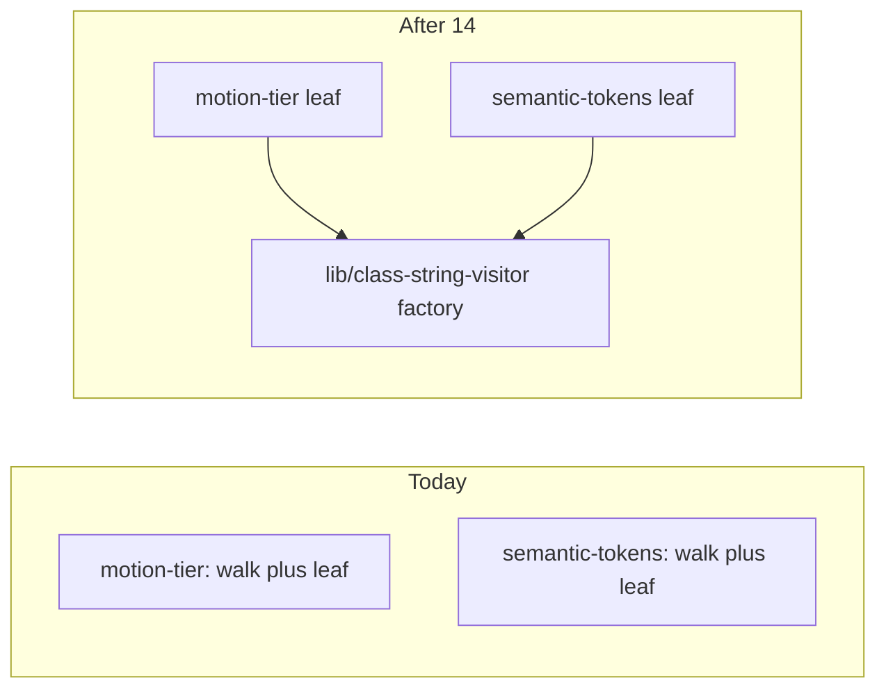

# Chat 14 — one AST visitor for both hard-constraint lint rules

F119. Top 5 #1 (after 13 closed F109). Own chat because the extract changes the `eslint-rules/**` denominator and **must re-baseline that floor**. Unblocked by 6a (tests exist) and 6c (coverage counts them). No migrations. Do not commit.

Today [eslint-rules/motion-tier.mjs](eslint-rules/motion-tier.mjs) and [eslint-rules/semantic-tokens.mjs](eslint-rules/semantic-tokens.mjs) each carry the same ~110-line walk: template-literal collector, expression walker, `cva` argument walker, `cn` import-source test, and the entire `create()` visitor. Only the leaf scan differs. A `cva` fix in one silently misses the other. Both also re-test `'@/utils/tailwind'` against a constant that already holds that string.

## Precondition

Before editing anything, run `git status` and record the working tree. Do not stash, revert, or clean.

Confirm 13 landed: [TECH_DEBT_AUDIT.md](TECH_DEBT_AUDIT.md) has F109 in § Resolved. If it is still Open, **stop**. Prior chats may still be uncommitted (11’s `tsconfig` / index guards, 10’s dialog host, 12’s users schema, 13’s registry import flip, dirty `stat-tile` / logs tiles, `nextjs-agent-rules` in [AGENTS.md](AGENTS.md)). Name those files up front. Touch only this chat’s files plus the F119 audit rows and the `eslint-rules/**` floor numbers.

## The factory

New [eslint-rules/lib/class-string-visitor.mjs](eslint-rules/lib/class-string-visitor.mjs). One named export: `createClassStringVisitor(context, scanClassString)`. It returns the visitor object (`ImportDeclaration`, `JSXAttribute`, `CallExpression`). Each rule’s `create` becomes a one-liner that passes its own leaf scanner. `meta` stays on each rule — descriptions differ.

`lib/` rather than a flat `eslint-rules/class-string-visitor.mjs`: the four existing files in `eslint-rules/` are all rules, and a fifth flat `.mjs` that is not a rule reads as one. `lib/` marks it as shared internals. Coverage `include` (`eslint-rules/**/*.mjs`) reaches either path.

Move into the factory, verbatim except the import-source clause below:

- `isCnImportSource` and its source constant (renamed — see below)
- `collectTemplateStatic`
- `scanExpressionStrings` (calls the injected leaf on every string it finds)
- `scanCvaCall`
- `const cnBindings = new Set()` — declared **inside** `createClassStringVisitor`, one Set per invocation. It is per-file mutable state: at module scope it would accumulate `cn` aliases across every linted file and across `lintText` cases in both rules.
- The three visitor entries and their `context.report` wrappers (`messageId: 'violation'`, same report nodes as today)

Do **not** export the walkers. Do **not** wrap `meta` or the whole `RuleModule` — the finding is a factory that takes a leaf scanner, not a rule constructor.

**Collapse the import-source test to one clause** while moving `isCnImportSource`. Today it is `source === CN_IMPORT_SOURCE || source === '@/utils/tailwind' || source.endsWith('/utils/tailwind')`. All three are redundant, not just the middle one: `'@/utils/tailwind'.endsWith('/utils/tailwind')` is `true`, so the `endsWith` test already subsumes both equality tests. Replace `CN_IMPORT_SOURCE` with `const CN_IMPORT_SUFFIX = '/utils/tailwind'` and make the whole test `source.endsWith(CN_IMPORT_SUFFIX)` — one clause, and the canonical value stays named rather than becoming an unused constant.

Leaf scanner contract: `(value, report) => void`. Same signature both rules already use. JSDoc that on the factory parameter; no extra types file.

Keep the identifier-resolution ceiling comment on **both rule files** (F144 and ADR-0002 cite those headers). Add a one-line note on the factory that the walk does not follow identifiers — do not delete the rule-file comments.

## Thin the two rules

[eslint-rules/motion-tier.mjs](eslint-rules/motion-tier.mjs) keeps `DURATION_TIER`, `isTransitionExempt`, `transitionRequiresTier`, `hasDurationTier`, `scanClassString`, `meta`, and `create` that calls the factory.

[eslint-rules/semantic-tokens.mjs](eslint-rules/semantic-tokens.mjs) keeps `HEX_COLOR`, `NUMERIC_TAILWIND_SCALE`, `scanClassString`, `meta`, and the same `create` shape.

Import with the `.mjs` extension: `./lib/class-string-visitor.mjs`.

Do **not** edit [eslint.config.mjs](eslint.config.mjs) — it still default-imports the two rule files. Named gates, `check:semantic-tokens`, and `pnpm lint` keep working without a registration change.

Coverage `include` is already `eslint-rules/**/*.mjs`, so the new file is measured automatically. Do not change `include` or any `exclude`.

## Out of scope

- **Extra `lintText` cases** to inflate coverage or to pin walker branches (template literals, logical/conditional, `compoundVariants`). Existing pins in [eslint.config.unit.test.ts](eslint.config.unit.test.ts) stay as they are.
- **`scripts/**` floors** and the two F186 `// debt:` excludes in [vitest.config.ts](vitest.config.ts).
- **F174** — do not extract `is-main`.
- **F186** — do not write check-script tests.
- **F144** — do not teach the visitor to resolve identifiers.
- [testing.mdc](.cursor/rules/testing.mdc) — floors already point at `vitest.config.ts`; do not paste the new percentages into the rule.
- **AGENTS.md, DESIGN.md, README, `/sync-repo-docs`.**
- **Committing and opening a PR.** Do neither.
- Do not edit [tmp/tech-debt-quick-fix-chats.md](tmp/tech-debt-quick-fix-chats.md).

## Re-baseline `eslint-rules/**` (same ritual as 8b)

Do this **after** the extract, not before. The current 48 / 53 / 57 / 48 numbers assume two copies of the walk.

1. Run `CI=true pnpm test:ci`. Read the `eslint-rules` four-metric aggregate (text table, or `--coverage.reporter=json-summary` if there is no single rollup row — do not leave that reporter in the config).
2. Floor each metric with `Math.floor(measured)`. No cushion. Dedup usually **raises** the ratio (uncovered walker branches stop counting twice); still set from the fresh run, do not assume headroom or keep 48.
   **If any of the four floored metrics lands below its current value (48 / 53 / 57 / 48), stop and report all four numbers before editing [vitest.config.ts](vitest.config.ts).** Lowering a coverage floor is a PM decision per [testing.mdc](.cursor/rules/testing.mdc) § Coverage Requirements, and the block's own comment says never lower. Do not decide it in-chat. Resume only on an explicit go-ahead.
3. Edit only the `'eslint-rules/**'` block in [vitest.config.ts](vitest.config.ts). Leave the comment date at **2026-08-29** (already correct) and leave the `'scripts/**'` block and the global 80s untouched. If the verifying `test:ci` then fails one metric on v8 jitter, drop **that metric** by 1 and stop — and note which metric was dropped, it is excluded from the probe in step 4.
4. **Confirm the glob still binds.** Temporarily raise one `eslint-rules/**` metric by 1, confirm `test:ci` fails naming that glob, restore the floor, re-run green. Probe a metric that was **not** jitter-adjusted in step 3 — raising a dropped metric by 1 only restores it to the measured value and passes, which reads as a non-binding glob. If all four were adjusted, raise by 2 instead. Do not “prove” the ratchet by adding a dummy file.

A structural denominator change may lower a number versus today’s 48. That is a re-baseline, not papering over a drop — but it still goes through the stop-and-report in step 2. Do not add tests to hold the old floor.

## Tests

No new test file. Targeted: `pnpm test:file -- eslint.config.unit.test.ts` — the three motion-tier cases and the four theming cases must still pass, plus the named-gate semantic-tokens cases in the same file.

Then `CI=true pnpm test:ci` (this *is* the floor change) and `CI=true pnpm pre-push`.

## Docs (audit)

After both gates are green, in [TECH_DEBT_AUDIT.md](TECH_DEBT_AUDIT.md):

- Move F119 to § Resolved with today’s date (**2026-08-29**): shared traversal in `eslint-rules/lib/class-string-visitor.mjs`; both rules call `createClassStringVisitor` with their own leaf scanner; `isCnImportSource` collapsed from three redundant clauses to one `endsWith` test; existing `lintText` pins unchanged; `eslint-rules/**` floor reset from a fresh `test:ci` (`Math.floor`, no cushion) — record the four numbers actually set. Note F174 / F186 / extra walker `lintText` cases were not done here.
- § Top 5: drop F119; remaining order **F180**. Do not promote a replacement.
- Exec-summary enforcement-layer bullet: add that the two class-string rules now share one visitor and that the `eslint-rules/**` floor was re-baselined this date. Leave F186 as the remaining least-tested pointer.
- F189 Resolved notes: the sentence that says F119 must re-baseline the `eslint-rules/**` floor — update it to past tense (done this date) and keep the F186 / `scripts/**` warning. In the same row, the recorded `eslint-rules/**: 48 / 53 / 57 / 48` numbers are now stale — either update them to the numbers actually set, or mark them as F189's initial baseline and name the current ones. The audit must not contradict `vitest.config.ts`.
- `Last synced:` stays **2026-08-29**.

## Quality bar

- Targeted: `pnpm test:file -- eslint.config.unit.test.ts`
- Then: `CI=true pnpm test:ci` (must pass with the new `eslint-rules/**` floor)
- Then: `CI=true pnpm pre-push` (a bare `pnpm pre-push` aborts in a non-TTY agent shell)
- `pnpm check:semantic-tokens` still green on the real tree
- Grep: zero copies of `collectTemplateStatic` / `scanCvaCall` / `scanExpressionStrings` left in the two rule files; one `createClassStringVisitor` export; both rules import it
- **If any gate fails on files this chat did not touch** (including `scripts/**`, and anything from the uncommitted prior chats named in § Precondition): stop and report. Do not fix it here.
- No browser pass — lint-rule internals, no UI

## Manual test checklist

- Existing motion-tier and semantic-tokens `lintText` pins still pass (bare `transition-colors` fails; `duration-swept` passes; hex / `cva` numeric / `cn()` numeric fail; clean tokens pass; `ui/` still ignored for motion-tier).
- `pnpm check:semantic-tokens` and `pnpm lint` still green.
- After the floor edit: `test:ci` passes; the bind-probe (raise one `eslint-rules/**` metric by 1) fails naming that glob; restore and re-run green.
- Coverage summary still lists all four lint rules plus the new `lib/class-string-visitor.mjs`. `checks-wired.mjs` and `pnpm-only.mjs` still absent. `scripts/**` floors unchanged.
