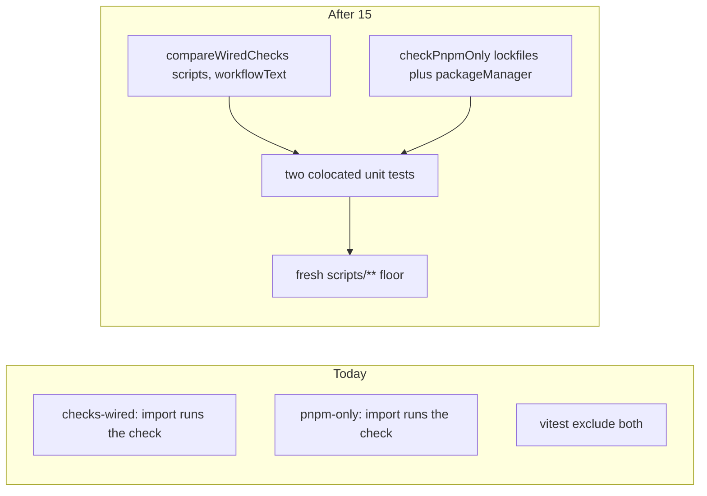

# Chat 15 — the meta-gate that keeps every other check wired

F186. Unblocked by 6c; 8b made the excludes load-bearing. Own chat because removing those excludes without tests fails the `scripts/**` floor, and adding the tests changes that denominator — **re-baseline `scripts/**` in the same session**. No migrations. Do not commit.

Today [scripts/checks/checks-wired.mjs](scripts/checks/checks-wired.mjs) and [scripts/checks/pnpm-only.mjs](scripts/checks/pnpm-only.mjs) run at import time and export nothing, so they cannot be imported by a test. They are the only two check scripts without a colocated test. The wired-check regex is the single thing that stops a `check:*` script from silently dropping out of CI — a regression there disables every other constraint without failing anything. Both files are `// debt:` excludes in [vitest.config.ts](vitest.config.ts); deleting those lines without tests now fails the `scripts/**` floor (74 / 77 / 83 / 74).

## Precondition

Before editing anything, run `git status` and record the working tree. Do not stash, revert, or clean.

Confirm 14 landed: [TECH_DEBT_AUDIT.md](TECH_DEBT_AUDIT.md) has F119 in § Resolved. If it is still Open, **stop**. Prior chats may still be uncommitted (11’s `tsconfig` / index guards, 10’s dialog host, 12’s users schema, 13’s registry import flip, 14’s class-string visitor and `eslint-rules/**` floor, dirty `stat-tile` / logs tiles, `nextjs-agent-rules` in [AGENTS.md](AGENTS.md)). Name those files up front. Touch only this chat’s files plus the F186 audit rows, the F174 “bundle with F186” phrase, the F189 scripts-floor numbers, and the one [testing.mdc](.cursor/rules/testing.mdc) clause that names F186.

## Why these two must export before they can be tested

The other four checkers already export a named function and wrap CLI I/O in `isMain`, which is why [seo-base-url.unit.test.ts](scripts/checks/seo-base-url.unit.test.ts) can `import { checkSeoBaseUrl } from './seo-base-url.mjs'` without exiting the process. These two do not. Importing either file today runs the check against the real repo and calls `process.exit`. The extract is what makes a test possible, not a style preference.

Do **not** create `scripts/checks/lib/`. Both exports live in their existing files. That directory is F174’s open question.

## checks-wired: the comparison function

In [scripts/checks/checks-wired.mjs](scripts/checks/checks-wired.mjs), export one named function:

`compareWiredChecks(scripts, workflowText)` → `{ ok, checkNames, missingFromPrePush, missingFromCi }`

`ok` is both missing arrays empty. `scripts` is the `package.json` `scripts` object — check names come from keys starting with `check:`, and the pre-push haystack is `scripts['pre-push']`. `workflowText` is the CI workflow file as a string. Move `isInvoked`, the `check:` key filter, and the two `filter` calls into this function. Do **not** export `isInvoked`.

`checkNames` is returned so the `check:` prefix rule lives in exactly one place. `isMain` must not re-derive it — it uses the returned array for both the zero-keys fail and the `all N check scripts` count in the OK line.

Keep the regex and the prefix-collision comment verbatim — that comment is the finding. The CLI (`isMain`) still owns: missing `package.json`, missing workflow file, missing `pre-push` string, zero `check:*` keys, printing, and `process.exit`. It reads the two files, then calls `compareWiredChecks`, then fails on `checkNames.length === 0` before reporting the missing arrays. If `pre-push` is not a string, do not call the function — keep today’s fail.

Wrap the current top-level I/O in `isMain`. Copy the **guarded** form from [a11y-structure.mjs](scripts/checks/a11y-structure.mjs) (`process.argv[1] && … pathToFileURL`), not the unguarded form in `seo-base-url.mjs` / `no-profiles-role.mjs`. That is one extra truthiness check, not F174 (F174 is extracting a shared helper). Do not introduce a shared `is-main`.

## pnpm-only: the same treatment

In [scripts/checks/pnpm-only.mjs](scripts/checks/pnpm-only.mjs), export:

`checkPnpmOnly({ foreignLockfiles, packageManager })` → `{ ok, violations }`

`foreignLockfiles` is the list of names that exist (`package-lock.json` and/or `yarn.lock`). Keep today’s three message strings. The `execSync('pnpm --version')` mismatch warning stays in `isMain` — it is advisory, needs a system boundary, and is not the finding.

`isMain` collects which lockfiles exist, reads `packageManager`, calls the function, prints every violation, then `fail`s once if `!ok`. That is a small fail-fast → collect-then-fail shift when both foreign lockfiles exist; accept it (same shape as F138 / current checks-wired). Then the version warning, then the OK line. Same guarded `isMain` as above.

Do not mock `child_process` in the test.

## Tests

Two new colocated files, same import style as the other checkers (`.mjs` extension). H/I/B, not a suite. [testing.mdc](.cursor/rules/testing.mdc) applies.

**[scripts/checks/checks-wired.unit.test.ts](scripts/checks/checks-wired.unit.test.ts)** — two cases only:

- **Happy:** read the real [package.json](package.json) `scripts` and [.github/workflows/pull-request.yaml](.github/workflows/pull-request.yaml) text, pass them in, expect `ok: true` and both missing arrays empty. This is the shipped-tree pin the other checkers already do.
- **The finding:** `scripts` has `check:a11y` and `check:a11y-contrast`; pre-push and workflow text contain only `pnpm check:a11y-contrast`. Expect `check:a11y` in both missing arrays and `check:a11y-contrast` in neither. That is the prefix-collision the comment on lines 39–40 names.

Do not also add “missing from pre-push only,” “missing from CI only,” and “missing from both” as separate cases. Do not export or test `isInvoked` directly.

**[scripts/checks/pnpm-only.unit.test.ts](scripts/checks/pnpm-only.unit.test.ts)** — three cases:

- **Happy:** `foreignLockfiles: []`, `packageManager: 'pnpm@11.0.9'` → `ok: true`
- **Invalid (lockfile):** `foreignLockfiles: ['package-lock.json']` → `ok: false`, message names `package-lock.json`
- **Invalid (pin):** `packageManager: 'yarn@1.22.0'` → `ok: false`, message says it must start with `pnpm@`

Do not also test `yarn.lock` (same lockfile branch). Do not test the version-mismatch warning. Do not substitute a missing `packageManager` for the pin case — absent and wrong-prefix are two different messages of the three kept verbatim, and the missing one does not say “must start with”.

## Drop the two excludes, then re-baseline `scripts/**`

In [vitest.config.ts](vitest.config.ts):

1. Delete the two F186 lines (`scripts/checks/checks-wired.mjs` and `scripts/checks/pnpm-only.mjs`) and their `// debt:` comments.
2. Leave every other exclude, including `scripts/checks/vitest-file.mjs` and the admin CLI shims.
3. Do **not** edit `include` or the `'eslint-rules/**'` block. Do not add `istanbul ignore` on the new `isMain` blocks — those stay uncovered, same as the other four checkers.

Then the same ritual as 14, against `'scripts/**'` only, **after** the extract and tests, not before. Today’s 74 / 77 / 83 / 74 assume those two files are absent.

**Expect all four metrics to drop, and set the floor to the drop.** This is denominator growth, not a coverage regression. Both new files are the inverse shape of the four already measured: those have a large exported body and a small `isMain` (`a11y-structure.mjs` covers 250/281 lines), while `compareWiredChecks` is ~8 of `checks-wired.mjs`’s 76 lines and `checkPnpmOnly` ~12 of `pnpm-only.mjs`’s 57. Roughly 100 lines join the denominator at ~20% covered, most of the new uncovered branches coming from `checks-wired`’s `isMain` guards. Measured baseline before this chat: 656/877 lines and statements, 37/48 functions, 145/173 branches. Re-baselining downward on a denominator change is what F189’s own § Resolved note already requires — the block comment’s “never lower” governs papering over a regression, which this is not.

1. Run `CI=true pnpm test:ci`. Read the `scripts` four-metric aggregate (text table, or `--coverage.reporter=json-summary` if there is no single rollup row — do not leave that reporter in the config).
2. Floor each metric with `Math.floor(measured)`. No cushion. Set them from the fresh run whether they rose or fell.
   **Two stop conditions — on either, report all four numbers plus the two per-file coverage rows and stop before editing [vitest.config.ts](vitest.config.ts):**
   - `compareWiredChecks` or `checkPnpmOnly` measures below **100%** on lines, functions, and branches. Both are small and pure; anything less means the tests miss a case, and that gap must not get floored in.
   - Any metric lands outside its sanity band — lines/statements **69–71**, functions **75–78**, branches **75–79**. Outside that range means the extract was built differently than specified here.

   Otherwise set the floor and continue; do not stop merely because a number fell.
3. Edit only the `'scripts/**'` block. Replace its comment with one recording the re-baseline and its cause — that F186 added `checks-wired.mjs` and `pnpm-only.mjs` to the denominator on **2026-08-29**, and that the residual uncovered code is their `isMain` reporters. Do not carry over the “raise when tests land, never lower to paper over a drop” wording on this block; it now contradicts the numbers it labels. Leave `'eslint-rules/**'` (comment included) and the global 80s untouched. If the verifying `test:ci` then fails one metric on v8 jitter, drop **that metric** by 1 and stop — and note which metric was dropped, it is excluded from the probe in step 4.
4. **Confirm the glob still binds.** Temporarily raise one `scripts/**` metric by 1, confirm `test:ci` fails naming that glob, restore the floor, re-run green. Probe a metric that was **not** jitter-adjusted in step 3. If all four were adjusted, raise by 2 instead. Do not “prove” the ratchet by adding a dummy file.

Put the comparison / constraint logic in the exported functions so the new files do not land mostly-uncovered. `isMain` is file I/O + print + exit only.

## Out of scope

- **F119** — already closed; do not touch the visitor or `eslint-rules/**` floors.
- **F174** — do not extract `is-main`. Using the guarded `argv[1]` check in two new sites is not that extract.
- **The rest of the missing enforcement-layer tests** — no tests for `vitest-file.mjs`, admin CLI shims, or `cli.ts` branches. No extra `lintText` cases.
- **F138-for-these-two as a named expansion** — collect-then-fail on pnpm-only is a side effect of the extract, not a second finding.
- [testing.mdc](.cursor/rules/testing.mdc) floor percentages — do not paste them. One clause only (below).
- **AGENTS.md, DESIGN.md, README, `/sync-repo-docs`.**
- **Committing and opening a PR.** Do neither.
- Do not edit [tmp/tech-debt-quick-fix-chats.md](tmp/tech-debt-quick-fix-chats.md).

## Docs

Read the [rule-authoring skill](.cursor/skills/rule-authoring/SKILL.md) first.

**[.cursor/rules/testing.mdc](.cursor/rules/testing.mdc)** § Coverage Requirements, the **Excluded from denominator** sentence: it currently lists “untested check scripts (F186)”. Delete that whole list item, not just the `(F186)` parenthetical — no untested check scripts remain excluded, so the bare phrase would be a false category. The neighbouring items (thin page/layout shells, vendored UI primitives, admin CLI entry shims, and the “other items called out there with comments” tail) stay. Do not restate the exclude set. Do not paste the new `scripts/**` percentages.

After both gates are green, in [TECH_DEBT_AUDIT.md](TECH_DEBT_AUDIT.md):

- Move F186 to § Resolved with today’s date (**2026-08-29**): `compareWiredChecks(scripts, workflowText)` exported; test covers the `check:a11y` / `check:a11y-contrast` prefix collision; `checkPnpmOnly` exported with lockfile + `packageManager` cases; both `isMain`-wrapped; both `// debt:` excludes deleted; `scripts/**` floor reset from a fresh `test:ci` (`Math.floor`, no cushion) — record the four numbers actually set. Note F174 and the rest of the enforcement-layer tests were not done here.
- § Top 5: leave it. F186 was never in it. Remaining item is still **F180**.
- Exec-summary enforcement-layer bullet: **two clauses in it go stale, not one.** Drop “F186 remains the least-tested pointer,” and correct the earlier sentence saying untested admin CLI shims, `vitest-file.mjs`, “and the two F186 checkers are explicit commented excludes” — the two checkers no longer are. Residual uncovered lines in this layer are the `isMain` reporters (same as the other four checkers).
- Mental-model “least-tested part of the repo (F186)” sentence: rewrite — the two remaining untested checkers now have colocated tests.
- § Verified OK coverage-exclusions bullet: drop “the two F186 check scripts” / “check scripts pending F186 tests.” `vitest-file.mjs` and the admin CLI shims stay.
- F189 Resolved notes: the sentence that says F186 files stay excluded — update to past tense (done this date) and update the recorded `scripts/**: 74 / 77 / 83 / 74` to the numbers actually set (or mark 74 / 77 / 83 / 74 as F189’s initial baseline and name the current ones). The audit must not contradict `vitest.config.ts`. Keep the “any further denominator change must re-baseline” warning; drop F186 from it.
- F174 Open row: it currently says “Bundle with F186.” F186 will be closed. Reword the home to the BACKLOG EXECUTE gate only — do not mark F174 done. In the same row, its recommendation says “Use it in all four check scripts plus the build guard”: that count is stale once `checks-wired.mjs` and `pnpm-only.mjs` gain `isMain`. Update it to name the six check scripts and note that three (`a11y-structure`, `checks-wired`, `pnpm-only`) already carry the guarded form, so the extract’s remaining work is `seo-base-url`, `no-profiles-role`, and the build guard.
- F122 Resolved notes: keep the framing that those excludes were F122’s work, but put the F186 half in the past tense — the note currently says the two F186 checkers **are** explicit commented excludes, which stops being true this chat. Same rule as F189: the audit must not contradict `vitest.config.ts`.
- `Last synced:` stays **2026-08-29**.

## Quality bar

- Targeted: `pnpm test:file -- scripts/checks/checks-wired.unit.test.ts scripts/checks/pnpm-only.unit.test.ts`
- Then: `CI=true pnpm test:ci` (this *is* the floor change) and `CI=true pnpm pre-push` (a bare `pnpm pre-push` aborts in a non-TTY agent shell)
- `pnpm check:checks-wired` and `pnpm check:pnpm-only` still green against the real tree
- Grep: one `export` of `compareWiredChecks`; one `export` of `checkPnpmOnly`; zero `checks-wired.mjs` / `pnpm-only.mjs` lines left in `vitest.config.ts` `exclude`; zero new `scripts/checks/lib/`
- **If any gate fails on files this chat did not touch** (including `eslint-rules/**`, and anything from the uncommitted prior chats named in § Precondition): stop and report. Do not fix it here.
- No browser pass — check-script internals, no UI

## Manual test checklist

- Existing four check-script unit tests still pass.
- New: shipped `package.json` + workflow report no missing checks; `check:a11y` is missing when only `check:a11y-contrast` is invoked; `package-lock.json` and a `yarn@` pin fail `checkPnpmOnly`; a `pnpm@` pin with no foreign lockfiles passes.
- `pnpm check:checks-wired` and `pnpm check:pnpm-only` still print their OK lines.
- After the floor edit: `test:ci` passes against the newly set floor; the bind-probe (raise one `scripts/**` metric by 1) fails naming that glob; restore to the set floor — not to 74 / 77 / 83 / 74 — and re-run green.
- Coverage summary now lists `checks-wired.mjs` and `pnpm-only.mjs`, each at 100% on its exported function. `vitest-file.mjs` still absent. `eslint-rules/**` floors and comment unchanged.
- No file still claims the two checkers are coverage-excluded — grep `F186` across `TECH_DEBT_AUDIT.md`, `.cursor/rules/testing.mdc`, and `vitest.config.ts`.
