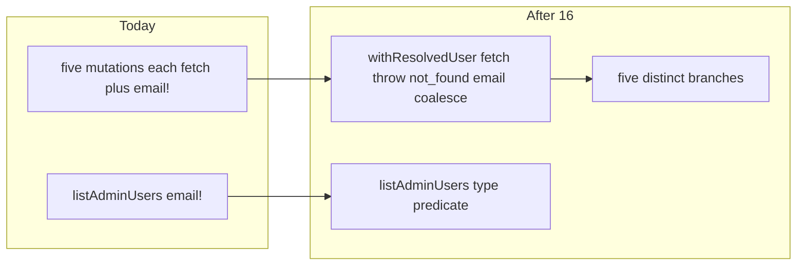

# Chat 16 — one resolve-user helper on the privileged path

F180 + F162. Top 5 #4. Same file 9a already taught. Audit says resolve F162 at this seam — do it, because F180 without widening `email` just relocates the assertions into the helper. No migrations. Do not commit.

Today [src/utils/admin-user-mutations.ts](src/utils/admin-user-mutations.ts) opens each of the five exported mutations with the same seven-line preamble: `getUserById`, throw on error, `not_found` when absent, then `user.email!`. There are **eight** assertions in that file (audit said nine — count is eight) plus one more in [scripts/admin/lib/admin-users.ts](scripts/admin/lib/admin-users.ts) (`listAdminUsers`). Result types declare `email: string`, so a phone-only or anonymous user pushes `undefined` into a `string` field and on into CLI / `appLog` copy.

## Precondition

Before editing anything, run `git status` and record the working tree. Do not stash, revert, or clean.

Confirm 15 landed: [TECH_DEBT_AUDIT.md](TECH_DEBT_AUDIT.md) has F186 in § Resolved. If it is still Open, **stop**. Prior chats may still be uncommitted (11’s `tsconfig` / index guards, 10’s dialog host, 12’s users schema, 13’s registry import flip, 14’s class-string visitor and `eslint-rules/**` floor, 15’s wired-check extract and `scripts/**` floor, dirty `stat-tile` / logs tiles, `nextjs-agent-rules` in [AGENTS.md](AGENTS.md)). Name those files up front. Touch only this chat’s files plus the F180 / F162 audit rows and the F148 / F149 / F179 notes that currently say “bundle with F180”.

## The helper

Private (not exported) `withResolvedUser` in [src/utils/admin-user-mutations.ts](src/utils/admin-user-mutations.ts). Same file — do **not** create `src/utils/admin-user-mutations/` or a sibling module.

Signature:

`withResolvedUser(client, userId, handler)` → `Promise<T | { status: 'not_found' }>`

- Fetch via `client.auth.admin.getUserById(userId)`.
- Throw the Supabase error if present (same as today — do not wrap).
- Return `{ status: 'not_found' }` when `data.user` is absent.
- Otherwise call `handler` with the user whose `email` is already `string | null`.

Give the handler a user it can read `email` from without asserting. Pass `Omit<User, 'email'> & { email: string | null }`. Do **not** write `User & { email: string | null }` — `User.email` is `string | undefined`, and an intersection adds a constraint rather than replacing it, so that shape resolves to `email: string` and rejects the coalesced `null`. Coalesce **once** in the helper: `email: user.email ?? null`. Handlers return that `email`; they never write `user.email!`.

Do not export the helper or invent a public `ResolvedUser` type. Do not add a display fallback (`'unknown'`, `'—'`) inside the helper — `null` is the honest value.

Keep the five exported functions’ explicit `Promise<*ByIdResult>` return types so inference cannot drop `'not_found'`.

## Five mutations shrink to the distinct branch

Each function is `return withResolvedUser(client, userId, async (user) => { … })`. What stays inside the handler is only what differs:

| Function | Distinct branch |
| ---- | ---- |
| `promoteUserById` | already-admin short-circuit; `updateUserById` with `mergePromoteMetadata` |
| `demoteUserById` | not-admin short-circuit; `updateUserById` with `mergeDemoteMetadata(user.app_metadata)` — **keep passing `user.app_metadata`** (F148 is out) |
| `banUserById` | `updateUserById` with `ban_duration` |
| `unbanUserById` | not-banned short-circuit; `updateUserById` with `ADMIN_UNBAN_DURATION` |
| `deleteUserById` | `deleteUser(userId)` — keep the argument as `userId`, not `user.id` |

Success returns use `email: user.email` (already `string | null`). Zero `user.email!` remain in this file.

## Widen `email` on the result contract (F162)

In the same file, every success arm of `PromoteUserByIdResult`, `DemoteUserByIdResult`, `BanUserByIdResult`, `UnbanUserByIdResult`, and `DeleteUserByIdResult` changes `email: string` to `email: string | null`. Status unions (`RoleMutationSuccessStatus`, `BanMutationSuccessStatus`) stay as they are.

That type will not assign to today’s runner unless the envelope widens too. In [src/app/admin/users/_lib/run-admin-user-mutation.ts](src/app/admin/users/_lib/run-admin-user-mutation.ts), change `email: string` to `email: string | null` on:

- `AdminUserMutationResult` success arm
- `AdminUserMutationActionSuccess.data`
- the `hasMutationEmail` predicate’s narrowed type

Keep the predicate (9a kept it because unconstrained `TStatus` does not narrow), but **rename it `isMutationFound`** — once `email` can be `null` the old name asserts something it never checked; it only ever meant “not `not_found`”. One call site, same file.

In the same file, change the success log line to `` `${result.email ?? userId} — ${result.status}` `` so an email-less user still leaves an attributable record of a privileged mutation. Do not flatten the envelope. Do not delete the predicate.

The two `'use server'` files redeclare the same success shape. Widen only the field — do **not** import `AdminUserMutationActionResult` (that is F149):

- [role-mutation-actions.ts](src/app/admin/users/_lib/role-mutation-actions.ts) — `RoleMutationActionSuccess.data.email`
- [ban-mutation-actions.ts](src/app/admin/users/_lib/ban-mutation-actions.ts) — `BanMutationActionSuccess.data.email`

Keep `PromoteUserActionResult`, `DemoteUserActionResult`, `BanUserActionResult`, `UnbanUserActionResult`, and `RoleMutationActionInput`. Hooks already toast on `data.status` only — do not touch them.

## CLI copy

In [scripts/admin/lib/admin-users.ts](scripts/admin/lib/admin-users.ts) `listAdminUsers`, drop `user.email!`. Keep returning `string[]` (emails only — skip users with no email, same as today’s truthy filter). Use a type predicate on the filter so the map is a plain `user.email`:

`filter((user): user is User & { email: string } => Boolean(isUserAdmin(user.app_metadata) && user.email))`

Do not change `promoteUser` / `demoteUser` / `findUserByEmail`. Do not edit [cli.ts](scripts/admin/lib/cli.ts) interpolations — `${result.email}` types as `string | null` and is fine.

## Tests

No new test file. Existing [admin-user-mutations.unit.test.ts](src/utils/admin-user-mutations.unit.test.ts) already covers `not_found` and each distinct branch through the public functions — that is the F180 pin.

Add **one** F162 case in that file: `promoteUserById` with `email: undefined` returns `email: null` and still promotes. Do not copy that case onto the other four mutations. Do not export or test `withResolvedUser` directly. Do not add a `getUserError` throw case (untested today; not this finding).

Do not add a `listAdminUsers` email-less case — the predicate is a type-only change of a filter that already dropped falsy email. [admin-users.unit.test.ts](scripts/admin/lib/admin-users.unit.test.ts) and the role/ban action tests should keep passing with no edits.

## Out of scope

- **F149 / F179** — do not collapse `run-*` into the action files; do not delete result-type aliases or rename `RoleMutationActionInput`.
- **F148** — do not drop `mergeDemoteMetadata`’s `_existing` parameter; do not touch `PublicBannerSlot.initialDismissed`. The audit says “bundle with F180”; this chat’s hard stop wins. Reword that audit phrase so it does not point at a closed finding.
- **F128** — already closed; do not revisit the list schema.
- Coverage floors — this chat does not change a denominator. Do not edit [vitest.config.ts](vitest.config.ts).
- **AGENTS.md, DESIGN.md, README, `/sync-repo-docs`.**
- **Committing and opening a PR.** Do neither.
- Do not edit [tmp/tech-debt-quick-fix-chats.md](tmp/tech-debt-quick-fix-chats.md).

## Docs

After both gates are green, in [TECH_DEBT_AUDIT.md](TECH_DEBT_AUDIT.md):

- Move **F180** and **F162** to § Resolved with today’s date (**2026-08-29**): private `withResolvedUser` owns fetch / throw / `not_found` and coalesces `email` to `string | null`; five mutations are distinct-branch only; eight `user.email!` plus the `listAdminUsers` assertion are gone; runner + both action success types widened. Note F149 / F179 / F148 were not done here.
- § Top 5: drop F180. Remaining batch-3 item is gone. Put **F129** (settings registry discriminated union) as the new #1 — unblocked by 13, own chat, do not mix with F132.
- F148 Open row: it currently says “bundle with F180”. F180 will be closed. Reword to “same file as closed F180; do not mix with a mutation extract” — still do not do F148 here.
- F149 / F179 Open rows: add that F180/F162 widened the mutation envelope and both action success types to `email: string | null` — still do not collapse files or delete aliases in this chat.
- Exec-summary admin-authorization bullet already says F149 / F179 remain; leave that.
- `Last synced:` stays **2026-08-29**.

No README, DESIGN.md, AGENTS.md, rules, or `/sync-repo-docs`.

## Quality bar

- Targeted: `CI=true pnpm type-check` (this *is* the F162 change) and `pnpm test:file -- src/utils/admin-user-mutations.unit.test.ts src/app/admin/users/_lib/role-mutation-actions.unit.test.ts src/app/admin/users/_lib/ban-mutation-actions.unit.test.ts scripts/admin/lib/admin-users.unit.test.ts`
- Then: `CI=true pnpm pre-push` (a bare `pnpm pre-push` aborts in a non-TTY agent shell)
- Grep: zero `user.email!` in `src/utils/admin-user-mutations.ts` and `scripts/admin/lib/admin-users.ts`; zero `export` of `withResolvedUser`; `mergeDemoteMetadata` still takes `_existing`; four `run-*-mutation.ts` files still exist
- **If any gate fails on files this chat did not touch** (including coverage floors, and anything from the uncommitted prior chats named in § Precondition): stop and report. Do not fix it here.
- No browser pass — privileged-path internals; toasts use `status`, not `email`. Runtime for users who have an email is unchanged.

## Manual test checklist

- Five public mutations still return the same statuses for users who have an email; existing unit tests pass.
- New: promote with no email returns `email: null`.
- `pnpm type-check` fails if a success arm is left as `email: string` while the helper returns `string | null`.
- CLI `list-admins` still prints only admin emails (email-less admins stay omitted).
- `mergeDemoteMetadata({ role, org })` still returns `{ role: null }` and still accepts the unused argument.
- `run-role-mutation.ts` / `run-ban-mutation.ts` / both action files still exist with their alias types.
