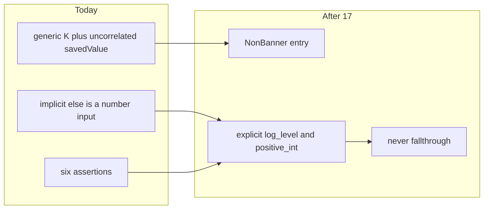

# Chat 17 — settings registry is a real union

F129. Audit Top 5 #1. Unblocked by 13 (F109). Own chat. No migrations. Do not commit.

Today [`app-setting-row.tsx`](src/app/admin/settings/_components/app-setting-row.tsx) is generic over `K extends AppSettingKey`. Checking `entry.valueType` does not narrow `savedValue`, so the dispatch casts on the way in (`as LogLevel` / `as number`) and each row casts parsed and returned values on the way out (four `as AppSettingValueMap[K]`). The implicit else is the positive-int row. The registry array is already a literal union after Chat 13; the hole is the row props, not the registry file. Safe today only because the panel filters banners out at runtime without a type predicate.

## Precondition

Before editing anything, run `git status` and record the working tree. Do not stash, revert, or clean.

Confirm 16 landed: [`TECH_DEBT_AUDIT.md`](TECH_DEBT_AUDIT.md) has **F180** and **F162** in § Resolved. If either is still Open, **stop**. Prior chats may still be uncommitted (11’s `tsconfig` / index guards, 10’s dialog host, 12–16, dirty `stat-tile` / logs tiles, `nextjs-agent-rules` in [`AGENTS.md`](AGENTS.md)). Name those files up front. Touch only this chat’s files plus the F129 audit rows, the § Top 5 list, the F062 Accepted row, and the F132 Open phrase that currently says “Do after F129”.

## Why the current generic cannot work

[`AppSettingRegistryEntry`](src/config/app-settings-registry.ts) is already `(typeof APP_SETTINGS_REGISTRY)[number]` — four literal objects, discriminated on `valueType`. `AssertRegistryDefaults` already rejects a mismatched `default`. Do **not** rewrite `AppSettingRegistryEntryBase`, do **not** delete that assert, do **not** add a `savedValue` field on the registry.

The row is `AppSettingRowProps<K>` with `savedValue: AppSettingValueMap[K]`. `K` and `entry.valueType` are independent to the compiler. That is why the six assertions exist. Replacing `K` with a generic over the entry (`E extends …`) has the same hole.

## The type on the registry

In [`src/config/app-settings-registry.ts`](src/config/app-settings-registry.ts), add one derived alias next to the existing entry types:

`NonBannerAppSettingRegistryEntry` = `Exclude<AppSettingRegistryEntry, { valueType: 'banner' }>`

Do not also export a banner alias (that is F157). Leave `AppSettingRegistryEntryFor` and the `getRegistryEntry` Map assertion alone.

## The dispatcher

In [`app-setting-row.tsx`](src/app/admin/settings/_components/app-setting-row.tsx):

Drop the generic `K` on `AppSettingRow`. Public props become `entry: NonBannerAppSettingRegistryEntry`, `savedSettings: ResolvedAppSettings`, and the same generic `onSaved` the panel already has (`<K extends AppSettingKey>(key: K, value: ResolvedAppSettings[K]) => void`).

Why the map, not a `savedValue` union on the public props: after `entry.valueType === 'log_level'`, `savedSettings[entry.key]` is `LogLevel` because the key is now the literal `'min_log_level'`. A standalone `savedValue` prop never narrows. A props-union plus a constructor helper is the same work twice. The inner rows still take a correlated `savedValue` per arm.

Dispatch:

1. `if (entry.valueType === 'log_level')` → `LogLevelSettingRow` with `savedValue={savedSettings[entry.key]}`
2. `if (entry.valueType === 'positive_int')` → `PositiveIntSettingRow` with `savedValue={savedSettings[entry.key]}`
3. `const exhaustive: never = entry` then a throw that interpolates the binding — `throw new Error(\`Unhandled app setting valueType: ${JSON.stringify(exhaustive)}\`)` — do **not** fall through to the number row

There is no `assertNever` helper in `src/`. Do not add one. Inline the assignment plus throw. Reference the binding in the throw message rather than leaving it unread: the runtime error names the offending entry, and the local is used.

Delete the F062 `// debt:` marker on the dispatcher. The `never` check is the self-announcing trigger that marker was waiting for. F062 stays Accepted (do not add a third non-banner type here).

## Inner rows lose the generic and the four outbound casts

`LogLevelSettingRow` / `PositiveIntSettingRow` drop `<K extends AppSettingKey>`. Each takes its own single-arm extract — `Extract<NonBannerAppSettingRegistryEntry, { readonly valueType: 'log_level' }>` and `Extract<NonBannerAppSettingRegistryEntry, { readonly valueType: 'positive_int' }>` — plus `savedValue: LogLevel` / `number`, and `onSaved` keyed to that arm’s key and value. One `Extract` naming both value types resolves back to the whole non-banner union and narrows nothing; write two. Keep the `readonly` modifier in the constraint, matching `AppSettingRegistryEntryFor` in the same registry file.

`saveAppSettingAction` already takes `unknown` — pass `parsed.data.value` / `parsedValue.data` with no cast.

On success, call `onSaved(entry.key, parsed.data.value)` / `onSaved(entry.key, parsedValue.data)` — those values are already `LogLevel` / `number` from the schemas. Do not keep `result.data.value as AppSettingValueMap[K]`; the action result is the full key union and would reintroduce the cast.

Zero `as LogLevel`, `as number`, or `as AppSettingValueMap[…]` remain in this file. Keep `AppSettingRegistryEntry` on `SettingRowShell` (label / description only).

Do not extract `useAppSettingSave`. Do not touch [`banner-setting-row.tsx`](src/app/admin/settings/_components/banner-setting-row.tsx).

## Panel filter must actually narrow

In [`app-settings-panel.tsx`](src/app/admin/settings/_components/app-settings-panel.tsx), the existing `valueType !== 'banner'` filter does not narrow. First try leaving the callback unannotated — TypeScript 5.9 infers a type predicate for a single-expression `.filter` callback that narrows its parameter, which would make `visibleEntries` `NonBannerAppSettingRegistryEntry[]` with no assertion at all. Only if that inference does not fire, annotate the callback `(entry): entry is NonBannerAppSettingRegistryEntry`. A hand-written predicate is an unverified assertion of exactly the kind this chat is deleting — take it as the fallback, not the first move. Pass `savedSettings={savedSettings}` instead of `savedValue={savedSettings[entry.key]}`. Leave `handleSaved` as it is.

Do **not** move the filter into `settings/_lib/`, do **not** share it with [`banner-settings-section.tsx`](src/app/admin/settings/_components/banner-settings-section.tsx), do **not** filter-before-grouping. That is F157 / Chat 18.

## Tests

No new test file. `testing.mdc` says not to test the type system. The `never` check is the pin.

Update the existing [`app-setting-row.integration.test.tsx`](src/app/admin/settings/_components/app-setting-row.integration.test.tsx) call sites from `savedValue={…}` to a single `ResolvedAppSettings` fixture (the four current keys, banner defaults from `DEFAULT_BANNER_SETTING`). Behavior assertions stay.

Existing panel / registry tests should keep passing with no assertion changes.

## Out of scope

- **F132** — do not extract `useAppSettingSave`; the three save sequences stay duplicated
- **F157** — do not partition banner / non-banner in `_lib/`
- **F062** — do not add a third non-banner `valueType`
- **F136** — do not add a `parseAppSettingValue` test; leave the three `as AppSettingValueMap[K]` in [`app-settings-schema.ts`](src/utils/app-settings-schema.ts)
- **F109** — already closed; do not revisit the types/registry import split
- Coverage floors — this chat does not change a denominator. Do not edit [`vitest.config.ts`](vitest.config.ts)
- **AGENTS.md, DESIGN.md, README, `/sync-repo-docs`, typescript.mdc.** One instance, no new rule.
- **Committing and opening a PR.** Do neither.
- Do not edit [`tmp/tech-debt-quick-fix-chats.md`](tmp/tech-debt-quick-fix-chats.md)

## Docs

After both gates are green, in [`TECH_DEBT_AUDIT.md`](TECH_DEBT_AUDIT.md):

- Move **F129** to § Resolved with today’s date (**2026-08-29**): `NonBannerAppSettingRegistryEntry` on the registry; `AppSettingRow` takes the map and dispatches `log_level` / `positive_int` / `never`; six assertions gone; F062 marker deleted because the compiler is the gate. Note F132 / F157 / F136 were not done here.
- § Top 5: drop F129. New #1 is **F132** (save hook; bundles F157). Do not promote a replacement beyond what is already in that list.
- F132 Open row: it currently says “Do after F129”. F129 will be closed. Reword to “row dispatch is now a real union (closed F129); extract the hook next” — still do not do F132 here.
- F062 Accepted row: record that the exhaustiveness guard landed in F129 and the `// debt:` marker is gone; reopen trigger is unchanged (a third non-banner `valueType`). Retarget the row’s `File:Line` — it points at `291:291`, the marker line being deleted; aim it at the dispatcher’s new line range in the same file. Do not move F062 to Resolved.
- F109 Resolved note already says F129 was not done there — leave that historical sentence.
- `Last synced:` stays **2026-08-29**.

## Quality bar

- Targeted: `CI=true pnpm type-check` (this *is* the F129 change) and `pnpm test:file -- src/app/admin/settings/_components/app-setting-row.integration.test.tsx src/app/admin/settings/_components/app-settings-panel.integration.test.tsx src/config/app-settings-registry.unit.test.ts`
- Then: `CI=true pnpm pre-push` (a bare `pnpm pre-push` aborts in a non-TTY agent shell)
- Grep: zero `as LogLevel` / `as number` / `as AppSettingValueMap` in `app-setting-row.tsx`; zero `// debt:` in that file; zero `useAppSettingSave`; `settings/_lib/` still only `actions.ts` and `admin-settings-visit-key.ts`; `parseAppSettingValue` still has its three casts
- **If any gate fails on files this chat did not touch** (including coverage floors, and anything from the uncommitted prior chats named in § Precondition): stop and report. Do not fix it here.
- No required browser pass — types and dispatch only; runtime for the two logging rows is unchanged. Optional smoke if the app is up: `/admin/settings` as admin, both logging rows still save.

## Manual test checklist

- Existing row / panel / registry tests still pass (log-level save, positive-int save, unchanged disables Save, failed save shows the error surface).
- `pnpm type-check` is clean. To pin the `never` guard, temporarily comment out the `positive_int` branch in the dispatcher and confirm the `exhaustive` assignment now errors (then restore it). Do **not** verify by adding a scratch fourth `valueType` to a registry entry — `AppSettingValueType` is a closed three-member union, so that fails at the registry’s `satisfies` before the guard is ever reached.
- Passing a banner entry into `AppSettingRow` is a type error.
- Banner accordion is untouched and still renders (panel still mounts `BannerSettingsSection`).
- No `useAppSettingSave` and no new file under `settings/_lib/`.
