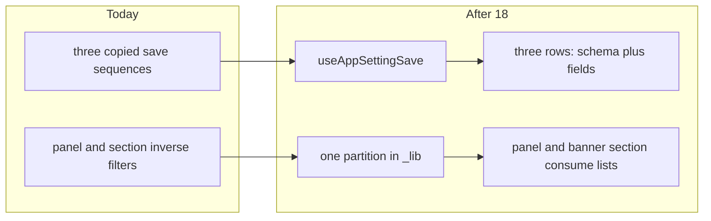

# Chat 18 — one save hook, one partition

F132 + F157. Audit Top 5 #2. Unblocked by 17 (F129). Own chat because the extract crosses three rows including the ~490-line banner row. F157 rides — [`settings/_lib/`](src/app/admin/settings/_lib/) already exists (actions, visit-key); the hook and the partition land there as two new files. No migrations. Do not commit.

Today [`LogLevelSettingRow`](src/app/admin/settings/_components/app-setting-row.tsx), [`PositiveIntSettingRow`](src/app/admin/settings/_components/app-setting-row.tsx), and [`BannerSettingRow`](src/app/admin/settings/_components/banner-setting-row.tsx) each own `isSaving` / error, a reset-on-`savedValue` effect, and the same five-step save. The panel groups every registry entry then discards banners per group; the banner section filters the other direction at module scope. The two predicates must stay exact complements or a setting renders twice or not at all.



## Precondition

Before editing anything, run `git status` and record the working tree. Do not stash, revert, or clean.

Confirm 17 landed: [`TECH_DEBT_AUDIT.md`](TECH_DEBT_AUDIT.md) has **F129** in § Resolved. If it is still Open, **stop**. Prior chats may still be uncommitted (11’s `tsconfig` / index guards, 10’s dialog host, 12–16, 17’s settings union, dirty `stat-tile` / logs tiles, `nextjs-agent-rules` in [`AGENTS.md`](AGENTS.md)). Name those files up front. Touch only this chat’s files plus the F132 / F157 audit rows, the § Top 5 list, and the F062 / F176 `File:Line` citations (both cited files shrink).

17’s union is the floor this extract stands on: [`AppSettingRow`](src/app/admin/settings/_components/app-setting-row.tsx) already takes `entry: NonBannerAppSettingRegistryEntry` plus the saved-settings map, and dispatches `log_level` / `positive_int` / `never`. Do not reopen that dispatch.

## The hook (F132)

New file: [`src/app/admin/settings/_lib/use-app-setting-save.ts`](src/app/admin/settings/_lib/use-app-setting-save.ts). Settings-route hook — stays in this `_lib/`, not [`src/hooks/`](src/hooks/). Match the `_lib` hook conventions in [`use-admin-logs-realtime.ts`](src/app/admin/logs/_lib/use-admin-logs-realtime.ts): `'use client'`, named arrow export, no default export.

Do **not** pass the react-hook-form instance into the hook. The three forms have different value shapes (literal / stringified int / banner field bag). The hook owns orchestration; each row keeps its schema and its `form.reset` mapping.

Generic over `K extends AppSettingKey`. Declare both sides of the contract explicitly per `typescript.mdc` § Conventions — an exported `UseAppSettingSaveOptions<K>` **interface** for the options, and an explicit return type on the exported hook (a `UseAppSettingSaveResult<K>` interface, not inference).

Options:

- `key`, `label`
- `savedValue: ResolvedAppSettings[K]` — reset-effect dependency only
- `parse: () => ResolvedAppSettings[K] | null` — `null` means client validation failed; silent return, same as today’s `safeParse` miss
- `onSaved: (key: K, value: ResolvedAppSettings[K]) => void`
- `resetForm: (savedValue: ResolvedAppSettings[K]) => void`

Return exactly `{ isSaving, error, clearError, save }` as the audit names. `clearError` is `() => setError(null)` — the field `onChange` handlers already clear on edit.

`save()` takes no arguments. The disabled guard stays at the call site, where the Save button already carries `disabled={isSaveDisabled}` — do not put an inverted-meaning `isDisabled` parameter on the hook’s public signature.

`save()` is the four-step body, copied not improved:

1. `parse()`; return if `null`
2. Set saving, clear error
3. `await saveAppSettingAction({ key, value })` — `value` is already typed; the action still takes `unknown`
4. Clear saving; on failure `setError(result.error)`; on success `onSaved(key, value)` then `showSuccessToast(\`${label} saved\`)`

Use the **parsed** value on success, not `result.data.value`. That deletes the last remaining settings-row cast: [`banner-setting-row.tsx`](src/app/admin/settings/_components/banner-setting-row.tsx) currently does `result.data.value as BannerSettingValue`. Do not add `try/finally`. The action already catches and returns an envelope.

Reset effect: the hook owns callback stability so no caller can loop it. Hold `resetForm` in a ref refreshed by its own effect, and depend on `savedValue` alone:

```ts
const resetFormRef = useRef(resetForm)

useEffect(() => {
  resetFormRef.current = resetForm
})

useEffect(() => {
  resetFormRef.current(savedValue)
}, [savedValue])
```

Do **not** put `resetForm` in the reset effect’s dependency array — that would make a caller who forgets `useCallback` render-loop, and the hook is the one place to prevent it. Behaviour matches today’s `[form, savedValue]`, since `form` is referentially stable.

Do not extract `useResetOnChange` (F176). That is the render-phase idiom on the visit-key / table-state sites, a different shape.

## Convert the three rows

Each row drops its `useState` pair, its reset effect, and its `handleSave`. It keeps the form, the unchanged/disabled derivation, the disabled guard, and the field UI.

Every Save button keeps the same shape: `if (isSaveDisabled) return` at the call site, then `void save()`.

- [`LogLevelSettingRow`](src/app/admin/settings/_components/app-setting-row.tsx): `parse` is `appSettingLogLevelFormSchema.safeParse(form.getValues())` then `parsed.data.value` or `null`. `resetForm` is `form.reset({ value })`.
- [`PositiveIntSettingRow`](src/app/admin/settings/_components/app-setting-row.tsx): `parse` is `positiveIntFormValueSchema.safeParse(form.getValues().value)` then the number or `null`. `resetForm` is `form.reset({ value: String(savedValue) })`.
- [`BannerSettingRow`](src/app/admin/settings/_components/banner-setting-row.tsx): `parse` is `bannerSettingFormSchema.safeParse` then `formValuesToBannerValue` or `null`. `resetForm` is `form.reset(bannerValueToFormValues(savedValue))`. Preview theme, accordion chrome, and field grid stay. Do not restyle (F159).

Field `onChange` handlers that currently call `setError(null)` call `clearError()` instead. `isSaving` still disables controls.

`SettingRowShell` and `SaveButton` stay in the non-banner file. The dispatcher and the `never` fallthrough stay. Zero `as LogLevel` / `as number` / `as AppSettingValueMap` / `as BannerSettingValue` in either row file.

## The partition (F157)

New file: [`src/app/admin/settings/_lib/app-settings-partition.ts`](src/app/admin/settings/_lib/app-settings-partition.ts). No `'use client'`. Pure module-scope data, same as today’s IIFEs.

Single pass over [`APP_SETTINGS_REGISTRY`](src/config/app-settings-registry.ts) so the two lists are complements by construction — do not write two inverse `.filter` predicates:

- `valueType === 'banner'` → banner list
- else → group by `entry.group`

Export:

- `GROUPED_NON_BANNER_REGISTRY_ENTRIES` — `Map<string, NonBannerAppSettingRegistryEntry[]>` (or `ReadonlyMap`). No `Banners` key can appear; empty groups cannot arise.
- `BANNER_REGISTRY_ENTRIES` — keep this name; the section already uses it.

In [`src/config/app-settings-registry.ts`](src/config/app-settings-registry.ts), add the complement alias next to `NonBannerAppSettingRegistryEntry`:

`BannerAppSettingRegistryEntry` = `Extract<AppSettingRegistryEntry, { valueType: 'banner' }>`

Match the NonBanner spelling (no `readonly` on the discriminant). Do **not** extract by key (`banner_public | banner_authenticated`) — a third banner key must type-check through the partition, not through a closed key list. [`BannerSettingRow`](src/app/admin/settings/_components/banner-setting-row.tsx) drops its local `Extract` and imports this alias.

[`app-settings-panel.tsx`](src/app/admin/settings/_components/app-settings-panel.tsx): delete `GROUPED_REGISTRY_ENTRIES`, the per-group `valueType !== 'banner'` filter, and the empty-group `return null`. Map the imported grouped map straight to sections. `handleSaved` stays.

[`banner-settings-section.tsx`](src/app/admin/settings/_components/banner-settings-section.tsx): delete the local `BANNER_REGISTRY_ENTRIES` filter; import the list from the partition. Visit-key / accordion state stays (F176 is out).

Also render the section heading from `APP_SETTINGS_GROUP_BANNERS` instead of the hardcoded `'Banners'` string. The partition splits on `valueType`, while the registry carries a parallel `group` field — with the literal in place, that second axis is dead and nothing ties the section’s heading to the group the banner entries actually declare.

## Tests

Two new colocated unit tests. Existing row / panel / banner tests are the behavior pin and should keep passing with no assertion changes.

[`use-app-setting-save.unit.test.ts`](src/app/admin/settings/_lib/use-app-setting-save.unit.test.ts) — `renderHook` from [`@/test/test-utils`](src/test/test-utils.tsx) is fine here (Chat 8 avoided it only because a mount-effect first-render is unobservable that way). Mock `saveAppSettingAction` and `showSuccessToast` at the module boundary, same as the row tests. Three cases:

- Happy: `parse` returns a value, action succeeds → `onSaved` + toast, `isSaving` false
- Action failure → `error` set, `onSaved` not called
- `parse` returns `null` → action not called

Do **not** add a disabled-guard case — the guard lives at the call site, not in the hook, and the row integration tests already pin that an unchanged form disables Save. Do **not** add a case that only asserts `resetForm` was called — that is an effect implementation detail. Do not export a test-only helper.

[`app-settings-partition.unit.test.ts`](src/app/admin/settings/_lib/app-settings-partition.unit.test.ts) — the F157 pin, against the real registry:

- Every `APP_SETTINGS_REGISTRY` key appears in exactly one of the two exports
- The grouped map has no `APP_SETTINGS_GROUP_BANNERS` key
- Every entry in `BANNER_REGISTRY_ENTRIES` declares `group === APP_SETTINGS_GROUP_BANNERS`, and no entry in the grouped map does — so the `valueType` and `group` axes cannot silently disagree and emit a second Banners heading

Do not hardcode today’s two logging keys.

Do **not** add a `parseAppSettingValue` test (F136 / Chat 20). The schema file does not move.

## Out of scope

- **F136** — do not add a schema parse test; leave the three `as AppSettingValueMap[K]` in [`app-settings-schema.ts`](src/utils/app-settings-schema.ts)
- **F159** — do not restyle `AppBanner` or the banner field grid
- **F062** — do not add a third non-banner `valueType`
- **F176 / F178** — do not extract `useResetOnChange`; do not touch the visit-key render-phase reset
- **F129** — already closed; do not revisit the dispatcher
- Coverage floors — new files are under `src/`, not `eslint-rules/**` or `scripts/**`. Do not edit [`vitest.config.ts`](vitest.config.ts)
- **AGENTS.md, DESIGN.md, README, `/sync-repo-docs`, forms.mdc.** The save-model citation on the two row files stays accurate.
- **Committing and opening a PR.** Do neither.
- Do not edit [`tmp/tech-debt-quick-fix-chats.md`](tmp/tech-debt-quick-fix-chats.md)

## Docs

After both gates are green, in [`TECH_DEBT_AUDIT.md`](TECH_DEBT_AUDIT.md):

- Move **F132** and **F157** to § Resolved with today’s date (**2026-08-29**): `useAppSettingSave` in `settings/_lib/` owns saving / error / reset-on-`savedValue` and the save sequence; three rows keep schema plus fields and the call-site disabled guard; banner success uses the parsed value (no `as BannerSettingValue`); single-pass partition exports the grouped non-banner map and `BANNER_REGISTRY_ENTRIES`; panel and banner section consume those lists; banner heading reads `APP_SETTINGS_GROUP_BANNERS`; `BannerAppSettingRegistryEntry` lives on the registry. Note F136 / F159 / F176 were not done here.
- § Top 5: drop F132 and renumber. Remaining rows stay in their current order (F188, F118, F133). Do not promote a replacement and do not delete any remaining row.
- F062 Accepted row: retarget `File:Line` to the dispatcher’s new line range in [`app-setting-row.tsx`](src/app/admin/settings/_components/app-setting-row.tsx) after the save sequences leave. Reopen trigger is unchanged. Do not move F062 to Resolved.
- F176 Open row: retarget `File:Line` to the visit-key reset block’s new line range in [`banner-settings-section.tsx`](src/app/admin/settings/_components/banner-settings-section.tsx) after the module-scope filter is deleted. Description and recommendation are unchanged. Do not move F176 to Resolved.
- F136 Open row: add that the schema file did not move. Still do not write the test here.
- F109 Resolved note already says F132 was not done there — leave that historical sentence.
- `Last synced:` stays **2026-08-29**.

## Quality bar

- Targeted: `CI=true pnpm type-check` and `pnpm test:file -- src/app/admin/settings/_lib/use-app-setting-save.unit.test.ts src/app/admin/settings/_lib/app-settings-partition.unit.test.ts src/app/admin/settings/_components/app-setting-row.integration.test.tsx src/app/admin/settings/_components/app-settings-panel.integration.test.tsx src/app/admin/settings/_components/banner-setting-row.integration.test.tsx src/app/admin/settings/_components/banner-settings-section.unit.test.tsx`
- Then: `CI=true pnpm pre-push` (a bare `pnpm pre-push` aborts in a non-TTY agent shell)
- Grep: zero `useState` for `isSaving` / `error` in the two row files; zero `as BannerSettingValue` in `banner-setting-row.tsx`; zero `valueType !== 'banner'` / `valueType === 'banner'` filters in the panel or banner section; no `'Banners'` string literal in `banner-settings-section.tsx`; `settings/_lib/` has the two new files plus `actions.ts` and `admin-settings-visit-key.ts`; `parseAppSettingValue` still has its three casts; no `useResetOnChange`
- **If any gate fails on files this chat did not touch** (including coverage floors, and anything from the uncommitted prior chats named in § Precondition): stop and report. Do not fix it here.
- Browser-verify on the running app: `/admin/settings` as admin. This chat changes save orchestration across three rows — a single screenshot is not enough.

## Manual test checklist

- Existing row / panel / banner / section tests still pass (log-level save, positive-int save, unchanged disables Save, failed save shows the error surface, banner accordion one-open and visit-key collapse).
- New: hook happy / action-fail / parse-null; partition complement (no overlap, no Banners group, `group` and `valueType` agree).
- `pnpm type-check` is clean. Passing a banner entry into `AppSettingRow` is still a type error. Passing a logging entry into `BannerSettingRow` is a type error.
- Browser: change minimum log level and save — toast, value sticks, no remount. Change retention days and save — same. Expand Public banner, edit headline, save — toast, badge updates, accordion chrome unchanged. One Banners heading. Logging section has no banner rows.
- No `parseAppSettingValue` test file. No class-map / `cva` edits under [`src/components/app-banner.tsx`](src/components/app-banner.tsx).
