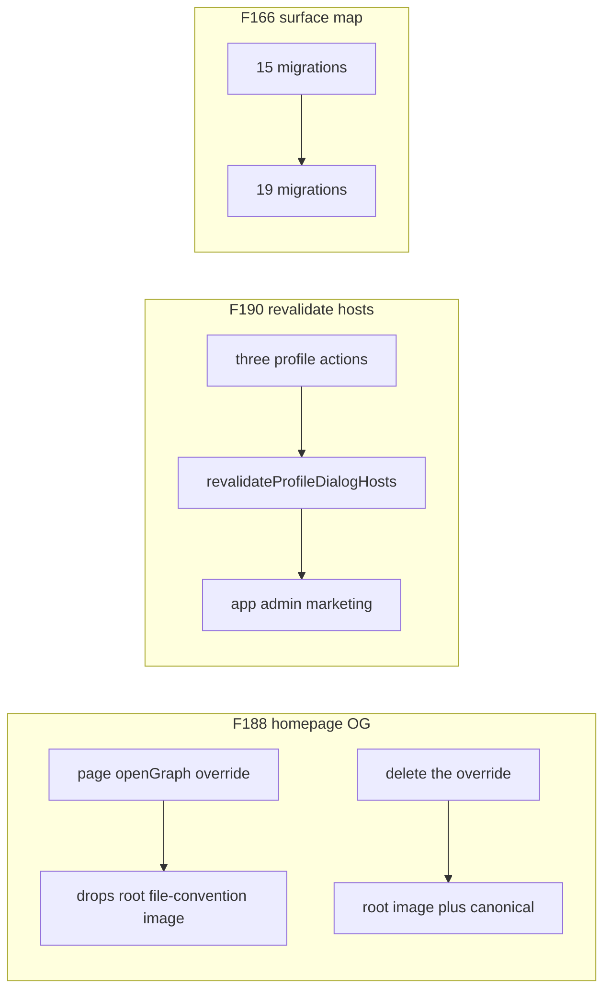

# Chat 19 — three small leftovers the last hoist left hanging

F188 + F190 + F166. Confirmed S-effort, independent, all fork-kept. Classic batch-1 shape. No migrations. Do not commit.

The homepage’s page-level `openGraph` replaces the root object and drops the file-convention image. Profile actions still open-code `revalidatePath` and miss marketing (and, on a display-name save, admin). The security-audit surface map still says 15 migrations; the folder has 19.

## Precondition

Before editing anything, run `git status` and record the working tree. Do not stash, revert, or clean.

Confirm 18 landed: [TECH_DEBT_AUDIT.md](TECH_DEBT_AUDIT.md) has **F132** and **F157** in § Resolved. If either is still Open, **stop**. These three findings do not depend on 18’s hook, but this chat is next in the locked batch order, not a substitute for it.

Prior chats may still be uncommitted (11’s `tsconfig` / index guards, 10’s dialog host, 12–18, dirty `stat-tile` / logs tiles, `nextjs-agent-rules` in [AGENTS.md](AGENTS.md)). Name those files up front. Touch only this chat’s files plus the F188 / F190 / F166 audit rows, the § Top 5 list, and the two leftover “F166’s remainder” sentences (F053 Open row and § Verified OK).

## F188 — homepage `<head>` emits the social image

**Locked:** stop the homepage’s partial `openGraph` override. Do **not** put `images` on [siteOpenGraphBase](src/config/site.ts). Spreading a root image onto the base would stamp that image onto every [getPageMetadata](src/config/site.ts) page; `/features` already attaches its own segment file after the helper, and a second image in the object is a regression, not a fix. Do **not** add `(marketing)/opengraph-image.tsx` — that collides with the root file at `/opengraph-image` (phase 9).

Today [src/app/(marketing)/page.tsx](src/app/(marketing)/page.tsx) sets `openGraph: { ...siteOpenGraphBase, url: '/' }`. Next replaces nested `openGraph` objects ([seo.mdc](.cursor/rules/seo.mdc)), so the sibling [src/app/opengraph-image.tsx](src/app/opengraph-image.tsx) never reaches this head. Root [getSiteMetadata](src/config/site.ts) already sets the same base fields without `url`; the root file convention still attaches at that segment. The page-level replace is the only thing dropping the image.

On the homepage:

- Delete the `openGraph` block and the `siteOpenGraphBase` import.
- Keep `alternates.canonical: '/'` and the JSON-LD script.
- Do not switch the homepage to `getPageMetadata` — that helper also sets a partial `openGraph` without `images`, and this page cannot grow a colocated segment file.

Do not change `getSiteMetadata` or `siteOpenGraphBase` up front. After the override is gone, browser-check the homepage `<head>`:

- Required: `og:image` and `twitter:image` (hashed `/opengraph-image-…` the way `/features` already emits `/features/opengraph-image-959drp?…`). Title, description, site_name, type, and `twitter:card` stay from the root layout.
- If `og:url` disappears, add `url: '/'` on `getSiteMetadata`’s `openGraph` only (same segment as the file convention, so images still attach) and update the existing assertion in [src/config/site.unit.test.ts](src/config/site.unit.test.ts) that `openGraph?.url` is undefined. Do not put `url` on `siteOpenGraphBase`. If this branch fires, update [seo.mdc](.cursor/rules/seo.mdc) § Metadata source of truth in the same edit — the bullet calling `getPageMetadata` the sole source of `og:url` becomes false, and every page that does not override `openGraph` (auth, app, admin) now emits `og:url: '/'`. Say both.

Revise — do not append to — the existing merge-rule bullet in [seo.mdc](.cursor/rules/seo.mdc). As written it tells a segment setting its own `openGraph` to spread `siteOpenGraphBase`, which is exactly what produced F188. The revised bullet must carry both halves without contradicting itself: nested `openGraph` replaces rather than merges, **and** a page-level `openGraph` without `images` drops the parent file-convention image, which only a colocated segment file re-attaches. Read [rule-authoring](.cursor/skills/rule-authoring/SKILL.md) before that edit. Do not run `/sync-repo-docs`.

No new homepage metadata test. `page.tsx` is coverage-excluded; the running `<head>` is the pin the audit already used.

## F190 — one helper lists the three hosts

Export `revalidateProfileDialogHosts()` so a fourth shell has one place to register. New file: [src/app/(app)/_lib/profile/revalidate-profile-dialog-hosts.ts](src/app/(app)/_lib/profile/revalidate-profile-dialog-hosts.ts) — beside `actions.ts`, its only caller. Named arrow export, explicit `void` return, no `'use server'` (the three actions already have the directive), no default export.

Do **not** put the helper in the host module — importing that file from actions would pull the dialog tree. Do **not** put it in `_components/profile/`: it calls `revalidatePath`, which cannot run in a Client Component, and that folder is the profile dialog’s client components. Surface-owned non-component code lives under the route group’s `_lib/<surface>/` (`project-standards.mdc` § Utilities & Helpers Location). The audit’s “one place to register” is carried by the pointer comment on the host, below.

The function calls `revalidatePath(path, 'layout')` for exactly these three, in this order:

1. `/(app)` — [src/app/(app)/layout.tsx](src/app/(app)/layout.tsx) line 29
2. `/admin` — [src/app/admin/_components/admin-auth-gate.tsx](src/app/admin/_components/admin-auth-gate.tsx) line 40
3. `/(marketing)` — [src/app/(marketing)/layout.tsx](src/app/(marketing)/layout.tsx) line 12

Route-group paths are a supported argument form (F170 already recorded this for `/(app)`). `/(marketing)` is the marketing parallel. Do **not** use `revalidatePath('/', 'layout')` — that purges the whole client cache and leans on the same temporary cross-path refresh the finding is written against.

Keep the path list as a file-private `as const` array the helper iterates. Do not export the array.

In [src/app/(app)/_lib/profile/actions.ts](src/app/(app)/_lib/profile/actions.ts): delete the `revalidatePath` import. All three success tails call `revalidateProfileDialogHosts()` instead of open-coding paths. `updateProfileAction` currently revalidates `/(app)` only — after this it also invalidates admin and marketing, which is the actual gap (a display-name / bio / avatar save leaves those shells stale once Next narrows). The two password actions already hit app + admin; they pick up marketing.

One-line comment on [profile-dialog-host.tsx](src/app/(app)/_components/profile/profile-dialog-host.tsx): a new shell that mounts this host must be added to `_lib/profile/revalidate-profile-dialog-hosts.ts`. That comment is the registration signpost — it must name the path.

**Tests**

- New [revalidate-profile-dialog-hosts.unit.test.ts](src/app/(app)/_lib/profile/revalidate-profile-dialog-hosts.unit.test.ts): mock `next/cache` the same way [actions.unit.test.ts](src/app/(app)/_lib/profile/actions.unit.test.ts) already does; one case that the helper calls `revalidatePath` three times with the three tuples above. That is the registration pin.
- In the actions test, do **not** mock the new helper module — mocking our own code is out per `testing.mdc` § Mocking Policy, and the existing `next/cache` mock is already the right boundary. Assert through it that `revalidatePath` is called three times on one success per action: one `updateProfileAction` success, the existing `setFirstPasswordAction` success, the existing `completeRecoveryPasswordAction` success. Do not assert the path list again there. Failure paths must not call it.

Do not add a browser-visible cache test — nothing today makes the gap visible, and we cannot simulate Next narrowing `revalidatePath`.

## F166 — surface map says 19

One cell in [SECURITY_AUDIT.md](SECURITY_AUDIT.md) line 25: `15 migrations` → `19 migrations`. Change the count only — do not restate which files landed after the stale count. The F166 row’s list of four does not reconcile (fourteen migrations pre-date 2026-08-28, five landed that day, and the EXECUTE-revoke migration it names is recorded as landed and verified in the same audit), and nothing this chat writes needs it. Do not recount routes, actions, or functions. Do not rewrite W1–W7. Leave that file’s `Last synced:` at **2026-08-28** — the field is written by `/audit-security` on a sync pass, and this is a one-cell correction, not a sync.

## Out of scope

- **F118 / F152 / F155 / F163 / F177** — throwaway-page or extract-threshold items; do not start them
- **F116** — Chat 21
- **F133 / F134 / F136** — Chat 20
- Do not collapse the helper to `revalidatePath('/', 'layout')`
- Do not add `images` to `siteOpenGraphBase` or a marketing-segment OG file
- **AGENTS.md, DESIGN.md, README, `/sync-repo-docs`.** The seo.mdc merge-rule bullet — plus the § Metadata source of truth bullet if the `og:url` branch fires — is the only rule edit.
- Coverage floors — new files are under `src/`. Do not edit [vitest.config.ts](vitest.config.ts)
- **Committing and opening a PR.** Do neither.
- Do not edit [tmp/tech-debt-quick-fix-chats.md](tmp/tech-debt-quick-fix-chats.md)

## Docs

After both gates are green, in [TECH_DEBT_AUDIT.md](TECH_DEBT_AUDIT.md):

- Move **F188**, **F190**, and **F166** to § Resolved with today’s date (**2026-08-29**): homepage no longer sets a partial `openGraph` (canonical kept; root file convention reaches the head); `revalidateProfileDialogHosts()` lists `/(app)`, `/admin`, `/(marketing)` and all three profile actions call it; security-audit DB / RLS row says 19 migrations. Note F118 was not done here.
- § Top 5: drop F188 and renumber. Remaining rows stay in their current order (F118, F133). Do not promote a replacement.
- F053 Open row and § Verified OK: delete the “F166’s remainder is the surface-map migration count” clause from both. F053 stays Deferred.
- F170 Resolved note already says the marketing shell is F190 — leave that historical sentence.
- Both places that still treat F188 as the confirmed open gap — the `## Executive summary` bullet and the § Scope line at the top of the file — rewrite so the homepage image reads as closed. Same claim in two spots; do not update one and leave the other.
- `Last synced:` stays **2026-08-29**.

## Quality bar

- Targeted: `CI=true pnpm type-check` and `pnpm test:file -- src/app/(app)/_lib/profile/revalidate-profile-dialog-hosts.unit.test.ts src/app/(app)/_lib/profile/actions.unit.test.ts src/config/site.unit.test.ts`
- Then: `CI=true pnpm pre-push` (a bare `pnpm pre-push` aborts in a non-TTY agent shell)
- Grep: zero `openGraph` in `(marketing)/page.tsx`; zero `revalidatePath(` in `profile/actions.ts`; the helper file lists exactly the three paths; `SECURITY_AUDIT.md` has `19 migrations` and no `15 migrations`; no `revalidatePath('/', 'layout')`
- **If any gate fails on files this chat did not touch** (including coverage floors, and anything from the uncommitted prior chats named in § Precondition): stop and report. Do not fix it here.
- Browser-verify on the running app: homepage `<head>` vs `/features`. This chat changes metadata the user can share — a single screenshot of the landing hero is not enough.

## Manual test checklist

- Helper unit test: three `revalidatePath` calls, those exact path/type tuples. Actions: `revalidatePath` called three times on each of the three success tails; not called on a failed update / failed password.
- `site.unit.test.ts` still passes. If `getSiteMetadata` gained `url`, the old “url is undefined” assertion is updated; `getPageMetadata` still sets the page path.
- Browser, logged-out: view source or inspect `<head>` on `/` — `og:image` and `twitter:image` present (hashed `/opengraph-image-…`). `/features` still emits `/features/opengraph-image-…`, not the root image. Canonical on `/` is still `/`. JSON-LD script unchanged.
- Browser, signed-in: change display name in the profile dialog from `/home`, then from `/admin`, then from a marketing page while signed in — save still succeeds, toast/indicator unchanged. We cannot prove the future Next narrowing; the tests own that contract.
- `SECURITY_AUDIT.md` surface map says 19. No `15 migrations` left in that file. `Last synced:` still reads 2026-08-28.
