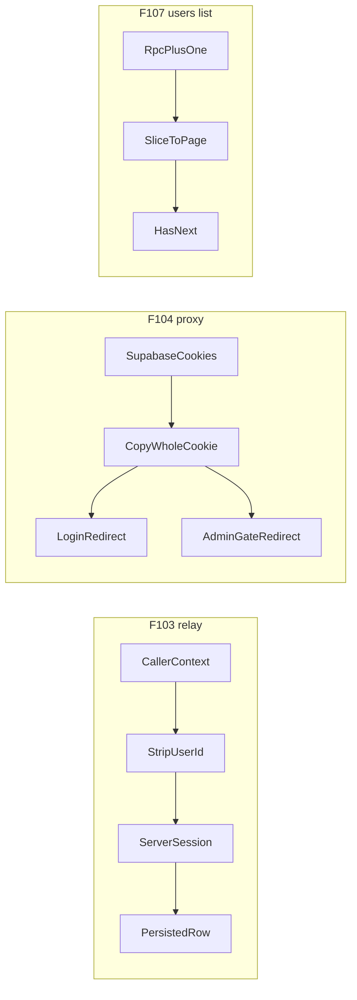

# Chat 1 — three real bugs

Three independent High-severity fixes in one change. No product-behavior change except “the bug stops happening.” ADR-0007 is not edited (immutable). The scratch note’s “no migrations” rule is waived for F107 only, per your call.

Do not commit or open a PR — see § Out of scope.



---

## F103 — unauthenticated relay cannot forge `userId`

**What is wrong:** [`src/app/api/client-logs/route.ts`](src/app/api/client-logs/route.ts) merges caller `context` with a server-read `userId`, but only overwrites that key when a session exists. On the unauthenticated path (the case [ADR-0007](docs/adr/ADR-0007-client-log-relay-unauthenticated.md) is written for), a caller can put `userId` in the body and it is persisted. An operator then cannot tell an attributed row from a forged one.

**Fix:** After the size cap, drop `userId` from the caller context, then attach the server-read id only if a session was found. Server session remains the only path to that field, authenticated or not. Leave the ADR alone.

**Test:** Add one case to [`src/app/api/client-logs/route.integration.test.ts`](src/app/api/client-logs/route.integration.test.ts) (already mocks `getUser` as null). POST a valid payload whose context includes a forged `userId` and another real key (e.g. `email`). Assert the forwarded context has no `userId` and still has the other key. The existing “attach userId when a session is present” case stays.

---

## F104 — proxy redirects keep `HttpOnly`, `Secure`, `SameSite`, expiry

**What is wrong:** [`src/supabase/proxy.ts`](src/supabase/proxy.ts) `redirectWithAuthCookies` copies cookies by name and value only, then `set`s them with framework defaults. This runs on the unauthenticated-redirect and stray-`code` paths, right after a local sign-out whose **deletion** cookies depend on expiry. Coverage shows those two copy lines are the file’s only uncovered branch — because the current proxy test’s `signOut` mock never writes cookies, so the loop body never runs.

A **second redirect in the same function bypasses the helper entirely**: the admin-gate branch (`isAdminPath && sessionClaims && !isAdmin(sessionClaims)`) returns a bare `NextResponse.redirect(url)` and copies no cookies at all. If `getClaims()` rotated the session token on that request, the new cookies never reach the browser while the old refresh token has already been consumed. That is a superset of the attribute-loss bug, on the same shared path.

**Fix (two call sites, one helper):**

1. In `redirectWithAuthCookies`, pass each cookie through whole instead of destructuring two fields off it. `supabaseResponse.cookies` is Next's `ResponseCookies`, whose `getAll()` returns full `ResponseCookie` objects (`httpOnly`, `maxAge`, `expires`, `path`, `sameSite`, `secure`) and whose `set` accepts a whole cookie object:

   ```ts
   for (const cookie of supabaseResponse.cookies.getAll()) {
     redirectResponse.cookies.set(cookie)
   }
   ```

   **Do not call `redirectResponse.cookies.setAll(...)`.** `ResponseCookies` has no `setAll` method — only `get`, `getAll`, `has`, `set`, `delete`, `toString`. The `setAll` named in the comment block lower in this file is Supabase's own `cookies` config callback, a different thing; that comment is upstream boilerplate and is wrong about the Next API.

2. Route the admin-gate redirect through the same helper: `return redirectWithAuthCookies(url, supabaseResponse)` instead of `NextResponse.redirect(url)`.

**Test:** In [`src/supabase/proxy.unit.test.ts`](src/supabase/proxy.unit.test.ts), make the mocked `signOut` invoke the captured Supabase `setAll` callback with a deletion cookie that includes `httpOnly`, `maxAge: 0`, `path`, `sameSite`, and `secure`. Hit the login-redirect path (`/home` unauthenticated). Assert the redirect’s `Set-Cookie` retains `HttpOnly` and the expiry/`Max-Age`. That both pins the bug and closes the coverage gap.

Add a second case for the admin-gate branch: an authenticated non-admin claim set on `/admin/users` where the mocked client writes a refreshed auth cookie via the captured `setAll`. Assert the `/home` redirect carries that cookie.

---

## F107 — users Next is not enabled on an exact-full last page

**What is wrong:** [`src/app/admin/users/_lib/list-admin-users.ts`](src/app/admin/users/_lib/list-admin-users.ts) treats “page came back exactly full” as “there is a next page.” Fifteen users at the default page size of 15 enables Next, which lands on an empty “No users found” page. Logs already probe with `perPage + 1` and slice ([`src/app/admin/logs/_lib/list-app-logs.ts`](src/app/admin/logs/_lib/list-app-logs.ts)).

**Why app-only plus-one cannot work:** `admin_list_users` allowlists `p_per_page` to `10 | 15 | 25 | 50` and computes `OFFSET` from that same value. Asking for 16 silently falls back to 15. The only caller is this list helper (not the CLI).

**Fix (two layers, same change):**

1. **Migration** (agent writes the SQL file; you apply it). Follow [create-migration](.cursor/skills/create-migration/SKILL.md): UTC timestamp from `date -u`, one file, `create or replace` the existing 8-argument `admin_list_users` (signature unchanged — no drop).

   `create or replace` restates the **entire** definition, so copy the function body verbatim from its current source, [`supabase/migrations/20260720142910_admin_list_users_new_30d_filter.sql`](supabase/migrations/20260720142910_admin_list_users_new_30d_filter.sql), and change one line. Carry over `security definer`, `set search_path = ''`, the `auth.jwt() -> 'app_metadata' ->> 'role'` admin gate, the page-size allowlist, the sort allowlist, and `OFFSET (v_page - 1) * v_per_page` unchanged — omitting `security definer` or `set search_path` silently changes the security posture of an admin-gated `auth.users` reader. Change only `limit v_per_page` to `limit v_per_page + 1`.

   Update the `comment on function` to state that the function returns up to `per_page + 1` rows and that **callers must slice the overflow row off** — it is a has-next probe, not a display row. (Audit F124's deferred recommendation is to have the admin CLI call this same RPC, so the comment is the only guard a future second caller gets.)

   Regenerated types should be a no-op (same arguments and return columns); still run `pnpm db:types` after push.

2. **App:** Keep passing the allowlisted `p_per_page`. After the RPC returns, if there is an overflow row, `hasNextPage` is true and slice it off; if the row count is `<= perPage`, this is the last page. Same shape as the logs helper.

**Tests:** Rewrite the existing “full page ⇒ has next” case in [`src/app/admin/users/_lib/list-admin-users.unit.test.ts`](src/app/admin/users/_lib/list-admin-users.unit.test.ts) — that case currently **encodes the bug** (15 rows ⇒ Next enabled). After the fix:

- 15 rows (exact page size) → 15 displayed, Next **off**
- 16 rows (overflow) → 15 displayed, Next **on**
- short page unchanged
- RPC still called with `p_per_page: 15`, not 16

Mirror the logs tests in [`src/app/admin/logs/_lib/list-app-logs.unit.test.ts`](src/app/admin/logs/_lib/list-app-logs.unit.test.ts).

---

## Out of scope

- F106 (admin mutation result type), F108/F122 (lint-rule coverage), Chats 2–5
- Editing ADR-0007
- Rate limiting the relay (F082 stays Deferred; F103 no longer makes it worse)
- **Committing and opening a PR.** Do neither. This plan carries no authorized commit step (`git-workflow.mdc` § Commits); leave the work in the tree for review.

## Docs

Add `/tmp` to [`.gitignore`](.gitignore) under the `# misc` group, so [`tmp/tech-debt-quick-fix-chats.md`](tmp/tech-debt-quick-fix-chats.md) cannot be staged by accident. That replaces the do-not-commit instruction with a mechanical guard.

The `TECH_DEBT_AUDIT.md` edit happens **after** the migration is applied — see § Quality bar and your steps.

## Quality bar and your steps

- [x] After the code is in: `pnpm pre-push`
- [ ] Deploy the app change (or, if working locally only, confirm the sliced build is what is running).
- [ ] Review the migration SQL.
- [ ] `pnpm db:push`
- [ ] `pnpm db:types`
- [ ] Move F103, F104, and F107 to **Resolved** in [`TECH_DEBT_AUDIT.md`](TECH_DEBT_AUDIT.md) with the date the migration was applied and a one-line note each. Uncheck them in Quick wins. Do not rewrite the rest of the audit.

**Order matters.** Push the migration *after* the app change is deployed, never before. The RPC starts returning `per_page + 1` rows the moment it is applied; if the deployed app has not yet been updated to slice, `/admin/users` renders a phantom 16th row on every page.

Before step 3 (`pnpm db:push`), the app slices an overflow row the live RPC never sends, so Next stays wrong in the deployed/linked project even though tests pass against the mock. F107 is not resolved until step 3 completes, which is why the audit edit sits at step 5 rather than in the agent's run.

## Manual test checklist

- [ ] **F103:** From a logged-out browser, POST a valid same-origin `/api/client-logs` body whose context includes `userId`. Confirm the new `app_logs` row has no `userId` in context. Signed-in, confirm a real session id still appears.
- [ ] **F104:** Sign out (or hit a protected URL logged out). In DevTools → Network, the login-redirect `Set-Cookie` still has `HttpOnly` and an expiry/`Max-Age` on the auth cookies. Then, signed in as a **non-admin**, hit `/admin/users`: the redirect to `/home` carries the auth cookies rather than dropping them, and the session survives the bounce.
- [ ] **F107:** On `/admin/users` with a user count that is an exact multiple of the page size (15, or change page size to match), Next is disabled. Add one more user (or pick a size that is not a multiple): Next is enabled and page 2 is not empty.
