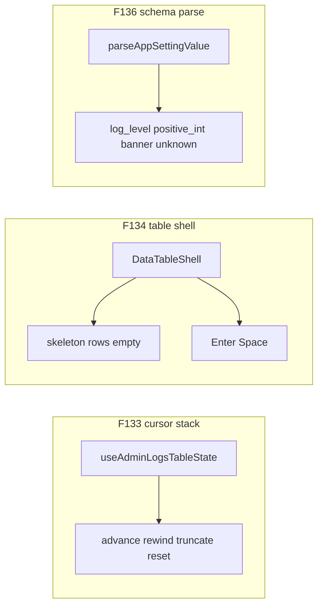

# Chat 20 — the three tests the gates still cannot see

F133 + F134 + F136. Highest-value *tests* on kept surfaces. Three independent files, one chat. After 17 so F136 pins the schema the union just made honest; 18 did not move that file. No production edits. No migrations. Do not commit.

The logs cursor-stack is the most intricate untested admin state (`logs-table.tsx` has 19 commits). The shared table shell holds a three-way body branch and hand-written Enter/Space activation the a11y checkers cannot see. `parseAppSettingValue` is the validation boundary on every stored setting — including the log-path threshold — and has no colocated test.

## Precondition

Before editing anything, run `git status` and record the working tree. Do not stash, revert, or clean.

Confirm 19 landed: [TECH_DEBT_AUDIT.md](TECH_DEBT_AUDIT.md) has **F188**, **F190**, and **F166** in § Resolved. If any is still Open, **stop**. These three tests do not depend on 19’s helper, but this chat is next in the locked batch order, not a substitute for it. 17’s union and 18’s save hook are already Resolved; do not reopen them.

Prior chats may still be uncommitted (11’s `tsconfig` / index guards, 10’s dialog host, 12–19, dirty `stat-tile` / logs tiles, `nextjs-agent-rules` in [AGENTS.md](AGENTS.md)). Name those files up front. Touch only the three new test files plus the F133 / F134 / F136 audit rows, the § Top 5 list, the F176 / F178 “bundle with F133” sentences, and the mental-model line that still names F133 as the coverage gap.

## F133 — logs cursor-stack

New file: [src/app/admin/logs/_lib/use-admin-logs-table-state.unit.test.tsx](src/app/admin/logs/_lib/use-admin-logs-table-state.unit.test.tsx). `renderHook` from `@testing-library/react` with a local `QueryClientProvider` wrapper built in the test file — mirror [use-admin-logs-realtime.unit.test.tsx](src/app/admin/logs/_lib/use-admin-logs-realtime.unit.test.tsx). `@/test/test-utils` wraps only `render`; its `renderHook` is the raw re-export and supplies no QueryClient. The JSX wrapper is why the file is `.tsx`; `_lib/**` unit tests are exempt from `test-scope-naming`.

Mock the same two boundaries the integration test already uses — [`../actions`](src/app/admin/logs/actions.ts) and [`use-admin-logs-realtime`](src/app/admin/logs/_lib/use-admin-logs-realtime.ts). Reuse that file’s `sampleRow` / success-envelope shape. Do **not** mock `useAdminLogsList`, `useDebouncedValue`, or `useDataTableShell` — those are our code.

Observe only the public contract: `page` and the `cursor` argument on `listLogsAction`. The action receives `cursor ?? undefined` ([use-admin-logs-list.ts](src/app/admin/logs/_lib/use-admin-logs-list.ts) line 35). Do not read `cursorStack`. Wait for the first list call to resolve before calling `handleNext` — `rows` is empty until then, and an empty page is a silent no-op.

Four required cases (the finding’s list). One extra that is the empty-page no-op, because that early return is how advance-on-empty fails:

- **Advance.** Page-1 rows ending `{ id: 10, createdAt: '…A' }`. `handleNext()` → `page === 2` and the next list call uses `cursor: { createdAt: '…A', id: 10 }`.
- **Rewind.** After advance, `handlePrevious()` → `page === 1` and the next list call uses `cursor: undefined`.
- **Advance-after-rewind (the truncate).** This is the case a two-page bounce cannot prove. Sequence: page 1 → 2 → 3, rewind to page 2, **change the page-2 last row in the mock**, advance again. The next list call must use the **new** last row, not the leftover page-3 cursor. Stable rows make truncate and append look identical.
  **Wait for the refetch before advancing.** Rewinding returns to a cached query key, so React Query serves the *old* page-2 rows synchronously and refetches in the background. `await waitFor(() => expect(result.current.rows.at(-1)?.id).toBe(<new id>))` before `handleNext()`. Without that wait the pushed cursor equals the leftover page-3 cursor and the assertion passes whether or not `handleNext` truncates — the case proves nothing. `rows` is on the hook's return, so this stays inside the public contract.
- **Reset-on-filter.** After advance, `handleLevelToggle('error')` → `page === 1` and `cursor: undefined`. One representative. Do not also test sort, page-size, chip removal, or debounced search — they all call the same `resetCursorStack`.
- **Advance on empty.** Mock `rows: []`. `handleNext()` leaves `page === 1` and does not add a list call with a cursor.

Do **not** add Next/Previous clicks to [logs-table.integration.test.tsx](src/app/admin/logs/_components/logs-table.integration.test.tsx). Do not extract a cursor helper. Do not extract `useResetOnChange` (F176). Do not rename `error` → `listError` (F178).

## F134 — data-table shell body and keyboard

New file: [src/components/data-table-shell.unit.test.tsx](src/components/data-table-shell.unit.test.tsx). Mirror [data-table-skeleton-body.unit.test.tsx](src/components/data-table-skeleton-body.unit.test.tsx): `render` / `screen` from `@/test/test-utils`, one-column `{ id, name }` fixture.

A small harness calls `useDataTableShell` only to produce a real `table` prop. That is fixture wiring. Do **not** assert sorting, `manualSorting`, or `DataTableColumnHeader`. F135 already closed the controlled/uncontrolled union at the type level.

Four render cases (the three-way branch plus the `AND` that makes skeleton mean “loading and empty”):

- **Empty.** Not loading, no rows → default `'No results.'`. Do not also test `emptyContent`.
- **Skeleton.** `isLoading` and no rows → `[data-slot="skeleton"]` present (same query as the sibling test), empty copy absent, `getByText` finds the loading label. Do not use `toHaveClass`.
- **Rows.** Data present → cell text visible, no skeletons.
- **Stale rows.** `isLoading` with existing rows → cell text still visible, no skeletons. This is the [data-tables.mdc](.cursor/rules/data-tables.mdc) loading rule and the reason `showSkeleton` is `isLoading && !hasRows`.

Two keyboard cases, one row, `onRowClick` set. Query `getByRole('row', { name: 'View row details' })` (the default `aria-label`). `userEvent.setup({ delay: null })`, focus the row, then Enter and Space. Assert the handler was called with the original row. Do **not** also click the row (`testing.mdc`: do not test keyboard and mouse for the same activation). Do not spy `preventDefault`. Do not add a no-`onRowClick` case.

## F136 — `parseAppSettingValue`

New file: [src/utils/app-settings-schema.unit.test.ts](src/utils/app-settings-schema.unit.test.ts). Import `parseAppSettingValue` only. No mocks. Pattern: [banner-settings-schema.unit.test.ts](src/utils/banner-settings-schema.unit.test.ts).

The schema file does not move. Leave the three `as AppSettingValueMap[K]` casts. Do not add a `never` fallthrough — the implicit `positive_int` branch stays. Do not test the form schemas or `saveAppSettingInputSchema`.

Six cases — three value-type happies, two representative failures, unknown-key rejection. Banner depth stays in the existing banner-schema test.

- `'min_log_level', 'warn'` → success `'warn'`
- `'min_log_level', 'verbose'` → `'Choose a valid log level'` (fixed copy, not Zod text)
- `'log_retention_days', 14` → success `14`
- `'log_retention_days', 0` → `'Must be greater than zero'`
- `'banner_public', DEFAULT_BANNER_SETTING` → success (delegate). Import the default from `@/types/banner`.
- `'not_a_real_key' as unknown as AppSettingKey, 'info'` → `'Unknown setting'`. The double assertion is required — a bare `as AppSettingKey` on a non-member literal fails `tsc` (TS2352, no overlap with the key union).

Do **not** add a second banner failure, a non-int `1.5`, or a second unknown-key variant. [app-settings.unit.test.ts](src/utils/app-settings.unit.test.ts) stays the cache-wrapper test.

## Out of scope

- **F176 / F178** — do not extract `useResetOnChange`; do not rename `error` → `listError`. Tests first; extract later.
- **F118 / F155 / F177** — do not extract the refresh indicator
- **F116** — Chat 21
- **F159** — do not restyle `AppBanner`
- Do not edit [use-admin-logs-table-state.ts](src/app/admin/logs/_lib/use-admin-logs-table-state.ts), [data-table-shell.tsx](src/components/data-table-shell.tsx), or [app-settings-schema.ts](src/utils/app-settings-schema.ts). If a test cannot be written because current behavior is wrong, stop and report.
- Coverage floors — new files are under `src/`. Do not edit [vitest.config.ts](vitest.config.ts)
- **AGENTS.md, DESIGN.md, README, `/sync-repo-docs`, testing.mdc.** No rule edits.
- **Committing and opening a PR.** Do neither.
- Do not edit [tmp/tech-debt-quick-fix-chats.md](tmp/tech-debt-quick-fix-chats.md)
- No browser pass. This chat adds tests only; nothing rendered changes.

## Docs

After both gates are green, in [TECH_DEBT_AUDIT.md](TECH_DEBT_AUDIT.md):

- Move **F133**, **F134**, and **F136** to § Resolved with today’s date (**2026-08-29**): colocated cursor-stack test covers advance, rewind, advance-after-rewind (truncate), reset-on-filter, and empty-page no-op; shell unit test covers the three body states plus stale-rows and Enter/Space activation, with the controlled/uncontrolled sorting branch left uncovered by decision (F135 closed it at the type level); `parseAppSettingValue` covers the three value-type branches plus unknown-key rejection. Note F176 / F178 / F118 were not done here.
- § Top 5: drop F133 and renumber. Remaining row stays F118. Do not promote F116 (that is Chat 21) or F176/F178.
- F176 and F178 Open rows: delete the “bundle with F133” clause from both. Tests landed first; the extract stays a later chat. File:Line, description, and the rest of the recommendation stay.
- Architectural mental model: the sentence that still names F133 as the remaining churn-vs-coverage gap must read as closed.
- Every place that still treats these three as the open coverage gap — if the `## Executive summary` lead bullet still describes Chat 19 as the latest close, rewrite it so this chat’s three tests are the latest close. The header `Scope:` line carries the same claim (`Sync this pass: closed F188 …, F190 …, and F166 …`) and must name these three closes too. Same claim in every spot you touch; do not update one and leave another.
- F129 / F132 Resolved notes already say F136 was not done there — leave those historical sentences.
- `Last synced:` stays **2026-08-29**.

## Quality bar

- Targeted: `CI=true pnpm type-check` and `pnpm test:file -- src/app/admin/logs/_lib/use-admin-logs-table-state.unit.test.tsx src/components/data-table-shell.unit.test.tsx src/utils/app-settings-schema.unit.test.ts src/app/admin/logs/_components/logs-table.integration.test.tsx src/utils/app-settings.unit.test.ts src/utils/banner-settings-schema.unit.test.ts src/components/data-table-skeleton-body.unit.test.tsx`
- Then: `CI=true pnpm pre-push` (a bare `pnpm pre-push` aborts in a non-TTY agent shell)
- Grep: the three new test files exist; zero `useResetOnChange`; `error` (not `listError`) still returned from the logs table-state hook; the three `as AppSettingValueMap[K]` casts still in `app-settings-schema.ts`; zero production edits in the three source files; no `runWithRefreshIndicator`
- **If any gate fails on files this chat did not touch** (including coverage floors, and anything from the uncommitted prior chats named in § Precondition): stop and report. Do not fix it here.

## Manual test checklist

- Cursor-stack: advance sets page 2 and the last-row cursor; rewind returns page 1 / `undefined`; after a three-page walk, rewind, and a changed page-2 last row, the next cursor is the new last row; filter toggle resets; empty page does not advance.
- Shell: empty copy, skeletons + loading label, row text, stale-rows keep text; Enter and Space each fire `onRowClick` with the row. No click case. No sort assertions.
- Schema: warn / verbose / 14 / 0 / default banner / unknown key. Banner schema test and cache-wrapper test still pass.
- Existing logs-table integration tests still pass (they never clicked Next/Previous; leave that true).
- `pnpm type-check` is clean. No production diff in the three source files.
