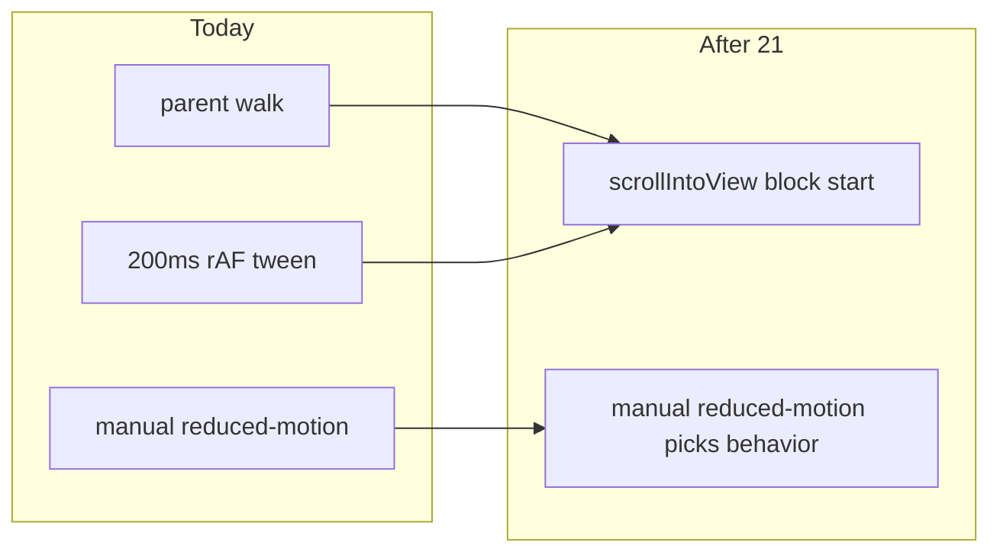

# Chat 21 — password accordion uses the platform

F116. App shell keeps this. One hook, visible. Own chat because it needs a browser pass. No migrations. Do not commit.

Today [`use-password-accordion-scroll.ts`](src/hooks/use-password-accordion-scroll.ts) walks parents for an `overflow-y: auto|scroll` container and eases `scrollTop` over 200ms with `requestAnimationFrame`. That 200ms is a copy of the accordion CSS (`--animate-accordion-down: 0.2s` in [`globals.css`](src/app/globals.css)). Native `Element.scrollIntoView({ block: 'start' })` replaces both — the walk and the tween — and is the platform feature this hook reinvented.

`scrollIntoView` scrolls **every** scrollable ancestor, not the single container the walk targeted. The nearest one is the dialog, and Radix locks body scroll while the dialog is open, so the page behind the overlay should not move — but that is a behavior difference to confirm in the browser, not an equivalence to assume.

It also does **not** honor `prefers-reduced-motion` on its own. `behavior: 'smooth'` is an explicit author request; browsers do not auto-downgrade it, and `globals.css` sets no `scroll-behavior` reduced-motion rule that would. The `matchMedia` branch stays and picks the behavior value.

The dialog that needs the scroll is already a scroller: [`profile-settings-dialog.tsx`](src/app/(app)/_components/profile/profile-settings-dialog.tsx) sets `max-h-[90vh] overflow-y-auto` on `DialogContent`. Expanding Change Password / Set Password is what overflows it.

## Precondition

Before editing anything, run `git status` and record the working tree. Do not stash, revert, or clean.

Confirm 20 landed: [TECH_DEBT_AUDIT.md](TECH_DEBT_AUDIT.md) has **F133**, **F134**, and **F136** in § Resolved. If any is still Open, **stop**. This chat does not depend on those tests, but it is next in the locked batch order, not a substitute for them.

Prior chats may still be uncommitted (11’s `tsconfig` / index guards, 10’s dialog host, 12–20, dirty `stat-tile` / logs tiles, `nextjs-agent-rules` in [AGENTS.md](AGENTS.md)). Name those files up front. Touch only this chat’s files plus the F116 audit row, the § Top 5 list only if a leftover sentence still treats F116 as open work, the executive-summary latest-close bullet, and the TS023 Accepted row in [TEST_AUDIT.md](TEST_AUDIT.md) (that row still describes a tween this chat deletes).

## Slim the hook — do not delete it

Keep [`use-password-accordion-scroll.ts`](src/hooks/use-password-accordion-scroll.ts). Two callers share “only scroll when the value is `password`” plus the section ref: [`profile-modal-content.tsx`](src/app/(app)/_components/profile/profile-modal-content.tsx) (kept) and [`reference-profile-settings-preview.tsx`](src/app/(marketing)/reference/_components/reference-profile-settings-preview.tsx) (throwaway; do not require it in the browser pass). Inlining would duplicate the hook. Do not extract a shared `PASSWORD_ACCORDION_VALUE` constant — both callers already have their own copy.

Public return stays `{ passwordSectionRef, handleAccordionValueChange }`. Do not edit either caller unless a type or name change forces it (it should not).

Delete from the hook: the parent walk, the cubic ease, the `requestAnimationFrame` loop, the frame-id ref, the cancel helper, the `useEffect` cleanup, and `ACCORDION_ANIMATION_MS`.

**Keep** the `window.matchMedia('(prefers-reduced-motion: reduce)')` read. It no longer branches to a separate code path — it picks the `behavior` value on the single native call.

On `'password'`, call `scrollIntoView({ behavior: prefersReducedMotion ? 'auto' : 'smooth', block: 'start' })` on the ref’s element. On any other value (including the collapse `''` the modal already sends after a successful password save), do nothing. Optional chaining on a missing ref is enough — do not add a container lookup.

That is the native-platform rung. No new helper. No new file.

## Tests — keep existing green; do not pin the native call

Do **not** add a colocated unit test that spies on `scrollIntoView`. That is testing the platform. [TEST_AUDIT.md](TEST_AUDIT.md) TS023 already accepted visual review for this helper; the finding only requires a cancellation test if the tween comes back.

Existing [`profile-modal-content.integration.test.tsx`](src/app/(app)/_components/profile/profile-modal-content.integration.test.tsx) cases that expand the accordion will now hit `scrollIntoView`. Three other files already guard jsdom with `Element.prototype.scrollIntoView ??= () => {}` ([`app-setting-row.integration.test.tsx`](src/app/admin/settings/_components/app-setting-row.integration.test.tsx), [`banner-setting-row.integration.test.tsx`](src/app/admin/settings/_components/banner-setting-row.integration.test.tsx), [`reference-forms-section.integration.test.tsx`](src/app/(marketing)/reference/_components/reference-forms-section.integration.test.tsx)). If the profile-modal suite fails because the method is missing, add that same one-line stub there. Do not add a global setup stub. Do not add new accordion cases.

## Browser pass — position first, then duration

This is why the finding is its own chat. After the slim lands and targeted tests are green, verify on the running app **before** declaring F116 closed.

Locked path (do not substitute `/reference`):

1. Sign in. Open `/home`.
2. Account menu → **Profile**.
3. Expand **Change Password** or **Set Password**.
4. Confirm the password section moves to the top of the dialog scroller — not the page behind the overlay — and the accordion still opens.
5. Repeat at a narrow viewport (dialog is `max-h-[90vh]`; the expanded password form is what overflows).
6. With reduced motion on (OS setting or DevTools → Rendering → Emulate CSS `prefers-reduced-motion: reduce`), the scroll must snap with no animation. This is our `matchMedia` branch, not the browser's — check it.

Admin and marketing mount the same host. One app-shell pass is enough. Do not require `/reference`.

**Position gate (primary):** the call fires synchronously in `onValueChange`, before React re-renders and before the 0.2s accordion height animation adds the scroll room the target needs. The old tween re-assigned `scrollTop` every frame for 200ms, so it converged as `scrollHeight` grew; a single `scrollIntoView` computes one target and can be clamped to the pre-expansion maximum, landing short of the top.

If step 4 shows the section landing short, do **not** jump to the tween. In order:

1. Defer the native call until after the expand has laid out — `requestAnimationFrame` first; if one frame is not enough, a timeout keyed to the accordion duration. A timeout reintroduces a 200ms constant coupled to `--animate-accordion-down`; if you take it, mark it with a `// debt:` comment naming that coupling.
2. Only if deferral still lands short, fall through to the tween restoration below.

**Duration gate (secondary, judged in the browser):** native smooth-scroll duration is browser-owned and often longer than 200ms. Prefer native. Reintroduce the tween **only** if the mismatch is obviously wrong next to the accordion open animation — not because it is different. If you bring the tween back:

- Restore the previous scroll path behind a `// debt:` marker that names the ceiling (native duration is browser-owned and visibly longer than the 200ms accordion) and the upgrade (drop the tween when that is acceptable).
- Then add a colocated unit test for the cancellation path only (expand, then collapse or unmount before the 200ms tick finishes; the next frame must not run). Fake timers / `requestAnimationFrame` mock. Do not also test easing math or the parent walk.
- Do not restyle anything to “make native look closer.”

If native looks fine, ship it and do not add that test.

## Out of scope

- **F159** — do not restyle `AppBanner`
- **F118 / F155 / F177** — do not extract the refresh indicator
- **F176 / F178** — do not extract `useResetOnChange` or rename `error`
- Do not require `/reference` in the browser pass
- Do not delete the hook or inline it at the two callers
- Do not change accordion CSS duration to chase the native scroll
- **AGENTS.md, DESIGN.md, README, `/sync-repo-docs`, testing.mdc, seo.mdc.** No rule edits.
- Coverage floors — this file is under `src/`. Do not edit [vitest.config.ts](vitest.config.ts)
- **Committing and opening a PR.** Do neither.
- Do not edit [tmp/tech-debt-quick-fix-chats.md](tmp/tech-debt-quick-fix-chats.md)

## Docs

After both gates are green **and** the browser pass has judged duration, in [TECH_DEBT_AUDIT.md](TECH_DEBT_AUDIT.md):

- Move **F116** to § Resolved with today’s date (**2026-08-29**): tween / parent-walk replaced with `scrollIntoView({ block: 'start' })`, reduced-motion check retained to pick `behavior`; public return unchanged; position and duration judged in the app-shell profile dialog (desktop + narrow). Say whether native shipped, whether the call is deferred past the expand, or whether the tween returned behind a `// debt:` marker. Note F159 was not done here.
- § Top 5: F116 was never promoted here. Remaining row stays F118. Do not promote F159.
- `## Executive summary` lead bullet: rewrite so this chat’s close is the latest close (same claim in every spot you touch).
- [TEST_AUDIT.md](TEST_AUDIT.md) TS023 Accepted row: rewrite the description so it no longer talks about an untested tween. Keep it Accepted — visual review still covers a one-line native call. Do not open a new test-audit finding. Leave `Last synced:` on that file alone (it is written by a test-audit pass).
- `Last synced:` on the tech-debt audit stays **2026-08-29**.

## Quality bar

- Targeted: `CI=true pnpm type-check` and `pnpm test:file -- src/app/(app)/_components/profile/profile-modal-content.integration.test.tsx src/app/(app)/_components/profile/profile-password-section.integration.test.tsx` — plus the new cancellation test **only if** the tween returned
- Then: `CI=true pnpm pre-push` (a bare `pnpm pre-push` aborts in a non-TTY agent shell)
- Grep (native path): the hook contains `scrollIntoView` and still contains `matchMedia`; zero `easeOutCubic`, `findScrollContainer`, `ACCORDION_ANIMATION_MS`, `cancelAnimationFrame` in that file; `requestAnimationFrame` appears only if the deferral step was taken; both callers still import the same hook; zero edits in `app-banner.tsx`
- Grep (tween-returned path): a `// debt:` marker in the hook, plus a colocated cancellation test
- **If any gate fails on files this chat did not touch** (including coverage floors, and anything from the uncommitted prior chats named in § Precondition): stop and report. Do not fix it here.

## Manual test checklist

- App shell, signed in, `/home` → Account menu → Profile → expand password. Section sits **at the top** of the dialog scroller — not short of it. Accordion still opens and collapses. Successful password save still collapses (existing modal behavior).
- Narrow viewport: same expand; the section still reaches the top; overflow is inside the dialog, and the page behind the overlay does not move.
- Reduced motion (OS setting or DevTools emulation): scroll snaps, no animation.
- `/reference` not required.
- `pnpm type-check` is clean. Callers unchanged unless the stub-only test edit above fired.
