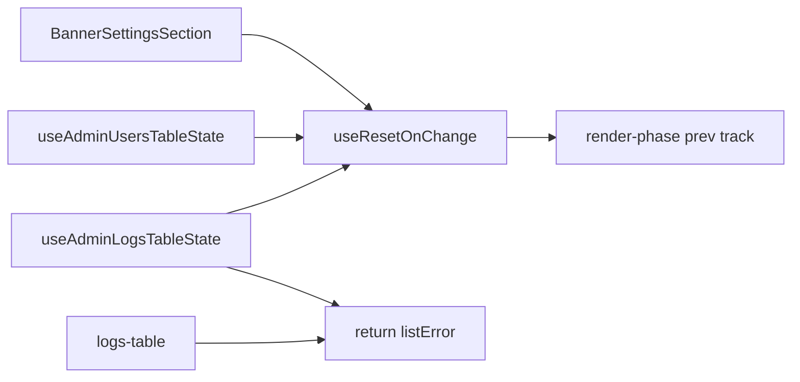

# Chat 23 — one reset hook, one error name

F176 + F178. Same shape as Chat 8: one hook, three call sites, plus a one-name rename the extract already touches. Unblocked by Chat 20’s cursor-stack test (F133). Own chat because it edits both table-state hooks and the settings accordion. No migrations. Zero intended UX change. Do not commit.

## Precondition

Before editing anything, run `git status` and record the working tree. Do not stash, revert, or clean.

Confirm 22 is closed: [TECH_DEBT_AUDIT.md](TECH_DEBT_AUDIT.md) has **F159** in § **Accepted** — reviewed 2026-08-29 and closed without action, so 22 landed no code change. If F159 is still in § Open, **stop** — this chat is next in the locked batch order (`22 → 23`), not a substitute. Also confirm **F133** is in § Resolved (the actual unblocker). If F133 is still Open, **stop**.

Prior chats may still be uncommitted (11’s `tsconfig` / index guards, 10’s dialog host, 12–21, dirty `stat-tile` / logs tiles, `nextjs-agent-rules` in [AGENTS.md](AGENTS.md)). 22 left nothing in the tree. Name those files up front. Touch only this chat’s files plus the F176 / F178 audit rows and the executive-summary claims listed in § Docs.

## Why extract, not rewrite

React’s documented “adjust state while rendering” pattern is what all three sites already do: `useState(value)` plus `if (value !== prev) { setPrev(value); reset… }`. We extract that, we do not replace it.

- Do **not** switch the track to a `useRef`. A ref skips the extra render the `useState` version schedules. That is a behavior change, and Chat 8 kept `useState` for the same reason.
- Do **not** move the reset into a `useEffect`. The whole point is render-phase, so the dependent state is current on the same pass.
- Do **not** invent a comparator, a `defaultValue`, or a returned previous-value. The hook is `useResetOnChange(value, onReset)` and returns `void`.
- Comparison stays `!==`, matching the three copies and React’s own example. All three values are strings today.

The callback is invoked only when the value changes, so an inline arrow at the call site is fine. Do not wrap `onReset` in `useCallback` as a hook requirement.

## The hook

New file: [`src/hooks/use-reset-on-change.ts`](src/hooks/use-reset-on-change.ts).

Match [`src/hooks/use-debounced-value.ts`](src/hooks/use-debounced-value.ts) and [`src/hooks/use-mounted.ts`](src/hooks/use-mounted.ts): `'use client'`, named arrow export, no default export, explicit return type `void`. Do not skip the directive — F172 notes `use-mobile` is the only hook without it; do not “fix” that file here.

Body is the three copies’ shared track:

- Generic over `T`
- `useState(value)` for the previous value
- `if (value !== prev) { setPrev(value); onReset() }`
- No effect, no lint suppression (the three sites already do this without one)

Carry the hook’s contract as a JSDoc block on the export, since both constraints are invisible at the call site:

- `onReset` runs during render — it must only call state setters. Anything else (logging, network, a meaningful ref write) fires more than once under StrictMode and on React’s render-phase re-run.
- `value` must be a primitive or referentially stable. Comparison is `!==`, so a value rebuilt each render never compares equal and the reset loops until React throws.

Colocated test: [`src/hooks/use-reset-on-change.unit.test.ts`](src/hooks/use-reset-on-change.unit.test.ts). `renderHook` from `@/test/test-utils` is fine here — there is no mount effect to flush (that is why Chat 8 could not use it). Two cases:

- **No fire.** First render and a same-value `rerender` leave the spy at zero.
- **Fire on change.** `rerender` with a new value calls the spy once; a second change (including back to the first value) calls it again. That is the track updating.

Do not test `NaN` / `Object.is`. Do not mock React. Do not add a Probe component.

## Convert the three callers

Each site drops its local previous-value state and the `if` comparison, then calls `useResetOnChange` from `@/hooks/use-reset-on-change`. Keep the reset body as an inline arrow. Do not reorder other hooks around the new call — put it where the `if` block sits today.

1. [`src/app/admin/settings/_components/banner-settings-section.tsx`](src/app/admin/settings/_components/banner-settings-section.tsx) — `useResetOnChange(settingsVisitKey, () => setOpenItem(''))`. Delete `boundVisitKey` / `setBoundVisitKey`. Keep `openItem`, `syncAdminSettingsVisitKey`, and the `pageshow` / bfcache effect. That effect is a different trigger, not a fourth copy of this idiom.

2. [`src/app/admin/users/_lib/use-admin-users-table-state.ts`](src/app/admin/users/_lib/use-admin-users-table-state.ts) — `useResetOnChange(debouncedSearch, () => setPage(1))`. Delete `trackedDebouncedSearch`. Other `setPage(1)` calls (sort, filter, page size) stay as event-handler resets; they are not this idiom.

3. [`src/app/admin/logs/_lib/use-admin-logs-table-state.ts`](src/app/admin/logs/_lib/use-admin-logs-table-state.ts) — `useResetOnChange(debouncedSearch, () => { setCursorStack([null]); setCursorStackIndex(0) })`. Delete `trackedDebouncedSearch`. Do **not** call `resetCursorStack` from the hook — that callback is declared later and exists for event handlers. Do not move `useResetOnChange` below it just to reuse the name. Filter / sort / chip resets stay on `resetCursorStack`.

Existing tests already cover the user-visible outcomes: [`banner-settings-section.unit.test.tsx`](src/app/admin/settings/_components/banner-settings-section.unit.test.tsx) (collapse on revisit, stay open on same visit, bfcache), [`use-admin-logs-table-state.unit.test.tsx`](src/app/admin/logs/_lib/use-admin-logs-table-state.unit.test.tsx) (reset-on-filter via `handleLevelToggle` — that path is still `resetCursorStack`, not the new hook; keep it). Do not add search-debounce cases to the table-state tests. The new hook unit test owns the track.

## F178 — logs returns `listError`

Same files as the logs half of F176. Users already has the right name.

In [`use-admin-logs-table-state.ts`](src/app/admin/logs/_lib/use-admin-logs-table-state.ts): destructure `error: listError` from `useAdminLogsList` (users already does this) and return `listError` instead of `error`.

In [`logs-table.tsx`](src/app/admin/logs/_components/logs-table.tsx): destructure `listError` and wire `{listError ? <AppErrorSurface error={listError} /> : null}`.

Do **not** rename the list-query hooks. [`use-admin-logs-list.ts`](src/app/admin/logs/_lib/use-admin-logs-list.ts) and [`use-admin-users-list.ts`](src/app/admin/users/_lib/use-admin-users-list.ts) already compute `listError` internally and return it as `error` — that is the query-hook convention. F178 is the table-state return and the table that reads it.

Chat 20’s cursor-stack test never reads `.error`. The logs integration test asserts the visible error panel, not the property name. Do not add a rename-only test.

## Out of scope

- **F118 / F155 / F177** — do not extract the refresh indicator or the admin refresh button
- **F149 / F179** — do not collapse the `run-*` layer (that is Chat 24)
- **F159** — do not restyle `AppBanner`. It was reviewed 2026-08-29 and closed without action into § Accepted; the `cva` conversion and `Alert` composition are net additions, not reductions. Do not re-open that call here
- **F172** — do not add `'use client'` to `use-mobile`
- Do not convert the logs localStorage restore (different shape; Chat 8 left it)
- Do not change `useAdminLogsList` / `useAdminUsersList` return names
- **AGENTS.md, DESIGN.md, README, `/sync-repo-docs`, testing.mdc.** No rule edits
- Coverage floors — new files are under `src/`. Do not edit [vitest.config.ts](vitest.config.ts)
- **Committing and opening a PR.** Do neither
- Do not edit [tmp/tech-debt-quick-fix-chats.md](tmp/tech-debt-quick-fix-chats.md)

## Docs

After both gates are green, in [TECH_DEBT_AUDIT.md](TECH_DEBT_AUDIT.md):

- Move **F176** and **F178** to § Resolved with today’s date (**2026-08-29**): `useResetOnChange` in `src/hooks/` owns the render-phase previous-value track; banner settings section, users table state, and logs table state call it; both table-state hooks return `listError`; logs table wires the error panel from that name. Note F118 / F177 / F149 were not done here.
- § Top 5: neither finding is listed. Leave it alone. Do not promote F118 (locked throwaway-page stay-out) or start F149.
- `## Executive summary` lead bullet (and the header `Scope:` line if it still names Chat 21 / 22 as the latest close): rewrite so this chat’s close is the latest close. Same claim in every spot you touch.
- **Open counts.** The header `Scope:` line and the executive-summary lead bullet both state the Open row count (currently 32 re-verified / 31 remaining). Closing F176 and F178 takes Open to **29** — update both figures in the same edit so the counts match the table.
- F133 / F132 / F157 Resolved notes already say F176 was not done there — leave those historical sentences.
- `Last synced:` stays **2026-08-29**.

## Quality bar

- Targeted: `CI=true pnpm type-check` and `pnpm test:file -- src/hooks/use-reset-on-change.unit.test.ts src/app/admin/settings/_components/banner-settings-section.unit.test.tsx src/app/admin/logs/_lib/use-admin-logs-table-state.unit.test.tsx src/app/admin/logs/_components/logs-table.integration.test.tsx src/app/admin/users/_components/users-table.integration.test.tsx`
- Then: `CI=true pnpm pre-push` (a bare `pnpm pre-push` aborts in a non-TTY agent shell)
- Grep: `useResetOnChange` exists and all three callers import it; zero `trackedDebouncedSearch` / `boundVisitKey`; logs table-state returns `listError` and does not return a bare `error`; `logs-table.tsx` destructures `listError`; `use-admin-logs-list.ts` still returns `error`; zero `runWithRefreshIndicator` / `AdminRefreshButton`; no edits under `users/_lib/run-*.ts` or `ban-mutation-actions.ts`
- **If any gate fails on files this chat did not touch** (including coverage floors, and anything from the uncommitted prior chats named in § Precondition): stop and report. Do not fix it here.

## Manual test checklist

Admin, signed in as admin. Behavior, not a screenshot. These paths already have unit/integration coverage; this is the sanity pass that the extract did not change them.

- `/admin/settings`: expand a banner row. Navigate to `/admin/logs` and back to settings (or trigger the same visit-key bump). Accordion is collapsed. Staying on settings and saving a non-banner row does not collapse it. Browser Back from another tab onto settings (bfcache) still collapses — the `pageshow` effect is untouched.
- `/admin/users`: type a search of 3+ characters, go to page 2 if there is one, then change the search. Page returns to 1. Filter chips and sort still reset the page the way they do today.
- `/admin/logs`: same search debounce — cursor/page returns to 1. Filter tile toggle still resets (existing F133 case). Force a list failure (or rely on the existing integration test) and confirm the error panel still renders with copy affordance.
- Confirm `use-admin-logs-table-state.ts` still has its localStorage `set-state-in-effect` suppression (sanity that this chat did not “also convert” it).
- `pnpm type-check` is clean.
