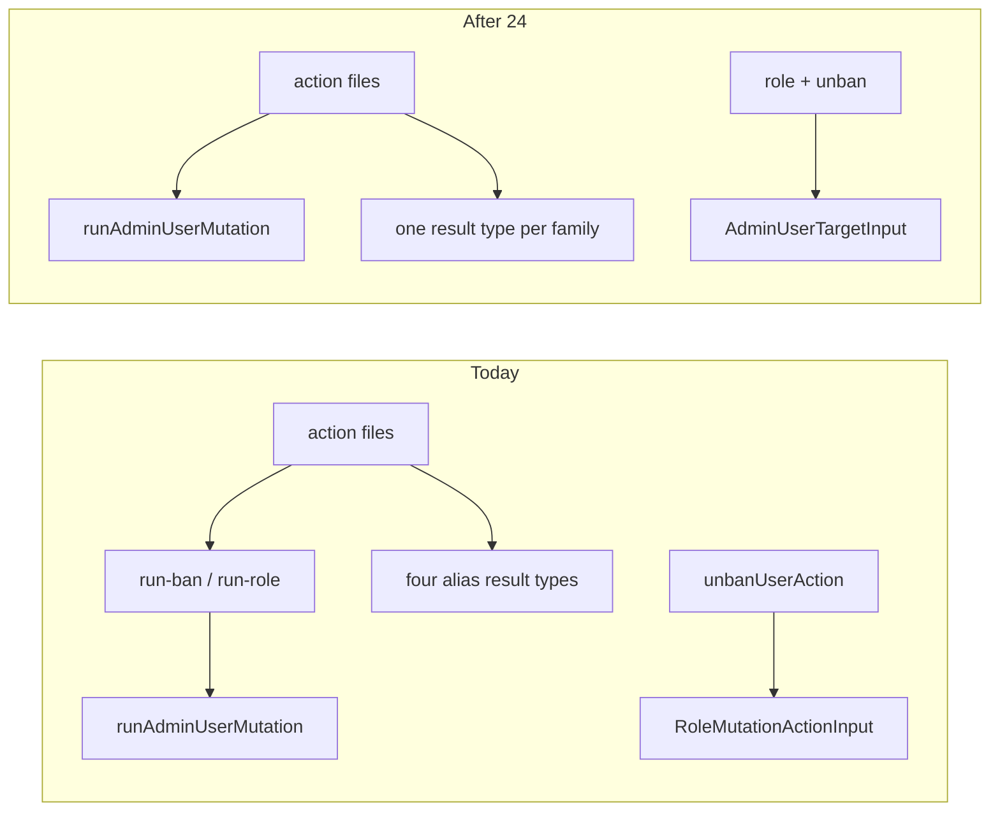

# Chat 24 — collapse the mutation middle layer

F149 + F179. Unblocked by 9a (real envelope) and 16 (`email: string | null`). Hygiene on the privileged path, not a fork multiplier — still one tightly scoped finding. No migrations. Zero intended UX change. Do not commit.

Every users mutation currently goes through three layers: the `'use server'` action, a `run-*` wrapper, then `runAdminUserMutation`. The middle layer is a rename (role) plus a ban-duration guard that already lives in the action. Each pair also redeclares the success envelope, so the same shape is written five times counting the generic. Co-change already showed the seam is not load-bearing.



## Precondition

Before editing anything, run `git status` and record the working tree. Do not stash, revert, or clean.

Confirm 23 landed: [TECH_DEBT_AUDIT.md](TECH_DEBT_AUDIT.md) has **F176** and **F178** in § Resolved. If either is still Open, **stop** — this chat is next in the locked batch order (`23 → 24`), not a substitute. 22 closed F159 into § Accepted without a code change; that is already true in the audit.

Prior chats may still be uncommitted (11’s `tsconfig` / index guards, 10’s dialog host, 12–23, dirty `stat-tile` / logs tiles, `nextjs-agent-rules` in [AGENTS.md](AGENTS.md)). Name those files up front. Touch only this chat’s files plus the F149 / F179 audit rows and the executive-summary claims listed in § Docs.

## Why inline, not keep a private `run-*`

The finding’s claim is that the middle layer buys no encapsulation. Folding the files but keeping exported `runPromoteUserMutation` (etc.) inside a `'use server'` module would register those functions as extra server actions — a wider public surface, not a collapse. Private helpers that only rename `runAdminUserMutation` are the same layer with a different home.

Inline the four `runAdminUserMutation` calls into the four action functions. Delete [run-ban-mutation.ts](src/app/admin/users/_lib/run-ban-mutation.ts) and [run-role-mutation.ts](src/app/admin/users/_lib/run-role-mutation.ts). Keep [run-admin-user-mutation.ts](src/app/admin/users/_lib/run-admin-user-mutation.ts) as the shared helper. Do **not** add `'use server'` to the helper — that would turn `runAdminUserMutation` itself into a server action.

Keep the four explicit `Exclude<*ByIdResult['status'], 'not_found'>` type arguments Chat 9a pinned. Do not go back to inference.

## F149 — four files become two

[role-mutation-actions.ts](src/app/admin/users/_lib/role-mutation-actions.ts) and [ban-mutation-actions.ts](src/app/admin/users/_lib/ban-mutation-actions.ts) already have `'use server'`. They already export only async actions plus types, so the directive still holds after the fold.

In both action files:

- Import `runAdminUserMutation` and `AdminUserMutationActionResult` from `./run-admin-user-mutation`.
- Add the imports the `run-*` files used to hold, from `@/utils/admin-user-mutations`:

  - role file: `promoteUserById`, `demoteUserById`, `type PromoteUserByIdResult`, `type DemoteUserByIdResult` (keep the existing `type RoleMutationSuccessStatus`)
  - ban file: `banUserById`, `unbanUserById`, `type BanUserByIdResult`, `type UnbanUserByIdResult` (keep the existing `type BanMutationSuccessStatus`)

- Drop the local `*MutationActionSuccess` objects and the `AdminActionError` import that exists only to union with them.
- Drop the imports of `runPromoteUserMutation` / `runDemoteUserMutation` / `runBanUserMutation` / `runUnbanUserMutation`.
- Move the family result aliases that already live on the `run-*` files:

  - `RoleMutationActionResult` = `AdminUserMutationActionResult<RoleMutationSuccessStatus>`
  - `BanMutationActionResult` = `AdminUserMutationActionResult<BanMutationSuccessStatus>`

- `promoteUserAction` / `demoteUserAction` / `unbanUserAction` become the `runAdminUserMutation` call they already delegated to. `banUserAction` keeps the `isAdminBanDuration` guard, then the same call (self-ban `beforeMutation` included). Self-demote `beforeMutation` moves with demote. Copy the log tags, messages, and fault strings verbatim.

### `banUserAction` — hoist the narrowed duration

After the `isAdminBanDuration` guard, bind the narrowed value to a local before building the call:

```ts
const banDuration = input.banDuration
// ...
mutation: (client, id) => banUserById(client, id, banDuration),
```

`banDuration` on `BanUserActionInput` is a non-readonly property of a parameter, so TypeScript discards the guard's narrowing inside the `mutation` arrow function — reading `input.banDuration` there types as `string` and fails against `banUserById`'s `AdminBanDuration`. Today's code avoids this only because the narrowed value is passed as an argument to `runBanUserMutation` and captured as a `const` parameter. Do not resolve this with a cast or by loosening `banUserById`.

Hooks stay untouched. They already call `promoteUserAction({ userId })` and friends from the barrel and do not import result-type names.

## F179 — one result type per family, one user-id input

Delete these four aliases; they are the same union under three (ban) or two (role) names:

- `PromoteUserActionResult`, `DemoteUserActionResult`
- `BanUserActionResult`, `UnbanUserActionResult`

Both action functions in a family return the family type (`RoleMutationActionResult` / `BanMutationActionResult`).

Add `AdminUserTargetInput` to [run-admin-user-mutation.ts](src/app/admin/users/_lib/run-admin-user-mutation.ts) — an interface with `userId: string`, matching today’s `RoleMutationActionInput`. Both families import it. Delete `RoleMutationActionInput`. `unbanUserAction` stops importing from the role file.

Keep `BanUserActionInput` (`userId` + `banDuration`). Do not make it extend `AdminUserTargetInput`. Do not change the helper’s options type — it still takes `userId: string | undefined` plus mutation/log fields; `validateUserId` stays there.

Re-export `AdminUserTargetInput` from [actions.ts](src/app/admin/users/actions.ts) alongside `BanUserActionInput`. Nothing in `src/` imports `RoleMutationActionInput` from the barrel today, but the barrel is the surface spinoffs type against, and leaving ban with a named input type while role and unban have none is an asymmetry with no reason behind it.

## Barrel

In [actions.ts](src/app/admin/users/actions.ts), replace the four alias re-exports with the two family types. Keep `BanUserActionInput`, add `AdminUserTargetInput`. Drop `RoleMutationActionInput`.

```
role: promoteUserAction, demoteUserAction, AdminUserTargetInput, RoleMutationActionResult
ban:  banUserAction, unbanUserAction, BanUserActionInput, BanMutationActionResult
```

`AdminUserTargetInput` is re-exported once — from whichever of the two blocks reads more naturally, not from both.

## Tests

No new test file. This is a module collapse and a type-name cleanup; [testing.mdc](.cursor/rules/testing.mdc) says not to test TypeScript with extra cases.

Existing [role-mutation-actions.unit.test.ts](src/app/admin/users/_lib/role-mutation-actions.unit.test.ts) and [ban-mutation-actions.unit.test.ts](src/app/admin/users/_lib/ban-mutation-actions.unit.test.ts) import from the barrel and assert envelopes (self-ban, self-demote, invalid duration, `not_found`, success, fault). They should stay green with no edits — they never read the alias type names.

Do not add a rename-only test. Do not move the tests to the barrel (the audit’s open question on test placement is not this chat).

## Out of scope

- **F148** — do not drop `mergeDemoteMetadata`’s unread param; do not touch `PublicBannerSlot.initialDismissed` (that is Chat 26)
- **F151** — do not touch the CLI or `@/supabase/service` factories (that is Chat 25)
- **F150** — do not delete the CLI `env.ts` barrel
- **F118 / F155 / F177** — do not extract the refresh indicator or the admin refresh button
- **F176 / F178** — do not edit the reset hook or table-state error names; 23 already owns those
- Do not add `'use server'` to `run-admin-user-mutation.ts`
- Do not export the former `run*` names from the action files
- Do not edit [src/utils/admin-user-mutations.ts](src/utils/admin-user-mutations.ts), the two mutation hooks, or `security.mdc` / LEXICON
- **AGENTS.md, DESIGN.md, README, `/sync-repo-docs`, testing.mdc.** No rule edits
- Coverage — the per-glob floors are on `eslint-rules/**` and `scripts/**`, so deleting files under `src/` cannot trip them. The global 80% threshold does cover `src/`, and removing two fully-covered files moves it slightly. If `test:ci` fails on the global threshold, stop and report: do not edit [vitest.config.ts](vitest.config.ts), do not add filler tests. Threshold and exclude-set changes are a PM decision per [testing.mdc](.cursor/rules/testing.mdc) § Coverage Requirements
- **Committing and opening a PR.** Do neither
- Do not edit [tmp/tech-debt-quick-fix-chats.md](tmp/tech-debt-quick-fix-chats.md)

## Docs

After both gates are green, in [TECH_DEBT_AUDIT.md](TECH_DEBT_AUDIT.md):

- Move **F149** and **F179** to § Resolved with today’s date (**2026-08-29**): each `run-*` file folded into its `'use server'` action file; four files became two; actions import `AdminUserMutationActionResult`; one exported result type per family; aliases deleted; `AdminUserTargetInput` lives on `run-admin-user-mutation.ts`, both families import it, and the barrel re-exports it. Note F148 / F151 were not done here.
- In the same Resolved note, record that the family result types intentionally carry the full family status union — `RoleMutationActionResult` admits all four role statuses, so `promoteUserAction` types as able to return `demoted` / `not_admin` even though `Exclude<PromoteUserByIdResult['status'], 'not_found'>` narrows the call itself. This is the pre-existing shape (the aliases were already this wide) and matches what `getRoleMutationToastMessage` consumes; it is closed as intended, not left open. Without this sentence a later audit re-files it as a new finding.
- § Top 5: neither finding is listed. Leave it alone. Do not promote F118 (locked throwaway-page stay-out) or start F148 / F151.
- `## Executive summary` lead bullet (and the header `Scope:` line if it still names Chat 23 as the latest close): rewrite so this chat’s close is the latest close. Same claim in every spot you touch.
- **Open counts.** The header `Scope:` line and the executive-summary lead bullet both state the Open row count. After 23 that should be **29**. Closing F149 and F179 takes Open to **27** — update both figures in the same edit so the counts match the table. If 23’s close left a different number, count the Open rows and subtract two; do not invent a third figure.
- F106 / F180 / F128 / F105 Resolved notes already say F149 / F179 were not done there — leave those historical sentences.
- The exec-summary “Admin authorization contract” bullet currently says F149 and F179 remain on their own tracks. Rewrite that clause so it no longer treats them as open.
- `Last synced:` stays **2026-08-29**.

## Quality bar

- Targeted: `CI=true pnpm type-check` and `pnpm test:file -- src/app/admin/users/_lib/role-mutation-actions.unit.test.ts src/app/admin/users/_lib/ban-mutation-actions.unit.test.ts`
- Then: `CI=true pnpm pre-push` (a bare `pnpm pre-push` aborts in a non-TTY agent shell)
- Grep: zero files named `run-ban-mutation` / `run-role-mutation`; zero `PromoteUserActionResult` / `DemoteUserActionResult` / `BanUserActionResult` / `UnbanUserActionResult` / `RoleMutationActionInput` in `src/`; both action files import `AdminUserMutationActionResult` and `AdminUserTargetInput`; `actions.ts` re-exports `AdminUserTargetInput` exactly once; `banUserAction` passes a hoisted local to `banUserById`, with no `as AdminBanDuration` anywhere in `src/app/admin/users/`; `unbanUserAction` does not import from `role-mutation-actions`; `run-admin-user-mutation.ts` has no `'use server'`; zero new exports of `runBanUserMutation` / `runPromoteUserMutation` / `runDemoteUserMutation` / `runUnbanUserMutation`; zero edits in `admin-user-mutations.ts`, `scripts/admin/lib/service-client.ts`, or `src/supabase/service.ts`
- **If any gate fails on files this chat did not touch** (including coverage floors, and anything from the uncommitted prior chats named in § Precondition): stop and report. Do not fix it here.

## Manual test checklist

Admin, signed in as admin. Existing unit tests already cover the envelopes; this is the sanity pass that inlining did not change them.

- `/admin/users`: promote a non-admin, then demote them back. Toasts and row state match today.
- Attempt to demote yourself — still blocked with the existing validation copy. Same for ban-yourself.
- Ban another user (any listed duration) and unban them. Invalid duration never reaches the mutation (existing unit case).
- Confirm `run-ban-mutation.ts` and `run-role-mutation.ts` are gone from the tree.
- `pnpm type-check` is clean.
