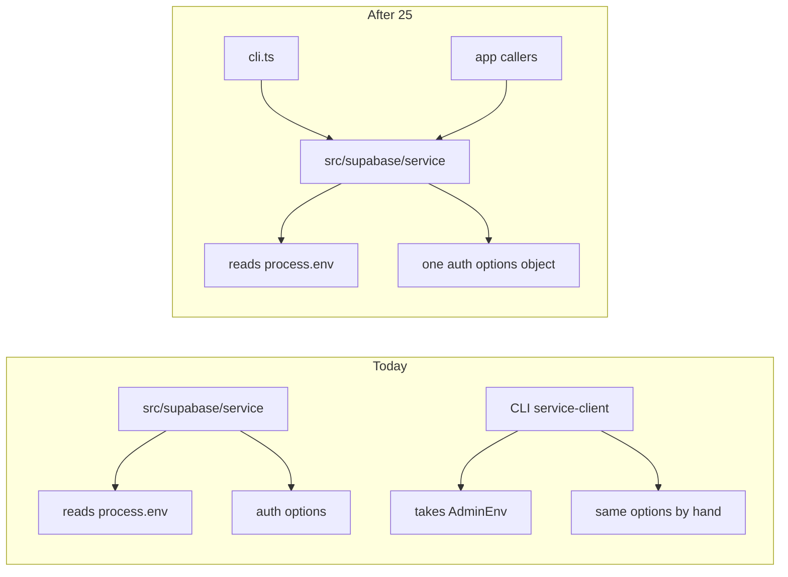

# Chat 25 — one secret-key factory

F151. Privileged path. Own chat because it touches the secret-key client — do not bury it as a hygiene row. Unblocked by nothing in 24’s file collapse; still next in the locked order (`24 → 25`), not a substitute for it. No migrations. Zero intended UX or CLI-output change. Do not commit.

Today two factories build the same secret-key client with the same `{ autoRefreshToken: false, persistSession: false }` object: [src/supabase/service.ts](src/supabase/service.ts) reads env itself; [scripts/admin/lib/service-client.ts](scripts/admin/lib/service-client.ts) takes env as a parameter. Those options have to stay in sync by hand, on the most privileged client in the tree.

## Why delete-and-import, not an optional env argument

The finding offers two fixes. Take the first and go all the way: the CLI factory dies; [scripts/admin/lib/cli.ts](scripts/admin/lib/cli.ts) imports `createServiceClient` from `@/supabase/service` and calls it with no arguments.

- The four CLI scripts already load `.env.local` into `process.env` via `node --env-file=.env.local` in [package.json](package.json) (`promote-admin`, `demote-admin`, `delete-user`, `list-admins`).
- `loadAdminEnv()` still runs first in every command. That is `loadServiceEnvForCli` — the fail-closed CLI reader that prints a missing-var line and `process.exit(1)`. Promote / demote / delete still need `env.supabaseUrl` for the confirmation prompt. `list-admins` has no prompt: call `loadAdminEnv()` without binding the return, then `createServiceClient()`. That bare call is load-bearing, not dead code — without it a missing `SUPABASE_SECRET_KEY` surfaces as `runCliScript`’s “Unexpected error” instead of the `[admin-cli] Missing …` line, so it carries a comment saying so.
- An optional env argument on the shared factory is unused flexibility. The app never passes one; after this change the CLI does not need to either. That is the same class as F148’s unread parameter.
- A one-line CLI wrapper that re-exports the shared factory is the same empty-barrel smell as F150. Delete the file.

Do **not** add `server-only` to [src/supabase/service.ts](src/supabase/service.ts). [logging.mdc](.cursor/rules/logging.mdc) already forbids it so plain-Node CLI can import this module. The ESLint default-deny on `@/supabase/service` is scoped to `src/**` only — [scripts/admin/lib/cli.ts](scripts/admin/lib/cli.ts) is already allowed to import it. Do not add CLI paths to that allowlist.

The shared factory’s signature stays `(): SupabaseClient`. App callers and [src/supabase/service.unit.test.ts](src/supabase/service.unit.test.ts) do not change.

## Precondition

Before editing anything, run `git status` and record the working tree. Do not stash, revert, or clean.

Confirm 24 landed: [TECH_DEBT_AUDIT.md](TECH_DEBT_AUDIT.md) has **F149** and **F179** in § Resolved. If either is still Open, **stop** — this chat is next in the locked batch order (`24 → 25`), not a substitute. 23’s F176 / F178 should already be Resolved; 22 closed F159 into § Accepted without a code change.

Prior chats may still be uncommitted (11’s `tsconfig` / index guards, 10’s dialog host, 12–24, dirty `stat-tile` / logs tiles, `nextjs-agent-rules` in [AGENTS.md](AGENTS.md)). Name those files up front. Touch only this chat’s files plus the F151 audit row, the H1 intro sentence that names F151, the § Verified OK secret-key containment bullet, and the executive-summary claims listed in § Docs.

## F151 — one factory

1. In [scripts/admin/lib/cli.ts](scripts/admin/lib/cli.ts): drop the `./service-client` import; import `createServiceClient` from `@/supabase/service`. All four commands keep `loadAdminEnv()`. The three mutation commands still pass `env.supabaseUrl` into `confirmAction`. Every `createServiceClient(env)` becomes `createServiceClient()`. In `runListAdmins`, where the return is discarded, add a one-line comment above the call naming what it preserves — the fail-closed `[admin-cli] Missing …` line and `process.exit(1)` on a missing var.
2. Delete [scripts/admin/lib/service-client.ts](scripts/admin/lib/service-client.ts).
3. In [scripts/admin/lib/cli.unit.test.ts](scripts/admin/lib/cli.unit.test.ts): point the existing `createServiceClient` mock at `@/supabase/service` instead of `./service-client`. Cases stay the same (not-found exit, cancel, avatar-storage warn). Do not add a “called with no args” assertion.
4. In [vitest.config.ts](vitest.config.ts): delete only the `scripts/admin/lib/service-client.ts` coverage-exclude line. The file is gone; leaving a dangling exclude is the sloppy leftover. [env.ts](scripts/admin/lib/env.ts) and [prompt.ts](scripts/admin/lib/prompt.ts) stay excluded. This is **not** a denominator change — the file was already excluded — so do **not** re-baseline the `scripts/**` floor.

Keep [scripts/admin/lib/env.ts](scripts/admin/lib/env.ts) untouched (that is F150, after this batch).

Pin the auth options on the one remaining factory. In [src/supabase/service.unit.test.ts](src/supabase/service.unit.test.ts), mock `@supabase/supabase-js`’s `createClient` and assert the third argument is `{ auth: { autoRefreshToken: false, persistSession: false } }`. That is the contract the duplicate was the risk for; do not add a second test file.

The mock returns a sentinel object, and the new case asserts `createServiceClient()` returns it — that subsumes the existing `should return a client when env vars are set` case, which asserts `client.auth` is defined and would fail against a mock. Replace that case rather than keeping both; `testing.mdc` § Core Principle rules out a second case covering the same thing. The two missing-env cases throw before `createClient` is reached and stay exactly as they are.

## Out of scope

- **F150** — do not delete `env.ts`; do not trim the `admin-users` barrel
- **F148** — do not drop `mergeDemoteMetadata`’s unread param; do not touch `PublicBannerSlot.initialDismissed` (that is Chat 26)
- **F149 / F179** — do not edit the mutation action files or `run-admin-user-mutation.ts` (that is 24)
- **F145 / F164 / F165 / F115 / F168** — H1 / Chat 26 leftovers
- Do not add an optional env argument to `createServiceClient`
- Do not add `server-only` to `service.ts` or `persist-app-log.ts`
- Do not change `getServiceSupabaseEnv` / `loadServiceEnvForCli` (different fail shapes — throw vs `process.exit` — are load-bearing)
- **AGENTS.md, DESIGN.md, README, SECURITY_AUDIT.md, LEXICON, `/sync-repo-docs`, security.mdc, logging.mdc, supabase.mdc.** W5’s “five server modules” allowlist count stays true (the deny is `src/**` only)
- Do not re-baseline coverage floors
- **Committing and opening a PR.** Do neither
- Do not edit [tmp/tech-debt-quick-fix-chats.md](tmp/tech-debt-quick-fix-chats.md)

## Docs

After both gates are green, in [TECH_DEBT_AUDIT.md](TECH_DEBT_AUDIT.md):

- Move **F151** to § Resolved with today’s date (**2026-08-29**): CLI factory deleted; `cli.ts` imports `createServiceClient` from `@/supabase/service`; auth options have one home; shared factory signature unchanged (no optional env). Note that `AdminEnv` in `scripts/admin/lib/env.ts` now has no importer — `service-client.ts` was its only one — which is F150 territory and not fixed here. Note F150 / F148 were not done here.
- Drop the H1 intro sentence that says F151 was considered for H1 and kept standalone. Leave the rest of that paragraph (the eleven-id list still includes F115 / F168 until 26).
- § Top 5: F151 is not listed. Leave it alone. Do not promote F118 (locked throwaway-page stay-out) or start F150 / F148.
- `## Executive summary` lead bullet (and the header `Scope:` line if it still names Chat 24 as the latest close): rewrite so this chat’s close is the latest close. Same claim in every spot you touch. Both of those spots also end with **“F148 / F151 were not done here”** — F151 is now done, so that clause is stale in both and must change too. Replacing only the leading close leaves a sentence contradicting the row you just moved.
- § Verified OK, **Secret-key containment** bullet. It currently asserts `createServiceClient` is reachable only from `run-admin-user-mutation.ts`. This chat adds `scripts/admin/lib/cli.ts` as a direct caller, so rewrite the bullet to state the containment property that is actually true and mechanically backed: no client-reachable module imports it; the ESLint default-deny plus server allowlist covers `src/**`; `scripts/admin/lib/cli.ts` imports it under plain Node, outside that deny, which is why `server-only` is not on the module. Do **not** enumerate the full `src/` caller set — that is a re-audit, not this chat.
- **Open counts.** After 24 that should be **27**. Closing F151 takes Open to **26** — update both figures in the same edit so the counts match the table. If 24’s close left a different number, count the Open rows and subtract one; do not invent a third figure.
- `Last synced:` stays **2026-08-29**.

## Quality bar

- Targeted: `CI=true pnpm type-check` and `pnpm test:file -- src/supabase/service.unit.test.ts scripts/admin/lib/cli.unit.test.ts`
- Then: `CI=true pnpm pre-push` (a bare `pnpm pre-push` aborts in a non-TTY agent shell)
- Grep: zero files named `service-client.ts`; `cli.ts` imports from `@/supabase/service` and calls `createServiceClient()` with no arguments; `loadAdminEnv` still appears in all four commands; `env.ts` still exists and still re-exports `loadServiceEnvForCli`; `createServiceClient` in `service.ts` still takes no parameters; the factory test asserts the auth-options object; `vitest.config.ts` no longer lists `service-client.ts` and the `scripts/**` floors are unchanged; zero edits in `admin-user-mutations.ts`, `run-admin-user-mutation.ts`, or `scripts/admin/lib/env.ts`
- **If any gate fails on files this chat did not touch** (including coverage floors, and anything from the uncommitted prior chats named in § Precondition): stop and report. Do not fix it here.

## Manual test checklist

Not a UI change — no browser pass. Existing unit tests cover missing-env throws and the delete-user CLI branches; this is the sanity pass that the factory move did not change CLI behavior.

- `pnpm list-admins` still lists (or prints “no admins found”) with the same copy as today. A blank or absent `SUPABASE_SECRET_KEY` in `.env.local` still exits with the existing `[admin-cli] Missing …` line, not an “Unexpected error” from the shared factory throw. (Test it by blanking the var, not by removing the file — `node --env-file=.env.local` fails before any script code runs when the file is absent.)
- Confirm `scripts/admin/lib/service-client.ts` is gone from the tree.
- `pnpm type-check` is clean.
- Do not run promote / demote / delete against the linked project as part of this chat.
