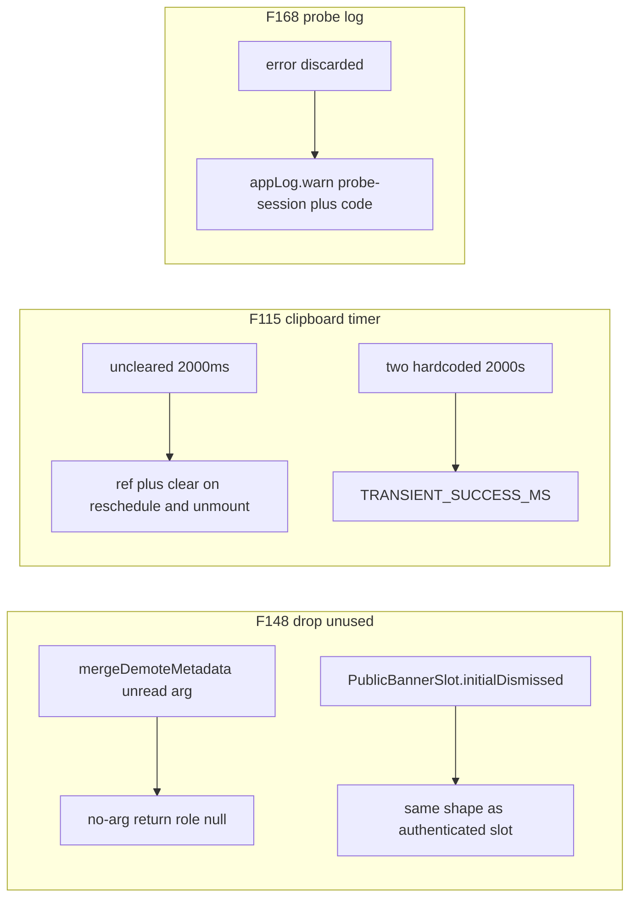

# Chat 26 — three small leftovers the last hoist left hanging

F148 + F115 + F168. Confirmed S-effort, independent, all fork-kept. Classic Chat 19 shape. Pulls the two real small misses out of H1 so leftover hygiene after this batch is mechanical only. No migrations. Do not commit.

## Precondition

Before editing anything, run `git status` and record the working tree. Do not stash, revert, or clean.

Confirm 25 landed: [TECH_DEBT_AUDIT.md](TECH_DEBT_AUDIT.md) has **F151** in § Resolved. If it is still Open, **stop** — this chat is next in the locked batch order (`25 → 26`), not a substitute. 24’s F149 / F179 and 23’s F176 / F178 should already be Resolved; 22 closed F159 into § Accepted without a code change.

Prior chats may still be uncommitted (11’s `tsconfig` / index guards, 10’s dialog host, 12–25, dirty `stat-tile` / logs tiles, `nextjs-agent-rules` in [AGENTS.md](AGENTS.md)). Name those files up front. Touch only this chat’s files plus the F148 / F115 / F168 audit rows, the H1 intro list, the F158 Accepted description (vestigial-prop clause only), and the executive-summary claims listed in § Docs.

## F148 — drop the unread parameter and the unreachable prop

Two independent deletions in one finding. Do both. Do **not** extract the slot pair (F158).

**`mergeDemoteMetadata`.** The body always returns `{ role: null }`. The `_existing` parameter exists only for shape symmetry with `mergePromoteMetadata` and implies a merge that does not happen. Keep the existing shallow-merge comment.

In [src/utils/admin-user-mutations.ts](src/utils/admin-user-mutations.ts): drop the parameter so the function takes no arguments. In `demoteUserById`, call `mergeDemoteMetadata()` with no argument.

Production has **one** caller (`demoteUserById`). The CLI barrel in [scripts/admin/lib/admin-users.ts](scripts/admin/lib/admin-users.ts) re-exports the helper but does not call it — that barrel is F150. Do not trim it. Do not invent a second caller.

In [src/utils/admin-user-mutations.unit.test.ts](src/utils/admin-user-mutations.unit.test.ts): the existing case passes `{ role: ADMIN_ROLE, org: 'acme' }` to prove extra keys are dropped. After the parameter is gone, call `mergeDemoteMetadata()` and still assert `{ role: null }`. The comment on the function remains the pin for why this is not a spread-merge.

**`PublicBannerSlot.initialDismissed`.** The only production caller ([src/components/public-banner-slot-entry.tsx](src/components/public-banner-slot-entry.tsx)) never passes it — dismissed banners are filtered server-side. [AuthenticatedBannerSlot](src/components/authenticated-banner-slot.tsx) already omits the prop.

In [src/components/public-banner-slot.tsx](src/components/public-banner-slot.tsx): delete the prop from the interface and the destructure. `useState(false)` matches the authenticated slot. Do not add a shared slot component.

In [src/components/public-banner-slot.unit.test.tsx](src/components/public-banner-slot.unit.test.tsx): delete the `should render nothing when initialDismissed is true` case. Keep the three remaining cases (cookie persist, headline/detail change, persistent banner).

## F115 — hold the timeout; one 2000ms constant

[src/hooks/use-copy-to-clipboard.ts](src/hooks/use-copy-to-clipboard.ts) never clears the reset timer. Unmount inside the window still fires `setDidCopy`; a second click stacks timers and the first clears the indicator early. [src/components/field-save-indicator.tsx](src/components/field-save-indicator.tsx) already does this correctly with an effect cleanup — and hardcodes the same 2000ms.

**Hook.** Hold the timeout id in a ref. Clear it before scheduling a new one and on unmount (cleanup effect). Do not also clear on the `catch` path — the finding names reschedule and unmount only. Keep the existing `try` / `catch` and return shape `{ didCopy, copy }`.

**Constant.** New [src/constants/transient-feedback.ts](src/constants/transient-feedback.ts) exporting `TRANSIENT_SUCCESS_MS = 2000`. Both the hook and `field-save-indicator` import it. A one-constant file matches [src/constants/admin-role.ts](src/constants/admin-role.ts). Do **not** export the number from the hook (the indicator must not import a clipboard hook) or from the indicator (the hook must not import a component). Do **not** touch the 2000ms toast delay on `/reference` (throwaway page).

**Test.** No hook test exists today. Add [src/hooks/use-copy-to-clipboard.unit.test.ts](src/hooks/use-copy-to-clipboard.unit.test.ts) with fake timers, `renderHook` from `@/test/test-utils` (same setup as [use-debounced-value.unit.test.ts](src/hooks/use-debounced-value.unit.test.ts)), and `navigator.clipboard.writeText` mocked at the boundary. Three cases:

1. Copy sets `didCopy` true, then false after `TRANSIENT_SUCCESS_MS`.
2. A second copy before the window ends does not clear early (first timer cancelled).
3. Unmount before the window ends does not throw (timer cleared).

Do not add a `field-save-indicator` test — swapping a literal there does not change behavior.

## F168 — log the discarded probe error

[src/app/(app)/_lib/profile/probe-session-action.ts](src/app/(app)/_lib/profile/probe-session-action.ts) destructures `error` and then ignores it. A failed `getUser()` and a genuinely absent session both return `{ success: false }`, so avatar retry shows “sign in again” with no server-side trace.

Split the combined `if (error || !user)`:

- On `error`: `appLog.warn('probe-session', 'Session probe failed', { supabaseCode: error.code })`, then `{ success: false }`.
- On `!user` with no error: return `{ success: false }` with no log. Genuine absence is not a failed auth call.
- On user present: `{ success: true }` unchanged.

Tag is `probe-session`. Level is **warn** (finding is explicit; a failed probe that still returns a typed `false` is a failed sub-operation, not a thrown fault). Context matches [src/app/auth/confirm/route.ts](src/app/auth/confirm/route.ts): `{ supabaseCode: error.code }`, not the raw error object and not a user id. This is a deliberate read of [error-handling.mdc](.cursor/rules/error-handling.mdc) § Database Errors (`{ supabaseCode: error.code }`, no raw PII) over [logging.mdc](.cursor/rules/logging.mdc) § Tag Convention (“passes the error object as the context argument”) — do not “correct” it to the error object. `AuthError` carries `code` and `status` as own properties, but `normalizeLogContext` in `persist-app-log.ts` keeps only `name` / `message` / `stack` from an `Error` — so passing the raw error drops the code. Do not “fix” `normalizeLogContext`; it is out of scope here. Return type `ProbeSessionResult` does not change. Do not edit [use-profile-avatar-upload.ts](src/app/(app)/_lib/profile/use-profile-avatar-upload.ts).

**Allowlist.** `appLog` is default-denied on `src/**`. [src/app/(app)/_lib/profile/actions.ts](src/app/(app)/_lib/profile/actions.ts) is already on the ignore list in [eslint.config.mjs](eslint.config.mjs); this sibling is not. Add `src/app/(app)/_lib/profile/probe-session-action.ts` next to `profile/actions.ts` on that same `appLog` / persist / service deny ignore list. [eslint.config.unit.test.ts](eslint.config.unit.test.ts) pins the boundary fixture, not the allowlist membership — do not add a membership assertion. Do not edit [logging.mdc](.cursor/rules/logging.mdc) (it points at the config file, not a file list).

**Test.** Mock `@/utils/app-logger` the same way [actions.unit.test.ts](src/app/(app)/_lib/profile/actions.unit.test.ts) does. Update the existing error-case mock so the error has a `code` (the current `new Error('invalid session')` has none). Assert `appLog.warn` is called with `'probe-session'` and `{ supabaseCode }` on the error branch, and is **not** called when `user` is null with `error: null`. Success and both failure return shapes stay exactly as they are.

## Out of scope

- **F158** — do not extract the public / authenticated slot pair. Two copies stay under the extract threshold. Promote only if they drift again after this chat.
- **F150 / F145 / F164 / F165 / F172 / F184** — remaining H1; after this batch
- **F118 / F155 / F177 / F152 / F117 / F163 / F171 / F173** — throwaway-page or extract-threshold stay-outs
- Do not add an unused `existing` spread back onto `mergeDemoteMetadata`
- Do not change `ProbeSessionResult` or the avatar-upload retry UX
- Do not add `server-only` to `app-logger.ts` / `persist-app-log.ts` / `service.ts`
- **AGENTS.md, DESIGN.md, README, SECURITY_AUDIT.md, LEXICON, `/sync-repo-docs`, logging.mdc, error-handling.mdc, security.mdc.** The eslint allowlist line is the only config edit.
- Do not re-baseline coverage floors
- **Committing and opening a PR.** Do neither
- Do not edit [tmp/tech-debt-quick-fix-chats.md](tmp/tech-debt-quick-fix-chats.md)

## Docs

After both gates are green, in [TECH_DEBT_AUDIT.md](TECH_DEBT_AUDIT.md):

- Move **F148**, **F115**, and **F168** to § Resolved with today’s date (**2026-08-29**): `mergeDemoteMetadata` takes no arguments; `PublicBannerSlot.initialDismissed` and its unreachable-branch test are gone; copy-to-clipboard holds and clears the timeout; `TRANSIENT_SUCCESS_MS` is shared with `field-save-indicator`; failed session probe logs `appLog.warn` with tag `probe-session` and `supabaseCode`; return shape unchanged; probe file added to the `appLog` allowlist. Note F158 / F150 / F145 / F164 were not done here.
- **H1 intro.** Drop F115 and F168 from the id list. Remaining nine: F145, F150, F163, F164, F165, F171, F172, F173, F184. The paragraph states the batch size twice in prose (“eleven `Do next` rows share one home”, “the gate is accumulation, and at eleven it is met”) — update both so the count matches the nine-id list; the gate fired at eleven and nine remain. Do not restructure into H1a / H1b. Do not drop the throwaway-page members from this paragraph (that filter is the after-batch split).
- **F158 Accepted row.** Two columns. In Description, delete the “vestigial `initialDismissed`” clause so the row does not claim a drift that this chat removed. In Reopen when, replace the whole cell — currently “A third banner surface appears. Flagging now because the pair **has already drifted** once (`initialDismissed`, tracked as F148) — if it drifts again before a third surface, promote this to Open.” — with exactly: `A third banner surface appears, or the pair drifts again.` Leave the row Accepted.
- § Top 5: none of these three are listed. Leave it alone. Do not promote F118 (locked throwaway-page stay-out).
- `## Executive summary` lead bullet (and the header `Scope:` line if it still names Chat 25 as the latest close): rewrite so this chat’s close is the latest close. Same claim in every spot you touch. If 25 left a “F148 was not done here” clause on those spots, that clause is now stale and must change too.
- F180 / F149 / F179 Resolved notes that say F148 was not done there — leave those historical sentences.
- **Open counts.** After 25 that should be **26**. Closing three takes Open to **23** — update both figures in the same edit so the counts match the table. If 25’s close left a different number, count the Open rows and subtract three; do not invent a third figure.
- `Last synced:` stays **2026-08-29**.

## Quality bar

- Targeted: `CI=true pnpm type-check` and `pnpm test:file -- src/utils/admin-user-mutations.unit.test.ts src/components/public-banner-slot.unit.test.tsx src/hooks/use-copy-to-clipboard.unit.test.ts src/app/(app)/_lib/profile/probe-session-action.unit.test.ts`
- Then: `CI=true pnpm pre-push` (a bare `pnpm pre-push` aborts in a non-TTY agent shell)
- Grep: `mergeDemoteMetadata` takes no parameters and is called with no arguments; zero `initialDismissed` in `src/`; zero `2000` in `use-copy-to-clipboard.ts` and `field-save-indicator.tsx`; both import `TRANSIENT_SUCCESS_MS`; `probe-session-action.ts` calls `appLog.warn` with `'probe-session'` and is listed in the eslint `appLog` ignore list; `ProbeSessionResult` still has only `{ success: true } | { success: false }`; zero edits in `authenticated-banner-slot.tsx`, `use-profile-avatar-upload.ts`, `scripts/admin/lib/env.ts`, or `admin-users.ts`
- **If any gate fails on files this chat did not touch** (including coverage floors, and anything from the uncommitted prior chats named in § Precondition): stop and report. Do not fix it here.

## Manual test checklist

F115 is the user-visible change — confirm the copy indicator, not just a screenshot. F148 and F168 should look the same as today.

- Signed in, `/admin/logs` or any `ErrorPanel`: click Copy — the Copied state holds about two seconds then clears. Click Copy twice quickly — it does not flash off early. Navigate away while Copied is showing — no console error.
- Profile settings: blur-save a field — the Saved tick still holds about two seconds (constant swap only).
- Logged out, marketing banner on: dismiss it. Cookie still sticks. No `initialDismissed` behavior to exercise — the loader still filters dismissed banners server-side.
- Admin users: demote a non-self admin, then promote them back. Toasts and row state match today.
- Avatar upload session-recovery path: a failed probe still shows the existing “sign in again” copy. New: the server log has `[probe-session]` and a Supabase code. Do not force this against the linked project unless a stale session is already easy to reproduce.
- `pnpm type-check` is clean.
