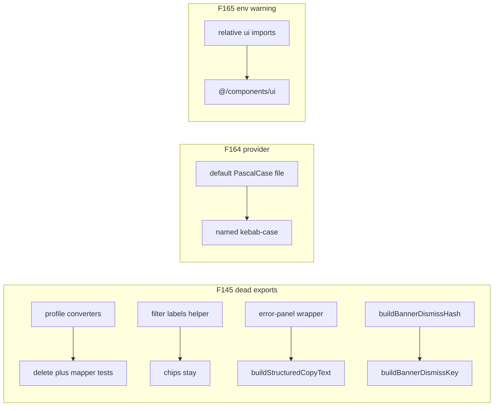

# Chat 27 — dead exports and import style

F145 + F164 + F165. Three Low / S items on kept surfaces. F145 is one finding that happens to touch several files; F164 and F165 are single-consumer nits in the same family. No migrations. Zero intended UX change. Do not commit.

## Precondition

Before editing anything, run `git status` and record the working tree. Do not stash, revert, or clean.

Confirm 26 landed: [TECH_DEBT_AUDIT.md](TECH_DEBT_AUDIT.md) has **F148**, **F115**, and **F168** in § Resolved. If any is still Open, **stop** — this chat is next in the locked batch order (`26 → 27`), not a substitute. 25’s F151 and 24’s F149 / F179 should already be Resolved; 22 closed F159 into § Accepted without a code change.

Prior chats may still be uncommitted (11’s `tsconfig` / index guards, 10’s dialog host, 12–26, dirty `stat-tile` / logs tiles, `nextjs-agent-rules` in [AGENTS.md](AGENTS.md)). Name those files up front. Touch only this chat’s files plus the F145 / F164 / F165 audit rows, the H1 intro list, the `react-tanstack-query.mdc` glob (F164 rename), the matching one-liner in [`.cursor/rules/README.md`](.cursor/rules/README.md), and the executive-summary claims listed in § Docs.

## F145 — delete dead and duplicate exports

One finding, several files. Do every item. Do not invent a shared “hygiene” helper.

**Profile converters.** [src/app/(app)/_lib/profile/profile-form-schema.ts](src/app/(app)/_lib/profile/profile-form-schema.ts) exports `toProfileFormValues` and `toProfileFormInput`. Production does the same null-vs-empty conversion inline; the server action uses the shared profile helpers. Delete both functions. Keep the schemas and `parseProfilePartialInput`.

In [src/app/(app)/_lib/profile/profile-form-schema.unit.test.ts](src/app/(app)/_lib/profile/profile-form-schema.unit.test.ts): delete the `profile form mappers` describe (both cases) and those two imports. Keep every `parseProfilePartialInput` case.

**Filter labels.** [src/app/admin/users/_lib/user-list-filters.ts](src/app/admin/users/_lib/user-list-filters.ts) `buildUserListFilterLabels` maps chips to labels and has no production caller. Delete the function. Keep `buildUserListFilterChips` and `hasActiveUserListFilters`.

In [src/app/admin/users/_lib/user-list-filters.unit.test.ts](src/app/admin/users/_lib/user-list-filters.unit.test.ts): delete the `buildUserListFilterLabels` describe (both cases). The chips describe already pins the same labels and the truncate.

**Error-panel wrapper.** [src/components/error-panel.tsx](src/components/error-panel.tsx) `buildErrorCopyText` is a pure pass-through to `buildStructuredCopyText`. Delete the wrapper and `BuildErrorCopyTextParams`. `ErrorPanel` calls `buildStructuredCopyText({ message, code, digest })` directly. Keep the existing `buildStructuredCopyText` import.

In [src/components/error-panel.unit.test.tsx](src/components/error-panel.unit.test.tsx): delete the entire `buildErrorCopyText` describe (four cases). Those cases already live on [src/utils/build-structured-copy-text.unit.test.ts](src/utils/build-structured-copy-text.unit.test.ts). Keep the three `ErrorPanel` cases. Do not add a structured-copy-text import to this file.

**Banner preview helper.** [src/app/admin/settings/_components/banner-setting-row.tsx](src/app/admin/settings/_components/banner-setting-row.tsx) `hasBannerPreviewContent` is used only inside the same file. Drop `export`. Do not move or rename it.

**Dismiss-hash alias.** [src/utils/banner-dismiss-hash.ts](src/utils/banner-dismiss-hash.ts) implements the hash as `buildBannerDismissHash` and aliases `buildBannerDismissKey`. Production and tests already call `buildBannerDismissKey`. Fold the body onto `buildBannerDismissKey` and delete the `buildBannerDismissHash` name. Do not change the algorithm. Cookie helper and slot tests need no import change.

**Unused env export.** [src/utils/env.ts](src/utils/env.ts) `getSupabaseUrlOptional` is used only by `getSupabaseOrigin` and `getSupabaseProjectRef` in the same file. Drop `export`. Keep the function. [src/utils/env-supabase-helpers.unit.test.ts](src/utils/env-supabase-helpers.unit.test.ts) already tests those two callers — do not add a test for the now-private helper.

**Duplicate sitemap export.** [src/utils/sitemap-routes.ts](src/utils/sitemap-routes.ts) exports both `buildSitemapEntries` and `export default buildSitemapEntries`. Keep the named export. Delete the default. [src/app/sitemap.ts](src/app/sitemap.ts) currently default-imports it — switch that file to a named import and keep `export default buildSitemapEntries` on the route file (Next requires the route default). [src/utils/sitemap-routes.unit.test.ts](src/utils/sitemap-routes.unit.test.ts) already uses the named export.

## F164 — named export, kebab-case file

[src/providers/ReactQueryProvider.tsx](src/providers/ReactQueryProvider.tsx) is a default export in a two-file directory whose other file ([src/providers/react-query-devtools.tsx](src/providers/react-query-devtools.tsx)) already uses a named export. Filename is PascalCase; everything else in the audited scope is kebab-case.

- Rename the file to `src/providers/react-query-provider.tsx`.
- Change `export default ReactQueryProvider` to a named `export const ReactQueryProvider`.
- Leave the `QueryClient` construction and defaults exactly as they are.
- In [src/app/layout.tsx](src/app/layout.tsx): `import { ReactQueryProvider } from '@/providers/react-query-provider'`. That is the only production consumer. [src/test/test-utils.tsx](src/test/test-utils.tsx) builds its own `QueryClientProvider` — do not touch it.

**Rule glob.** [`.cursor/rules/react-tanstack-query.mdc`](.cursor/rules/react-tanstack-query.mdc) frontmatter `globs` names `src/providers/ReactQueryProvider.tsx`, and two body bullets cite that path. Update those three strings to `src/providers/react-query-provider.tsx`. Read [rule-authoring](.cursor/skills/rule-authoring/SKILL.md) before that edit. In [`.cursor/rules/README.md`](.cursor/rules/README.md) the Applies-to line that says `ReactQueryProvider.tsx` becomes `react-query-provider.tsx`. Do not run `/sync-repo-docs`. Do not edit [RULE_AUDIT.md](RULE_AUDIT.md) or [testing.mdc](.cursor/rules/testing.mdc) (those name the component, not the file).

## F165 — alias imports, plain attributes

[src/components/env-var-warning.tsx](src/components/env-var-warning.tsx) is the only shared-component file that imports UI primitives by relative path and the only user of `variant={'outline'}`.

- `import { Badge } from '@/components/ui/badge'`
- `import { Button } from '@/components/ui/button'`
- `variant="outline"` and `variant="default"` (plain strings).

Leave `export function EnvVarWarning` as a function. Do not restyle. [src/components/env-var-warning.unit.test.tsx](src/components/env-var-warning.unit.test.tsx) and [src/app/(marketing)/_components/landing-auth-buttons.tsx](src/app/(marketing)/_components/landing-auth-buttons.tsx) need no change.

## Out of scope

- **F150 / F172 / F184** — Chat 28
- **F158** — do not extract the banner-slot pair
- **F118 / F177 / F155 / F152 / F117 / F163 / F171 / F173** — throwaway-page or extract-threshold stay-outs
- Do not delete `parseProfilePartialInput` or `profileFormInputSchema`
- Do not extract `hasBannerPreviewContent` or change the preview condition
- Do not change `QueryClient` defaults
- **AGENTS.md, DESIGN.md, README, SECURITY_AUDIT.md, LEXICON, `/sync-repo-docs`.** The `react-tanstack-query.mdc` glob plus the README Applies-to line are the only rule edits.
- Do not re-baseline coverage floors
- **Committing and opening a PR.** Do neither
- Do not edit [tmp/tech-debt-quick-fix-chats.md](tmp/tech-debt-quick-fix-chats.md)

## Docs

After both gates are green, in [TECH_DEBT_AUDIT.md](TECH_DEBT_AUDIT.md):

- Move **F145**, **F164**, and **F165** to § Resolved with today’s date (**2026-08-29**): unused profile converters and `buildUserListFilterLabels` plus their test blocks are gone; `ErrorPanel` calls `buildStructuredCopyText` directly; `hasBannerPreviewContent` is file-private; `buildBannerDismissKey` is the only public name; `getSupabaseUrlOptional` is no longer exported; sitemap helper is named-export only; `ReactQueryProvider` is a named export in `react-query-provider.tsx`; `env-var-warning` uses alias imports and plain string attributes. Note F150 / F172 / F184 were not done here.
- **H1 intro.** Drop F145, F164, and F165 from the id list. Remaining six: F150, F163, F171, F172, F173, F184. Update the “nine `Do next` rows” phrasing so the count matches the six-id list. Correct the “a twelve-file no-behavior-change commit” figure in the same paragraph — it counts the nine-member batch, not the remaining six. Leave the “gate is accumulation, and at eleven it is met” sentence — that is when the gate fired. Do not restructure into H1a / H1b. Do not drop the throwaway-page members from this paragraph.
- § Top 5: none of these three are listed. Leave it alone. Do not promote F118 (locked throwaway-page stay-out).
- **`## Executive summary` bullet 1** (the “This sync (2026-08-29): no Open movement” bullet). Closing three rows falsifies it. Rewrite it so it reports this chat’s close instead of a verify-only pass — no “no Open movement” claim, no “all N Open rows still match the cited code” claim.
- **`## Executive summary` bullet 2** (the “Latest close (same day): F148 / F115 / F168” bullet). Rewrite so this chat’s close is the latest close.
- **Header `Scope:` line.** It carries the same two claims as bullets 1 and 2 — the verify-only / “no closures” sentence and the latest-close sentence. Update both. Same claim in every spot you touch. If 26 left a “F145 / F164 were not done here” clause on those spots, that clause is now stale and must change too.
- F148 / F115 / F168 Resolved notes that say F145 / F164 were not done there — leave those historical sentences.
- **Open counts.** After 26 that should be **23**. Closing three takes Open to **20**. There are **four** Open-count figures, not two — update all of them in the same edit so they match the table: the header `Scope:` line twice (“all 23 Open rows still match the cited code” and the closing “23 Open remain”), executive-summary bullet 1 (“All 23 Open rows”), and executive-summary bullet 2 (“23 Open remain”). If 26’s close left a different number, count the Open rows and subtract three; do not invent a third figure.
- `Last synced:` stays **2026-08-29**.

## Quality bar

- Targeted: `CI=true pnpm type-check` and `pnpm test:file -- src/app/(app)/_lib/profile/profile-form-schema.unit.test.ts src/app/admin/users/_lib/user-list-filters.unit.test.ts src/components/error-panel.unit.test.tsx src/utils/sitemap-routes.unit.test.ts src/utils/env-supabase-helpers.unit.test.ts src/components/env-var-warning.unit.test.tsx`
- Then: `CI=true pnpm pre-push` (a bare `pnpm pre-push` aborts in a non-TTY agent shell)
- Grep: zero `toProfileFormValues` / `toProfileFormInput` / `buildUserListFilterLabels` / `buildErrorCopyText` / `buildBannerDismissHash`; `hasBannerPreviewContent` is not exported; `getSupabaseUrlOptional` is not exported; `sitemap-routes.ts` has no default export; `src/app/sitemap.ts` named-imports `buildSitemapEntries`; zero files named `ReactQueryProvider.tsx`; layout imports `{ ReactQueryProvider }` from `@/providers/react-query-provider`; `env-var-warning.tsx` has zero relative `./ui/` imports and zero `variant={'…'}`; `react-tanstack-query.mdc` glob names `react-query-provider.tsx`; zero edits in `scripts/admin/lib/env.ts`, `use-mobile.ts`, or `use-profile-avatar-upload.ts`
- **If any gate fails on files this chat did not touch** (including coverage floors, and anything from the uncommitted prior chats named in § Precondition): stop and report. Do not fix it here.
- **If the coverage gate fails on files this chat did touch** — deleting covered functions and their test blocks lowers the global percentage — stop and report. Do not re-baseline the floors, do not add filler tests, and do not restore a deleted function to recover coverage.

## Manual test checklist

No intended UX change. Confirm the surfaces still work; do not hunt for new behavior.

- Signed in, `/home`: open profile, blur-save display name — still saves. Avatar upload still works.
- `/admin/users`: filter chips still render and clear. Error-panel Copy on a list fault still copies JSON and shows Copied.
- `/admin/settings`: a saved banner with a headline still shows the preview under the accordion.
- Logged-out landing: Sign in / Sign up still render when env is present. (Do not blank `.env.local` just to see `EnvVarWarning`.)
- App still hydrates — admin users or logs table still fetches. That is the provider rename.
- `/sitemap.xml` still returns the marketing routes. No test covers the route file, only the named helper.
- `pnpm type-check` is clean.
