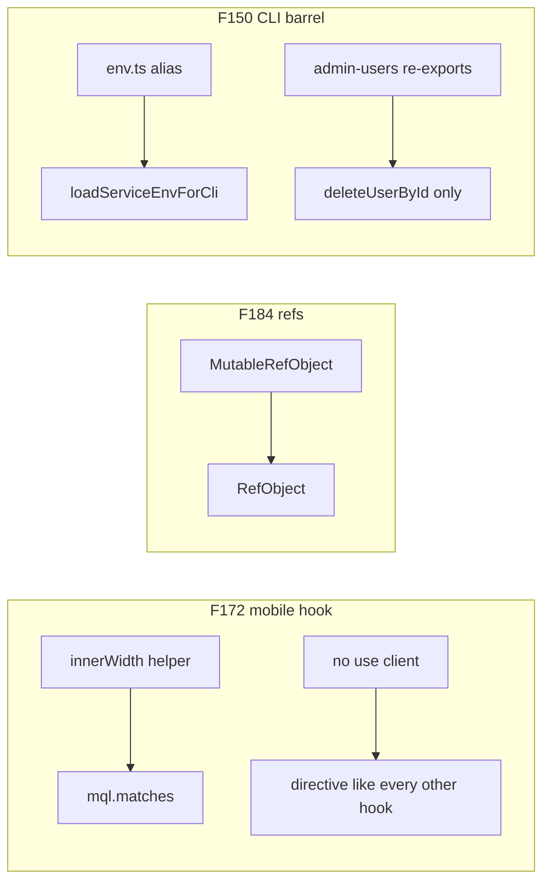

# Chat 28 — hook types + CLI barrel

F172 + F184 + F150. Three leftover nits Chat 25 and the hook layer left hanging. All one-file (plus the tests that pin them). No migrations. Zero intended UX or CLI-output change. Do not commit.

## Precondition

Before editing anything, run `git status` and record the working tree. Do not stash, revert, or clean.

Confirm 27 landed: [TECH_DEBT_AUDIT.md](TECH_DEBT_AUDIT.md) has **F145**, **F164**, and **F165** in § Resolved. If any is still Open, **stop** — this chat is next in the locked batch order (`27 → 28`), not a substitute. 26’s F148 / F115 / F168 should already be Resolved.

Prior chats may still be uncommitted (11’s `tsconfig` / index guards, 10’s dialog host, 12–27, dirty `stat-tile` / logs tiles, `nextjs-agent-rules` in [AGENTS.md](AGENTS.md)). Name those files up front. Touch only this chat’s files plus the F172 / F184 / F150 audit rows, the H1 intro list, the `vitest.config.ts` `env.ts` coverage-exclude line, and the executive-summary claims listed in § Docs.

## F172 — directive + `matches`

[src/hooks/use-mobile.ts](src/hooks/use-mobile.ts) is the only hook in `src/hooks/` without `'use client'` (every other file in that folder has it — ten of them as of this chat). It works today only because every importer is already a client module. The change handler reads `window.innerWidth` through `getIsMobile` while the media query is already `(max-width: 767px)`, so the breakpoint is expressed twice.

- Add `'use client'` as the first line.
- Delete `getIsMobile`.
- In the `change` handler (and the initial `onChange()` call), `setIsMobile(mql.matches)`.
- Keep `MOBILE_BREAKPOINT = 768` and the query string `` `(max-width: ${MOBILE_BREAKPOINT - 1}px)` ``. Keep the initial `useState(false)` so SSR markup still matches hydration.

**Test.** [src/hooks/use-mobile.unit.test.ts](src/hooks/use-mobile.unit.test.ts) stubs `innerWidth` and then expects the handler to read it. After this change that stub is dead and the second case is wrong — `matches` on the mock stays `false` unless you update it.

- First case: drop the `innerWidth` stub. `createMatchMedia(true)` is enough.
- Second case: hold the media-query object, set `matches` to `true` on it, then fire the stored change handler. Do not update `innerWidth` and expect the hook to notice.

Do not add a third case. Sidebar ([src/components/ui/sidebar/sidebar-provider.tsx](src/components/ui/sidebar/sidebar-provider.tsx)) is the only production caller — do not edit it.

## F184 — `RefObject`

[src/app/(app)/_lib/profile/use-profile-avatar-upload.ts](src/app/(app)/_lib/profile/use-profile-avatar-upload.ts) types `inFlightRef` and `lastSavedRef` as `React.MutableRefObject`. That type is deprecated in the React 19 definitions this project pins, and it is the only remaining use in the tree. [src/hooks/use-blur-save-field.ts](src/hooks/use-blur-save-field.ts) already returns those refs from `useRef` (React 19 `RefObject`, `current` writable).

Change both option fields to `React.RefObject<…>` with the same type arguments they have today. Do not add a `react` default import if `React.` already resolves (it does today). Do not edit the blur-save hook or [src/app/(app)/_components/profile/profile-settings-form.tsx](src/app/(app)/_components/profile/profile-settings-form.tsx). No new test — this is a type-only change; `pnpm type-check` is the pin.

## F150 — delete the CLI env barrel

Two shallow modules. Do both.

**`env.ts`.** [scripts/admin/lib/env.ts](scripts/admin/lib/env.ts) is a type alias plus a one-line re-export of `loadServiceEnvForCli`. Delete the file.

In [scripts/admin/lib/cli.ts](scripts/admin/lib/cli.ts): drop `import { loadAdminEnv } from './env'`; import `loadServiceEnvForCli` from `@/utils/env`. Every `loadAdminEnv()` becomes `loadServiceEnvForCli()`. The three mutation commands still bind the return for `env.supabaseUrl` in `confirmAction`. `runListAdmins` still calls it without binding — update the existing comment so it names `loadServiceEnvForCli`, not `loadAdminEnv`. `AdminEnv` dies with the file; do not re-declare it.

In [scripts/admin/lib/cli.unit.test.ts](scripts/admin/lib/cli.unit.test.ts): point the mock at `@/utils/env` (`loadServiceEnvForCli` → the existing hoisted fn). Cases stay the same. Rename the hoisted fn to `mockLoadServiceEnv` if you touch those lines anyway; do not add a “called with no args” assertion.

In [vitest.config.ts](vitest.config.ts): delete only the `scripts/admin/lib/env.ts` coverage-exclude line. The file is gone; leaving a dangling exclude is the sloppy leftover. This is **not** a denominator change — the file was already excluded — so do **not** re-baseline the `scripts/**` floor. [scripts/admin/lib/prompt.ts](scripts/admin/lib/prompt.ts) stays excluded.

**`admin-users` barrel.** [scripts/admin/lib/admin-users.ts](scripts/admin/lib/admin-users.ts) re-exports `ADMIN_ROLE`, both merge helpers, and both role mutations; none of those have an importer going through this file. `cli.ts` genuinely imports `deleteUserById` from here. `isUserAdmin` is a pure rename of `isAdminFromAppMetadata`, which this file already imports and [src/utils/admin.unit.test.ts](src/utils/admin.unit.test.ts) already tests.

- Keep the `deleteUserById` re-export. Keep the file’s own functions (`findUserByEmail`, `promoteUser`, `demoteUser`, `listAdminUsers`, `deleteUserAvatarStorage`).
- Delete the `export { ADMIN_ROLE }` line, and narrow the `export { … } from '@/utils/admin-user-mutations'` block to `deleteUserById` alone — `demoteUserById`, `mergeDemoteMetadata`, `mergePromoteMetadata`, and `promoteUserById` come off it.
- Of those four, only `promoteUserById` and `demoteUserById` stay as **imports** — `promoteUser` / `demoteUser` call them, and both are already in the top import block. The two merge helpers are **not** imported today and nothing in this file calls them: do not add imports for them.
- Delete the now-dead top-level imports too. `ADMIN_ROLE` and `deleteUserById` are each imported at the top and never referenced in the file body — the `export { … } from …` statements do not consume those bindings. Both imports go; the `deleteUserById` re-export stays.
- Delete `export const isUserAdmin = isAdminFromAppMetadata`. In `listAdminUsers`, call `isAdminFromAppMetadata` directly (already imported).
- In [scripts/admin/lib/admin-users.unit.test.ts](scripts/admin/lib/admin-users.unit.test.ts): delete the `isUserAdmin` describe **and** drop `isUserAdmin` from that file’s import block — leaving the import fails `type-check` once the export is gone. Keep promote / demote / list cases; `ADMIN_ROLE` is still used there.

Do not change `findUserByEmail` paging (F124, Accepted). Do not add a `// debt:` marker on the users RPC (F185 — see hard stop).

## Out of scope

- **F174** — `is-main` extract waits for the next `scripts/checks/` phase
- **F185** — do not edit an applied migration to add the missing `// debt:` marker. Applied migrations are not rewritten as a rule; a comment-only edit is a judgment call, not this finding
- **F118 / F177 / F155 / F152 / F117 / F163 / F171 / F173** — throwaway-page or extract-threshold stay-outs
- **F158** — do not extract the banner-slot pair
- Do not change `MOBILE_BREAKPOINT` or the sidebar
- Do not add `server-only` to `env.ts` / `service.ts`
- Do not change `getServiceSupabaseEnv` / `loadServiceEnvForCli` fail shapes
- **AGENTS.md, DESIGN.md, README, SECURITY_AUDIT.md, LEXICON, `/sync-repo-docs`.** No rule edits in this chat.
- Do not re-baseline coverage floors
- **Committing and opening a PR.** Do neither
- Do not edit [tmp/tech-debt-quick-fix-chats.md](tmp/tech-debt-quick-fix-chats.md)

## Docs

After both gates are green, in [TECH_DEBT_AUDIT.md](TECH_DEBT_AUDIT.md):

- Move **F172**, **F184**, and **F150** to § Resolved with today’s date (**2026-08-29**): `use-mobile` has `'use client'` and reads `matches`; avatar-upload options use `RefObject`; `scripts/admin/lib/env.ts` is gone; `cli.ts` imports `loadServiceEnvForCli` from `@/utils/env`; `admin-users` re-exports only `deleteUserById`; `isUserAdmin` alias is gone. Note F174 / F185 were not done here.
- **H1 intro.** Drop F172, F184, and F150 from the id list. Remaining three: F163, F171, F173 — all throwaway-page members the fork filter left in the audit list. Update the count phrasing to match. Leave the “at eleven it is met” sentence. Do not move those three to Accepted in this chat (that is the optional doc-only pass after this batch).
- § Top 5: none of these three are listed. Leave it alone. Do not promote F118.
- **Three spots carry the latest-close claim, not two.** The header `Scope:` line, the `## Executive summary` lead bullet, **and** the second exec bullet (`Latest close (same day): …`). Rewrite all three so this chat’s close is the latest close, with the same claim in each. Both the “F150 / F172 / F184 were not done here” clause and any “20 Open remain” sentence on those spots are stale and must change too.
- F151 Resolved note that says `AdminEnv` has no importer / F150 was not done there — leave that historical sentence.
- **Open counts.** After 27 that should be **20**. Closing three takes Open to **17** — update both figures in the same edit so the counts match the table. If 27’s close left a different number, count the Open rows and subtract three; do not invent a third figure.
- `Last synced:` stays **2026-08-29**.

## Quality bar

- Targeted: `CI=true pnpm type-check` and `pnpm test:file -- src/hooks/use-mobile.unit.test.ts scripts/admin/lib/cli.unit.test.ts scripts/admin/lib/admin-users.unit.test.ts`
- Then: `CI=true pnpm pre-push` (a bare `pnpm pre-push` aborts in a non-TTY agent shell)
- Grep: `use-mobile.ts` starts with `'use client'` and has zero `innerWidth` / `getIsMobile`; the unit test has zero `innerWidth`; `use-profile-avatar-upload.ts` has zero `MutableRefObject` and two `RefObject`; zero files named `env.ts` under `scripts/admin/`; `cli.ts` imports `loadServiceEnvForCli` from `@/utils/env` and never mentions `loadAdminEnv`; `admin-users.ts` re-exports `deleteUserById` and does not export `ADMIN_ROLE`, `mergePromoteMetadata`, `mergeDemoteMetadata`, `promoteUserById`, `demoteUserById`, or `isUserAdmin`; `vitest.config.ts` no longer lists `scripts/admin/lib/env.ts` and the `scripts/**` floors are unchanged; zero edits in `scripts/checks/`, `use-blur-save-field.ts`, or any file under `supabase/migrations/`
- **If any gate fails on files this chat did not touch** (including anything from the uncommitted prior chats named in § Precondition): stop and report. Do not fix it here.
- **If the `scripts/**` coverage floor trips**, stop and report that too — including when this chat’s own deletions caused it. `admin-users.ts` is measured, so removing covered lines from it does move those numbers (unlike the `env.ts` exclude line, which is not a denominator change). Re-baselining a floor is a PM decision, never a fix applied inside the chat.

## Manual test checklist

Not a product-visible change. Existing unit tests cover the mobile breakpoint and the delete-user CLI branches.

- Narrow the window below 768px on `/home` or `/admin` — the mobile sidebar / sheet still opens. Widen it — desktop sidebar still shows. That is the `matches` swap.
- Profile avatar upload still succeeds when signed in (type-only change).
- `pnpm list-admins` still lists (or prints “no admins found”) with the same copy as today. A blank `SUPABASE_SECRET_KEY` in `.env.local` still exits with `[admin-cli] Missing …`, not an “Unexpected error.” (Blank the var; do not remove the file.)
- Confirm `scripts/admin/lib/env.ts` is gone from the tree.
- `pnpm type-check` is clean.
- Do not run promote / demote / delete against the linked project as part of this chat.
