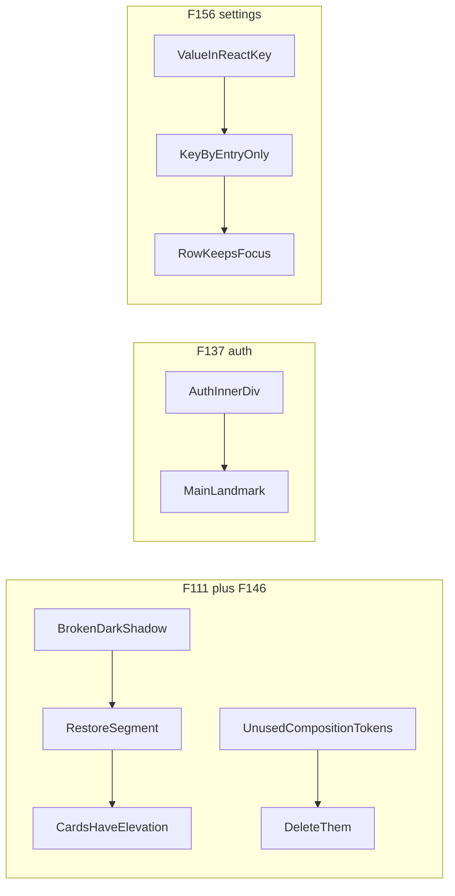

# Chat 2 — things users can actually see

Three independent Medium-severity user-visible fixes, plus one Deferred CSS cleanup in the same file as F111. No migrations. No product-behavior change except “the bug stops happening.”

F146 is in scope (scratch optional add-on). Same file as F111, unused by every consumer, zero extra risk. Deletion, not composition — the longhand shadow values stay.

Do not commit or open a PR — see § Out of scope.

## Precondition

Before editing anything, run `git status` and record the working tree's starting state in your output. This plan's deliverable is an uncommitted tree for human review, so any already-modified file must be named up front or the review diff cannot be attributed. Do not stash, revert, or clean anything — only record it. Note that `next dev` rewrites the `nextjs-agent-rules` block in `AGENTS.md`, so that file may legitimately already be dirty.

---

## F111 — dark-mode cards get their elevation back

**What is wrong:** In [src/app/globals.css](src/app/globals.css), the `.dark` `--shadow` token’s second layer is `hsl(0 0% 0.1)` — three components, lightness `0.1`, no alpha. `:root` has four: `hsl(0 0% 0% / 0.1)`. The `%` and the `/` are missing. What that looks like on screen depends on the browser's CSS Color 4 handling of a bare number for lightness: if it is accepted, the layer renders as an opaque near-black shadow at 0.1% lightness; if it is rejected, `box-shadow: var(--shadow)` is invalid at computed-value time and the shadow drops entirely. Either way the `.dark` recipe does not match `:root`, and the `Card` primitive uses the bare `shadow` utility, so every card renders the wrong elevation in dark mode. The contrast checker does not cover shadow tokens, which is why this survived.

Every other dark shadow token (`--shadow-2xs` through `--shadow-2xl`) already matches `:root`. Only `--shadow` is broken.

**Fix:** Restore the missing `% /` so the `.dark` declaration matches `:root` exactly. Do not convert shadows to oklch; they are already hsl black-with-alpha in both themes.

**Test:** None automated. This is a computed-value CSS typo; `check:a11y-contrast` correctly ignores shadow tokens, and testing.mdc bans class-string probes. Pin it with the dark-mode browser check below. Do not extend the contrast checker.

---

## F146 — delete unused shadow-composition tokens (same file)

**What is wrong:** Six composition custom properties (`--shadow-x`, `-y`, `-blur`, `-spread`, `-opacity`, `-color`) are defined in `:root`, repeated verbatim in `.dark`, and referenced by nothing — the real `--shadow-*` values immediately below are written longhand. `--tracking-normal` is the same residue (`:root` only; not repeated in `.dark`). A reader reasonably assumes editing them re-skins the shadows. It does nothing. They are not mapped in `@theme inline`. [DESIGN.md](DESIGN.md) § Token groups already lists only the consumed shadow names, so no edit is needed there — but § Re-skinning a product does need one; see § Docs.

**Verified 2026-08-28** — a repo-wide grep returns zero `var()` reads of any of the seven tokens, and the only `tracking-normal` hit in `src/` is the declaration itself (`globals.css:153`), with no component using it as a Tailwind class. The deletion is inert; do not re-verify.

**Fix:** Delete the six composition tokens from **both** the `:root, .light` block and the `.dark` block — twelve declarations — plus `--tracking-normal` from `:root, .light`, which has no `.dark` counterpart. Thirteen lines total. Leave the longhand `--shadow-2xs` through `--shadow-2xl` (and the `@theme inline` bridge) untouched.

**Test:** None. Absence of unused tokens.

---

## F137 — auth screens get a `main` landmark

**What is wrong:** [src/app/auth/layout.tsx](src/app/auth/layout.tsx) wraps children in plain divs. Marketing pages and the authenticated app shell each render `<main id="main-content">`. All seven `/auth` routes therefore give screen-reader landmark navigation nothing to jump to. `check:a11y-structure` enforces heading and alt only, so this is invisible to CI.

Admin also lacks a `main` (its shell uses a content `div`). That is not this finding — do not expand.

**Fix:** Change the **inner** wrapper (`flex w-full max-w-sm flex-col gap-6`) to `<main id="main-content">` with the same classes. That is the id the other surfaces use. Leave the outer centering div as a div. Do not add a skip-link (none exists in the repo today) and do not wrap the logo in a separate `header`.

No auth page or `auth/error.tsx` already renders a `main`, so this will not nest landmarks. `CardTitle` is a `div`, not an `h1`; heading counts stay unchanged.

**Test:** Extend the existing [src/app/auth/layout.unit.test.tsx](src/app/auth/layout.unit.test.tsx): assert a `main` landmark with `id="main-content"` wrapping the child content. One extra assertion; do not add a new case.

---

## F156 — saving an admin setting no longer remounts the row

**What is wrong:** [src/app/admin/settings/_components/app-settings-panel.tsx](src/app/admin/settings/_components/app-settings-panel.tsx) keys each non-banner row as `` `${entry.key}-${savedSettings[entry.key]}` ``. A successful save changes that key, so React unmounts and remounts the row — discarding DOM focus and local form state. Both row variants already reset on `savedValue` via an effect. The banner section on the same save-then-refresh flow keys by `entry.key` only and relies on that effect. Two mechanisms, and the panel’s is the one that fights the rows.

**Fix:** Key by `entry.key`, matching [src/app/admin/settings/_components/banner-settings-section.tsx](src/app/admin/settings/_components/banner-settings-section.tsx). Leave the reset effects and `handleSaved` alone. Do not extract a save hook (that is F132).

After save the Save button disables (value now matches saved). Browsers typically move focus off a newly-disabled control anyway, so do **not** assert that the Save button keeps focus. The remount is the bug; identity of the row’s field is the pin.

**Test:** Extend the existing save case in [src/app/admin/settings/_components/app-settings-panel.integration.test.tsx](src/app/admin/settings/_components/app-settings-panel.integration.test.tsx). After the successful save, assert `screen.getByRole('spinbutton', { name: 'Log retention window' })` **is the same node** as the `retentionInput` reference captured before the click. A remounting key fails that identity check; a stable key passes. Do not add a separate test.

---

## Out of scope

- F132 (extract `useAppSettingSave`), F157 (banner/non-banner partition)
- Admin shell `main` landmark (not filed as this finding)
- Skip-link component (does not exist; do not invent one)
- Extending `check:a11y-contrast` to shadow tokens
- Chats 3–5
- **Committing and opening a PR.** Do neither. This plan carries no authorized commit step (`git-workflow.mdc` § Commits); leave the work in the tree for review.

## Docs

This is a **token change** — one of the doc-sync triggers in AGENTS.md § Agent workflow step 4 (env, scripts, token, rule-file).

DESIGN.md § Token groups § Shadow lists only the consumed `--shadow-*` names and never listed the composition tokens, so no edit is needed there. One edit **is** needed: DESIGN.md § Re-skinning a product step 3 tells the next product to diff-apply a fresh tweakcn export, and tweakcn ships exactly the tokens F146 deletes — without a note they come straight back on the first re-skin. Add a bullet to step 3, sibling in shape to the existing border-alpha caveat:

> **Do not copy the shadow-composition tokens** (`--shadow-x`, `-y`, `-blur`, `-spread`, `-opacity`, `-color`) or `--tracking-normal` from a tweakcn export — the `--shadow-*` values here are written longhand and nothing consumes the composition tokens.

No README or AGENTS.md edit.

After `pnpm pre-push` is green, move F111, F137, and F156 to **Resolved** in [TECH_DEBT_AUDIT.md](TECH_DEBT_AUDIT.md) with today’s date (2026-08-28) and a one-line note each. Move F146 from Deferred to Resolved the same way. Then **remove** the F111, F137, and F156 rows from § Quick wins — that section is scoped "Open only," so a resolved finding leaves the list rather than staying on it as an unchecked box (F146 is not on that list). Do not rewrite the rest of the audit.

No human deploy/db sequencing — unlike Chat 1’s F107, these are app-only.

## Quality bar and your steps

- After the code is in: `pnpm pre-push`
- Browser-verify F111 and F156 (agent, before calling the work done)
- Audit Resolved rows as above

## Manual test checklist

- **F111:** Toggle dark mode. Cards on `/auth/login`, `/home`, and `/admin/settings` render the same two-layer recipe `:root` uses — soft elevation matching light mode, no hard opaque edge. Do not read "a shadow is present before the fix" as evidence there was no bug; the broken value may render as an opaque near-black layer rather than dropping. Spot-check a `shadow-sm` / `shadow-lg` surface if one is on screen — those tokens were already valid.
- **F146:** No visual change beyond F111. Nothing should look different in light mode.
- **F137:** Open `/auth/login` (logged out). In the accessibility tree / screen-reader landmarks, there is a `main`. The logo and form sit inside it. Other `/auth/*` screens inherit the same layout.
- **F156:** On `/admin/settings`, change Log retention window and Save. The row does not flash-remount; you can continue tabbing from that row rather than being dumped to the top of the page. Save a log-level row too. Banner accordion save still works (already stable keys).
