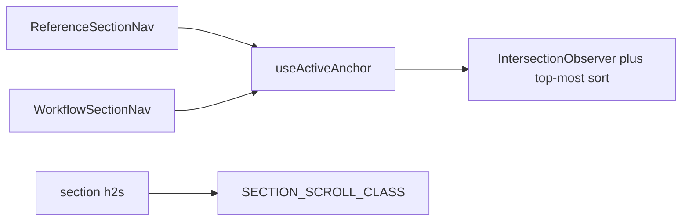

# Chat 30 — one scroll-spy hook

F117 only. Same shape as Chat 8 / Chat 23: one hook, the copies become markup over it. The duplicated heading scroll-offset class folds in the same change. No migrations. Zero intended UX change. Do not commit.

## Precondition

Before editing anything, run `git status` and record the working tree. Do not stash, revert, or clean.

Confirm 29 landed: [TECH_DEBT_AUDIT.md](TECH_DEBT_AUDIT.md) has **F163**, **F171**, and **F173** in § Resolved. If any is still Open, **stop** — this chat is first in the locked batch order (`30 → 31 → 32`), not a substitute. 29 has no plan file in `.cursor/plans/`; the audit Resolved rows are the gate.

Prior chats may still be uncommitted (11’s `tsconfig` / index guards, 10’s dialog host, 12–28, dirty `stat-tile` / logs tiles, `nextjs-agent-rules` in [AGENTS.md](AGENTS.md)). Name those files up front. Touch only this chat’s files plus the F117 audit row, the H1 leftover list, the § Top 5 entry, and the executive-summary claims listed in § Docs.

## Why extract, not rewrite

The two navs already share the same observer, `rootMargin` (`-96px 0px -55% 0px`), threshold `0`, top-most-intersecting sort, and disconnect cleanup. We extract that, we do not redesign it.

- Do **not** extract a shared `SectionNav` component. The wrappers have already drifted by one class (`border-b` on reference only). That stays. Each nav keeps its own `aria-label`, links array, and wrapper classes.
- Do **not** change observer tuning, pill variants, or heading markup beyond the import swap.
- Do **not** switch the observer to a scroll listener, `useSyncExternalStore`, or a third-party scroll-spy.
- The hook’s **argument** is the links array (objects with `id`) so callers pass `REFERENCE_ANCHOR_LINKS` / `WORKFLOW_ANCHOR_LINKS` directly. Do not change the callers to map to a `string[]` first. This governs the call sites only — how the hook derives ids internally is § The hook’s business.

The `?? 'forms'` / `?? 'two-environments'` literals Chat 11 hoisted are dead — both arrays are non-empty module constants, so the first link’s id already wins. That id is both the initial state and the observer fallback. First paint stays the first link (`design-system` / `two-environments`), same as today.

## The hook

New file: [`src/hooks/use-active-anchor.ts`](src/hooks/use-active-anchor.ts).

Match [`src/hooks/use-mounted.ts`](src/hooks/use-mounted.ts) and [`src/hooks/use-reset-on-change.ts`](src/hooks/use-reset-on-change.ts): `'use client'`, named arrow export, no default export, explicit return type `string`.

Body is the two copies’ shared observer:

- Argument: `links: readonly { id: string }[]`. Keep the `{ id }` shape file-private — do not export a new public link type. The two page-local types stay where they are.
- At render scope: `const ids = links.map((link) => link.id).join('\n')` — a primitive, recomputed each render, cheap.
- `useState(links[0]?.id ?? '')` — initial value only, evaluated once, so `links` needs no stability here.
- Effect body reads only `ids`: `const idList = ids.split('\n')`, looks up `document.getElementById` for each, filters nulls, no-ops when none exist, otherwise constructs the observer (same options, same sort, same top-most write) with `idList[0] ?? ''` as the fallback, observes, disconnects on cleanup. Nothing in the effect references `links`.
- Effect deps: `[ids]`. A primitive dep means an inline-allocated array is safe — same ids, same string, no re-subscribe. No JSDoc stability warning; the JSDoc documents the return only. Do not add `links` to the deps.
- Empty `links` yields `''`, which splits to `['']`, which `getElementById` misses — the existing no-elements no-op already covers it. Do not add a separate empty guard.

Do not export `rootMargin` or the threshold. Do not add options.

Colocated test: [`src/hooks/use-active-anchor.unit.test.ts`](src/hooks/use-active-anchor.unit.test.ts). Mock `IntersectionObserver` the way [`src/hooks/use-scrolled.unit.test.ts`](src/hooks/use-scrolled.unit.test.ts) does (capture the callback, stub `observe` / `disconnect`). `renderHook` from `@/test/test-utils`. Four cases:

- **Initial.** Append elements for the fixture ids. Hook returns the first id. `observe` was called once per existing element.
- **Top-most wins.** Emit two intersecting entries with different `boundingClientRect.top`. Active id is the one closer to the top.
- **Empty intersecting list.** After a first update, emit only non-intersecting entries. Active id stays put (the copies already skip the write when nothing intersects).
- **Unmount.** `disconnect` runs.

Do not test `rootMargin` / threshold values. Do not test an empty `links` array as a fifth case. Do not add nav-component tests — both navs stay coverage-excluded by design ([`vitest.config.ts`](vitest.config.ts)). The hook is what enters the `src/` denominator.

## Convert the two navs

[`src/app/(marketing)/reference/_components/reference-section-nav.tsx`](src/app/(marketing)/reference/_components/reference-section-nav.tsx) and [`src/app/(marketing)/workflow/_components/workflow-section-nav.tsx`](src/app/(marketing)/workflow/_components/workflow-section-nav.tsx):

- `const activeId = useActiveAnchor(REFERENCE_ANCHOR_LINKS)` (and the workflow array on the other).
- Delete `useState`, `useEffect`, `DEFAULT_ACTIVE_ID`, and the observer block. Drop the `react` import if nothing else needs it.
- Markup, `aria-label`, wrapper classes, and `border-b` (reference only) stay exactly as they are.

## Fold the scroll-offset class

[`src/app/(marketing)/reference/_lib/reference-anchor-links.ts`](src/app/(marketing)/reference/_lib/reference-anchor-links.ts) and [`src/app/(marketing)/workflow/_lib/workflow-anchor-links.ts`](src/app/(marketing)/workflow/_lib/workflow-anchor-links.ts) each export the same `'scroll-mt-24'` with the same JSDoc. Delete both exports. Do **not** leave re-export aliases.

New file: [`src/constants/section-scroll.ts`](src/constants/section-scroll.ts) — one named export `SECTION_SCROLL_CLASS = 'scroll-mt-24'`, same JSDoc (clears sticky site header `h-14`). `src/constants/` is the project home for cross-route constants; a one-export file matches [`src/constants/transient-feedback.ts`](src/constants/transient-feedback.ts). Headings must not import from the hook module.

Swap the import in every heading that uses the old names (className strings otherwise unchanged):

- Reference: design-system, forms, feedback, toast, table sections
- Workflow: two-environments, plan-review, documents, conventions, guide-cta

[`src/config/features-content.unit.test.ts`](src/config/features-content.unit.test.ts) imports `REFERENCE_ANCHOR_LINKS` only — leave it.

## Out of scope

- **F152** — that is Chat 31
- **F118 / F177 / F155** — that is Chat 32
- **F167 / F183** — do not rewrite `/workflow` copy or guard the diagram mouseover cast
- **F158** — do not extract the banner-slot pair
- Do not extract a shared section-nav component or unify the `border-b` drift
- Do not change observer options, pill variants, or heading copy
- Do not add coverage for `reference/_components/**` or the excluded workflow section files
- **AGENTS.md, DESIGN.md, README, `/sync-repo-docs`, LEXICON, testing.mdc.** No rule edits
- Do not edit [vitest.config.ts](vitest.config.ts) (new files are under `src/`; no floor change)
- **Committing and opening a PR.** Do neither
- Do not edit [tmp/tech-debt-quick-fix-chats.md](tmp/tech-debt-quick-fix-chats.md)

## Docs

After both gates are green, in [TECH_DEBT_AUDIT.md](TECH_DEBT_AUDIT.md):

- Move **F117** to § Resolved with today’s date (**2026-08-29**): `useActiveAnchor` in `src/hooks/` owns the observer, sort, and disconnect; both section navs call it; `SECTION_SCROLL_CLASS` in `src/constants/section-scroll.ts` is the only `scroll-mt-24` name; the two page-prefixed aliases are gone. Record the in-scope residual: the shared pill markup and the `border-b` wrapper drift were deliberately left — two sites is under the extraction threshold, so no shared `SectionNav` component was extracted. Note F152 / F118 / F155 were not done here.
- **H1 leftover list.** Drop F117. Remaining throwaway-page Open Do-next: F152, F155 (fold into F118).
- § Top 5: drop F117 and renumber. Remaining rows stay **F118**, **F152**. Do not promote F155 or any Deferred row.
- **Two spots carry the latest-close claim.** The header `Scope:` line’s `Latest close same day:` sentence, and the `## Executive summary` lead bullet — which *is* the `Latest close (same day):` bullet, not a third location. Rewrite both so this chat’s close is the latest close. The “F117 / F152 / F118 / F155 were not done” clause on that lead bullet is stale and must change too. Do **not** touch the `Prior same-day close: F150 / F172 / F184` bullet or any other historical bullet.
- **Open counts.** Closing one takes Open from **14** to **13** — update the current-state figures only so they match the table. If 29’s close left a different number, count the Open rows and subtract one; do not invent a third figure. Historical counts in the “This sync” and prior-sync bullets (e.g. “all 17 Open rows”, “All 32 Open rows”) are a record of an earlier pass — leave them exactly as written.
- F163 / F171 / F173 Resolved notes already say F117 was not done there — leave those historical sentences.
- `Last synced:` stays **2026-08-29**.

## Quality bar

- Targeted: `CI=true pnpm type-check` and `pnpm test:file -- src/hooks/use-active-anchor.unit.test.ts src/config/features-content.unit.test.ts`
- Then: `CI=true pnpm pre-push` (a bare `pnpm pre-push` aborts in a non-TTY agent shell)
- Grep: `useActiveAnchor` exists and both navs import it; zero `IntersectionObserver` in either nav file; zero `REFERENCE_SECTION_SCROLL_CLASS` / `WORKFLOW_SECTION_SCROLL_CLASS`; `SECTION_SCROLL_CLASS` is the only remaining `scroll-mt-24` export; zero `runWithRefreshIndicator` / `AdminRefreshButton`; no edits under `reference-profile-settings-preview.tsx`, `reference-toast-section.tsx` (beyond the scroll-class import), `use-admin-logs-realtime.ts`, or `use-admin-users-refresh.ts`
- **If any gate fails on files this chat did not touch** (including anything from the uncommitted prior chats named in § Precondition): stop and report. Do not fix it here.

## Manual test checklist

Public pages, no sign-in. Behavior, not a screenshot. Exercise both routes — they share the hook and the scroll-offset class.

- `/reference`: load. First pill (Design system) is the filled one. Scroll until Forms / Toast / Table enter the header-offset band — the matching pill fills, the others stay outline. Click a pill — the heading lands below the sticky header, not under it. `border-b` under the reference pills is still there.
- `/workflow`: same scroll + click pass. First pill (Two environments) starts filled. No `border-b` under the workflow pills (the existing drift). Headings still clear the sticky header.
- Narrow viewport (~375px): pills wrap, scroll-spy and click-jump still work on both pages.
- `pnpm type-check` is clean.
