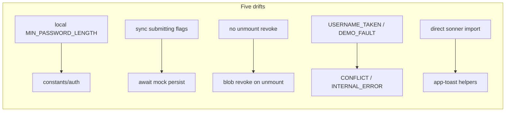

# Chat 31 — `/reference` showroom matches what it advertises

F152 only. Five listed drifts plus the header comment. No extract. No migrations. The showroom starts teaching the real patterns; production password / avatar / toast routing do not change. Do not commit.

## Precondition

Before editing anything, run `git status` and record the working tree. Do not stash, revert, or clean.

Confirm 30 landed: [TECH_DEBT_AUDIT.md](TECH_DEBT_AUDIT.md) has **F117** in § Resolved. If it is still Open, **stop** — this chat is next in the locked batch order (`30 → 31 → 32`), not a substitute.

Prior chats may still be uncommitted (11’s `tsconfig` / index guards, 10’s dialog host, 12–30, dirty `stat-tile` / logs tiles, `nextjs-agent-rules` in [AGENTS.md](AGENTS.md)). Name those files up front. Touch only this chat’s files plus the F152 audit row, the H1 leftover list, the § Top 5 entry, [notifications.mdc](.cursor/rules/notifications.mdc) API paragraph, and the executive-summary claims listed in § Docs.

## Why fix, not extract

The page claims to be a live showroom of production patterns. Five remaining drifts teach the wrong ones. We close those. We do **not** extract a shared profile dialog, a shared persist, or a shared section-nav. We do **not** add a first-password branch — that absence is an intentional divergence and stays in the header comment.

Do **not** add coverage for `reference/_components/**`. Still excluded by design in [vitest.config.ts](vitest.config.ts). The finding is the unverified parity claim, not the exclusion. The pin that enters the `src/` denominator is [src/utils/app-toast.unit.test.ts](src/utils/app-toast.unit.test.ts). The existing forms-section integration test already opens this dialog for blur-save — run it; do not add a password or avatar case to it.

## 1. Shared password constant + reachable “Updating…”

[src/app/(marketing)/reference/_components/reference-profile-settings-preview.tsx](src/app/(marketing)/reference/_components/reference-profile-settings-preview.tsx)

- Delete the local `const MIN_PASSWORD_LENGTH = 8`. Import `MIN_PASSWORD_LENGTH` from [`src/constants/auth.ts`](src/constants/auth.ts), same as [profile-password-section.tsx](src/app/(app)/_components/profile/profile-password-section.tsx).
- In `handlePasswordSubmit`, after the validation returns, `setIsSubmittingPassword(true)`, then **`await referenceDemoMockPersist({})`** between the two flag writes, then the existing toast + field reset, then `setIsSubmittingPassword(false)`. Use `try` / `finally` so the flag clears the way production does. Do not invent a password payload type — `referenceDemoPersist` is the display-name / bio helper; the generic mock is the one the per-row and per-section demos already await.
- Import `referenceDemoMockPersist` next to the existing `referenceDemoPersist` (blur-save keeps the typed one). Do not change [reference-demo-persist.ts](src/app/(marketing)/reference/_lib/reference-demo-persist.ts) or the 400ms delay.

The 400ms delay is what makes “Updating…” visible. Do not stub it to zero in the component.

## 2. Production unmount revoke

The parent holds blob URLs in `avatarUrl` after a demo upload (there is no storage URL to replace them). Replace/remove already revoke. Unmount does not.

Match [profile-avatar-field.tsx](src/app/(app)/_components/profile/profile-avatar-field.tsx): a ref that tracks the current URL, plus an empty-deps `useEffect` whose cleanup revokes if the URL starts with `blob:`. Do not revoke `/images/aw-avatar.jpg`. Do not also hook `onOpenChange`. Do not edit the production avatar field — it already has this. Do not extract a shared revoke helper.

## 3. Taxonomy codes

[src/app/(marketing)/reference/_components/reference-feedback-section.tsx](src/app/(marketing)/reference/_components/reference-feedback-section.tsx)

- Operational demo: `code: 'CONFLICT'` (username-taken is a 409 in [error-handling.mdc](.cursor/rules/error-handling.mdc)). Message stays.
- Fault demo: `code: 'INTERNAL_ERROR'`. Message stays.
- `kind` values stay `operational` / `fault`.

Zero `USERNAME_TAKEN` / `DEMO_FAULT` left in the tree.

## 4. Toast helpers, then the section calls those

[src/utils/app-toast.ts](src/utils/app-toast.ts) — add four named arrow exports next to `showSuccessToast`, same `void` return, same one-argument message shape except the promise helper:

- `showInfoToast` → `toast.info`
- `showWarningToast` → `toast.warning`
- `showErrorToast` → `toast.error`
- `showPromiseToast(promise, { loading, success, error? })` → `toast.promise`. `error` is optional and passed through when supplied. The loading demo does not pass one, but the helper ships in shared utils and must be able to report a rejection — a promise helper with no failure path leaves a caller's rejected promise in a loading toast with no terminal state.

Only this file calls `toast.*`. Do not change [sonner.tsx](src/components/ui/sonner.tsx) or [toast-icon-config.tsx](src/utils/toast-icon-config.tsx).

**Guard comment.** Add one comment above the four new helpers: production calls only `showSuccessToast`; the other four exist for the `/reference` gallery, and errors never surface as toasts in product code (`notifications.mdc`). The constraint has to be greppable at the point of temptation, not one directory away — a spinoff copying `app-toast.ts` sees the export before it sees the rule.

**Test.** Extend [src/utils/app-toast.unit.test.ts](src/utils/app-toast.unit.test.ts). Widen the sonner mock with `info` / `warning` / `error` / `promise`. One case per new helper (plus the existing success case). The promise case passes a resolved promise and asserts `toast.promise` was called with that promise and the message object. Do not test the showroom section.

These are pass-through cases, which `testing.mdc` § What NOT to Test normally excludes. They are here for the coverage floor — `src/utils/**` is in the denominator and four untested exports land in it — and they match the shape of the existing `showSuccessToast` case in the same file. Do not extend them beyond one assertion each.

**Section.** [src/app/(marketing)/reference/_components/reference-toast-section.tsx](src/app/(marketing)/reference/_components/reference-toast-section.tsx): drop the `sonner` import. The trigger buttons render inside a `.map()` over `TOAST_ICON_VARIANTS`, so `onClick` receives `variant` as a loop value and a variant→helper dispatch still has to exist — replace `showReferenceToast`'s `toast.*` calls with the helpers rather than deleting the dispatch. A `Record<ToastIconVariant, (message: string) => void>` is the preferred shape; keeping the switch and calling helpers from it is acceptable. Either way the `loading` entry still builds the 2000ms timeout promise and passes it to `showPromiseToast` with `success: 'Changes saved'`. Keep `LOADING_TOAST_DELAY_MS`, the preview cards, and the trigger labels.

Tighten the Alert one sentence: helpers now live in `app-toast`; production still only calls success; the other four are the gallery. Do not claim production error routing changed — [notifications.mdc](.cursor/rules/notifications.mdc) still says errors never toast in product code.

**Rule.** The API paragraph still says info / warning “are not pre-built” and “do not add unused variants.” That sentence becomes a lie the moment the helpers land, and it is why they were missing. Rewrite **that paragraph only** (read the rule-authoring skill first): five helpers exist; only `app-toast.ts` calls sonner; production still only calls `showSuccessToast`; `/reference` is the other consumer; `showErrorToast` is for the gallery and does not change “errors never surface as toasts.” Do not touch the routing table.

Do not run `/sync-repo-docs`, despite [AGENTS.md](AGENTS.md) § Agent workflow step 4. That gate exists for rule-file changes that alter the index: `.cursor/rules/README.md`'s own maintenance rule fires on adding, removing, or reclassifying a rule file. This edits one paragraph inside an existing rule; the README's `notifications.mdc` row (mode, globs, purpose) stays accurate.

## 5. Header comment

Rewrite the file-header comment on the profile preview so it no longer claims parity while listing only some gaps. List remaining **intentional** divergences:

- No first-password branch (always Change Password, always the current-password field)
- Password accordion is local mock persist, not Supabase
- Read-only demo email
- Non-persisting saves on this public page are correct, not drift

Do not mention the five closed drifts.

## Out of scope

- **F118 / F177 / F155** — that is Chat 32
- **F167 / F183** — do not rewrite `/workflow` copy
- **F158** — do not extract the banner-slot pair
- Do not add a first-password branch
- Do not add coverage for `reference/_components/**` or edit [vitest.config.ts](vitest.config.ts)
- Do not edit production [profile-password-section.tsx](src/app/(app)/_components/profile/profile-password-section.tsx) or [profile-avatar-field.tsx](src/app/(app)/_components/profile/profile-avatar-field.tsx)
- Do not change [reference-demo-persist.ts](src/app/(marketing)/reference/_lib/reference-demo-persist.ts)
- **AGENTS.md, DESIGN.md, README, LEXICON, error-handling.mdc, testing.mdc.** No other rule edits
- **Committing and opening a PR.** Do neither
- Do not edit [tmp/tech-debt-quick-fix-chats.md](tmp/tech-debt-quick-fix-chats.md)

## Docs

After both gates are green, in [TECH_DEBT_AUDIT.md](TECH_DEBT_AUDIT.md):

- Move **F152** to § Resolved with today’s date (**2026-08-29**): shared `MIN_PASSWORD_LENGTH`; password submit awaits `referenceDemoMockPersist` so “Updating…” can appear; blob avatar URLs revoke on unmount; demo envelopes use `CONFLICT` / `INTERNAL_ERROR`; `app-toast.ts` owns info / warning / error / promise helpers and the toast section calls those; header comment lists only remaining intentional divergences (absent first-password branch). Record the in-scope residual: `reference/_components/**` stay coverage-excluded by design — the parity claim is what this closed, not the exclusion. Note F118 / F155 / F177 were not done here.
- **H1 leftover list.** Drop F152. Remaining throwaway-page Open Do-next: F155 (fold into F118).
- § Top 5: drop F152. The only remaining row is **F118**. Do not promote F155 or any Deferred row.
- **Two spots carry the latest-close claim.** The header `Scope:` line’s `Latest close same day:` sentence, and the `## Executive summary` lead bullet — which *is* the `Latest close (same day):` bullet, not a third location. Rewrite both so this chat’s close is the latest close.
- **F117 moves down the chain; it does not disappear.** Closing F152 demotes F117 from latest to prior, and both spots have to carry that or F117's close is recorded nowhere outside its § Resolved row:
  - Header `Scope:` line — prepend **F117** to the existing `Prior same-day:` chain, ahead of `F163 / F171 / F173`.
  - `## Executive summary` — the F117 lead bullet is **replaced** by the new F152 lead bullet. Rewrite the `Prior same-day close: F150 / F172 / F184` bullet to carry F117 instead, keeping F117's own substance (`useActiveAnchor`, `SECTION_SCROLL_CLASS`, the deliberately-left shared pill markup). This is the one prior bullet that gets rewritten; leave every other historical bullet alone.
- F117's § Resolved row and its “F152 / F118 / F155 were not done” clause are historical — do **not** edit that Resolved note.
- **Open counts.** Closing one takes Open from **13** to **12** — update the current-state figures only so they match the table. If 30’s close left a different number, count the Open rows and subtract one; do not invent a third figure. Historical counts in the “This sync” and prior-sync bullets stay as written.
- F117 / F163 / F171 / F173 Resolved notes that say F152 was not done there — leave those historical sentences.
- `Last synced:` stays **2026-08-29**.

## Quality bar

- Targeted: `CI=true pnpm type-check` and `pnpm test:file -- src/utils/app-toast.unit.test.ts src/app/(marketing)/reference/_components/reference-forms-section.integration.test.tsx`
- Then: `CI=true pnpm pre-push` (a bare `pnpm pre-push` aborts in a non-TTY agent shell)
- Grep: preview imports `MIN_PASSWORD_LENGTH` from `@/constants/auth` and has zero local password-length literal; password submit awaits `referenceDemoMockPersist`; preview has an unmount `revokeObjectURL`; zero `USERNAME_TAKEN` / `DEMO_FAULT`; feedback section uses `CONFLICT` and `INTERNAL_ERROR`; `app-toast.ts` exports the four new helpers; zero `from 'sonner'` in `reference-toast-section.tsx`; zero `runWithRefreshIndicator` / `AdminRefreshButton`; [vitest.config.ts](vitest.config.ts) still excludes `reference/_components/**`; no edits under `use-admin-logs-realtime.ts`, `use-admin-users-refresh.ts`, or `use-reference-shipments-refresh.ts`
- **If any gate fails on files this chat did not touch** (including anything from the uncommitted prior chats named in § Precondition): stop and report. Do not fix it here.

## Manual test checklist

Public page, no sign-in. Behavior, not a screenshot. `/reference` only.

- **Forms → Profile.** Open Preview profile settings. Change password to 8+ matching characters and submit — the button reads “Updating…” for a beat, then “Update password”, toast “Password updated”, fields clear. A 7-character password still shows the min-length inline error and never shows “Updating…”.
- **Avatar.** Change photo to a local image — preview updates. Remove — preview clears. Close the dialog and reopen — the uploaded preview is **still there**, and that is correct: `avatarUrl` lives in `ReferenceProfileSettingsPreview`'s own state and only `DialogContent` unmounts on close. Do not treat it as a leak or add a reset. Navigate off `/reference` after an upload (unmount revoke; you will not see a visual, just no console error).
- **Feedback.** InlineError still shows the username-taken copy; the copyable code is `CONFLICT`. ErrorPanel still shows the save-failed copy; the code is `INTERNAL_ERROR`.
- **Toast.** All five trigger buttons still fire the matching variant. Loading still resolves to “Changes saved” after ~2s.
- Narrow viewport (~375px): profile dialog still scrolls; toast row buttons still fire.
- `pnpm type-check` is clean.
