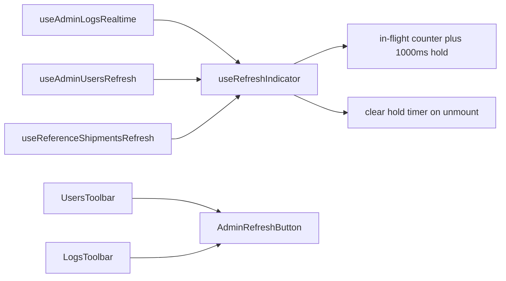

# Chat 32 — one refresh-indicator helper

F118 + F177 + F155. Same shape as Chat 8 / Chat 23 / Chat 30: one hook, the copies become wrappers over it, plus the toolbar button the extract already touches. No migrations. Zero intended UX change (the hold stays 1000ms; the reference leak is the only behavior change, and it is a cleanup). Do not commit.

## Precondition

Before editing anything, run `git status` and record the working tree. Do not stash, revert, or clean.

Confirm 31 landed: [TECH_DEBT_AUDIT.md](TECH_DEBT_AUDIT.md) has **F152** in § Resolved. If it is still Open, **stop** — this chat is last in the locked batch order (`30 → 31 → 32`), not a substitute.

Prior chats may still be uncommitted (11’s `tsconfig` / index guards, 10’s dialog host, 12–31, dirty `stat-tile` / logs tiles, `nextjs-agent-rules` in [AGENTS.md](AGENTS.md)). Name those files up front. Touch only this chat’s files plus the F118 / F177 / F155 audit rows, the H1 leftover list, the § Top 5 entry, the one present-tense F118 sentence in § Architectural mental model, and the executive-summary claims listed in § Docs.

## Why extract, not accept

Three copies of the same in-flight counter + 1000ms hold. The third site is `/reference`, so the helper lives in `src/hooks/`, not `admin/_lib/`. The logs copy is already the general one (takes the operation as a callback); users and reference hardcode `refetchQueries`. Only logs is tested. The reference copy leaks its hold timer on unmount (F155). We extract that, we do not redesign it.

- Do **not** change the 1000ms hold, the in-flight counter, or the started-at ref.
- Do **not** switch the sleep to `useTableFetchDim`, a CSS animation, or a third-party delay.
- Do **not** patch the reference hook alone and leave the other two copies. F155 closes because the shared helper clears on unmount.
- Do **not** extract the filtered-empty-state “Refresh” text buttons. Those are a different control (secondary, labeled, no spinner). F177 is the toolbar icon-button only.
- Do **not** put `AdminRefreshButton` on the `/reference` toolbar. That button has no `isFetching` and is not admin.

## The hook

New file: [`src/hooks/use-refresh-indicator.ts`](src/hooks/use-refresh-indicator.ts).

Match [`src/hooks/use-copy-to-clipboard.ts`](src/hooks/use-copy-to-clipboard.ts) and [`src/hooks/use-table-fetch-dim.ts`](src/hooks/use-table-fetch-dim.ts): `'use client'`, named arrow export, no default export. Colocate `REFRESH_MIN_VISIBLE_MS = 1000` in this file (same as `TABLE_FETCH_DIM_MIN_MS`) and export it. Do **not** add a `src/constants/` file — the duration is only consumed here.

Hook name is `useRefreshIndicator`. Return `{ isRefreshing, runWithRefreshIndicator }` with an explicit return type. `runWithRefreshIndicator` is the logs copy’s callback: `(operation: () => Promise<void>) => Promise<void>`. Empty deps.

Body is the three copies’ shared hold, plus the cleanup none of them have:

- `isRefreshing` state, `refreshInFlightRef`, `refreshStartedAtRef` — same increment / started-at / remaining-ms / `setIsRefreshing(false)` sequence as [use-admin-logs-realtime.ts](src/app/admin/logs/_lib/use-admin-logs-realtime.ts) lines 26–54.
- Hold timer id in a ref, and the hold promise’s `resolve` in a second ref. The `setTimeout` that sleeps `remainingMs` writes the timer ref; the resolve callback nulls both.
- Empty-deps `useEffect` cleanup clears the hold timer **and** calls the stored `resolve`, then nulls both refs. Clearing the timeout alone leaves the awaited promise pending forever and retains its closure.
- No mounted flag. React 19 makes a setState after unmount a silent no-op, and an empty-deps `useRef(true)` flag that its own cleanup sets to `false` stays `false` after StrictMode’s mount → cleanup → remount in dev, disarming the hook for the session.
- Do not export options. Do not parameterize the duration.

Colocated test: [`src/hooks/use-refresh-indicator.unit.test.ts`](src/hooks/use-refresh-indicator.unit.test.ts). Fake timers. `renderHook` from `@/test/test-utils`. Three cases — the logs test stays the call-site pin; this file pins the helper that enters the `src/` denominator and the new unmount path:

- **Min-visible hold.** Call `runWithRefreshIndicator` with a resolved operation. `isRefreshing` is true at 999ms and false at 1000ms.
- **Overlapping.** Start a second operation before the first settles. `isRefreshing` stays true until both settle and the hold elapses once from the first start.
- **Unmount.** Start a hold, `unmount`, advance past 1000ms — the hold timer is cleared and no pending timers remain (`vi.getTimerCount()` is 0). Same shape as the copy-to-clipboard unmount case, with a real assertion rather than `not.toThrow()`.

Do not test the 1000 literal against the exported constant name. Do not add users / reference hook tests. Do not add a toolbar-button test.

## Convert the three call sites

[`src/app/admin/logs/_lib/use-admin-logs-realtime.ts`](src/app/admin/logs/_lib/use-admin-logs-realtime.ts)

- `const { isRefreshing, runWithRefreshIndicator } = useRefreshIndicator()`.
- Delete the local `REFRESH_MIN_VISIBLE_MS`, `isRefreshing` state, both refresh refs, and the local `useCallback` body.
- Keep `REALTIME_DEBOUNCE_MS`, the debounce timer ref, the channel effect, and both `runWithRefreshIndicator(...)` call sites (debounced invalidate + manual refetch).
- [`use-admin-logs-realtime.unit.test.tsx`](src/app/admin/logs/_lib/use-admin-logs-realtime.unit.test.tsx) stays as written. Do not move its refresh cases onto the new hook test.

[`src/app/admin/users/_lib/use-admin-users-refresh.ts`](src/app/admin/users/_lib/use-admin-users-refresh.ts) and [`src/app/(marketing)/reference/_lib/use-reference-shipments-refresh.ts`](src/app/(marketing)/reference/_lib/use-reference-shipments-refresh.ts)

- Each becomes the query-client plus a `refresh` that calls `runWithRefreshIndicator` with that surface’s `refetchQueries`. Return `{ refresh, isRefreshing }` unchanged.
- Delete the local constant, both refs, and the inlined hold. Drop `useState` / `useRef` if nothing else needs them.

Public return of all three hooks stays `{ refresh, isRefreshing }`. Table-state hooks and the reference table demo do not change.

## F177 — `AdminRefreshButton`

New file: [`src/app/admin/_components/admin-refresh-button.tsx`](src/app/admin/_components/admin-refresh-button.tsx). Named export, `'use client'`. Props: `label` (the `aria-label` string), `isRefreshing`, `isFetching` defaulting to `false`, and `onClick`. Internally `showRefreshSpinner = isRefreshing || isFetching`. Markup is the existing icon-button: outline, icon size, `shrink-0`, `disabled={isRefreshing}`, `aria-busy={showRefreshSpinner}`, `Loader2` / `RefreshCw` swap.

[`users-toolbar.tsx`](src/app/admin/users/_components/users-toolbar.tsx) and [`logs-toolbar.tsx`](src/app/admin/logs/_components/logs-toolbar.tsx): replace the inline button with `<AdminRefreshButton label="Refresh users" … />` / `label="Refresh logs"`. Delete `showRefreshSpinner` and the `Loader2` / `RefreshCw` imports from both. Search icon stays.

Do not add a unit test for the button. [logs-table.integration.test.tsx](src/app/admin/logs/_components/logs-table.integration.test.tsx) already clicks “Refresh logs”; [users-table.integration.test.tsx](src/app/admin/users/_components/users-table.integration.test.tsx) already finds the refresh control. Run those; do not add cases.

[`reference-toolbar.tsx`](src/app/(marketing)/reference/_components/reference-toolbar.tsx) stays as it is.

## Out of scope

- **F167 / F183** — do not rewrite `/workflow` copy or guard the diagram mouseover cast
- **F174** — `is-main` extract waits for the next `scripts/checks/` phase
- **F158** — do not extract the banner-slot pair
- Do not change the 1000ms hold, observer-style options, or empty-state Refresh buttons
- Do not add coverage for `reference/_components/**` or edit [vitest.config.ts](vitest.config.ts)
- **AGENTS.md, DESIGN.md, README, `/sync-repo-docs`, LEXICON, testing.mdc.** No rule edits
- **Committing and opening a PR.** Do neither
- Do not edit [tmp/tech-debt-quick-fix-chats.md](tmp/tech-debt-quick-fix-chats.md)

## Docs

After both gates are green, in [TECH_DEBT_AUDIT.md](TECH_DEBT_AUDIT.md):

- Move **F118**, **F177**, and **F155** to § Resolved with today’s date (**2026-08-29**): `useRefreshIndicator` in `src/hooks/` owns the in-flight counter, 1000ms hold, and unmount clear; logs / users / `/reference` call it; `REFRESH_MIN_VISIBLE_MS` lives next to the hook; `AdminRefreshButton` in `admin/_components/` is the toolbar icon-button on both admin toolbars. Record the in-scope residual: filtered-empty-state Refresh text buttons and the `/reference` toolbar icon were deliberately left — different controls, under the extract threshold. Note F167 / F183 / F174 / F158 were not done here.
- **H1 leftover list.** Drop F155. Remaining throwaway-page Open Do-next: none. F167 / F183 stay Deferred with the next `/workflow` content change.
- § Top 5: drop F118. The list is empty — remaining Open rows are all Deferred. Do not promote any Deferred row.
- **Architectural mental model.** One present-tense sentence still says the refresh indicator is copied in logs, users, and `/reference` (F118). Rewrite that clause so it names the shared hook, not the copies. Do not otherwise rewrite the model.
- **Two spots carry the latest-close claim.** The header `Scope:` line’s `Latest close same day:` sentence, and the `## Executive summary` lead bullet — which *is* the `Latest close (same day):` bullet, not a third location. Rewrite both so this chat’s close is the latest close, and **demote F152 rather than dropping it**: in the header `Scope:` line, insert `F152` at the head of the `Prior same-day:` chain (ahead of `F117`); in `## Executive summary`, add a new `**Prior same-day close: F152.**` bullet directly above the existing `Prior same-day close: F117` bullet, carrying the current F152 bullet’s text verbatim. Without the demotion the summary reads as if F117 were the prior close. The “F118 / F155 were not done” clause on the F152 / F117 lead bullets is now historical — do **not** edit those Resolved notes. Do **not** touch the `Prior same-day close: F150 / F172 / F184` bullet or any other historical bullet.
- **Open counts.** Closing three takes Open from **12** to **9** — update the current-state figures only so they match the table. If 31’s close left a different number, count the Open rows and subtract three; do not invent a third figure. Historical counts in the “This sync” and prior-sync bullets stay as written.
- **Test-file and test counts.** This chat adds one test file. Update `152 test files` in the header `Scope:` line and `780 tests / 152 files` in the `## Executive summary` quality-gates bullet to the actual figures from the `test:ci` run. These two are current-state, not historical.
- F117 / F152 / F173 / F176 Resolved notes that say F118 / F155 / F177 were not done there — leave those historical sentences.
- The § Open questions bullet about F118 vs a throwaway `/reference` is now decided (extract; the third copy counted, and the toolbar button stayed admin-scoped). Rewrite the bullet to record that answer, or remove it — do not leave a settled question under § Open questions.
- `Last synced:` stays **2026-08-29**.

## Quality bar

- Targeted: `CI=true pnpm type-check` and `pnpm test:file -- src/hooks/use-refresh-indicator.unit.test.ts src/app/admin/logs/_lib/use-admin-logs-realtime.unit.test.tsx src/app/admin/logs/_components/logs-table.integration.test.tsx src/app/admin/users/_components/users-table.integration.test.tsx`
- Then: `CI=true pnpm pre-push` (a bare `pnpm pre-push` aborts in a non-TTY agent shell)
- Grep: `useRefreshIndicator` exists and all three refresh hooks import it; zero `REFRESH_MIN_VISIBLE_MS` outside `src/hooks/use-refresh-indicator.ts`; zero `refreshInFlightRef` / `refreshStartedAtRef` in the three route hooks; logs still has `debounceTimerRef`; `AdminRefreshButton` is imported by both admin toolbars; zero `Loader2` / `RefreshCw` in either toolbar; zero `AdminRefreshButton` under `reference/`; the hook cleanup clears a timeout; [vitest.config.ts](vitest.config.ts) still excludes `reference/_components/**`; no edits under `workflow-page-content.ts`, `workflow-diagram.tsx`, `public-banner-slot.tsx`, or `scripts/checks/`
- **If any gate fails on files this chat did not touch** (including anything from the uncommitted prior chats named in § Precondition): stop and report. Do not fix it here.

## Manual test checklist

Admin surfaces need a signed-in admin. `/reference` is public.

- **`/admin/logs`.** Click Refresh — the icon spins for about a second even when the refetch is instant, then returns to the refresh icon. The button is disabled while spinning. Turn live on, trigger an insert (or wait for one) — the same spinner appears. Mark-all and search still work.
- **`/admin/users`.** Same Refresh hold. Search-at-3-chars and filter chips still work.
- **`/reference` → Table.** Click Refresh shipments — same ~1s spin. Search / filters still work. Start a refresh and navigate to `/workflow` before the second is up — the page navigates cleanly. (The unmount clear itself is pinned by the unit test; React 19 emits no console error either way, so this step cannot verify it.)
- Narrow viewport (~375px): both admin toolbars and the reference toolbar still wrap; Refresh still fires.
- `pnpm type-check` is clean.
