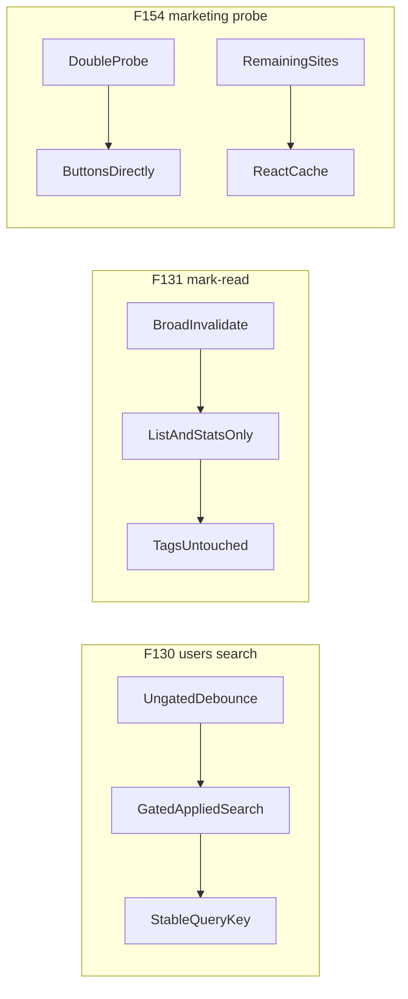

# Chat 3 — admin lists behave correctly

Three independent Medium-severity waste/flicker fixes. No migrations. No product-behavior change except “the extra round-trip / flicker stops.”

Do not commit or open a PR — see § Out of scope.

## Precondition

Before editing anything, run `git status` and record the working tree's starting state in your output. Chats 1 and 2 may still be sitting uncommitted; this plan's deliverable is an uncommitted tree for human review, so any already-modified file must be named up front. Do not stash, revert, or clean anything — only record it. Note that `next dev` rewrites the `nextjs-agent-rules` block in `AGENTS.md`, so that file may legitimately already be dirty.

---

## F130 — users search does not query until 3 characters

**What is wrong:** [src/app/admin/users/_lib/use-admin-users-table-state.ts](src/app/admin/users/_lib/use-admin-users-table-state.ts) already computes a 3-character-gated `appliedSearch` and uses it for chips and the filtered empty state. The list hook still receives the **ungated** debounced string. That value is part of the React Query key, so typing `a` then `ab` creates a distinct cache entry and a fresh server round-trip per keystroke — each returning the same unfiltered page, because the server gate in [src/app/admin/users/_lib/list-admin-users.ts](src/app/admin/users/_lib/list-admin-users.ts) already ignores short prefixes. Results are correct; the work is wasted, and the table dims on every extra fetch.

The toolbar already tells the admin “Enter at least 3 characters,” so the UI contract is known. The request boundary is the one place that doesn't honor it.

**Fix:** Pass `appliedSearch ?? undefined` as `emailFilter` (same value as `filters.search`). Keep the server-side gate as defense-in-depth. Do not change debounce timing, the 3-character constant, or the page-reset-on-debounce-change (resetting page on a 1–2 character debounce is harmless once the query key is stable).

**Test:** Add one case to [src/app/admin/users/_components/users-table.integration.test.tsx](src/app/admin/users/_components/users-table.integration.test.tsx), sibling to the existing “debounce search and call action with email filter” case (that case types `abc` and stays). After mount (1 list call), type `ab`, **wait past the 300ms debounce** (a 400ms real-timer sleep — do not introduce fake timers into this file), then assert the list action is still called once with `emailFilter: undefined`. `waitFor` alone is a false pass here: the “still unfiltered” assertion is true *before* debounce fires. The existing 3-character case already proves a real filter does fire after debounce.

---

## F131 — marking a log read does not refetch tags

**What is wrong:** All three mark-read mutations invalidate the entire `['admin-logs']` prefix — list, stats, **and** tags. Tag distinctness only changes when a new row appears, never from a read-state change. Clicking rows is the primary interaction on `/admin/logs`, so this is a steady stream of avoidable `listLogTagsAction` calls (and a flicker of the tag combobox).

Same over-broad invalidation in:

- [src/app/admin/logs/_lib/use-mark-log-read-mutation.ts](src/app/admin/logs/_lib/use-mark-log-read-mutation.ts)
- [src/app/admin/logs/_lib/use-mark-log-unread-mutation.ts](src/app/admin/logs/_lib/use-mark-log-unread-mutation.ts)
- [src/app/admin/logs/_lib/use-mark-all-logs-read-mutation.ts](src/app/admin/logs/_lib/use-mark-all-logs-read-mutation.ts)

The realtime INSERT handler and the manual Refresh button in [src/app/admin/logs/_lib/use-admin-logs-realtime.ts](src/app/admin/logs/_lib/use-admin-logs-realtime.ts) correctly keep the broad prefix — a new row may carry a new tag. Leave those two alone.

**Fix:** Add a `lists` prefix key to [src/app/admin/logs/_lib/admin-logs-query-keys.ts](src/app/admin/logs/_lib/admin-logs-query-keys.ts) that is `['admin-logs', 'list']` (the parameterized `list(...)` factory cannot be used for invalidation — mark-read only has an id, not the current cursor/filters). Define the existing `list(...)` factory in terms of it — `list: (...) => [...lists(), { cursor: cursor ?? null, sortDirection, perPage, filters }]` — so the prefix cannot silently drift from the full key if the key shape is edited later; a sibling literal would break the prefix match with no compile or test signal. In each of the three mutations, invalidate `lists()` and `stats()` as two calls; do not invalidate `all` or `tags()`. Do not extract a shared invalidator helper — three two-line call sites is the whole change.

**Test:** Extend the existing “open the detail dialog and mark an unread row read” case in [src/app/admin/logs/_components/logs-table.integration.test.tsx](src/app/admin/logs/_components/logs-table.integration.test.tsx). After the mark-read action fires, wait until the list action has been called a second time (list refetch is expected), then assert `listLogTagsAction` is still at 1 call. Do not add separate cases for unread or mark-all — same invalidation pattern, and testing.mdc does not want three ways to pin one behavior. Review confirms the other two files were edited.

---

## F154 — unauthenticated marketing pages probe the session once

**What is wrong:** [src/app/(marketing)/_components/landing-mobile-header-chrome.tsx](src/app/(marketing)/_components/landing-mobile-header-chrome.tsx) awaits `hasServerAuthSession` to pick its branch, then on the logged-out branch hands the sheet a Suspense slot that renders [src/app/(marketing)/_components/landing-auth-slot.tsx](src/app/(marketing)/_components/landing-auth-slot.tsx), which probes **again** to reach the same conclusion and render the Sign in / Sign up buttons. `hasServerAuthSession` is not wrapped in React `cache` (unlike `getCurrentUserProfile`), so each call re-reads the cookie and re-verifies the JWT. Combined with the desktop `LandingAuthSlot` and the banner Suspense fallback in [src/app/(marketing)/_components/marketing-top-stack.tsx](src/app/(marketing)/_components/marketing-top-stack.tsx), one logged-out marketing render pays the probe several times.

**Fix (two parts, both in this change):**

1. On the unauthenticated branch, pass `LandingAuthButtons` with `layout="stack"` straight into the mobile nav's `authSlot`. Delete the module-level Suspense/`LandingAuthSlot` wrapper — the branch already knows the answer, so there is nothing to suspend for. Keep the authenticated branch as it is (Suspense around `AppHeaderAccountNav`). Drop the now-unused `LandingAuthSlot` import. Do not change the desktop header, which still needs `LandingAuthSlot` because it has not already probed.

2. Wrap `hasServerAuthSession` in React `cache` in [src/supabase/require-auth.ts](src/supabase/require-auth.ts), matching [src/app/(app)/_lib/get-current-user-profile.ts](src/app/(app)/_lib/get-current-user-profile.ts). Remaining call sites in the same request (desktop slot, banner fallback, admin gate) then share one probe. Do not wrap `getDisplayAuthClaims`. Do not add a cached/uncached split export.

**Test:** In [src/app/(marketing)/_components/landing-mobile-header-chrome.integration.test.tsx](src/app/(marketing)/_components/landing-mobile-header-chrome.integration.test.tsx), on the existing anonymous case, assert `hasServerAuthSession` was called once. **Before applying the part-1 change, add this assertion against the current code and run it — confirm it fails.** The nested `LandingAuthSlot` is an async component under Suspense and the existing assertions are satisfied by the Suspense fallback, so it is not established that the slot's probe actually runs in this renderer. If the assertion already passes today, it pins nothing: replace it with an assertion that does distinguish the two shapes (e.g. that no Suspense fallback boundary is rendered on the anonymous branch) and say so in the output. The Sign in / Sign up assertions stay — they now come from buttons rendered directly. Do not add a test that React `cache` dedupes (framework behavior). Existing [src/supabase/require-auth.unit.test.ts](src/supabase/require-auth.unit.test.ts) cases should keep passing; `getCurrentUserProfile` is already wrapped the same way and its tests are stable.

---

## Out of scope

- F128 (zod on `emailFilter`), F133 (logs cursor-stack tests)
- Changing realtime INSERT or Refresh invalidation
- Wrapping `getDisplayAuthClaims`, hoisting `ProfileDialogProvider` (F061)
- Chats 4–5
- **Committing and opening a PR.** Do neither. This plan carries no authorized commit step (`git-workflow.mdc` § Commits); leave the work in the tree for review.

## Docs

After `pnpm pre-push` is green, move F130, F131, and F154 to **Resolved** in [TECH_DEBT_AUDIT.md](TECH_DEBT_AUDIT.md) with today’s date (2026-08-28) and a one-line note each. Moving means both halves: add the three rows to § Resolved **and delete their rows from § Open**, so neither ID appears in both sections. Then **remove** those three bullets from § Quick wins — that section is scoped “Open only.” Leave the § Architectural mental model prose references to F130 alone; do not rewrite the rest of the audit.

No README, DESIGN.md, or AGENTS.md edit. No `sync-repo-docs` trigger (not env, scripts, token, or rule-file).

No human deploy/db sequencing — app-only, unlike Chat 1’s F107.

## Quality bar and your steps

- After the code is in: `pnpm pre-push`
- Browser-verify F130 and F131 (agent, before calling the work done). F154’s extra probe is server-side; the browser check is “logged-out marketing header still looks right,” with the call-count test as the pin.
- Audit Resolved rows as above

## Manual test checklist

- **F130:** On `/admin/users`, **starting on page 1**, type `ab` in search and pause. The “at least 3 characters” hint shows. The table does not dim or refetch. (From a later page the table *does* refetch — `page` is part of the query key and a debounced-search change still resets to page 1. That is unchanged existing behavior, not a regression.) Type a third character (`abc`): after a short pause the list filters. Clear the box: back to the full list, one refetch.
- **F131:** On `/admin/logs`, click an unread row. The detail dialog opens and the row marks read. The tag combobox does not flash or reload. Toggle unread from the dialog: same — tags stay put. Click Refresh (or wait for a live insert if live is on): tags *are* allowed to refresh on that path.
- **F154:** Logged out, open `/` (and one other marketing page, e.g. `/features`). Desktop shows Sign in / Sign up. Open the mobile menu: Sign in / Sign up are in the sheet, no account menu. Sign in, hit `/` again: desktop and mobile sheet show the account menu instead.
