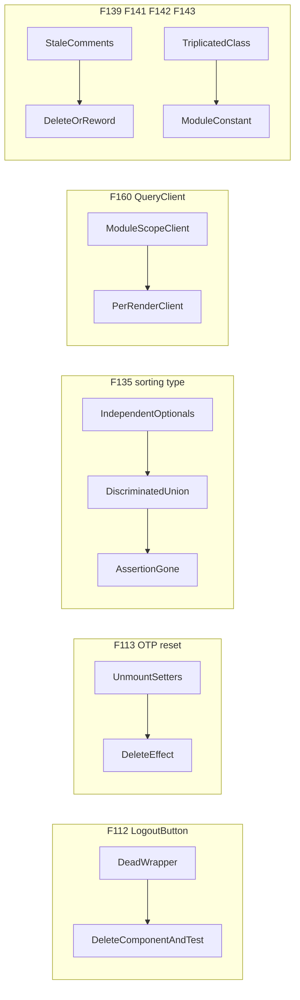

# Chat 4 — delete dead things + type traps

Independent S-effort cleanups. No migrations. No product-behavior change except “the dead code / type hole / shared cache goes away.”

**F112 product call (confirmed):** delete `LogoutButton`. Do not add it to `/reference`. The real sign-out path is [`useSignOut`](src/hooks/use-sign-out.ts), already covered by [`use-sign-out.unit.test.ts`](src/hooks/use-sign-out.unit.test.ts). A demo of an unused wrapper teaches the wrong pattern.

Do not commit or open a PR — see § Out of scope.

## Precondition

Before editing anything, run `git status` and record the working tree's starting state in your output. Chats 1–3 may still be sitting uncommitted; this plan's deliverable is an uncommitted tree for human review, so any already-modified file must be named up front. Do not stash, revert, or clean anything — only record it. Note that `next dev` rewrites the `nextjs-agent-rules` block in `AGENTS.md`, so that file may legitimately already be dirty.

---

## F112 — delete `LogoutButton`

**What is wrong:** [`src/components/logout-button.tsx`](src/components/logout-button.tsx) is imported by exactly one file: its own test. No app surface renders it. The authenticated shell signs out through `useSignOut` directly. The 39-line integration test is keeping a dead component in the coverage denominator.

**Fix:** Delete [`src/components/logout-button.tsx`](src/components/logout-button.tsx) and [`src/components/logout-button.integration.test.tsx`](src/components/logout-button.integration.test.tsx). Do not add a `/reference` demo. Do not edit archived plans that mention the old component. Do not touch `useSignOut` or its unit test — that is the live contract.

**Test:** None new. The hook test already pins sign-out + redirect + cookie clearing. Absence of the component is the pin.

---

## F113 — delete the inert OTP unmount reset

**What is wrong:** [`src/components/email-otp-request-card.tsx`](src/components/email-otp-request-card.tsx) has a `useLayoutEffect` with an empty dependency array whose cleanup calls ten state setters. Cleanup runs only at unmount; React discards those updates on an unmounted instance. Under StrictMode's simulated remount they reset state that is already at its initial value. It reads as a defensive reset and is inert.

The two consumers ([`sign-in-link-form.tsx`](src/components/sign-in-link-form.tsx), [`forgot-password-form.tsx`](src/components/forgot-password-form.tsx)) are separate routes, not one tree swapping flows, so there is nothing to key at the call site.

**Fix:** Delete the effect. Drop `useLayoutEffect` from the React import. Leave the countdown `useEffect`, `clearOtpInput`, and `handleUseDifferentEmail` alone.

**Test:** None new for “the effect is gone.” Existing [`sign-in-link-form.integration.test.tsx`](src/components/sign-in-link-form.integration.test.tsx) and [`forgot-password-form.integration.test.tsx`](src/components/forgot-password-form.integration.test.tsx) already cover the card through its consumers and must keep passing.

---

## F135 — sorting without a change handler is a compile error

**What is wrong:** [`useDataTableShell`](src/components/data-table-shell.tsx) treats `sorting` and `onSortingChange` as independent optionals, infers “controlled” from `sorting !== undefined`, then non-null-asserts the handler. Passing `sorting` without `onSortingChange` type-checks and crashes on the first sort click. This is the only non-null assertion in the shared component layer.

All three live callers already pass both: [`use-admin-users-table-state.ts`](src/app/admin/users/_lib/use-admin-users-table-state.ts), [`use-admin-logs-table-state.ts`](src/app/admin/logs/_lib/use-admin-logs-table-state.ts), [`reference-table-demo.tsx`](src/app/(marketing)/reference/_components/reference-table-demo.tsx). The union will not churn those call sites.

**Fix:** Split `UseDataTableShellOptions` into a union on a shared base (`data`, `columns`, `getRowId`, `initialSorting`, `manualSorting`):

- Controlled arm: `sorting` and `onSortingChange` both required
- Uncontrolled arm: both typed as optional `never` so passing one without the other is a type error

**Narrowing trap:** do **not** destructure `sorting` / `onSortingChange` before the mode check. After destructure, TypeScript forgets the union. Read them off `options` after `options.sorting !== undefined` so the controlled arm actually narrows and the `!` deletes.

**`initialSorting` placement:** check whether any of the three controlled callers passes `initialSorting` alongside `sorting`. If none does, type it `initialSorting?: never` on the controlled arm — a controlled caller passing it gets it silently ignored, which is the same representable-but-meaningless combination this change exists to remove. If any controlled caller does pass it, leave `initialSorting` on the shared base. Either way `useState` still needs its default on the uncontrolled arm.

Do not add F134 (shell body/keyboard tests) in this change.

**Test:** None new. This is a type-level hole; `testing.mdc` does not want type-checking tests. `pnpm type-check` plus the three existing callers continuing to compile is the pin.

---

## F160 — each test render gets its own QueryClient

**What is wrong:** [`src/test/test-utils.tsx`](src/test/test-utils.tsx) constructs one `QueryClient` at module scope and shares it across every `render()` in the worker. Cache, mutation state, and in-flight queries persist across cases. Nothing fails today because most rendered trees barely use React Query, but the failure mode when they do is order-dependent flakiness.

Admin table tests that wrap their own client are unaffected (inner provider wins). Production [`ReactQueryProvider.tsx`](src/providers/ReactQueryProvider.tsx) already constructs inside `useState` — match that.

**Fix:** Move construction **inside** the existing `Wrapper` component via `useState(() => new QueryClient({ defaultOptions: { queries: { retry: false } } }))`. Keep `Wrapper` as a stable component identity passed to `customRender`. Do **not** create a new wrapper function per `customRender` call — that remounts on `rerender()` and would reset cache mid-test.

Do not export the client. Do not change query defaults.

**Test:** None new — do not test that React Query isolates (framework / test-infra). The existing suite is the pin. If anything was accidentally depending on leaked cache, it should fail, and that is the desired catch. `src/test/**` is coverage-excluded, so this does not move the 80% needle.

---

## F143 — hoist the admin dashboard card class bundle

**What is wrong:** The hover + motion-tier class string `hover:bg-muted/50 duration-swept h-full transition-colors` is copy-pasted onto all three cards in [`src/app/admin/page.tsx`](src/app/admin/page.tsx) (lines 34, 49, 64). The JSX `debt:` comment already names this; the trigger is standing and true. (This is not a comment-only fix, unlike F139/F141/F142. The scratch’s “one-line each” grouping is imprecise here.)

**Fix:** Hoist to a module-level string constant in this file. Pass it as `className={…}` on each `Card`. Do **not** wrap it in `cn()` — there is nothing to merge. Do **not** add a `cva` variant on the `Card` primitive — no other surface wants this hover treatment. Delete the JSX `debt:` comment; the triplication it warned about is gone.

Note the lint consequence: `local/motion-tier` does not resolve identifiers in `className`, `cn()`-wrapped or not, so the hoisted constant is no longer scanned for the `transition-colors` / `duration-swept` pairing. That is the F144 blind spot, and avoiding `cn()` does not avoid it.

Do **not** add a new F144-shaped marker on the constant. F144 is Accepted and already notes that this hoist would be a fifth site of the same lint ceiling (`scanExpressionStrings` skips identifiers). Record the site in F144's Sites list (see § Docs) and mention it in the F143 Resolved note; do not copy the marker.

**Test:** None. `page.tsx` is coverage-excluded. Visual no-op, pinned by the browser check.

---

## F139, F141, F142 — comment-only

Three one-line marker fixes. Do not change surrounding code.

**F139** — [`src/components/site-header.tsx`](src/components/site-header.tsx) line 29. The comment claims the grid class is “intentionally shared inline with site-footer.tsx” and that F060 extraction is deferred. The footer pairing is gone (`md:grid-cols-2`); the track string has one occurrence. **Delete the comment.** Leave the class string.

**F141** — [`scripts/checks/no-profiles-role.mjs`](scripts/checks/no-profiles-role.mjs) lines 1–4. The marker says this scanner runs in pre-push only and CI never invokes it. CI runs `pnpm check:admin-gate`, which invokes this file. **Delete the four-line marker.** Do not touch [`no-profiles-role.unit.test.ts`](scripts/checks/no-profiles-role.unit.test.ts) — it does not read the file header.

**F142** — [`src/app/admin/settings/_components/app-setting-row.tsx`](src/app/admin/settings/_components/app-setting-row.tsx) line 291. The marker says “refactor to dispatch if a third `valueType` is added.” The registry already has three (`log_level`, `positive_int`, `banner`); banner never reaches this component, so the two-branch dispatch is still correct. **Reword** to name a third **non-banner** `valueType`. Do not refactor (that is F062, still Accepted). Do not do F129 (exhaustiveness) in this change. Leave the F062 Accepted row as-is — it already says “non-banner.”

---

## Out of scope

- F134 (DataTableShell body/keyboard tests — pairs with F135, but M-effort)
- F129 (settings-row exhaustiveness), F062 refactor
- F144 (extending motion-tier to scan constants)
- Putting `LogoutButton` on `/reference`
- Chat 5 (auth-form correctness)
- **Committing and opening a PR.** Do neither. This plan carries no authorized commit step (`git-workflow.mdc` § Commits); leave the work in the tree for review.

## Docs

After `CI=true pnpm pre-push` is green, move F112, F113, F135, F160, F139, F141, F142, and F143 to **Resolved** in [TECH_DEBT_AUDIT.md](TECH_DEBT_AUDIT.md) with today’s date (2026-08-28) and a one-line note each. Moving means both halves: add the eight rows to § Resolved **and delete their rows from § Open**, so neither ID appears in both sections. Then **remove** F112, F113, F135, and F160 from § Quick wins — that section is scoped “Open only.” F139/F141/F142/F143 are Low and are not on that list.

F143’s Resolved note should mention this is a fifth F144-class site (identifier `className`, lint does not follow it). Add `src/app/admin/page.tsx` to the Sites list in F144’s Accepted row — that row already anticipates this fifth site; this makes it a listed one. Change nothing else in that row. Do not rewrite the executive-summary “five declared markers” bullet or the F060 Resolved note that still points at F139.

No README, DESIGN.md, or AGENTS.md edit. No `sync-repo-docs` trigger (not env, scripts, token, or rule-file).

No human deploy/db sequencing — app-only.

## Quality bar and your steps

- After the code is in: `CI=true pnpm pre-push` (a bare `pnpm pre-push` aborts in a non-TTY agent shell with `ERR_PNPM_ABORTED_REMOVE_MODULES_DIR_NO_TTY` — see TECH_DEBT_AUDIT.md § Tooling notes)
- Browser-verify F113, F135, and F143 (agent, before calling the work done). F112 and F160 have no UI. Comment-only fixes have no UI.
- Audit Resolved rows as above

## Manual test checklist

- **F112:** Sign out from the app-shell account menu and from the admin account menu. Both still go to `/auth/login`. There is no standalone Logout button on `/reference` or anywhere else — that is intended.
- **F113:** Logged out, open `/auth/forgot-password`. Request a code, land on the OTP step, use “different email” to go back, request again. Same on `/auth/sign-in-link` if that route is handy. No flash-reset or stuck loading state on those transitions.
- **F135:** On `/admin/users`, click a sortable column header. Sort still flips and the list refetches. Same on `/admin/logs` for the timestamp column, and on `/reference` for the demo table.
- **F143:** On `/admin`, the three dashboard cards still have the same hover wash and the same transition. No visual change intended.
- **F160 / comments:** No product surface. Confirmed by `CI=true pnpm pre-push`.
