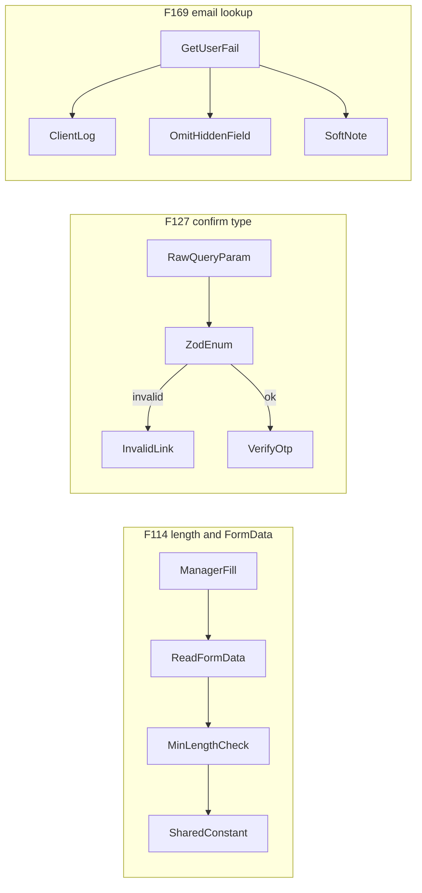

# Chat 5 — auth-form correctness

Three independent Medium S-effort fixes on real auth UX. No migrations. No product-behavior change except “the bug stops happening.” Do not migrate the `useState` auth forms onto RHF (that is [F022](TECH_DEBT_AUDIT.md), still Accepted).

Do not commit or open a PR — see § Out of scope.

## Precondition

Before editing anything, run `git status` and record the working tree's starting state in your output. Chats 1–4 may still be sitting uncommitted; this plan's deliverable is an uncommitted tree for human review, so any already-modified file must be named up front. Do not stash, revert, or clean anything — only record it. Note that `next dev` rewrites the `nextjs-agent-rules` block in `AGENTS.md`, so that file may legitimately already be dirty.

---

## F114 — sign-up and update-password enforce min length and read live fields

**What is wrong:** [`MIN_PASSWORD_LENGTH`](src/constants/auth.ts) (8) already reaches the RHF/zod surfaces ([`sign-up/schema.ts`](src/app/auth/_lib/sign-up/schema.ts), [`first-password-schema.ts`](src/app/(app)/_lib/profile/first-password-schema.ts), [`profile-password-section.tsx`](src/app/(app)/_components/profile/profile-password-section.tsx)). The two `useState` forms never check it, so any non-empty string goes to the server. Separately, [`login-form.tsx`](src/components/login-form.tsx) and [`email-otp-request-card.tsx`](src/components/email-otp-request-card.tsx) read `FormData` off the submitted form because password managers write to the DOM and auto-submit without firing React `onChange`. Sign-up and update-password still read from state. Sign-up is the most exposed: managers inject a generated password, and those password inputs currently have **no `name` attributes**, so `FormData` would not see them even if we read it.

The server already rejects short passwords (zod on sign-up; `parseSetFirstPasswordInput` on recovery). This is client correctness and a wasted round-trip, not a hole in the trust boundary. Do not change the actions or schemas.

**Fix:** In both [`sign-up-form.tsx`](src/components/sign-up-form.tsx) and [`update-password-form.tsx`](src/components/update-password-form.tsx):

1. Type the submit handler as `React.FormEvent<HTMLFormElement>` (login already does; these two currently use the unparameterized `FormEvent`, which will not type `e.currentTarget` as a form).
2. Copy login's FormData read and its comment. Hold the submitted values in local variables and pass **those** downstream — sign-up's mismatch comparison and `signUpWithPasswordAction({ email, password })`, update-password's `completeRecoveryPasswordAction({ password })` — exactly as login passes `submittedEmail` / `submittedPassword` to `signInWithPassword`. Also call the state setters, but only so the inputs re-render with the submitted values; a `setState` call does not update the variable inside the same handler run, so reading `password` / `email` / `repeatPassword` after the sync would still see the stale render-time values and leave the bug in place. Sign-up reads `username`, `password`, and `repeat-password`; update-password reads `password` (the hidden username field is not submitted as the new secret).
3. After the FormData read, reject when the submitted password is shorter than `MIN_PASSWORD_LENGTH`, using the exact message profile already uses: `Password must be at least ${MIN_PASSWORD_LENGTH} characters.` Surface it the way each form already surfaces client validation — sign-up's mismatch path is an operational envelope into `AppErrorSurface` (no `code`); update-password has no client-validation path yet, so use the same operational envelope. Do **not** introduce `InlineError` alongside `AppErrorSurface` in these files. On sign-up, check length **before** mismatch, matching profile.
4. Add `name` attributes: sign-up password → `name="password"`, repeat → `name="repeat-password"`; update-password → `name="password"`. Email already has `name="username"`.

Do not add HTML `minLength`. Do not add a confirm-password field to update-password. Do not touch [`profile-password-section.tsx`](src/app/(app)/_components/profile/profile-password-section.tsx) or the reference demo (F152).

**Test:** Existing files, one new case each, plus one rewrite.

- [`sign-up-form.integration.test.tsx`](src/components/sign-up-form.integration.test.tsx): extend the autofill-attributes case to expect `name="password"` and `name="repeat-password"`. Add one case: matching 7-character passwords → the length message, action not called. Add one FormData-without-onChange case: set the password and repeat-password input values directly on the DOM nodes without firing React `onChange`, submit, and assert `signUpWithPasswordAction` receives the DOM values — this is the only case that fails if the submitted values are synced to state but not passed downstream. Existing mismatch case stays.
- [`update-password-form.integration.test.tsx`](src/components/update-password-form.integration.test.tsx): the existing “action fails” case types `weak` (4 characters). After the client check that case **never reaches the action**, so it would stop pinning the envelope path. Change it to a password of 8+ characters so it still exercises action failure. Add one case: a short password → the length message, action not called. Add one FormData-without-onChange case: set the password input value directly on the DOM node without firing React `onChange`, submit, and assert `completeRecoveryPasswordAction` receives the DOM value. Extend the autofill-attributes case to expect `name="password"` on the new-password input.

---

## F127 — confirm route validates OTP `type` before `verifyOtp`

**What is wrong:** [`src/app/auth/confirm/route.ts`](src/app/auth/confirm/route.ts) casts `searchParams.get('type')` straight to Supabase's `EmailOtpType` and passes it to `verifyOtp`. The redirect target is already gated by `isUsableRedirectNext`. The `type` param is untrusted input crossing into an auth call, which `security.mdc` / `forms.mdc` want zod for.

Templates this app actually emits: `email` (magic-link and confirm-signup) and `recovery` (reset-password). The audit allowlist is still `magiclink | recovery | email | signup` — those are the email-OTP types this app's flows issue or can issue. Do **not** shrink it to the two template literals, and do **not** add `invite` or `email_change`.

**Fix:** Add [`src/app/auth/_lib/email-otp-type.ts`](src/app/auth/_lib/email-otp-type.ts) with a zod enum of those four values. In the route, `safeParse` the search param; only enter the `verifyOtp` branch when `token_hash` is present **and** the parse succeeds. Invalid or missing `type` falls through to the existing `/auth/error?source=invalid_link` redirect (same as missing `token_hash`). Do not log invalid types — missing params are silent today. Drop the `EmailOtpType` cast; the parsed enum is the subset `verifyOtp` accepts. Do not wrap `safeParse` in a parse helper (one call site). Do not add a colocated schema unit test (that would re-test zod).

**Test:** One case on [`src/app/auth/confirm/route.integration.test.ts`](src/app/auth/confirm/route.integration.test.ts): `token_hash` present, `type=invite` (a real Supabase OTP type this app does not issue) → `invalid_link`, `verifyOtp` not called. Existing `type=email` success cases stay. Do not add a case per enum member.

---

## F169 — failed email lookup does not save against a blank account

**What is wrong:** [`update-password-form.tsx`](src/components/update-password-form.tsx) calls `getUser()` with no rejection handling and no error branch. Failure leaves `accountEmail` at `''`, which is bound to the visually-hidden username input `forms.mdc` requires so password managers know which credential to update. The manager then silently saves the new password against no account. The recovery action itself is fine — it uses the session, not this field.

**Product call (recommendation, do this):** do **both** halves of the audit's either/or. Omitting the empty field is what stops the silent save-against-blank; a note without omitting still poisons the manager. A note without blocking submit is what tells the user something is off while still letting recovery complete. Do not add a registry key.

**Fix:**

1. Treat rejection, `{ error }`, and a user with no email as the same failure. `clientLog.error('auth-form-error', …)` with the caught/error object as context. No email in the log (there isn't one). Existing key — [`extract-auth-form-error.ts`](src/utils/extract-auth-form-error.ts) already uses it for form-adjacent auth failures.
2. Render the hidden username input **except** after a confirmed failure. It stays in the DOM while the lookup is pending, as it is today — some password managers scan the form once on load and do not re-scan on DOM mutation, so removing it during the in-flight window would change happy-path autofill behavior, which this fix must not do. Only the `failed` state omits it.
3. After a confirmed failure (not while pending), show one muted `text-sm` line carrying `role="status"` so the change is announced — it appears asynchronously after the lookup resolves, and without a live region a screen-reader user never hears it. Not `InlineError`, not a toast, not `AppBanner`. Copy: "Couldn't confirm your email. Your password will still be saved, but your password manager may not update the stored login." Do not disable submit.
4. Add the exception to [`forms.mdc`](.cursor/rules/forms.mdc) § Password fields & autofill in the same change. The bullet requiring a paired username field says it "must be in the DOM"; without the carve-out the next agent reads step 2 as a bug and restores the field, reintroducing this finding. Add one clause to that existing bullet: when the account email cannot be resolved, omit the field rather than render it empty — an empty username anchor is worse than none, because the manager binds the saved password to it. Do not restructure the rule or touch `.cursor/rules/README.md` (its hand-maintained rule count and table are unchanged by an in-rule edit).

A `failed` flag (distinct from empty-string pending) is required so the note does not flash on every visit during the in-flight lookup.

**Test:** One case in [`update-password-form.integration.test.tsx`](src/components/update-password-form.integration.test.tsx). Mock `getUser` to reject. Assert: no `input[name="username"]`, the muted note is visible, `clientLog.error` was called with `'auth-form-error'`. Do not add a second case for `user: null` — same visible outcome. Mock `clientLog` at the module boundary. Existing happy-path autofill case still waits for the filled username.

---

## Out of scope

- F022 (unify form stacks onto RHF)
- F152 (reference demo's local min-length constant)
- Changing sign-up / recovery server schemas (already correct)
- Adding confirm-password to update-password
- New `CLIENT_LOG_KEYS` entries
- Chat 1–4 leftovers
- **Committing and opening a PR.** Do neither. This plan carries no authorized commit step (`git-workflow.mdc` § Commits); leave the work in the tree for review.

Rule-file edits are otherwise out of scope; the single exception is the one-clause `forms.mdc` edit in F169 step 4.

## Docs

After `CI=true pnpm pre-push` is green, move F114, F127, and F169 to **Resolved** in [TECH_DEBT_AUDIT.md](TECH_DEBT_AUDIT.md) with today’s date (2026-08-28) and a one-line note each. Moving means both halves: add the three rows to § Resolved **and delete their rows from § Open**, so neither ID appears in both sections. They are not currently on § Quick wins — leave that list alone. Leave the executive-summary mention of F114 and the F022 Accepted row as-is (F022 already points at F114 for the `useState` correctness gaps).

No README, DESIGN.md, or AGENTS.md edit. F169 step 4 edits one clause inside `forms.mdc`; that does not change `.cursor/rules/README.md`'s rule count or table, so no `/sync-repo-docs` run is needed. Nothing else here is env, scripts, or token.

No human deploy/db sequencing — app-only.

## Quality bar and your steps

- After the code is in: `CI=true pnpm pre-push` (a bare `pnpm pre-push` aborts in a non-TTY agent shell with `ERR_PNPM_ABORTED_REMOVE_MODULES_DIR_NO_TTY` — see TECH_DEBT_AUDIT.md § Tooling notes)
- Browser-verify F114 and F127 (agent, before calling the work done). F169's failure path is mock-only; the browser check is the happy path (hidden username still fills).
- Audit Resolved rows as above

## Manual test checklist

- **F114 sign-up:** Logged out, open `/auth/sign-up`. Enter a valid email, type matching 7-character passwords, submit. Inline message: password must be at least 8 characters. Action does not proceed. Type 8+ matching: request goes through (or the existing server/Supabase error, if that account exists).
- **F114 update-password:** From a recovery link, land on `/auth/update-password`. Submit a 7-character password: same length message, not saved. Submit 8+: saves and redirects.
- **F127:** Logged out, open `/auth/confirm?token_hash=abc&type=invite`. Error page with the invalid-link copy ("That link isn't valid…"), not the confirm-failure copy. A real email link still confirms as before.
- **F169:** On a successful recovery landing, the page still looks the same and a password manager still has an account email to bind to — confirm the hidden username input is present in the DOM from first paint, before the lookup resolves, not only after. The failure path is pinned by the test.
