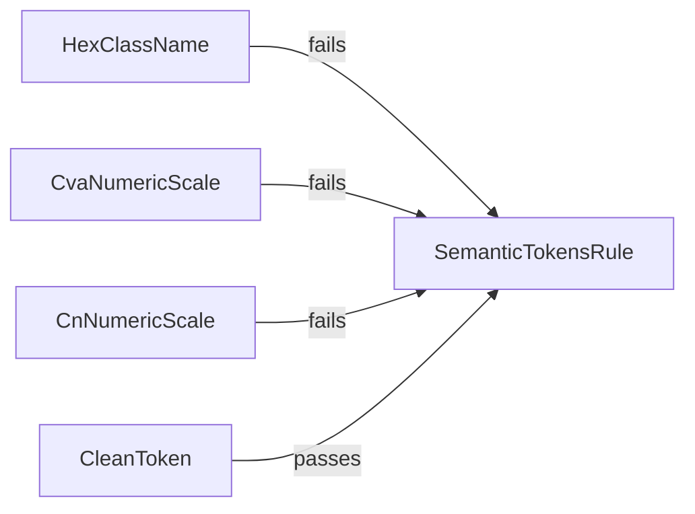

# Chat 6a — pin the theming rule

F108 (theming half only). The theming hard constraint is the only one of the nine whose mechanical enforcement has no test. Copy the existing motion-tier `lintText` pattern in [eslint.config.unit.test.ts](eslint.config.unit.test.ts). No production behavior change. No migrations. Do not commit.

## Precondition

Before editing anything, run `git status` and record the working tree's starting state. Earlier chats or `next dev` rewriting the `nextjs-agent-rules` block in `AGENTS.md` may already be dirty. Do not stash, revert, or clean — only record it.

## What is wrong

[eslint-rules/semantic-tokens.mjs](eslint-rules/semantic-tokens.mjs) is the sole gate that a raw hex color or a numeric Tailwind scale actually fails CI. [eslint.config.unit.test.ts](eslint.config.unit.test.ts) already has a working `lintText` pattern for `local/motion-tier`, but `getLocalRuleBlock` is hard-typed to that one rule name, so it cannot fetch the theming rule without a type edit. Nothing in the repo currently asserts that `#ff0000` or `bg-red-500` produces a lint error.

## Helper: widen, then reuse

In [eslint.config.unit.test.ts](eslint.config.unit.test.ts):

1. **Widen `getLocalRuleBlock`.** Change the two hard-coded `'motion-tier'` / `'local/motion-tier'` parameter types to the union of all four custom rules this repo owns:
   - `motion-tier` / `local/motion-tier`
   - `semantic-tokens` / `local/semantic-tokens`
   - `no-unquarantined-skips` / `seminova-test/no-unquarantined-skips`
   - `test-scope-naming` / `seminova-test/test-scope-naming`

   The last two are unused in this chat on purpose. Chat 6b's contract is "helper already widened" — if the union stops at theming, 6b has to edit the signature again.

   **Types only.** Leave the helper body alone — the `block.plugins.local.rules[pluginName]` lookup already resolves theming, because theming and motion-tier share the `local` plugin. Generalizing that lookup is 6b's job (see Out of scope).

2. **Lift the ESLint factory** that the motion-tier describe currently closes over, so both describes pass in a config block and a fake file path. Same options as today (`overrideConfigFile: true`, JSX parser features, the block's plugins/rules/ignores). Motion-tier assertions stay identical.

3. Add `getSemanticTokensBlock()` next to `getMotionTierBlock()`, calling the widened helper with `semantic-tokens` / `local/semantic-tokens`.

Do not rename the helper. Do not add overloads or a mapped type to correlate the two parameters — the existing unpaired literals stay unpaired, just with more members.

## Four cases, nothing else

New `describe('eslint local/semantic-tokens rule')` in the same file. Fake paths under `src/components/` so they match the rule's `src/**/*.{ts,tsx}` glob (the files do not need to exist on disk — `lintText` is enough, same as motion-tier). Filter messages by `local/semantic-tokens` only.

One case per top-level visitor entry in [eslint-rules/semantic-tokens.mjs](eslint-rules/semantic-tokens.mjs) (`JSXAttribute`, the `cva` branch of `CallExpression`, the `cn` branch of `CallExpression`), plus one control.

- **Hex in `className` fails.** Source: a component whose `className` is `bg-[#ff0000]`. Expect at least one message whose text names `#ff0000` and semantic tokens. This is the realistic Tailwind-arbitrary path the constraint is for.
- **Numeric scale inside a `cva` variant fails.** Source: `cva('text-foreground', { variants: { tone: { danger: 'bg-red-500' } } })`. No import needed — the rule keys off the callee name `cva`. Expect a message that names `bg-red-500` (or "Numeric Tailwind"). This is the second scan entry the constraint actually uses; a second `className` would not prove `cva` is wired.
- **Numeric scale inside a `cn()` argument fails.** Source must include the real import line — `import { cn } from '@/utils/tailwind'` — followed by a `cn('bg-red-500')` call. The import is load-bearing, not decoration: the rule only scans `cn` calls whose callee name it collected from an `ImportDeclaration` matching that source, so this is the one entry point whose enforcement is conditional and can silently stop firing. Expect a message that names `bg-red-500`.
- **Clean semantic token passes.** Source: `className='bg-background text-foreground'`. Expect zero `local/semantic-tokens` messages.

Do not add a `src/components/ui/` ignore case. The theming and motion-tier rules are enabled in two separate config blocks that each declare their own `ignores: ['src/components/ui/**']`, so motion-tier's ignore case does not cover theming's copy — the case is skipped because losing that ignore makes CI stricter and fails loudly on real files, not because the coverage is shared.

Do not add template literals, `cn()` with conditional/logical arguments, compound variants, or any other walker branch — those are AST internals, which this chat hard-stops. The `cn()` case above tests the visitor entry and its import binding, not the walker beneath it: keep its argument a plain string literal.

## Out of scope

- Chat 6b: skip-quarantine and test-scope-naming cases. Do not add those describes. Do not open those two rule files.
- Chat 6b also owns generalizing the helper's plugin lookup. Those two rules live under the `seminova-test` plugin in [eslint.config.mjs](eslint.config.mjs), not `local`, so `block.plugins.local.rules[pluginName]` will need to become "any plugin on the block whose `rules` contain this name." Leave it alone here — nothing in this chat exercises that path, and 6b's own cases will.
- Chat 6c / F122: do not touch [vitest.config.ts](vitest.config.ts) coverage `include`. These tests will run; they will not move the 80% number, and that is intended.
- F119 (shared AST visitor extract), F120 (scope the named ESLint gates), F186 (check-script tests).
- Changing the theming rule, [eslint.config.mjs](eslint.config.mjs), or AGENTS.md. The constraint is unchanged; only its test pin is new.
- **Committing and opening a PR.** Do neither.

## Docs

F108 is not fully done until 6b, so **do not move it to Resolved.**

After `CI=true pnpm pre-push` is green, in [TECH_DEBT_AUDIT.md](TECH_DEBT_AUDIT.md):

- Update the F108 Open-row description: theming `lintText` cases exist in `eslint.config.unit.test.ts` covering all three of the rule's visitor entries; remaining work is one positive and one negative case each for the skip and naming rules, plus generalizing the helper's plugin lookup off `plugins.local` (Chat 6b).
- Update the executive-summary sentence that currently says the theming rule has zero tests, so it does not claim a hole this chat just closed. Leave F122's coverage-include hole as stated — that is still true.
- Leave § Top 5 item 1 and § Quick wins alone (they are about F122 sequencing and the remainder, not a false "theming is untested").

No README, DESIGN.md, AGENTS.md, or `/sync-repo-docs`. Nothing here is env, scripts, or tokens.

## Quality bar

- Targeted: `pnpm test:file -- eslint.config.unit.test.ts`
- Then: `CI=true pnpm pre-push` (a bare `pnpm pre-push` aborts in a non-TTY agent shell — see the audit § Tooling notes)
- No browser pass — this is a lint-rule unit test, no UI

## Manual test checklist

- Run the ESLint unit test file: the four new theming cases pass, and the three existing motion-tier cases still pass.
- Confirm `pnpm check:semantic-tokens` is unchanged (still green on the real tree; the new cases only exist as `lintText` fixtures).
