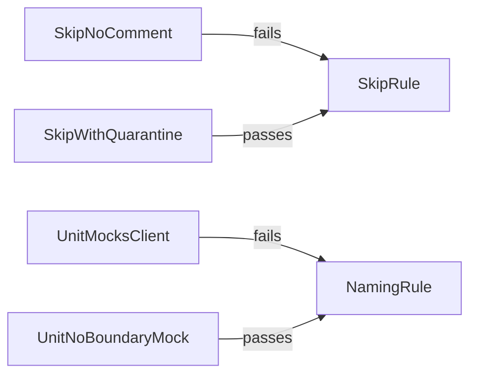

# Chat 6b — pin the other two local rules

F108 remainder. [eslint.config.unit.test.ts](eslint.config.unit.test.ts) already has a widened helper type and theming cases from 6a. The helper body still looks up `block.plugins.local` only, so it cannot fetch the two `seminova-test` rules. Generalize that lookup, add four `lintText` cases, resolve F108. No production behavior change. No migrations. Do not commit.

## Precondition

Before editing anything, run `git status` and record the working tree's starting state. Earlier chats or `next dev` rewriting the `nextjs-agent-rules` block in `AGENTS.md` may already be dirty. Do not stash, revert, or clean — only record it.

## What is wrong

[eslint-rules/no-unquarantined-skips.mjs](eslint-rules/no-unquarantined-skips.mjs) and [eslint-rules/test-scope-naming.mjs](eslint-rules/test-scope-naming.mjs) are the other two custom gates a spin-off inherits. Nothing in the repo currently asserts that a bare `it.skip` fails, or that a `.unit.test.tsx` file mocking `@/supabase/client` must be renamed. Both rules live under the `seminova-test` plugin in [eslint.config.mjs](eslint.config.mjs) (the test-file block around the `seminova-test` plugin registration), not `local`. `getLocalRuleBlock` still finds plugins via `block.plugins?.local?.rules?.[pluginName]`, so calling it with either of those two names throws today.

## Helper: generalize the plugin lookup

In [eslint.config.unit.test.ts](eslint.config.unit.test.ts), change only the `pluginBlock` find inside `getLocalRuleBlock`. Instead of hard-coding `plugins.local`, derive the plugin namespace from the `ruleId` argument (the segment before the `/`) and find the block where `block.plugins?.[namespace]?.rules?.[pluginName]` exists. Do not search every plugin for the bare rule name — the namespace is already in hand, and a bare-name search would resolve to the wrong block if two plugins ever register the same rule name. Motion-tier and semantic-tokens still resolve (`local` namespace); the two `seminova-test` names start resolving. Leave the `ruleBlock` find (`block.rules?.[ruleId] === 'error'`) and the returned `{ files, ignores, plugins, rules }` shape alone.

Do not rename the helper. Do not add overloads. The type unions from 6a already include all four rules — do not touch them.

Add `getNoUnquarantinedSkipsBlock()` and `getTestScopeNamingBlock()` next to the existing getters, calling the helper with `no-unquarantined-skips` / `seminova-test/no-unquarantined-skips` and `test-scope-naming` / `seminova-test/test-scope-naming`. Reuse `createLocalRuleEslint` as-is.

## Four cases, nothing else

Two new `describe` blocks in the same file. Fake paths do not need to exist on disk. Filter messages by the specific rule id only. Do not edit the motion-tier or semantic-tokens describes.

All four fixture sources are **plain JavaScript**, even the `.tsx`-suffixed ones. `createLocalRuleEslint` configures only `ecmaFeatures: { jsx: true }` on the default espree parser, so a type annotation or any other TypeScript syntax in a fixture throws a parse error instead of exercising the rule.

**Skip rule** — fake paths matching the test glob in [eslint.config.mjs](eslint.config.mjs) (for example `src/components/skip-fail.unit.test.ts`). `it.skip` is the representative; do not also pin `xit`, `.todo`, or `describe.skip`.

- **Bare skip fails.** Source: `it.skip('flaky', () => {})` with no preceding comment. Expect at least one `seminova-test/no-unquarantined-skips` message whose text names `QUARANTINE`.
- **Quarantined skip passes.** Same `it.skip`, with a preceding line comment that satisfies the rule's real pattern: the word `QUARANTINE:`, a reason, and a GitHub issue URL (`https://github.com/<org>/<repo>/issues/<n>`). A comment that only says `QUARANTINE` without the URL still fails — the URL is load-bearing, same class as the `cn()` import in 6a. Use `https://github.com/aaronwllms/seminova/issues/1` as the fixture URL (the issue does not need to exist). Expect zero messages for this rule.

**Naming rule** — fake paths **must** end in `.unit.test.tsx` and **must not** sit under `_lib/`. The rule returns an empty visitor for `.unit.test.ts` (no `x`) and for `_lib/**`; those paths would make the fail case a vacuous pass. Example: `src/components/scope-fail.unit.test.tsx`. The mock check is a raw string includes of `vi.mock('…'` with **single quotes** — double-quoted `vi.mock` does not fire.

- **Unit file mocking a session/auth boundary fails.** Source must include `vi.mock('@/supabase/client'` (single quotes; that module is one of the four the rule lists). Expect at least one `seminova-test/test-scope-naming` message whose text names `.integration.test`.
- **Unit file with no boundary mock passes.** Same path suffix, a trivial `it('works', …)` and no `vi.mock` of `@/supabase/client`, `@/supabase/server`, `@/supabase/require-auth`, or `next/headers`. Expect zero messages for this rule.

Do not add a `_lib/` exclusion case, a colocated-`actions` mock under `_components/`, or any other visitor branch — those are rule internals, which this chat hard-stops.

## Out of scope

- Chat 6a theming cases: do not edit them, the semantic-tokens getter, or [eslint-rules/semantic-tokens.mjs](eslint-rules/semantic-tokens.mjs).
- Chat 6c / F122: do not touch [vitest.config.ts](vitest.config.ts) coverage `include`. These tests will run; they will not move the 80% number, and that is intended.
- Do not modify [eslint-rules/no-unquarantined-skips.mjs](eslint-rules/no-unquarantined-skips.mjs) or [eslint-rules/test-scope-naming.mjs](eslint-rules/test-scope-naming.mjs). Pin what they do today.
- F119 (shared AST visitor), F120 (scope named ESLint gates), F186 (check-script tests).
- Changing [eslint.config.mjs](eslint.config.mjs), AGENTS.md, or `testing.mdc`. The constraints are unchanged; only their test pins are new.
- **Committing and opening a PR.** Do neither.

## Docs

F108 is complete after this chat. After `CI=true pnpm pre-push` is green, in [TECH_DEBT_AUDIT.md](TECH_DEBT_AUDIT.md):

- Move F108 to § Resolved with today's date (2026-08-28): all four custom lint rules now have `lintText` pins in `eslint.config.unit.test.ts`; helper resolves the rule from whichever plugin owns it.
- Update the executive-summary sentence that still says skip-quarantine and test-scope-naming are untested and the helper is hard-coded to `plugins.local`. Leave F122's coverage-include hole as stated — that is still true.
- Update § Top 5 item 1 so it no longer treats F108 as open. The remaining enforcement-layer hole is F122 (then F119, sequenced after 6c).
- Update § Architectural mental model, which still names F108 in the enforcement-layer sentence "It is also the least-tested part of the repo (F108, F116, F122)" — drop F108 from that list.
- In § Quick wins, keep the F122 bullet but strike its trailing "(do this before F108)" — F108 is closed, so the sequencing note is no longer true. Do not otherwise reorder or remove the section.

No README, DESIGN.md, AGENTS.md, or `/sync-repo-docs`. Nothing here is env, scripts, or tokens.

## Quality bar

- Targeted: `pnpm test:file -- eslint.config.unit.test.ts`
- Then: `CI=true pnpm pre-push` (a bare `pnpm pre-push` aborts in a non-TTY agent shell — see the audit § Tooling notes)
- No browser pass — this is a lint-rule unit test, no UI

## Manual test checklist

- Run the ESLint unit test file: the four new skip/naming cases pass, and the existing motion-tier and semantic-tokens cases still pass.
- Confirm `pnpm lint` is unchanged (still green on the real tree; the new cases only exist as `lintText` fixtures).
