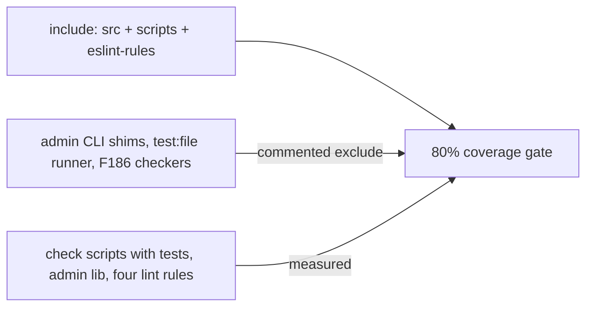

# Chat 6c — coverage include matches the enforcement layer

F122. Coverage `include` is `src/**` only, so custom lint rules and check scripts never touch the 80% number. Widen include, exclude what still has no tests, run the coverage gate, and record what the enforcement layer actually scores. No production behavior change. No migrations. Do not commit.

**What this does and does not close.** Widening `include` makes the enforcement layer *measured and visible* in the coverage report. It does not make the gate bite on it: `eslint-rules/**` plus the measured `scripts/**` files add roughly 1.5–2k lines to a denominator of ~12–18k measured `src/` lines, so a lint rule sitting at 30% moves the global number by about a point — inside the existing headroom. Making the gate actually enforce this code needs a per-glob threshold, which cannot be set until this chat produces the baseline numbers. That is F189, filed here, done later. Word the doc edits accordingly — do not claim the structural hole is shut.

Must follow 6a and 6b: the four lint rules already have `lintText` pins, so adding `eslint-rules/**` does not dump ~570 untested lines into the denominator.

## Precondition

Before editing anything, run `git status` and record the working tree. Do not stash, revert, or clean.

Confirm 6b landed: [TECH_DEBT_AUDIT.md](TECH_DEBT_AUDIT.md) has F108 in § Resolved, and [eslint.config.unit.test.ts](eslint.config.unit.test.ts) has the skip-quarantine and test-scope-naming describes. If either is missing, **stop** — flipping include first is what this chat exists to avoid.

## What is wrong

[vitest.config.ts](vitest.config.ts) coverage `include` is `src/**/*.{ts,tsx}`. Tests under `scripts/` already run; their source is invisible to the threshold. The four files in [eslint-rules/](eslint-rules/) are imported by [eslint.config.mjs](eslint.config.mjs) and exercised by `lintText`, and they are also invisible. That is why untested enforcement code could grow with every gate green.

## Config: widen include, exclude the untested remainder

In [vitest.config.ts](vitest.config.ts), change coverage `include` to:

- `src/**/*.{ts,tsx}` (unchanged)
- `scripts/**/*.{ts,mjs}`
- `eslint-rules/**/*.mjs`

Leave the existing `src/` excludes and the 80% thresholds alone.

Add new excludes for everything that still has no test. Comment each one. Do not write those tests — that is F186 (later) or a different chat.

**Admin CLI entry shims** — one-liners that call `runCliScript`. Logic lives in `lib/`, which already has tests. Use the glob `scripts/admin/*.ts` so it matches only the four entries (`promote-admin`, `demote-admin`, `list-admins`, `delete-user`) and not `lib/`.

**Admin lib with no tests** — [cli.unit.test.ts](scripts/admin/lib/cli.unit.test.ts) mocks all three, so they would land at 0% if included:

- `scripts/admin/lib/env.ts` — pass-through to `loadServiceEnvForCli`
- `scripts/admin/lib/prompt.ts` — interactive stdin
- `scripts/admin/lib/service-client.ts` — thin `createClient` wrapper

**Check-script entry-point shim:** `scripts/checks/vitest-file.mjs` — the `pnpm test:file` spawn wrapper. Not a `check:*` gate.

**The two check scripts with no tests yet (F186):** `scripts/checks/checks-wired.mjs` and `scripts/checks/pnpm-only.mjs`. Comment both with F186 as the upgrade path so they stay greppable.

**Stay in the denominator** (already have tests, or `lintText` pins from 6a/6b):

- Check scripts: `a11y-contrast`, `a11y-structure`, `seo-base-url`, `no-profiles-role`, `supabase-env`
- Admin lib: `cli.ts`, `admin-users.ts`
- All four `eslint-rules/*.mjs`

**Comment style.** The two F186 checkers get `// debt:` markers naming the ceiling and upgrade path — they are intentional shortcuts with a route out, and `vitest.config.ts` already carries one on the `opengraph-image.tsx` line. The shim exclusions (the four admin CLI entries, `vitest-file.mjs`, and the three thin admin lib modules) have no upgrade path and stay plain explanatory comments — do not mark them as debt.

The `isMain` CLI blocks at the bottom of the five tested checkers will show as uncovered. That is a few lines per file — leave them. Do not add `istanbul ignore` comments in those files (not config-only). Rely on Vitest’s default coverage exclude for `*.test.*` files; do not duplicate it.

## If the 80% gate fails

Stop and ask. Do not write the missing tests. Do not lower the threshold. Do not exclude a file that already has tests (that would undo F122). Do not add walker-branch `lintText` cases to inflate eslint-rules coverage (6a/6b hard-stopped those as rule internals; F119 is the follow-up after this chat).

## Out of scope

- F186 — tests for `checks-wired.mjs` / `pnpm-only.mjs`. Exclude them; do not extract or test them.
- F119 — shared AST visitor. Unblocked by this chat, not in it.
- F120, F138, F121 — other check-script chats.
- **Setting the per-glob thresholds themselves (F189).** File the finding with the measured numbers; do not add threshold globs to `vitest.config.ts` in this chat.
- Changing the 80% numbers, AGENTS.md, or any check script / lint rule source.
- **Committing and opening a PR.** Do neither.

## Docs

After `CI=true pnpm test:ci` is green (then `CI=true pnpm pre-push`), in [TECH_DEBT_AUDIT.md](TECH_DEBT_AUDIT.md):

- Move F122 to § Resolved with today's date (2026-08-28). Word it as **measured and visible, not closed**: coverage `include` now covers `scripts/**` and `eslint-rules/**` so the enforcement layer appears in the report; untested admin CLI shims, `vitest-file.mjs`, and the two F186 checkers are explicit commented excludes. State that the global threshold still does not gate this code and point at F189.
- Update the executive-summary sentence that names F122 as the remaining structural hole. The hole narrows, it does not shut — the enforcement layer is now measured, the gate still does not enforce it (F189), and most check scripts remain excluded pending F186.
- Update § Architectural mental model — the sentence currently reads “least-tested part of the repo (F116, F122)”. Drop F122, and **replace F116 with F186**: that sentence is about the enforcement layer, and F116 is `use-password-accordion-scroll.ts`, a scroll hook in `src/hooks/` with no enforcement role. Deferred status does not disqualify F186 from a descriptive sentence.
- Update the § Verified OK bullet on coverage exclusions — it enumerates the current src-only set (`page.tsx` / `layout.tsx` / `src/components/ui/**` / reference demo shells / static workflow sections) and is incomplete once the scripts and eslint-rules exclusions land. Add them; keep the existing reasoning intact.
- **Add F189 to § Open** (Status `Do next`, Category `Test debt`, `vitest.config.ts`, Severity Medium, Effort S): global thresholds are computed across the whole denominator, so the ~1.5–2k lines of enforcement code added by F122 cannot move the number enough to fail the gate — untested lint rules and check scripts can still grow with `pre-push` green. Recommendation: add per-glob thresholds for `eslint-rules/**` and `scripts/**` under `coverage.thresholds` (Vitest 3.2 supports glob keys alongside the global ones). **Carry the measured per-file percentages from this chat's coverage run into the finding text** so the follow-up sets the numbers from data rather than guessing.
- Add F189 to § Quick wins (Low effort, Medium severity, Open — it meets the section's criteria).
- **Remove** the F122 Quick wins bullet rather than checking it off — the section is declared “Open only,” so a resolved item does not belong there checked or unchecked.
- Replace § Top 5 item 1 (currently F122). Promote F106 to 1 and shift the existing items up; **add F119 as the new item 5** — the deleted item is what currently carries the F119 thread (110 byte-identical lines across two hard-constraint lint rules that drift independently), and it is actionable now that 6a/6b's pins exist. Keep the note that F119 is unblocked.
- On the F186 Deferred row, replace “Sequence with F122 so coverage counts it” — those two files are now explicit excludes until F186 writes the tests.

In [testing.mdc](.cursor/rules/testing.mdc) § Coverage Requirements, update **both** sentences that go stale:

- **In scope** — no longer “app logic under `src/` only”; it now includes the check scripts and custom lint rules.
- **Excluded from denominator** — currently enumerates src-only exclusions and is now incomplete.

Point at `vitest.config.ts` as the authoritative exclude list (already the closer). One sentence each; do not restate the whole exclude set.

No README, DESIGN.md, AGENTS.md, TEST_AUDIT.md, or `/sync-repo-docs`. Nothing here is env, scripts table, tokens, or a rule-index change.

## Quality bar

- Targeted: `CI=true pnpm test:ci` — this *is* the change; the coverage summary should now list `eslint-rules/` and the measured `scripts/` files, and thresholds must still pass.
- Then: `CI=true pnpm pre-push` (a bare `pnpm pre-push` aborts in a non-TTY agent shell)
- No browser pass — coverage config, no UI

## Manual test checklist

- Run `pnpm test:ci` and confirm the 80% lines/functions/branches/statements thresholds still pass.
- In the coverage summary, confirm `eslint-rules/` and the five tested check scripts appear, and that `checks-wired.mjs`, `pnpm-only.mjs`, and `vitest-file.mjs` do not.
- **Record the per-file lines/functions/branches/statements percentages for all four `eslint-rules/*.mjs` and the measured `scripts/**` files.** These are the baseline F189 needs to set its thresholds from — without them the follow-up is guessing.
- Confirm `pnpm test` (no coverage) is unchanged — include/exclude only affects `test:ci`.
