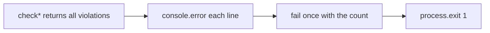

# Chat 7a — print every check-script violation

F138. Five checkers already collect a full violation list, then throw it away: the CLI loop calls `fail`, and `fail` calls `process.exit(1)` on the first line. A PR that breaks six contrast pairs takes six push-fix cycles. Print every violation, then exit once with a count. No migrations. Do not commit.

The original chat named four files. **supabase-env.mjs has the same loop** and is included here (PM call). Still do **not** add a `check:supabase-env` script or teach `checks-wired` about it — that is F121 / Chat 7c.



## Precondition

Before editing anything, run `git status` and record the working tree. Do not stash, revert, or clean.

Confirm 6c landed: [TECH_DEBT_AUDIT.md](TECH_DEBT_AUDIT.md) has F122 in § Resolved. If it is still Open, **stop** — this chat is next in the recommended order, not a substitute for the coverage-include work.

## What is wrong

Each of these files exports a function that returns `{ ok, violations }`. The unit tests already assert that multiple violations are collected (the supabase-env test asserts length 2). The leak is only in the `isMain` block:

```js
for (const violation of result.violations) {
  fail(violation)  // exits on the first call
}
```

Same shape in:

- [scripts/checks/a11y-structure.mjs](scripts/checks/a11y-structure.mjs) (lines 341–345)
- [scripts/checks/a11y-contrast.mjs](scripts/checks/a11y-contrast.mjs) (lines 244–248)
- [scripts/checks/seo-base-url.mjs](scripts/checks/seo-base-url.mjs) (lines 97–101)
- [scripts/checks/no-profiles-role.mjs](scripts/checks/no-profiles-role.mjs) (lines 56–60)
- [scripts/checks/supabase-env.mjs](scripts/checks/supabase-env.mjs) (lines 42–46)

[scripts/checks/checks-wired.mjs](scripts/checks/checks-wired.mjs) already does the right thing: print every miss, then `fail` once with a summary. Copy that shape. Do not extract a shared helper — F174 already owns a `scripts/checks/lib/` extract, and five copies of a four-line reporter is not a reason to start it.

## The change (same in all five)

In each file, hoist the check prefix to a module `const` above `fail` (e.g. `const PREFIX = '[check:a11y-contrast]'`) and use it in both `fail` and the new loop, so the string is written once per file rather than twice. Prefixes: `[check:a11y-structure]`, `[check:a11y-contrast]`, `[check:seo-base-url]`, `[check:admin-gate]` (in `no-profiles-role.mjs`), `[check:supabase-env]`.

Then, in each `isMain` failure branch:

1. Loop the collected violations and `console.error` each one with that file's prefix.
2. Call `fail` **once** with a summary that includes the count and tells the reader what to do, e.g. `2 violation(s) — fix the items listed above.` `fail` still prints the prefix and exits.

**Invariant — this is what the change must preserve.** Each checker still exits non-zero whenever `result.violations` is non-empty, and never reaches its OK `console.log` in that case. `fail` must sit outside the loop but inside the `!result.ok` branch. A version that prints every violation and then exits 0 silently disables four CI-enforced hard constraints and passes every gate.

Otherwise leave `fail`'s body alone. Leave the exported `check*` functions alone — they already return the full list. Leave the OK `console.log` lines alone.

Do not add a `report` helper per file. Do not spawn the CLI from tests. The `isMain` blocks stay uncovered on purpose (Chat 6c left those lines in the denominator as a few uncovered lines; do not add `istanbul ignore`).

## Out of scope

- **F121 / Chat 7c** — do not add `check:supabase-env` to `package.json`, do not teach [scripts/checks/checks-wired.mjs](scripts/checks/checks-wired.mjs) about a file that is not a `check:*` script, do not rename supabase-env out of `scripts/checks/`.
- **F120 / Chat 7b** — do not `--rule`-scope the named ESLint gates.
- **F174** — do not extract `is-main.mjs` or any shared checks lib.
- **F186** — do not write tests for `checks-wired.mjs` or `pnpm-only.mjs`.
- [scripts/checks/pnpm-only.mjs](scripts/checks/pnpm-only.mjs) and [scripts/checks/checks-wired.mjs](scripts/checks/checks-wired.mjs) — they fail on single fatal conditions (or already print-all). Leave them.
- **AGENTS.md** — hard stop. The constraints are unchanged; only the reporter is.
- **Committing and opening a PR.** Do neither.

## Docs

After `CI=true pnpm pre-push` is green, in [TECH_DEBT_AUDIT.md](TECH_DEBT_AUDIT.md):

- Move F138 to § Resolved with today's date (2026-08-28). Note the original four plus supabase-env (same shape, still build-only / F121).
- Append to F189's Open row that its recorded `scripts/checks/` coverage baseline predates this change — the new `isMain` lines are uncovered, so the per-file numbers must be re-measured before per-glob floors are set from them.
- **Remove** the F138 Quick wins bullet rather than checking it off — the section is declared “Open only.”
- Leave § Top 5, executive summary, and mental model alone unless a sentence still claims checkers exit on the first violation. They currently do not.

No README, DESIGN.md, AGENTS.md, `testing.mdc`, or `/sync-repo-docs`.

## Quality bar

- Targeted: `pnpm test:file -- scripts/checks/a11y-structure.unit.test.ts scripts/checks/a11y-contrast.unit.test.ts scripts/checks/seo-base-url.unit.test.ts scripts/checks/no-profiles-role.unit.test.ts scripts/checks/supabase-env.unit.test.ts`
- Then: `CI=true pnpm pre-push` (a bare `pnpm pre-push` aborts in a non-TTY agent shell)
- No browser pass — check-script reporters, no UI

## Manual test checklist

**Failure path first — the clean-tree runs below cannot tell a correct build from a broken one.**

- Create two throwaway files under `src/` that trip `seo-base-url`: one containing a literal `http://localhost:3000`, one reading `process.env.NEXT_PUBLIC_SITE_URL`. Run `pnpm check:seo-base-url` and confirm all four things: every violation prints on its own line, one summary line with the count follows, no OK line appears, and the exit code is 1 (`echo $?`). Delete both scratch files before the final `CI=true pnpm pre-push`.
- For the other four files, confirm the same four properties by reading each diff: prefix on every violation line, `fail` outside the loop, `fail` inside the `!result.ok` branch, OK line unreachable on failure.
- Run `pnpm check:a11y-structure`, `pnpm check:a11y-contrast`, `pnpm check:seo-base-url`, and `pnpm check:admin-gate` on the clean tree — each still prints its OK line and exits 0.
- Confirm existing unit tests still pass (they already assert that multiple violations are *collected*; this chat only changes how the CLI prints them).
- Do not add a `check:supabase-env` script. Running `node scripts/checks/supabase-env.mjs` on a configured tree should still print its OK line.
