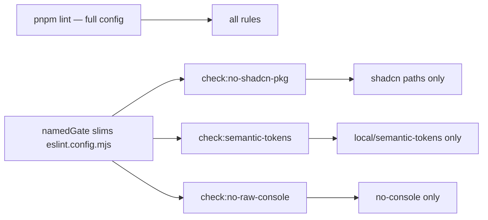

# Chat 7b — named ESLint gates fail only on their own rule

F120. Three named hard-constraint gates all run the full ESLint config today, so a `console.log` failure reports as a semantic-token violation and a server-only import failure can report as “no shadcn package.” Scope each gate to its own rule. `pnpm lint` stays the catch-all. This is an enforcement change: the AGENTS.md hard-constraint list updates in the same commit — wording of how the gate runs, not the constraint itself. No migrations. Do not commit.

## Precondition

Before editing anything, run `git status` and record the working tree. Do not stash, revert, or clean.

Confirm 7a landed: [TECH_DEBT_AUDIT.md](TECH_DEBT_AUDIT.md) has F138 in § Resolved. If it is still Open, **stop** — this chat is next in the recommended order, not a substitute for the reporter work.

## Why `--rule` is a trap

ESLint 9.39.2 `--rule` **merges** with the loaded config. It does not turn other rules off. Official CLI docs: isolation requires `--rule` **plus** `--no-config-lookup`, which then drops the TypeScript parser, the `local/` plugin, the `no-console` ignore list, and the restricted-import path lists.

A second collision: `no-restricted-imports` is two different constraints in [eslint.config.mjs](eslint.config.mjs) — shadcn packages (lines 33–53) and server-only imports (lines 86–134). `--rule no-restricted-imports` would still fail `check:no-shadcn-pkg` on an `@/supabase/service` import. That is the same wrong-diagnostic bug.

Use the audit’s other option: a per-check flat-config export. Invoke with `--config` **and** `--no-config-lookup` so the main config is not merged back in.

## The change

**1. Slim helper** — new [eslint.named-gate.mjs](eslint.named-gate.mjs) next to [eslint.config.mjs](eslint.config.mjs). Repo root, not `scripts/checks/`: Chat 7c’s F121 may start enumerating that folder, and `scripts/**/*.{ts,mjs}` sits inside `coverage.include` in [vitest.config.ts](vitest.config.ts) while root `.mjs` does not — root placement needs no coverage exclusion. One function: take the existing default config, keep parser / plugins / ignores / `globalIgnores`, and drop the rules from every config object except the one carrying the named rule.

**Return new objects — never mutate.** [eslint.config.unit.test.ts](eslint.config.unit.test.ts) imports the same default export, and its existing tests read `block.rules` off it; emptying `rules` in place would corrupt them. Map to a new array of new config objects.

**Throw when nothing matches.** If the named rule — or, when a config `name` is supplied, the named block — is not found, throw instead of returning a config with no rules. A hard-constraint gate that finds nothing must fail loudly, not exit 0.

For `no-restricted-imports`, also require a config `name` so the server-only block is dropped. Add `name: 'seminova/no-shadcn-pkg'` on the shadcn block in [eslint.config.mjs](eslint.config.mjs). Do not rename or merge the server-only block.

**2. Three default-export configs** (two-line files that call the helper):

- [eslint.gate-no-shadcn-pkg.mjs](eslint.gate-no-shadcn-pkg.mjs) — `no-restricted-imports` + `seminova/no-shadcn-pkg`
- [eslint.gate-semantic-tokens.mjs](eslint.gate-semantic-tokens.mjs) — `local/semantic-tokens`
- [eslint.gate-no-raw-console.mjs](eslint.gate-no-raw-console.mjs) — `no-console`

**3. [package.json](package.json)** — keep the same globs, `--cache`, `--max-warnings 0`, and `--no-error-on-unmatched-pattern`. Add `--config <gate file> --no-config-lookup` to each of the three scripts. Do not rename the scripts ( [scripts/checks/checks-wired.mjs](scripts/checks/checks-wired.mjs) and CI key off the names).

**Give each gate its own `--cache-location`.** All four ESLint invocations currently share `node_modules/.cache/eslint/`, which works only because they run the same config. ESLint keys each cached file entry on a hash of that file's resolved config, so once the gates run their own configs none of `pnpm lint`'s entries can hit and the four runs collide in one cache file. Point each gate at its own directory — e.g. `node_modules/.cache/eslint-no-shadcn-pkg/`, `.../eslint-semantic-tokens/`, `.../eslint-no-raw-console/` — and leave `pnpm lint` on the existing path.

**4. Isolation pin** in [eslint.config.unit.test.ts](eslint.config.unit.test.ts) — `lintText` against `namedGate(...)`, same fake-path pattern already used for the local rules. Five cases, no more — each gate needs a positive case, or a gate that silently resolves to no rules passes everything while `pnpm lint` keeps `pre-push` green:

- Semantic-tokens gate + `console.log('x')` → zero messages (foreign rule silent)
- Semantic-tokens gate + `className='bg-red-500'` → `local/semantic-tokens` fires
- Shadcn gate + `import { createServiceClient } from '@/supabase/service'` → zero messages (the shared-rule split)
- Shadcn gate + `import 'shadcn'` → `no-restricted-imports` with the primitive-first message
- No-raw-console gate + `console.log('x')` on a non-exempt `src/` path → `no-console` fires

Do not re-test the rule implementations. Do not spawn the CLI from tests.

**Leftover, do not fix:** on `src/` files, flat-config merge means the later server-only `no-restricted-imports` block replaces the shadcn paths inside `pnpm lint`. After this chat the *named* gate uses only the shadcn block, so `import 'shadcn'` in `src/` will fail `check:no-shadcn-pkg` even if `pnpm lint` still misses it. That strengthening is correct for the named gate. Merging the two blocks is a different finding — leave it.

## AGENTS.md (same change — change protocol)

Update only the **Enforced:** parentheticals on the three bullets. Constraint text stays. Suggested wording:

- `check:no-shadcn-pkg` — ESLint scoped to the shadcn `no-restricted-imports` block; `pnpm lint` remains the catch-all
- `check:semantic-tokens` — ESLint scoped to `local/semantic-tokens`; keep the existing limitation pointer
- `check:no-raw-console` — ESLint scoped to `no-console` with category-aligned exemptions

Do not add file names, `--config`, or `--no-config-lookup` to AGENTS.md.

## Out of scope

- **F121 / Chat 7c** — do not wire or rename `supabase-env.mjs`
- **F138** — reporters already print-all; do not reopen
- **F174** — do not start `scripts/checks/lib/`
- **F186** — do not test `checks-wired.mjs` or `pnpm-only.mjs`
- **F119** — do not extract the shared AST visitor
- [eslint-rules/*.mjs](eslint-rules/) — do not edit the rule implementations
- [.github/workflows/pull-request.yaml](.github/workflows/pull-request.yaml) — script names unchanged
- DESIGN.md, `testing.mdc`, `git-workflow.mdc`, `/sync-repo-docs` — command names unchanged
- README § Scripts table — rows are unchanged. The one README edit this change does require is in § Contributing and quality (see § Docs)
- **Committing and opening a PR.** Do neither.

## Docs

After `CI=true pnpm pre-push` is green, in [TECH_DEBT_AUDIT.md](TECH_DEBT_AUDIT.md):

- Move F120 to § Resolved with today's date (**2026-08-29**). Note per-check config export (not `--rule`), and that the shadcn gate keeps only the shadcn `no-restricted-imports` block so a server-only import does not fail it.
- **Remove** the F120 Quick wins bullet rather than checking it off — the section is declared “Open only.”
- Mental model sentence that still says “two checkers weaker than the contract they appear to serve (F120, F121)” — drop F120 so only F121 remains.
- Leave § Top 5 and the executive summary alone.

And in [README.md](README.md) § Contributing and quality, correct the cache paragraph. It currently claims the repo-wide `lint` run populates the cache and “the narrower per-constraint passes reuse it instead of re-parsing the same files” — false once the gates run their own configs. Replace with a sentence saying each ESLint-backed check keeps its own cache under `node_modules/.cache/`, since the named gates run scoped configs that cannot share the repo-wide cache. Leave the § Scripts table rows alone.

## Quality bar

- Targeted: `pnpm test:file -- eslint.config.unit.test.ts`
- Then the three gates on the clean tree: `pnpm check:no-shadcn-pkg`, `pnpm check:semantic-tokens`, `pnpm check:no-raw-console`
- Then: `CI=true pnpm pre-push` (a bare `pnpm pre-push` aborts in a non-TTY agent shell)
- No browser pass — enforcement wiring, no UI

## Manual test checklist

**Failure path first — the clean-tree runs cannot tell a scoped gate from a full-config one.**

- Add `console.log('scratch')` to a non-exempt file under `src/` (not an ignore in [eslint.config.mjs](eslint.config.mjs)). Confirm `pnpm check:semantic-tokens` still prints OK and exits 0, and `pnpm check:no-raw-console` fails with `no-console` only. Revert.
- Add `className="bg-red-500"` to a non-`ui` component. Confirm `pnpm check:no-raw-console` still exits 0, and `pnpm check:semantic-tokens` fails with `local/semantic-tokens` only. Revert.
- Add `import 'shadcn'` to a `src/` file. Confirm `pnpm check:no-shadcn-pkg` fails with the primitive-first message, and the other two named gates still exit 0. Revert.
- On the clean tree, all three named gates still print OK and exit 0. `pnpm lint` still fails on the same classes of violation it does today (it is the catch-all).
