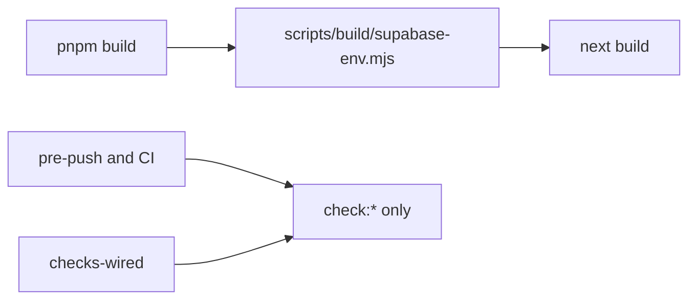

# Chat 7c — three small enforcement-adjacent fixes

F121, F110, F182. Three independent edits. No migrations. Do not add `check:supabase-env`. Do not commit.

**Locked for F121:** keep it build-only. Move the file to [`scripts/build/`](scripts/build/), header comment, prefix `[build:supabase-env]`. Do not wire pre-push or CI. `checks-wired.mjs` stays a `check:*` inventory — it must not start enumerating the folder.

## Precondition

Before editing anything, run `git status` and record the working tree. Do not stash, revert, or clean.

Confirm 7b landed: [TECH_DEBT_AUDIT.md](TECH_DEBT_AUDIT.md) has F120 in § Resolved. If it is still Open, **stop** — this chat is next in the recommended order, not a substitute for the named-gate work.

## F121 — move supabase-env out of the checks namespace

Today [`scripts/checks/supabase-env.mjs`](scripts/checks/supabase-env.mjs) prints `[check:supabase-env]`, sits beside real gates, and has a colocated test — but [`package.json`](package.json) line 19 is the only invocation (`build`). CI has no build step. `checks-wired` enumerates `check:*` keys, so it never sees this file. The file looks like a gate and is not one.

**Move, do not promote.**

1. Create [`scripts/build/supabase-env.mjs`](scripts/build/supabase-env.mjs) from the current file. Delete the old path.
2. File-header comment, one or two lines: build-only guard, not a `check:*` gate, invoked only from `pnpm build`.
3. Change `PREFIX` to `[build:supabase-env]`. Use that constant for `fail`, the per-violation `console.error` lines, **and** the OK `console.log` (line 54 currently hardcodes the old prefix).
4. Leave `checkSupabaseEnv` and the `{ ok, violations }` shape alone. Leave the print-all-then-`fail`-once reporter from F138 alone.
5. Move [`scripts/checks/supabase-env.unit.test.ts`](scripts/checks/supabase-env.unit.test.ts) to [`scripts/build/supabase-env.unit.test.ts`](scripts/build/supabase-env.unit.test.ts). The relative import stays `./supabase-env.mjs`. Do not add cases.

**[`package.json`](package.json) line 19 only:**

`node scripts/build/supabase-env.mjs && next build`

Do not add a `check:supabase-env` script. Do not touch `pre-push`. Do not touch [`.github/workflows/pull-request.yaml`](.github/workflows/pull-request.yaml). Do not edit [`scripts/checks/checks-wired.mjs`](scripts/checks/checks-wired.mjs).

**Coverage:** [vitest.config.ts](vitest.config.ts) already includes `scripts/**/*.{ts,mjs}`. The new path stays in the denominator. There is no supabase-env exclude to update. Do not add one.

**Lint:** `no-console` only sweeps `src/**` and `scripts/admin/**` TypeScript. A `.mjs` reporter is already outside that sweep — moving it does not create a raw-console failure.

**Docs that would name the old path:**

- [SECURITY_AUDIT.md](SECURITY_AUDIT.md) § Verified OK, W1 bullet — change `scripts/checks/supabase-env.mjs` to `scripts/build/supabase-env.mjs`. That bullet is the only occurrence of the path; “W1” also appears as a Category value in the Open table — not that.
- [`.cursor/rules/testing.mdc`](.cursor/rules/testing.mdc) coverage “In scope” sentence — add build guards under `scripts/build/` next to the existing `scripts/checks/` clause.
- [`.cursor/rules/logging.mdc`](.cursor/rules/logging.mdc) § Exempt raw `console.*` call sites — add a `scripts/build/*.mjs` row to the **Not application logging** group, reason: build-time guard output. The section states raw `console.*` is correct *only* at the listed surfaces, and the existing `scripts/checks/*.mjs` row is already a surface `check:no-raw-console` never sweeps — gate coverage is not the table's inclusion criterion, so the moved file needs its own row.

Before editing, grep the repo for `scripts/checks/supabase-env` and update any hit beyond the files named above, or confirm there are none. The two bullets above are an enumeration, not a verified sweep — `.cursor/skills/` and `docs/` have not been checked.

README env table already says the public Supabase vars are required for `pnpm build`. Leave the scripts table alone — no new `check:*` row.

## F110 — madge invocation in the audit skill

One file: [`.cursor/skills/audit-tech-debt/SKILL.md`](.cursor/skills/audit-tech-debt/SKILL.md) lines 126–127.

Both the pnpm and npm stack-tooling lines still say `npx madge --circular`. Replace each with the command already recorded in [TECH_DEBT_AUDIT.md](TECH_DEBT_AUDIT.md) Tooling notes:

`npx madge --circular --extensions ts,tsx --ts-config tsconfig.json src`

Include `src` so the next full pass is the invocation that actually resolves `@/` aliases. Do not edit Tooling notes (it already has both the correct command and the false-negative example).

## F182 — drop unused registry

**Decided:** remove `@shadcnblocks` until a registry is actually adopted.

**`baseColor` stays.** The shadcn `components.json` schema (`https://ui.shadcn.com/schema.json`) lists `config`, `css`, `baseColor`, and `cssVariables` as **required** inside `tailwind`. Deleting `baseColor` makes the file fail CLI config validation, breaking `pnpm dlx shadcn@latest add` — the workflow `ui-shadcn.mdc` prescribes for adding primitives. `registries` is optional and safe to remove.

In [`components.json`](components.json):

- Delete the entire `registries` block.

Leave `style`, `rsc`, `tsx`, the whole `tailwind` block (including `baseColor`), aliases, and icon library alone.

**Rule edits (same change):** one correction — the 7b “correct the sentence that is now false” pattern — plus one addition that replaces what the deleted config implied.

- [`.cursor/rules/ui-shadcn.mdc`](.cursor/rules/ui-shadcn.mdc) lines 25–26 — delete the shadcnblocks example from the Adding shadcn/ui Components block. Leave line 12's config summary alone; `baseColor: slate` is still accurate.
- [`.cursor/rules/ui-shadcn.mdc`](.cursor/rules/ui-shadcn.mdc), same section — add the review expectation for third-party registries: components added from any registry other than shadcn's own need review before landing in `src/components/ui`, because `check:no-shadcn-pkg` only blocks npm-package imports and a CLI-vendored file trips no gate. This is a new line, not a deletion — read [`.cursor/skills/rule-authoring/SKILL.md`](.cursor/skills/rule-authoring/SKILL.md) before editing the rule and follow its authoring standard for both edits.

Do not edit [DESIGN.md](DESIGN.md) — its `baseColor` bullet and re-skin `baseColor` step both stay true.

Do not run `/sync-repo-docs`. README and AGENTS.md do not mention the registry. Leave the sync-repo-docs skill’s `baseColor` checklist trigger alone.

**This is config hygiene, not an enforcement fix.** `registries` is a nickname map read only by the shadcn CLI — it is not imported, bundled, or read at runtime, and official `shadcn add <component>` does not go through it. Removing it deletes an unused shorthand and changes nothing about how components are added. It does **not** close the primitive-first enforcement gap: the CLI accepts a bare registry URL (`shadcn add "https://example.com/r/button.json"`) with no `components.json` entry involved, so third-party vendoring into `src/components/ui` stays ungated. `check:no-shadcn-pkg` still only blocks npm-package imports; that stays as-is. Do not add a registry-block to the ESLint gate — the gap is covered by the review expectation added to `ui-shadcn.mdc` below.

## Out of scope

- **F120 / F138** — already Resolved. Do not reopen named gates or reporters.
- **F174** — do not start `scripts/checks/lib/`. Update the Open row’s path list only (see Docs).
- **F186** — do not test `checks-wired.mjs` or `pnpm-only.mjs`.
- **F189** — do not add per-glob coverage floors.
- **F119** — do not extract the shared AST visitor.
- **AGENTS.md** — not a hard-constraint change.
- CI workflow, `pre-push`, `checks-wired.mjs`.
- **Committing and opening a PR.** Do neither.

## Docs

After `CI=true pnpm pre-push` is green, in [TECH_DEBT_AUDIT.md](TECH_DEBT_AUDIT.md):

- Move F121, F110, and F182 to § Resolved with today's date (**2026-08-29**).
  - F121: moved to `scripts/build/`, `[build:]` prefix, still build-only, not a `check:*`.
  - F110: skill lines now match Tooling notes, including `src`.
  - F182: `registries` removed as unused CLI config; the `ui-shadcn.mdc` shadcnblocks example deleted and a third-party-registry review expectation added in the same change. `baseColor` retained — the shadcn `components.json` schema requires it, so removing it would break `shadcn add`. Note the removal is hygiene, not an enforcement fix: the CLI accepts a bare registry URL, so vendoring into `src/components/ui` remains ungated by design — the `ui-shadcn.mdc` line is what covers it.
- **Remove** the F110 and F121 Quick wins bullets rather than checking them off — the section is declared “Open only.”
- Mental model sentence that still says “one checker weaker than the contract it appears to serve (F121)” — drop that clause. Nine wired hard constraints stays.
- Exec-summary parenthetical “(F109, F110)” — F110 is closed; leave F109.
- F174 Open row: point the leftover unguarded `pathToFileURL` at `scripts/build/supabase-env.mjs` — do not drop it, the instance is still live — and adjust the “all five check scripts” wording to match. Also adjust the recommendation: the proposed shared `is-main` helper now serves a consumer outside `scripts/checks/`, so its home is an open question rather than settled at `scripts/checks/lib/`. Do not implement F174.
- F186 Open row: “the other five all have one” becomes “the other four” (supabase-env is no longer a check script).
- F189 Open row: append that the recorded `scripts/checks/supabase-env.mjs` baseline predates this move — re-measure `scripts/build/` before setting floors.
- Remove F182 from § Open questions.
- Bump the header `Last synced:` to **2026-08-29**.

Leave § Top 5 alone.

## Quality bar

- Targeted: `pnpm test:file -- scripts/build/supabase-env.unit.test.ts`
- Then: `CI=true pnpm pre-push` (a bare `pnpm pre-push` aborts in a non-TTY agent shell)
- No browser pass — config, skill, and a build-only reporter

## Manual test checklist

**Failure path first.**

- Run `node scripts/build/supabase-env.mjs` with the two public vars unset or set to the `.env.example` placeholders (override via the environment for that command so `.env.local` does not mask the miss). Confirm two violation lines, one summary with the count, prefix `[build:supabase-env]`, no OK line, exit 1.
- On a configured tree, the same command prints the OK line and exits 0.
- Confirm `package.json` has no `check:supabase-env`. `pnpm check:checks-wired` still reports 10 checks and exits 0.
- `pnpm build` still invokes the new path first (read the `build` script). Do not need a full production build if env is present and the unit test plus the CLI run above already exercise the checker.
- Run `pnpm exec eslint scripts/build/supabase-env.unit.test.ts` and confirm it is **not** reported as ignored. `eslint.config.mjs` `globalIgnores` carries `build/**`; if that pattern is not root-anchored the moved test silently drops out of `seminova-test/no-unquarantined-skips` and `test-scope-naming`, and `pre-push` stays green either way.
- Confirm `components.json` has no `registries` block and still has `tailwind.baseColor`.
- Confirm the audit skill’s two madge lines both include `--ts-config tsconfig.json` and `src`.
