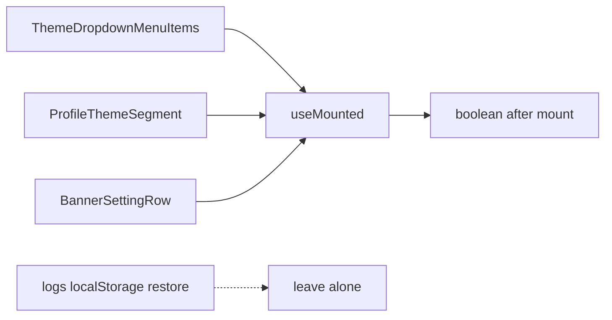

# Chat 8 — one mount guard, not three

F089. Reopen trigger fired: three byte-identical next-themes hydration guards on surfaces a fork keeps. One hook, three call sites. No migrations. No product-behavior change except the fourth copy never appearing. Do not commit.

**Leave alone:** the `set-state-in-effect` suppression at [`src/app/admin/logs/_lib/use-admin-logs-table-state.ts`](src/app/admin/logs/_lib/use-admin-logs-table-state.ts) line 76 — that is a localStorage preference restore, a different shape. The hold-duration suppression in [`src/hooks/use-table-fetch-dim.ts`](src/hooks/use-table-fetch-dim.ts) is also a different shape.

## Precondition

Before editing anything, run `git status` and record the working tree. Do not stash, revert, or clean.

Confirm 7c landed: [TECH_DEBT_AUDIT.md](TECH_DEBT_AUDIT.md) has F121, F110, and F182 in § Resolved. If any of those are still Open, **stop** — this chat is next in the recommended order, not a substitute. Chats 6–7c may still be sitting uncommitted; name those files up front. `next dev` may have dirtied the `nextjs-agent-rules` block in `AGENTS.md`.

## Why extract, not rewrite

React's `useSyncExternalStore` (server snapshot `false`, client snapshot `true`) would delete the lint suppression. We still extract the existing `useState(false)` + mount `useEffect` because:

- It is the contract the chat locked: one hook carrying the single suppression.
- It preserves first paint on the surface that is actually server-rendered: the banner row falls back to `light` until mounted, matching next-themes' documented guard. The store version returns `true` immediately on a client-only mount — which is why the two dropdown-mounted callers (theme menu, profile segment) would render one fewer `null` under it. That is an improvement, not a risk, but it is out of scope here.
- The hook's contract is a bare boolean, so swapping the body onto `useSyncExternalStore` later is a one-file change with no call-site impact.
- Zero intended UX change on the three kept surfaces.

Do not invent options, a `defaultValue`, or a callback. The hook returns a boolean.

## The hook

New file: [`src/hooks/use-mounted.ts`](src/hooks/use-mounted.ts).

Match the conventions in [`src/hooks/use-sign-out.ts`](src/hooks/use-sign-out.ts) and [`src/hooks/use-debounced-value.ts`](src/hooks/use-debounced-value.ts): `'use client'`, named arrow export, no default export. Do not skip the directive — F172 notes `use-mobile` is the only hook without it; do not "fix" that file here.

Body is the three copies' shared five lines:

- `useState(false)`
- empty-deps `useEffect` that sets true
- the existing `eslint-disable-next-line react-hooks/set-state-in-effect` on that setter
- comment on the suppression: hydration guard so the first client paint matches SSR (all three current callers are theme, but the hook is the mount flag)

Return type `boolean`. No extra state, no theme import.

Colocated test: [`src/hooks/use-mounted.unit.test.tsx`](src/hooks/use-mounted.unit.test.tsx) — `.tsx`, because the test renders a probe component.

Do **not** use `renderHook`. React Testing Library wraps it in `act`, so the mount effect has already flushed by the time it returns and `result.current` is `true` — the first-render value is unobservable that way.

Record the value on every render instead, and assert against the recorded sequence:

- A local `Probe` component calls `useMounted()`, pushes the result into an array declared in the test, and returns `null`.
- `render(<Probe />)` from `@testing-library/react`.
- First recorded value is `false` — this is the hydration contract.
- Last recorded value is `true` — the mount effect ran.

Two assertions, one render. Do not test the lint suppression. Do not mock React.

## Convert the three callers

Each site drops its local `mounted` state and the mount effect, then calls `const mounted = useMounted()` from `@/hooks/use-mounted`. Keep the existing `if (!mounted)` / `mounted && …` usage as-is.

1. [`src/components/theme-dropdown-menu-items.tsx`](src/components/theme-dropdown-menu-items.tsx) — still returns `null` until mounted. Drop the `useState` / `useEffect` import from `react` (nothing else uses them).
2. [`src/app/(app)/_components/profile/profile-theme-segment.tsx`](src/app/(app)/_components/profile/profile-theme-segment.tsx) — same: still returns `null` until mounted; drop the unused React state/effect imports.
3. [`src/app/admin/settings/_components/banner-setting-row.tsx`](src/app/admin/settings/_components/banner-setting-row.tsx) — still derives `resolvedPreviewTheme` as `mounted && resolvedTheme === 'dark' ? 'dark' : 'light'`. Keep `previewThemeOverride` state, the form-reset effect, and every other `useState` / `useEffect`. Only the mount flag and its effect move.

Do not restyle, rename, or extract anything else from the banner row (F129, F132, F176 stay closed).

Existing tests already cover the user-visible theme controls after mount — [`theme-dropdown-menu-items.unit.test.tsx`](src/components/theme-dropdown-menu-items.unit.test.tsx), [`profile-theme-segment.unit.test.tsx`](src/app/(app)/_components/profile/profile-theme-segment.unit.test.tsx), [`banner-setting-row.integration.test.tsx`](src/app/admin/settings/_components/banner-setting-row.integration.test.tsx). Do not add cases. They should keep passing because RTL flushes the same mount effect, now inside the hook.

## Out of scope

- **Logs live-enabled restore** and **`use-table-fetch-dim`** suppressions.
- **F172** (`use-mobile` missing `'use client'` / `matches` vs `innerWidth`).
- **Chat 8b / F189** — per-glob coverage floors.
- **Chat 10 / F061** — profile dialog hoist.
- **F176** — `useResetOnChange`.
- Rewriting the hook onto `useSyncExternalStore`.
- **AGENTS.md** — not a hard-constraint change.
- **Committing and opening a PR.** Do neither.

## Docs

After `CI=true pnpm pre-push` is green, in [TECH_DEBT_AUDIT.md](TECH_DEBT_AUDIT.md):

- Move F089 to § Resolved with today's date (**2026-08-29**): `useMounted` in `src/hooks/` carries the single suppression; theme menu, profile segment, and banner row converted; logs localStorage restore left alone.
- Exec-summary reopen-trigger sentence: keep F089 named. The bullet opens "Three reopen triggers fired since the last pass" and enumerates three, so deleting its clause leaves the count wrong. Rewrite the clause to say the trigger fired and is now closed by the extracted `useMounted` hook — the same shape as the F060 clause already in that bullet, which names a trigger alongside its resolution. Leave F061 as the one still open (four profile-dialog mounts).
- Bump `Last synced:` to **2026-08-29**.
- Leave § Top 5 and § Quick wins alone (neither lists F089).

No README, DESIGN.md, AGENTS.md, or `/sync-repo-docs`.

## Quality bar

- Targeted: `pnpm test:file -- src/hooks/use-mounted.unit.test.tsx src/components/theme-dropdown-menu-items.unit.test.tsx src/app/(app)/_components/profile/profile-theme-segment.unit.test.tsx src/app/admin/settings/_components/banner-setting-row.integration.test.tsx`
- Then: `CI=true pnpm pre-push` (a bare `pnpm pre-push` aborts in a non-TTY agent shell)
- Browser pass — this is UI on three kept surfaces. Confirm behavior, not a single screenshot.

## Manual test checklist

**Hydration / first paint first**, then the three controls.

- Load `/` signed in. Open the header theme menu. Light / Dark / System appear after mount (no empty-forever). Selecting Dark applies; no hydration-mismatch warning in the browser console.
- Open the profile dialog from the header account menu — there is no `/settings` route; `src/app/(app)/` has only `home/`. The Light / Dark / System segment appears and switching Dark applies. Same console check.
- `/admin/settings` as admin: expand a banner row. Preview follows the page theme after mount (dark page → dark preview). "Preview light" / "Preview dark" still toggles the override. Save path untouched — do not need a successful save if the existing integration test already covers it.
- Confirm `use-admin-logs-table-state.ts` still has its own localStorage suppression (sanity that this chat did not "also convert" it).
