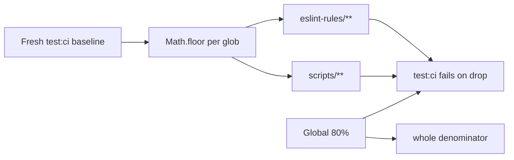

# Chat 8b — the coverage gate actually covers the enforcement layer

F189. 6c made the enforcement layer visible; the global 80% number still cannot fail on it. Two glob floors, set from a **fresh** `test:ci` run — not the F189 table (those numbers predate F138’s uncovered `isMain` reporter lines and F121’s move of `supabase-env` into `scripts/build/`). Config and docs only. No migrations. Do not commit.

## Precondition

Before editing anything, run `git status` and record the working tree. Do not stash, revert, or clean.

Confirm 8 landed: [TECH_DEBT_AUDIT.md](TECH_DEBT_AUDIT.md) has F089 in § Resolved. If it is still Open, **stop**. Chat 8 files may still be uncommitted (`src/hooks/use-mounted.ts` and the three converted callers); name them, do not touch them. `next dev` may have dirtied the `nextjs-agent-rules` block in `AGENTS.md`.

## Why two globs, not 80% on those paths

`eslint-rules/` currently sits around 48% and `scripts/admin/lib/cli.ts` around 34%. Raising those globs to 80% is writing the missing tests — that is F186 / F119, and the hard stop. The job here is a **ratchet**: today’s measured aggregate becomes the floor, so a new untested lint rule or check script fails `test:ci` even though the global 80% would still pass.

Vitest 3.2 (`vitest` ^3.2.6) supports glob keys next to the global ones. Global 80% is **not inherited** by a glob — set all four metrics on each glob. Leave `perFile` and `autoUpdate` off: `perFile` would demand 48% of *every* eslint-rules file and fail immediately on `motion-tier.mjs` (~22%); `autoUpdate` would rewrite the floors on every run.

One `scripts/**` floor, not per-subdir. `cli.ts` pulls the scripts aggregate down, so a new untested check script has more room to hide than it would under a `scripts/checks/**` floor. The chat locked two globs; splitting is a follow-up if this floor proves too loose.

## Measure first, then edit

1. Run `CI=true pnpm test:ci` **before** changing [vitest.config.ts](vitest.config.ts). Read the text coverage table’s directory rollups for `eslint-rules` and `scripts` (all four metrics). The text table prints percentages only — no covered/total counts — so a `scripts/**` aggregate cannot be derived from the `admin/lib` / `checks` / `build` rows. Unless the table prints a single `scripts` rollup row covering all three, run once with `--coverage.reporter=json-summary` (do not leave that reporter in the config), then for each metric sum `total` and `covered` across the files matching the glob and divide.
2. Floor each metric with `Math.floor(measured)`. No blanket cushion. If the verification `test:ci` then fails that one metric on v8 jitter, drop **that metric** by 1 and stop. Do not lower any other number.
3. Only then edit `coverage.thresholds` in [vitest.config.ts](vitest.config.ts). Keep the existing global 80s. Add the two glob keys using the same include-style paths:

- `'eslint-rules/**'`
- `'scripts/**'`

Comment each glob with the baseline date (**2026-08-29**) and “raise when tests land, never lower to paper over a drop.” These are the intended gate, not a `// debt:` shortcut.

Leave `include` and every `exclude` line exactly as they are — including the two F186 `// debt:` excludes. Do not add `istanbul ignore` on the `isMain` reporter blocks.

## Out of scope

- **F186** — tests for `checks-wired.mjs` / `pnpm-only.mjs`. Do not write them. Do not remove their excludes.
- **F119** — shared AST visitor. Unblocked, not in this chat. Do not add walker-branch `lintText` cases to inflate eslint-rules coverage.
- Changing the global 80% numbers, `perFile`, `autoUpdate`, or AGENTS.md.
- **Committing and opening a PR.** Do neither.

## Docs

After the verifying `CI=true pnpm test:ci` is green (then `CI=true pnpm pre-push`), in [TECH_DEBT_AUDIT.md](TECH_DEBT_AUDIT.md):

- Move F189 to § Resolved with today’s date (**2026-08-29**). Record the four-metric floors actually set (so the next pass can see what the ratchet was). Note that F186 files stay excluded and that removing those excludes without tests will now fail the `scripts/**` floor. Also note the floors are the measured aggregate with **no cushion**: any change to the `eslint-rules/**` or `scripts/**` denominator — F119’s dedup removing ~110 duplicated lines, or deleting an F186 exclude — must re-baseline the floor rather than assume headroom, since the ratio moves even with no test regression.
- Exec-summary “enforcement layer is measured but not gated” sentence: rewrite to say the layer is now gated by per-glob floors; untested growth in `eslint-rules/**` or measured `scripts/**` fails `test:ci`. Leave F186 as the remaining “least-tested” pointer in the mental-model paragraph.
- On the F186 Deferred row, add that the two files stay excluded **and** that deleting those excludes without the tests now fails the `scripts/**` floor.
- Remove the F189 Quick wins bullet (section is Open only). F189 is the only bullet there, so the section is left with its heading and its "Low effort, Medium-or-higher severity, Open only." lead-in and no bullets — do not delete the section. Leave § Top 5 alone (F189 is not in it).
- Bump `Last synced:` to **2026-08-29** (already that date if 8 landed today — keep it).

In [`.cursor/rules/testing.mdc`](.cursor/rules/testing.mdc): read the rule-authoring skill first. One clause on the **Enforced** sentence and one on the authoring-checklist coverage line — per-glob floors exist for `eslint-rules/**` and `scripts/**`, numbers live in `vitest.config.ts`. Do not paste the floor percentages into the rule (they go stale). Do not restate the exclude set.

No README, DESIGN.md, AGENTS.md, CONTRIBUTING.md, or `/sync-repo-docs`. The global 80% claim in those docs stays true.

## Quality bar

- Targeted: `CI=true pnpm test:ci` — this *is* the change. Must pass with the new glob floors. A bare `pnpm test:ci` aborts in a non-TTY agent shell.
- Then: `CI=true pnpm pre-push`
- No browser pass — coverage config, no UI

## Manual test checklist

- First `test:ci` (no config change yet): record `eslint-rules` and `scripts` aggregates. Confirm they differ from the F189 table if F138/F121 moved the numbers.
- After the edit: `test:ci` still passes. If a glob fails, the error names that glob (not “global threshold”).
- Coverage summary still lists the four lint rules and the measured scripts (four checkers, `supabase-env` under `scripts/build/`, `cli.ts`, `admin-users.ts`). `checks-wired.mjs`, `pnpm-only.mjs`, and `vitest-file.mjs` still absent.
- **Confirm each glob actually binds.** A threshold glob matching zero files passes exactly like a working one, so green alone proves nothing. After the verifying `test:ci` is green, temporarily raise one metric on `eslint-rules/**` by 1 above its set floor and confirm `test:ci` fails naming that glob; restore the floor. Repeat for `scripts/**`. Re-run `test:ci` green before moving on. This changes only the floor numbers — no excludes touched, no files added.
- `pnpm test` (no coverage) unchanged.
- Do not “prove” the ratchet by deleting an exclude or adding a dummy untested file.
