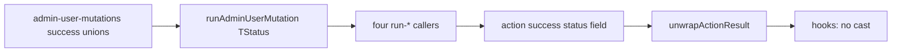

# Chat 9a — admin mutation result is a real union

F106. High, small, one seam. Today `Exclude<string, 'not_found'>` is a no-op, `TStatus` infers as `string`, and both client hooks cast — an unhandled status fails at runtime on the privileged path. Make the envelope a genuine discriminated union. Unblocks F149 and F179; do not do them. No migrations. Do not commit.

## Precondition

Before editing anything, run `git status` and record the working tree. Do not stash, revert, or clean.

Confirm 8b landed: [TECH_DEBT_AUDIT.md](TECH_DEBT_AUDIT.md) has F189 in § Resolved. If it is still Open, **stop**. Prior chats may still be uncommitted; name those files up front. `next dev` may have dirtied the `nextjs-agent-rules` block in [AGENTS.md](AGENTS.md).

## Why the type is a lie

In [src/app/admin/users/_lib/run-admin-user-mutation.ts](src/app/admin/users/_lib/run-admin-user-mutation.ts):

- `AdminUserMutationResult` success arm is `{ status: Exclude<string, 'not_found'>; email: string }`. `Exclude` distributes over unions; `string` is not one, so that evaluates to `string`. The two arms are undiscriminated.
- The helper returns `AdminUserMutationActionResult<TResult['status']>`, so `TStatus` is `string` for every caller. The generic also defaults `= string`.
- The four `run-*` wrappers and the two `'use server'` action files then redeclare success as `*ByIdResult['status']`, which **includes** `'not_found'` even though the helper already mapped that to an error envelope.
- Both hooks therefore cast: [use-admin-user-role-mutation.ts](src/app/admin/users/_lib/use-admin-user-role-mutation.ts) (`data.status as RoleMutationSuccessStatus`) and [use-admin-user-ban-mutation.ts](src/app/admin/users/_lib/use-admin-user-ban-mutation.ts) (`data.status as BanMutationSuccessStatus`). Toast lookup is unchecked.

Runtime is already correct (`not_found` → error envelope). This chat is the compiler contract.

## The helper

In [run-admin-user-mutation.ts](src/app/admin/users/_lib/run-admin-user-mutation.ts):

- Parameterize `AdminUserMutationResult<TStatus extends string>` as `{ status: 'not_found' } | { status: TStatus; email: string }`.
- **`TStatus` replaces `TResult` as the helper's single type parameter.** `RunAdminUserMutationOptions<TStatus extends string>` types the callback as `mutation: (client, userId) => Promise<AdminUserMutationResult<TStatus>>`. Do **not** add `TStatus` alongside `TResult`: two type parameters make the four one-argument call sites fail (`Expected 2 type arguments, but got 1`), and a `TResult` unrelated to `TStatus` leaves the explicit type argument unchecked against what the mutation actually returns — the same unsoundness this chat exists to remove. With one parameter, `promoteUserById` et al. are checked against `AdminUserMutationResult<TStatus>` at the call site.
- Keep `AdminUserMutationActionResult<TStatus>` as it is shaped today — success `{ success: true; data: { status: TStatus; email: string } }` (`AdminUserMutationActionSuccess<TStatus>`) plus `UsersActionError`. Only the status field is parameterized; **do not flatten the `success` / `data` envelope** — `unwrapActionResult` and both hooks depend on it. **Remove the `= string` default** so a missing type argument cannot collapse back to the no-op.
- Return `AdminUserMutationActionResult<TStatus>`, not `TResult['status']`.
- **Delete `hasMutationEmail`** and narrow inline on `result.status === 'not_found'`. The predicate exists only because `result` is currently a generic type *parameter*, which TypeScript will not narrow by discriminant; once the mutation returns a concrete `AdminUserMutationResult<TStatus>` union, the `'not_found'` arm drops out natively. Keep a generic predicate only if that narrowing genuinely fails to compile.

No `as` cast may be introduced anywhere in the helper to make narrowing compile. A cast relocated from the hooks into the helper closes F106 on paper only.

Do not invent a `string extends TStatus ? never` constraint. The four explicit callers plus the deleted hook casts are the pin: if `TStatus` becomes `string` again, `getRoleMutationToastMessage(data.status)` / `getBanMutationToastMessage(data.status)` fail `pnpm type-check`.

Leave `assertAdminCaller` and `UsersActionError` imported from [assert-admin-caller.ts](src/app/admin/users/_lib/assert-admin-caller.ts). Do not move them.

## Four callers pass the concrete unions

Each `runAdminUserMutation` call takes an explicit type argument derived from the mutation result types already in [src/utils/admin-user-mutations.ts](src/utils/admin-user-mutations.ts). Do not add new exported status aliases.

| Caller | Type argument |
| ---- | ---- |
| `runPromoteUserMutation` | `Exclude<PromoteUserByIdResult['status'], 'not_found'>` |
| `runDemoteUserMutation` | `Exclude<DemoteUserByIdResult['status'], 'not_found'>` |
| `runBanUserMutation` | `Exclude<BanUserByIdResult['status'], 'not_found'>` |
| `runUnbanUserMutation` | `Exclude<UnbanUserByIdResult['status'], 'not_found'>` |

Do not rely on inference — that is how `TStatus` became `string` the first time.

Replace the local success-object types in [run-role-mutation.ts](src/app/admin/users/_lib/run-role-mutation.ts) and [run-ban-mutation.ts](src/app/admin/users/_lib/run-ban-mutation.ts) with the helper envelope parameterized by the **family** unions that already exclude `'not_found'`:

- `RoleMutationActionResult` = `AdminUserMutationActionResult<RoleMutationSuccessStatus>`
- `BanMutationActionResult` = `AdminUserMutationActionResult<BanMutationSuccessStatus>`

Keep those two exported names. Keep the annotated `Promise<…>` return types on all four functions (the per-call type argument is narrower; it is assignable to the family result).

Fix imports in both files in the same edit: `UsersActionError` becomes unused once the local success types are gone — drop it, or `pnpm lint` fails inside the quality gate. Add type imports for `AdminUserMutationActionResult` from `./run-admin-user-mutation` and for `RoleMutationSuccessStatus` / `BanMutationSuccessStatus` from `@/utils/admin-user-mutations`. The `*ByIdResult` type imports stay — the per-call `Exclude<…>` arguments still need them.

## Action files: fix the status field only

[role-mutation-actions.ts](src/app/admin/users/_lib/role-mutation-actions.ts) and [ban-mutation-actions.ts](src/app/admin/users/_lib/ban-mutation-actions.ts) redeclare the same success shape. Change `status` from `*ByIdResult['status']` (includes `'not_found'`) to `RoleMutationSuccessStatus` / `BanMutationSuccessStatus`. Drop the now-unused `*ByIdResult` type imports.

Keep `PromoteUserActionResult`, `DemoteUserActionResult`, `BanUserActionResult`, `UnbanUserActionResult`, and the local success types. Do **not** import `AdminUserMutationActionResult` into the `'use server'` files — that is F149.

## Delete both hook casts

In both hooks, pass `data.status` straight to the toast helper. Drop the `as …` and the type-only imports that exist only for the cast (`RoleMutationSuccessStatus`, `BanMutationSuccessStatus`).

No other hook changes. Do not touch table state, toasts, or query invalidation.

## Out of scope

- **Chat 9b / F105** — do not move `assertAdminCaller` or the error envelope to `admin/_lib/`. Do not rename to `AdminActionError`. Do not edit `security.mdc`.
- **F149** — do not collapse `run-*` into the action files.
- **F179** — do not delete result-type aliases or rename `RoleMutationActionInput`.
- **F180 / F162 / F128 / F109** — different seams.
- **AGENTS.md** — not a hard-constraint change.
- **Committing and opening a PR.** Do neither.

## Tests

No new test file. This is a compiler contract; [testing.mdc](.cursor/rules/testing.mdc) says not to test TypeScript with extra cases. The deleted casts **are** the pin.

Existing runtime tests stay: [role-mutation-actions.unit.test.ts](src/app/admin/users/_lib/role-mutation-actions.unit.test.ts) and [ban-mutation-actions.unit.test.ts](src/app/admin/users/_lib/ban-mutation-actions.unit.test.ts) already cover `not_found` → error envelope and success statuses. They should keep passing with no edits.

## Docs

After `CI=true pnpm type-check` is green and `CI=true pnpm pre-push` is green, in [TECH_DEBT_AUDIT.md](TECH_DEBT_AUDIT.md):

- Move F106 to § Resolved with today’s date (**2026-08-29**): helper parameterized over success `TStatus`; four callers pass `Exclude<*ByIdResult['status'], 'not_found'>`; action success fields use the family unions; both hook casts deleted. Note F149/F179 remain Deferred and can now import the real envelope.
- On the F149 and F179 Deferred rows, add that F106 closed the envelope they wait on — still do not collapse files or delete aliases in this chat.
- § Top 5: drop F106; shift F128 / F105 / F061 / F119 up; add **F109** (settings registry cycle) as the new fifth — next architectural fork-multiplier, own chat, not mixed with 9a/9b.
- Leave § Quick wins as the empty Open-only section it is after 8b. Leave the exec-summary F105 “admin surface layering” sentence (that is 9b).
- `Last synced:` stays **2026-08-29**.

No README, DESIGN.md, AGENTS.md, rules, or `/sync-repo-docs`.

## Quality bar

- Targeted: `CI=true pnpm type-check` (this *is* the change) and `pnpm test:file -- src/app/admin/users/_lib/role-mutation-actions.unit.test.ts src/app/admin/users/_lib/ban-mutation-actions.unit.test.ts`
- Then: `CI=true pnpm pre-push` (a bare `pnpm pre-push` aborts in a non-TTY agent shell)
- No browser pass — types only, runtime unchanged

## Manual test checklist

- `pnpm type-check` fails if you restore either hook `as` cast’s necessity (status widened to include `'not_found'` or `string`).
- Both `as RoleMutationSuccessStatus` and `as BanMutationSuccessStatus` are gone from the two hooks.
- Role and ban action unit tests still pass: missing user → `NOT_FOUND` envelope; success still returns `status` + `email`.
- Do not need to click promote/ban in the browser. Runtime path is unchanged.
