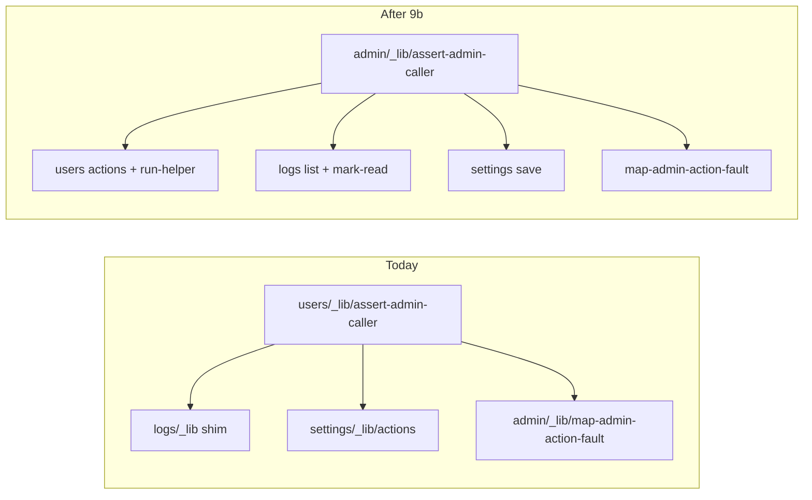

# Chat 9b — admin auth contract lives at the group

F105. Ownership move. After 9a so the envelope being moved is already a real union (`AdminUserMutationActionResult<TStatus>` still unions with the error type — only the import path and the type name change). No migrations. Runtime unchanged: same `getUser()` gate, same FORBIDDEN envelopes. Do not commit.

## Precondition

Before editing anything, run `git status` and record the working tree. Do not stash, revert, or clean.

Confirm 9a landed: [TECH_DEBT_AUDIT.md](TECH_DEBT_AUDIT.md) has F106 in § Resolved. If it is still Open, **stop**. Prior chats may still be uncommitted (including the 9a mutation-union files); name those files up front. `next dev` may have dirtied the `nextjs-agent-rules` block in [AGENTS.md](AGENTS.md).

## Why move, not rewrite

[project-standards.mdc](.cursor/rules/project-standards.mdc): a file’s position says who owns it — nested `_lib/` means one surface, flat `_lib/` means the group. `assertAdminCaller` and the error envelope are consumed by users, logs, settings, and the group-level fault mapper. They live in [src/app/admin/users/_lib/assert-admin-caller.ts](src/app/admin/users/_lib/assert-admin-caller.ts). Logs re-exports through a five-line shim that only exists to rename the type ([src/app/admin/logs/_lib/assert-admin-caller.ts](src/app/admin/logs/_lib/assert-admin-caller.ts)). Settings and [map-admin-action-fault.ts](src/app/admin/_lib/map-admin-action-fault.ts) import *upward* from the users surface. Deleting users would break the other two.

The function body does not change. This chat is the home and the name.

## The new home

Create [src/app/admin/_lib/assert-admin-caller.ts](src/app/admin/_lib/assert-admin-caller.ts) by moving the users file next to `map-admin-action-fault.ts`. Keep `'use server'` and the `createClient` → `getUser()` → `isAdminFromAppMetadata` body byte-identical.

Rename in that file only:

- `UsersActionErrorCode` → `AdminActionErrorCode`
- `UsersActionError` → `AdminActionError`

Keep `AssertAdminCallerResult` and `assertAdminCaller`. No compatibility aliases (`export type UsersActionError = AdminActionError` would leave the ownership lie in place). No new helpers, options, or re-exports.

If the `UsersActionErrorCode` grep below shows no importer outside this file, drop the `export` on `AdminActionErrorCode` and keep it module-private. The group's canonical contract is `assertAdminCaller`, `AssertAdminCallerResult`, and `AdminActionError`; the code union is an implementation detail, and `error-handling.mdc` owns the taxonomy.

Delete [src/app/admin/users/_lib/assert-admin-caller.ts](src/app/admin/users/_lib/assert-admin-caller.ts) and [src/app/admin/logs/_lib/assert-admin-caller.ts](src/app/admin/logs/_lib/assert-admin-caller.ts) in the same change.

## Every importer switches to the group path

All remaining call sites import from `@/app/admin/_lib/assert-admin-caller` (the same alias [run-admin-user-mutation.ts](src/app/admin/users/_lib/run-admin-user-mutation.ts) already uses for `mapAdminActionFault`). Do not leave a relative `./assert-admin-caller` under users or logs.

| File | Change |
| ---- | ---- |
| [map-admin-action-fault.ts](src/app/admin/_lib/map-admin-action-fault.ts) | `UsersActionError` → `AdminActionError`; import is now a sibling, not an upward users path |
| [run-admin-user-mutation.ts](src/app/admin/users/_lib/run-admin-user-mutation.ts) | `assertAdminCaller` + `AdminActionError`; 9a’s `AdminUserMutationActionResult<TStatus>` still unions with the error arm — only the name and path change |
| [list-actions.ts](src/app/admin/users/_lib/list-actions.ts) (users) | `assertAdminCaller` + `AdminActionError` on the two result unions |
| [role-mutation-actions.ts](src/app/admin/users/_lib/role-mutation-actions.ts) | `AdminActionError` on promote/demote results |
| [ban-mutation-actions.ts](src/app/admin/users/_lib/ban-mutation-actions.ts) | `AdminActionError` on ban/unban results |
| [list-actions.ts](src/app/admin/logs/_lib/list-actions.ts) (logs) | `assertAdminCaller` + `AdminActionError`; every `LogsActionError` occurrence goes |
| [mark-read-actions.ts](src/app/admin/logs/_lib/mark-read-actions.ts) | same |
| [settings/_lib/actions.ts](src/app/admin/settings/_lib/actions.ts) | drop the users-surface import; `SaveAppSettingActionResult` unions with `AdminActionError` |

No `LogsActionError` and no `UsersActionError` may remain in `src/` after this chat. Grep both names (and `UsersActionErrorCode`) before calling it done.

## Surface barrels drop the type re-exports

Required by the deletions above, not optional cleanup. [users/actions.ts](src/app/admin/users/actions.ts) and [logs/actions.ts](src/app/admin/logs/actions.ts) each open with a `export type { … } from './_lib/assert-admin-caller'` block — re-exporting `AssertAdminCallerResult` plus `UsersActionError` / `LogsActionError` from the two files this chat deletes. Leaving either block in place means the barrel imports a module that no longer exists and `type-check` fails.

Delete both blocks. Nothing in `src/` imports those three names from the barrels — clients import action functions and surface result types (`ListUsersActionResult`, `PromoteUserActionResult`, …) — so no call site needs repointing. Do **not** re-export `AdminActionError` from a surface barrel instead; that would put group ownership back behind a users/logs door. Surface result types stay; they compose `AdminActionError` internally.

## Docs that name the old path

In the same change:

Each occurrence is a markdown link carrying the old path **twice** — once as backticked display text, once as the href — and the two files use different relative forms. Update both halves of every link and preserve each file's existing form. Nothing in `pre-push` or CI validates markdown links, so a broken href ships silently.

- [security.mdc](.cursor/rules/security.mdc) lines 19 and 26 — both canonical-pattern links. Display text `` `src/app/admin/users/_lib/assert-admin-caller.ts` `` → `` `src/app/admin/_lib/assert-admin-caller.ts` ``; href `../../src/app/admin/users/_lib/assert-admin-caller.ts` → `../../src/app/admin/_lib/assert-admin-caller.ts` (the `../../` prefix stays — the link resolves from `.cursor/rules/`). Wording of the rule does not change.
- [LEXICON.md](LEXICON.md) § Defense in depth (admin) — the same stale filepath at the `assertAdminCaller()` enforcement sentence, here as a repo-root-relative link: display text and href both `src/app/admin/users/_lib/assert-admin-caller.ts` → `src/app/admin/_lib/assert-admin-caller.ts`, no `../` prefix. Bump `**Last updated:**` to **2026-08-29** in the same edit. Do not rewrite the three-gate narrative.

Do not edit archive plans, `RULE_AUDIT.md`, or `SECURITY_AUDIT.md`. `error-handling.mdc` points at `users/actions.ts` as a server-action envelope example, not at the assert file — leave it. No `/sync-repo-docs` (the rules index does not cite this path).

The ESLint server-only allowlist in [eslint.config.mjs](eslint.config.mjs) does not list the current users assert file (it does not import `appLog` or the service client). The moved file needs no new allowlist entry.

## Out of scope

- **F149** — do not collapse `run-*` into the `'use server'` action files.
- **F179** — do not delete result-type aliases or rename `RoleMutationActionInput`.
- **F128** — do not validate `emailFilter`. Sequence after this chat; do not start it.
- **F109** — settings registry cycle. Own chat; do not mix.
- **F180 / F162** — mutation preamble helper and `email: string` assertions.
- **AGENTS.md** — not a hard-constraint change (admin gate still reads `app_metadata.role` via `getUser()`).
- **The `'use server'` directive on the assert file.** It is carried to the new home unchanged. It makes `assertAdminCaller` a callable server-action endpoint even though no client calls it, and `security.mdc` points spinoffs at this file as the canonical gated-action pattern — so the directive propagates. Deliberate hold, not an oversight: dropping it is a runtime-surface change and this chat is a move and a rename. Own chat if it is worth doing.
- **Committing and opening a PR.** Do neither.

## Tests

No new test file. This is a move and a rename; [testing.mdc](.cursor/rules/testing.mdc) says not to test TypeScript with extra cases, and no test currently imports the assert module or the shim. Existing admin-gate coverage stays:

- [list-actions.unit.test.ts](src/app/admin/users/_lib/list-actions.unit.test.ts)
- [role-mutation-actions.unit.test.ts](src/app/admin/users/_lib/role-mutation-actions.unit.test.ts)
- [ban-mutation-actions.unit.test.ts](src/app/admin/users/_lib/ban-mutation-actions.unit.test.ts)
- [logs/actions.unit.test.ts](src/app/admin/logs/actions.unit.test.ts)
- [settings/_lib/actions.unit.test.ts](src/app/admin/settings/_lib/actions.unit.test.ts)

They mock `getUser` at `@/supabase/server` and should pass with no edits.

## Docs (audit)

After `CI=true pnpm type-check` is green and `CI=true pnpm pre-push` is green, in [TECH_DEBT_AUDIT.md](TECH_DEBT_AUDIT.md):

- Move F105 to § Resolved with today’s date (**2026-08-29**): helper and envelope now live in `admin/_lib/assert-admin-caller.ts`; envelope renamed `AdminActionError`; logs shim deleted; `map-admin-action-fault` no longer imports upward; `security.mdc` + LEXICON paths updated. Note F149/F179/F128 remain Deferred / Do next and were not done here.
- § Top 5: drop F105; remaining order **F128 / F061 / F119 / F109**; add **F180** (five identical privileged-path preambles in `admin-user-mutations.ts`) as the new fifth — next architectural item on the admin mutation seam this chat just left, not mixed with 9b.
- Exec summary: replace the “Admin surface layering inverted” bullet with a closed note (contract now lives at the group; F105 resolved).
- § Verified OK “Server-side admin authorization” sentence that currently says “F105 is about where this code *lives*” — past tense / closed.
- Leave § Quick wins as the empty Open-only section it is after 8b.
- `Last synced:` stays **2026-08-29**.

No README, DESIGN.md, or AGENTS.md.

## Quality bar

- Targeted: `CI=true pnpm type-check` and `pnpm test:file --` on the five action test files above
- Then: `CI=true pnpm pre-push` (a bare `pnpm pre-push` aborts in a non-TTY agent shell)
- Grep: zero `UsersActionError`, `LogsActionError`, `UsersActionErrorCode`, and zero remaining imports of `users/_lib/assert-admin-caller` or `logs/_lib/assert-admin-caller` under `src/`
- No browser pass — ownership and types only, runtime path unchanged

## Manual test checklist

- `pnpm type-check` fails if any surface still imports from `users/_lib/assert-admin-caller` (file deleted).
- Logs and settings still type-check with users-surface `_lib` conceptually deletable — their assert imports no longer point there.
- Existing action unit tests still pass: missing session → `FORBIDDEN` / `"Unauthorized"`; non-admin → `FORBIDDEN` / `"Forbidden"`; success paths unchanged.
- Do not need to click promote/ban/mark-read/save-setting in the browser. Runtime path is unchanged.
