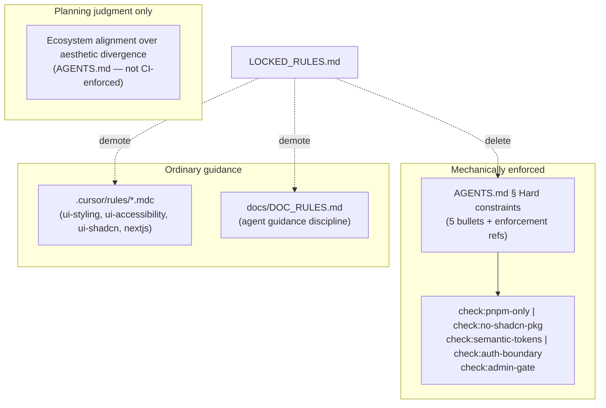

# Dissolve locked rules — docs restructure plan

**Scope:** Documentation and `.cursor/` guidance only — no changes to `src/`, `scripts/`, `eslint-rules/`, or test files.

**Prerequisite (confirmed):** Five `check:*` scripts exist in [`package.json`](package.json) and are wired into `pre-push` / CI (constraints 4–5 also run via `test:ci` inside `pnpm pre-push`).

---

## Architecture after this story



---

## 1. Rewrite AGENTS.md § Hard constraints

Replace [`AGENTS.md`](AGENTS.md) `## Locked rules` (lines 89–93) with `## Hard constraints`:

- **Intro:** "Non-negotiable constraints, each enforced deterministically — a violation fails pnpm pre-push and CI"
- **Five bullets** — use story wording; each bullet pairs rule text with its `check:*` enforcement mechanism:
  - pnpm only → `check:pnpm-only`
  - UI primitive-first → `check:no-shadcn-pkg` (ESLint `no-restricted-imports`)
  - Semantic tokens → `check:semantic-tokens` (custom ESLint rule; note limitation in [`eslint-rules/semantic-tokens.mjs`](eslint-rules/semantic-tokens.mjs))
  - Auth boundary → `check:auth-boundary` (discovered-route proxy tests)
  - Admin gate → `check:admin-gate` (source contract test + migration scanner)
- **Immediately after:** add **Ecosystem alignment over aesthetic divergence** as a planning/judgment principle (not mechanically enforced) — copy **exact** paragraph from [`LOCKED_RULES.md`](LOCKED_RULES.md) line 13.

**Terminology sweep within AGENTS.md:**

| Location | Change |
| -------- | ------ |
| Purpose blurb (line 3) | "hard-constraint governance" (or equivalent) |
| Skills table (line 36) | `pre-release-review` → "hard-constraints check" |
| Implemented-now / Foundation (line 101) | Remove `LOCKED_RULES.md`; mention hard constraints in AGENTS + `check:*` scripts |
| Where-things-live (line 186) | **Remove** `LOCKED_RULES.md` row |
| Change protocol table (line 225) | Row label **Hard constraints**; new text per story (enforcement + AGENTS list must change together — never list alone) |
| Change protocol footer (line 230) | Mirror-only language for hard-constraint changes |

---

## 2. Demote remaining rules into owning files

Merge **current LOCKED_RULES.md wording** into targets; do not duplicate if the target already states the same thing in different words — consolidate to one canonical phrasing per concern.

| Source rule (LOCKED_RULES.md) | Target | Merge approach |
| ----------------------------- | ------ | -------------- |
| Structure fixed / theme swappable (line 17) | [`.cursor/rules/ui-styling.mdc`](.cursor/rules/ui-styling.mdc) | Add a short **Structure vs theme** principle near the top (mobile-first already at line 12) |
| Mobile-first responsive (line 18) | same | Ensure LOCKED_RULES wording is present (line 12 is close — align to canonical text) |
| WCAG 2.1 AA (line 19) | [`.cursor/rules/ui-accessibility.mdc`](.cursor/rules/ui-accessibility.mdc) | Add at top of body or fold into § WCAG 2.1 AA Compliance — semantic HTML first, ARIA only when needed, `focus-visible` token rings |
| shadcn CLI non-interactive (line 20) | [`.cursor/rules/ui-shadcn.mdc`](.cursor/rules/ui-shadcn.mdc) | § Adding shadcn/ui Components already covers flags — add any missing LOCKED_RULES phrasing (`--dry-run`/`--diff` before overwrite) without duplicating the command block |
| Images / next/image (line 21) | [`.cursor/rules/nextjs.mdc`](.cursor/rules/nextjs.mdc) | Strengthen line 50 to require **explicit dimensions** per LOCKED_RULES wording |
| Agent guidance (line 24) | [`docs/DOC_RULES.md`](docs/DOC_RULES.md) doc-roles section | Add as discipline on `.cursor/rules/` + `.cursor/skills/` rows or a new write-discipline bullet |

**ui-styling.mdc line 14:** remove `LOCKED_RULES.md` pointer; keep semantic-token cross-ref to `globals.css` / AGENTS § Hard constraints if helpful.

---

## 3. Delete files

- Delete [`LOCKED_RULES.md`](LOCKED_RULES.md)
- Delete [`LOCKED_RULES_AUDIT.md`](LOCKED_RULES_AUDIT.md) (temporary working file)

---

## 4. Reference sweep (story file list)

### docs/

- [`docs/DOC_RULES.md`](docs/DOC_RULES.md) — remove LOCKED_RULES.md from doc-roles table (row 19); update AGENTS.md row to "hard-constraint change protocol"; rewrite write-discipline rules 4–5 → canonical home is **AGENTS § Hard constraints + enforcement code**; mirror-only sync language
- [`docs/WORKFLOW_GUIDE.md`](docs/WORKFLOW_GUIDE.md) — doc map row 42 → AGENTS § Hard constraints; initialize-project inherit list (86) → drop LOCKED_RULES.md, note hard constraints via AGENTS + checks; phase-planning input (99) → AGENTS.md; relabel lexicon subsection (170–171) from "Locked rule" to **Hard constraint** with updated definition pointing at AGENTS + enforcement
- [`LEXICON.md`](LEXICON.md) — discipline line (7): replace `LOCKED_RULES.md` pointer with AGENTS / `.mdc` homes; entries at 17, 25, 29, 37 relabel per split:
  - **Primitive-first**, **Auth boundary**, **Admin gate** → "Hard constraint (enforced: check:*)" + link AGENTS § Hard constraints
  - **Structure vs theme**, **Semantic token** (where applicable) → plain guidance → DESIGN.md / ui-styling.mdc
- [`README.md`](README.md) — remove LOCKED_RULES.md doc-map row (200); update AGENTS.md row (203) to "hard constraints"
- [`DESIGN.md`](DESIGN.md) — lines 3, 15, 160, 209 → AGENTS § Hard constraints; line 160 claim that full rule wording lives in AGENTS becomes accurate

### .cursor/

- [`.cursor/rules/README.md`](.cursor/rules/README.md) — lines 13, 191 → AGENTS § Hard constraints (remove LOCKED_RULES.md links)
- [`.cursor/agents/refactor-cleaner.md`](.cursor/agents/refactor-cleaner.md) — 4 refs → "AGENTS § Hard constraints"
- [`.cursor/README.md`](.cursor/README.md) — one stray "Locked rules" hit (not in story list; required for grep acceptance)
- **Skills** (term swaps per story):
  - [`pre-release-review`](.cursor/skills/pre-release-review/SKILL.md) — retitle Step 5 to hard-constraints check; note five are CI-enforced; manual pass confirms code/plan did not disable or bypass a check
  - [`security-audit`](.cursor/skills/security-audit/SKILL.md), [`plan-next-epic`](.cursor/skills/plan-next-epic/SKILL.md), [`refactor-cleaner`](.cursor/skills/refactor-cleaner/SKILL.md), [`tech-debt-audit`](.cursor/skills/tech-debt-audit/SKILL.md), [`sync-tech-debt-audit`](.cursor/skills/sync-tech-debt-audit/SKILL.md)
  - [`rule-audit`](.cursor/skills/rule-audit/SKILL.md), [`lexicon-audit`](.cursor/skills/lexicon-audit/SKILL.md) — input contract: read AGENTS § Hard constraints instead of LOCKED_RULES.md
  - [`rule-authoring`](.cursor/skills/rule-authoring/SKILL.md) — overlap principle: hard-constraint text in AGENTS + enforcement; `.mdc` carries guidance
  - [`initialize-project`](.cursor/skills/initialize-project/SKILL.md) — inherit list: remove LOCKED_RULES.md; hard constraints inherit via AGENTS + checks
  - [`sync-repo-docs`](.cursor/skills/sync-repo-docs/SKILL.md) + [`reference.md`](.cursor/skills/sync-repo-docs/reference.md) — mirror-only routing targets AGENTS § Hard constraints + enforcement change rule

### Root audit doc

- [`RULE_AUDIT.md`](RULE_AUDIT.md) — update scope line (remove LOCKED_RULES.md); mark **RA-009** and **RA-010** **RESOLVED** with disposition: duplication dissolved — demoted guidance now canonical in `.mdc` files; adjust executive-summary bullet 1 accordingly

### Active plans (not archive)

Update terminology in:
- [`.cursor/plans/hard_constraint_checks_112bfe21.plan.md`](.cursor/plans/hard_constraint_checks_112bfe21.plan.md)
- [`.cursor/plans/fix_rule_audit.plan.md`](.cursor/plans/fix_rule_audit.plan.md)

**Explicitly do not edit:** `docs/adr/` (ADR-0001 historical mention stays; ADR-0002 already records the decision), `docs/archive/`, `docs/prds/archive/`, `SECURITY_AUDIT.md`, **`.cursor/plans/archive/`** (PM decision: historical plans exempt from grep acceptance).

---

## 5. Verification (acceptance)

**Order matters.** This plan's body references `LOCKED_RULES` throughout — it will fail grep while it lives in `.cursor/plans/`. Run verification in two passes:

### Pass 1 — after all doc edits (todo: `verify-pre-push`)

```bash
pnpm pre-push
```

Confirm deleted files are gone: `LOCKED_RULES.md`, `LOCKED_RULES_AUDIT.md`.

Do **not** treat grep failure on this plan file as a story defect at this stage.

### Pass 2 — archive this plan, then grep (todo: `archive-plan-and-verify`, **run last**)

Move this plan from `.cursor/plans/` to `.cursor/plans/archive/` — same mechanism as other completed plans (e.g. via `/archive-cursor-plans` or `git mv`):

```bash
# Example — adjust filename if the workspace copy differs
git mv .cursor/plans/dissolve_locked_rules_docs_9388dc80.plan.md \
       .cursor/plans/archive/dissolve_locked_rules_docs_9388dc80.plan.md
```

Then re-run acceptance grep. The existing archive exemption covers it — **no per-file special case** in the grep command:

```bash
# LOCKED_RULES — allowed paths only (+ .cursor/plans/archive/ exempt)
rg -i 'LOCKED_RULES' --glob '!.cursor/plans/archive/**' \
  | rg -v '^(docs/adr/|docs/archive/|docs/prds/archive/|SECURITY_AUDIT\.md)'

# "locked rule" — zero outside exempt paths (+ plans archive exempt)
rg -i 'locked rule' --glob '!.cursor/plans/archive/**' \
  | rg -v '^(docs/adr/|docs/archive/|docs/prds/archive/|SECURITY_AUDIT\.md)'
```

Both commands must return no output for acceptance to pass.

---

## Risk notes

- **No code changes** — enforcement already lives in checks/tests; this story only aligns docs with ADR-0002.
- **ui-styling / ui-accessibility** — story asks to *merge* LOCKED_RULES wording, not trim RA-009/010 tutorial blocks; resolving RA-009/010 in RULE_AUDIT.md is a documentation disposition, not a signal-to-noise trim pass.
- **AGENTS pre-push wording** — implemented-now still lists an older pre-push chain without all `check:*` steps; out of scope unless you want a one-line freshness fix while editing that section.
