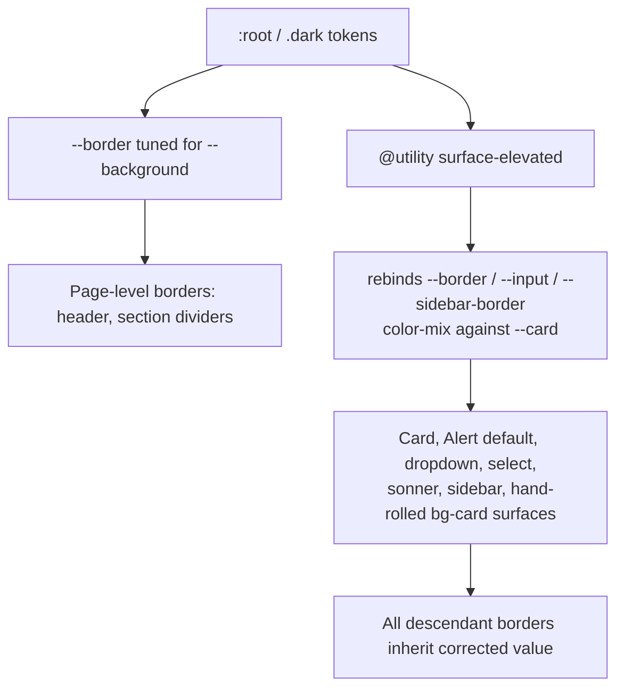

# Elevated surface borders

## Problem

Commit `671687c` softened `--border` toward `--background`. Dark-mode elevated surfaces are *lighter* than the background, so the same token nearly vanishes on them:

- dark `--background` 0.2077, `--border` 0.30 → lightness delta 0.092 (reads well)
- dark `--card` / `--popover` / `--sidebar` 0.2795, `--border` 0.30 → delta 0.0205 (invisible)

Every elevated surface is affected, not just the two the user noticed. `dd70d9a` patched the workflow diagram by borrowing `--muted-foreground` (a text token) to paint chrome — a symptom fix.

## Approach

`src/app/globals.css` uses `@theme inline`, so `border-border` and the base-layer `* { @apply border-border }` compile to `border-color: var(--border)` — resolved at the element. That means an elevated surface can rebind `--border` for itself and every border, divider, and `border-b` inside it inherits the corrected value with no call-site changes.

One Tailwind `@utility surface-elevated` rebinds `--border`, `--input`, and `--sidebar-border` to a value derived from `--card` with `color-mix`. Because the mix is declared inside the utility (not at `:root`), `var(--card)` and `var(--foreground)` resolve against whichever theme is active — one declaration covers light and dark, and it survives a re-skin.

## Step 0 — verify the cascade before building anything

Non-negotiable gate. If `@theme inline` does not inline `var(--border)` into the utility, this whole approach collapses. **Fallback shape:** declare an explicit `--border-elevated` token pair in `:root` and `.dark` alongside the existing `--border`, and opt in per bordered element with `border-[var(--border-elevated)]` at each call site. That loses descendant inheritance — every border inside an elevated surface has to be found and changed individually — so the surface inventory in Steps 2 and 3 becomes a starting point, not the full list. Stop and report before taking it.

Run the dev server, open `/admin/settings` in dark mode, and confirm in DevTools that a `--border` override on the `Card` element changes the computed `border-bottom-color` of a `SettingRowShell` row inside it. Stop and report if it does not.

## Step 1 — token and utility

[src/app/globals.css](src/app/globals.css)

- Add `@utility surface-elevated` rebinding `--border`, `--input`, and `--sidebar-border` to `color-mix(in oklch, var(--card) 88%, var(--foreground))`.
- 88/12 is chosen to reproduce the page-level lightness delta on both themes (light ~0.087, dark ~0.078). Add a short CSS comment naming that intent so a re-skinner knows what the number is for.
- Derivation is against `--card`; `--popover` and `--sidebar` are the same value today. Note in the comment that a re-skin diverging them needs a second utility.
- No change to the existing `--border` / `--input` values — page-level chrome and the new header stay exactly as they are.
- `scripts/checks/a11y-contrast.mjs` only inspects its hardcoded `TOKEN_PAIRS`, so a new derived value does not trip the `var()` indirection guard.

## Step 2 — primitives

`src/components/ui/` is ESLint-excluded and vendored, so each edit is a one-line class addition to a base string.

- [src/components/ui/card.tsx](src/components/ui/card.tsx) — add to the `Card` base classes. This file is an older `forwardRef` shadcn version with no `data-slot="card"`, which is why a class beats an attribute selector here.
- [src/components/ui/alert.tsx](src/components/ui/alert.tsx) — `default` variant only; the tinted `info` / `success` / `warning` / `destructive` variants set their own border colors.
- [src/components/ui/dropdown-menu.tsx](src/components/ui/dropdown-menu.tsx) — both the content (line 45) and sub-content (line 233) `bg-popover` strings.
- [src/components/ui/select.tsx](src/components/ui/select.tsx) — the `bg-popover` content string (line 65).
- [src/components/ui/sonner.tsx](src/components/ui/sonner.tsx) — the Toaster already sets `--normal-border: var(--border)` in a style object; adding the utility to that element makes the substitution pick up the elevated value.
- [src/components/ui/sidebar/sidebar-shell.tsx](src/components/ui/sidebar/sidebar-shell.tsx) — all three `bg-sidebar` branches: `collapsible="none"` (line 41), the mobile `SheetContent` (line 58), and the desktop inner panel (line 115), so `border-r` and internal separators land on the sidebar fill correctly.
- [src/components/ui/sidebar/sidebar-provider.tsx](src/components/ui/sidebar/sidebar-provider.tsx) — the wrapper's `bg-sidebar` (line 111), which applies only under `has-data-[variant=inset]`.

`dialog.tsx` and `tooltip.tsx` use `bg-background` / `bg-primary` and are deliberately out of scope. `sheet.tsx` is likewise out of scope as a primitive — the mobile sidebar above is the sanctioned exception, since it overrides the Sheet surface to `bg-sidebar`.

## Step 3 — hand-rolled surfaces

These paint `bg-card` / `bg-popover` directly instead of going through a primitive:

- [src/components/error-panel.tsx](src/components/error-panel.tsx)
- [src/components/marketing-display-card.tsx](src/components/marketing-display-card.tsx)
- [src/components/stat-tile.tsx](src/components/stat-tile.tsx) — the `total` role only; the sibling roles paint `bg-muted` or tinted accents and are not elevated surfaces. Also re-check whether `border-[0.5px]` is still too faint once the token is corrected.
- [src/app/(marketing)/workflow/_components/workflow-documents-section.tsx](src/app/(marketing)/workflow/_components/workflow-documents-section.tsx)
- [src/app/admin/logs/_components/logs-tag-combobox.tsx](src/app/admin/logs/_components/logs-tag-combobox.tsx)
- [src/app/(marketing)/reference/_components/reference-toast-section.tsx](src/app/(marketing)/reference/_components/reference-toast-section.tsx)
- [src/app/admin/_components/admin-shell-skeleton.tsx](src/app/admin/_components/admin-shell-skeleton.tsx) — the loading skeleton's sidebar column.
- [src/app/(marketing)/workflow/_components/workflow-diagram.tsx](src/app/(marketing)/workflow/_components/workflow-diagram.tsx) — the `<svg>` element, whose `<rect>` fills `var(--card)`. Child strokes reading `var(--border)` inherit from the SVG element.

## Step 4 — retire the one-off

In [workflow-diagram.tsx](src/app/(marketing)/workflow/_components/workflow-diagram.tsx), revert the two dashed loop-container `<rect>` strokes from `var(--muted-foreground)` back to `var(--border)` — they are chrome and will now resolve correctly on the card fill.

Leave the connector `<line>` / `<path>` arrows and the loop labels on `--muted-foreground`. Those are diagram content, not chrome, and should read stronger than a border. Also revisit `getNodeColors`, whose inactive stroke mixes the accent with `var(--border)` — it now picks up the elevated value automatically, so confirm the node outlines did not get too strong.

Separately, `sidebarMenuButtonVariants`' `outline` variant ([sidebar-menu.tsx](src/components/ui/sidebar/sidebar-menu.tsx) line 46) draws its border as a `box-shadow` ring from `var(--sidebar-border)` rather than a real border. It inherits the rebound value from the shell automatically and needs no edit — confirm it in the manual pass rather than changing it.

## Step 5 — enforcement rule

The utility is opt-in per surface, so without a check the convention decays as new surfaces are added — in this repo and in every spinoff.

Add a `local/surface-elevated` ESLint rule alongside the existing `local/motion-tier` rule, following its shape and registration. It flags a JSX class string containing `bg-card`, `bg-popover`, or `bg-sidebar` that does not also contain `surface-elevated`.

Guidance tier, not a hard constraint: it ships as a `local/*` lint rule owned by `ui-styling.mdc`, not a `check:*` script. Every `check:*` in this repo is an AGENTS.md § Hard constraints item; adding one there would route through the § Change protocol.

**Allowlist** — inline `eslint-disable-next-line local/surface-elevated` with a comment naming the reason, matching the `local/motion-tier` exemption pattern. Known cases:

- [sidebar-controls.tsx](src/components/ui/sidebar/sidebar-controls.tsx) line 52 — `bg-sidebar` on a `SidebarRail` hover state, not a bordered surface.
- [sidebar-provider.tsx](src/components/ui/sidebar/sidebar-provider.tsx) line 111 — if the `has-data-[variant=inset]` prefix makes the class string read as unconditional to the rule.

**Stated coverage ceiling** — the rule reads class strings only, so three surfaces in this plan are invisible to it and stay convention-dependent: [sonner.tsx](src/components/ui/sonner.tsx) (inline `style` object), and [workflow-diagram.tsx](src/app/(marketing)/workflow/_components/workflow-diagram.tsx) `getNodeColors` (line 44) and its backing `<rect>` (line 208), both SVG `fill` attributes. Record this with a `// debt:` marker on the rule naming the ceiling.

`src/components/ui/` is ESLint-excluded, so the rule does not lint the primitives edited in Step 2 — it guards new surfaces in `src/components/` and `src/app/`.

## Step 6 — docs

- [DESIGN.md](DESIGN.md) — add the elevated-surface border to the semantic colors table around line 89, and add "check card, popover, and sidebar borders in dark mode" to the re-skin smoke test at line 225. That step is exactly what would have caught this.
- [.cursor/rules/ui-styling.mdc](.cursor/rules/ui-styling.mdc) — one line under Semantic Tokens: any surface painting `bg-card` / `bg-popover` / `bg-sidebar` carries `surface-elevated`, enforced by `local/surface-elevated`.
- Run `/sync-repo-docs` (AGENTS.md § Agent workflow step 4 — this change touches both a token and a rule file).

No AGENTS.md change — this is guidance, not a hard constraint, so it stays out of that file per ADR-0010.

## Step 7 — verify

- `pnpm pre-push`
- Manual dark-mode pass on `/admin/settings`, `/admin/logs` (stat tiles, tag combobox, table), `/workflow`, `/reference`, the admin sidebar (desktop, mobile drawer, and the loading skeleton), the sidebar menu `outline` variant ring, a dropdown, a select, and a toast. Then the same list in light mode to confirm nothing got heavier than intended.

## Risks

- **Cascade assumption.** Step 0 is the gate. Everything downstream depends on it.
- **`--input` doubles as a background.** `dark:bg-input/30` on inputs inside cards shifts very slightly. Expected to be imperceptible at 30% alpha; confirm on the settings and profile forms.
- **`--sidebar-border` semantics.** The sidebar's outer `border-r` separates the sidebar fill from the page background, so the "elevated" value may read slightly strong there. Visual check; back it out of the utility and retune the token literally if it looks wrong.
- **Vendored primitive drift.** Class additions in `src/components/ui/` are lost if someone re-pulls from the shadcn CLI with `-o`. Acceptable and already true of the other hand-edits in `table.tsx` and `tabs.tsx`.