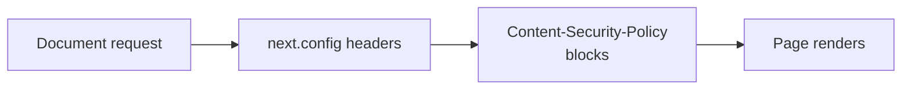

# Ship a single enforced CSP header

This implements RESEARCH-0006 Option D in the only form that actually works: the enforced policy **must** name `script-src` explicitly. Omitting it would fall back to `default-src 'self'`, which blocks Next's inline hydration bootstrap and leaves the page non-interactive.

There is **no** `Content-Security-Policy-Report-Only` header. A strict report-only `script-src` would be violated by Next's hydration bootstrap on every page load, so it would emit permanent expected noise with no collector consuming it — which would bury any real violation rather than surface it. The gap is recorded in the `// debt:` comment and the research brief instead.

No ADR in this change. The `// debt:` comment points at [docs/research/RESEARCH-0006-csp-enforcement-nextjs-cache-components.md](docs/research/RESEARCH-0006-csp-enforcement-nextjs-cache-components.md) rather than restating the analysis.

## Enforced header — `Content-Security-Policy`

Always emitted, and the only CSP header. Built from today's [src/utils/security-headers.ts](src/utils/security-headers.ts) `buildCspDirectives()`, with one change to `script-src`:

- `default-src 'self'`
- `script-src 'self' 'unsafe-inline' https://va.vercel-scripts.com` — permissive on purpose; `'unsafe-inline'` is the load-bearing token. It still blocks external scripts from unlisted origins; what it cannot stop is inline injection.
- `style-src 'self' 'unsafe-inline'`
- `img-src`, `font-src`, `connect-src` — unchanged, including the Supabase origin and `wss://*.supabase.co` when env is set
- `frame-ancestors 'none'`, `object-src 'none'`, `base-uri 'self'`, `form-action 'self'`

## Module changes — [src/utils/security-headers.ts](src/utils/security-headers.ts)

- Replace the top-of-file `// debt:` comment. New text: `script-src` cannot be enforced strictly because nonce-based CSP requires dynamic rendering and is incompatible with `cacheComponents` ([vercel/next.js#89754](https://github.com/vercel/next.js/issues/89754)); the enforced `script-src` is deliberately permissive; revisit when that issue closes. Point at the research brief; do not restate the analysis.
- Keep `buildCspDirectives()` and its name; add `'unsafe-inline'` to its `script-src`. With one policy there is no naming ambiguity to resolve.
- `getSecurityHeaders()` always returns one `Content-Security-Policy` entry, then the existing `X-Frame-Options` and HSTS entries.
- Delete `getCspHeaderKey()` and all `CSP_ENFORCE` branching.
- [next.config.ts](next.config.ts) is unchanged: it already attaches whatever `getSecurityHeaders()` returns.

## Tests — [src/utils/security-headers.unit.test.ts](src/utils/security-headers.unit.test.ts)

- Keep the `buildCspDirectives` cases (core directives, Supabase origin). Update the `script-src` assertion to include `'unsafe-inline'`.
- Replace the two `getSecurityHeaders` cases (report-only default + `CSP_ENFORCE` switch) with:
  - exactly one CSP header key is present, and it is `Content-Security-Policy` — no `Content-Security-Policy-Report-Only`
  - that value contains a `script-src` directive (regression guard against the `default-src` fallback trap)
  - `frame-ancestors 'none'` is present
  - existing `X-Frame-Options` and HSTS assertions stay
- Drop env stubbing for `CSP_ENFORCE`.

## Docs that would otherwise lie

Removing the env switch without touching these would leave a documented no-op:

- [`.env.example`](.env.example) — remove the `CSP_ENFORCE` comment block
- [README.md](README.md) env table — remove the `CSP_ENFORCE` row
- [`.cursor/rules/security.mdc`](.cursor/rules/security.mdc) Security Headers paragraph — describe a single enforced policy whose `script-src` is deliberately permissive, not the old env flip
- [SECURITY_AUDIT.md](SECURITY_AUDIT.md) S004 and the W6 verified-ok paragraph — remaining gap is strict `script-src`, not "CSP is report-only"
- [TECH_DEBT_AUDIT.md](TECH_DEBT_AUDIT.md) F053 — same remaining gap; still deferred on #89754. F095 (`style-src 'unsafe-inline'`) stays; styles are now actually enforced, with `'unsafe-inline'` still allowed for Tailwind

Do not rewrite RESEARCH-0006. Do not write an ADR in this pass. If `.env.local` still has `CSP_ENFORCE`, it becomes a no-op; you can delete it locally.

## Quality bar and browser verification

`headers()` in next.config is evaluated at **build time** and baked into the routes manifest. A running `pnpm dev` session will not pick this up. After the code change:

1. Run `pnpm pre-push`.
2. Stop the current dev server. Run a **production** build and start: `pnpm build && pnpm start`. (Dev mode uses `eval` and would produce refusals production does not.)
3. In the browser, walk these four surfaces and confirm **zero** `Refused to` console errors. With no report-only header, every refusal is a real break — there is no expected noise to filter.
   - A marketing page (`/` or `/workflow`)
   - Login (`/auth/login`)
   - Admin logs (`/admin/logs`) with the live toggle enabled (websocket `connect-src`)
   - Profile on `/home` with an avatar set (`img-src` against the Supabase origin)
4. Spot-check Network → document response: `Content-Security-Policy` is present and `Content-Security-Policy-Report-Only` is absent.

If any refusal appears on those four surfaces, stop and fix the policy before marking complete.
