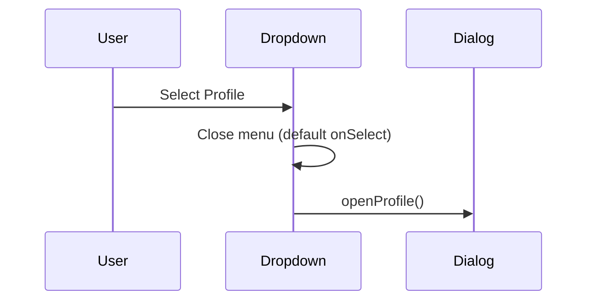

# Epic 1 code-review close-out

## Scope

Addresses everything from the `de518bd...68c196b` review. [AGENTS.md](AGENTS.md) and [LEXICON.md](LEXICON.md) are already updated — no doc work in this pass.

**Out of scope / no action:**

- **PRD ambiguity** (email vs username layout) — spent story; code already follows the plan’s single-field reading
- **Password form “duplication” debt** — only one implementation survives after the dialog was removed; extracting a shared inner form would be speculative generality with one consumer ([code-minimalism](.cursor/rules/code-minimalism.mdc))

---

## 1. Blocker — close dropdown before opening profile dialog

**File:** [src/app/(app)/_components/app-nav-user.tsx](src/app/(app)/_components/app-nav-user.tsx)

**Problem:** Profile `DropdownMenuItem` calls `event.preventDefault()` in `onSelect`, which keeps the Radix dropdown open while the profile dialog opens — contradicting the epic plan and risking overlapping focus traps.

**Fix:** Remove `preventDefault`. Let Radix close the menu on select, then call `openProfile()`:

```tsx
<DropdownMenuItem onSelect={openProfile}>
```

If focus timing is flaky in manual testing, use `requestAnimationFrame(openProfile)` — only apply the fallback if the manual smoke test shows a focus race.

**Test update:** [src/app/(app)/_components/app-nav-user.unit.test.tsx](src/app/(app)/_components/app-nav-user.unit.test.tsx) — after selecting Profile, assert `mockOpenProfile` was called.



---

## 2. Nit — collapse `HOME_PATH`

**File:** [src/constants/app-paths.ts](src/constants/app-paths.ts)

`HOME_PATH` is only used to alias `APP_HOME` (no other imports). Replace with:

```ts
export const APP_HOME = '/home' as const
```

No other files reference `HOME_PATH` today.

---

## 3. Nit — stabilize `ProfileDialogProvider` context value

**File:** [src/app/(app)/_components/profile/profile-dialog-provider.tsx](src/app/(app)/_components/profile/profile-dialog-provider.tsx)

Wrap `openProfile` in `useCallback` and the provider `value` in `useMemo` so descendants don’t re-render on every parent render:

- `const openProfile = useCallback(() => setOpen(true), [])`
- `const value = useMemo(() => ({ openProfile }), [openProfile])`

---

## 4. Debt — move `FieldSaveState` type to `_lib`

**Problem:** [use-blur-save-field.ts](src/app/(app)/_lib/profile/use-blur-save-field.ts) imports a type from a `_components` file, inverting the usual layer direction.

**Fix:**

1. Create [src/app/(app)/_lib/profile/field-save-state.ts](src/app/(app)/_lib/profile/field-save-state.ts) exporting:

   ```ts
   export type FieldSaveState = 'idle' | 'saving' | 'saved'
   ```

2. Update every call site to import `FieldSaveState` from that path:

   - [field-save-indicator.tsx](src/app/(app)/_components/profile/field-save-indicator.tsx)
   - [use-blur-save-field.ts](src/app/(app)/_lib/profile/use-blur-save-field.ts)
   - [profile-text-field.tsx](src/app/(app)/_components/profile/profile-text-field.tsx)
   - [profile-avatar-field.tsx](src/app/(app)/_components/profile/profile-avatar-field.tsx)

   `field-save-indicator.tsx` must not re-export the type.

---

## 5. Debt — remove low-value render-only integration test

**Delete:** [src/app/(app)/_components/profile/profile-modal-content.integration.test.tsx](src/app/(app)/_components/profile/profile-modal-content.integration.test.tsx)

**Rationale:** All three children are mocked; the test only asserts stub text appears — no user interaction, no real behavior ([testing.mdc](.cursor/rules/testing.mdc) render-only rule). Coverage already lives in:

- [profile-password-section.integration.test.tsx](src/app/(app)/_components/profile/profile-password-section.integration.test.tsx)
- [profile-settings-form.integration.test.tsx](src/app/(app)/_components/profile/profile-settings-form.integration.test.tsx)

[ProfileModalContent](src/app/(app)/_components/profile/profile-modal-content.tsx) is thin composition; no replacement test needed.

If `pnpm test:ci` fails the 80% coverage threshold after the delete, stop and report the coverage delta rather than adding a replacement test.

---

## 6. Standard defects — rule file path sync

Update stale `/profile` references to the relocated modal implementation:

| File | Changes |
|------|---------|
| [forms.mdc](.cursor/rules/forms.mdc) | Add glob `src/**/*password-section*`; change reference implementation line to `src/app/(app)/_lib/profile/` + `src/app/(app)/_components/profile/`; update Server Action link to `src/app/(app)/_lib/profile/actions.ts` |
| [error-handling.mdc](.cursor/rules/error-handling.mdc) | Update test reference to `src/app/(app)/_lib/profile/actions.unit.test.ts` |
| [supabase.mdc](.cursor/rules/supabase.mdc) | Update “Shipped flow” and “Server mutations” links to `_lib/profile/actions.ts` and `_components/profile/` |
| [react-tanstack-query.mdc](.cursor/rules/react-tanstack-query.mdc) | Update mutations reference to `src/app/(app)/_lib/profile/actions.ts` |

Read [rule-authoring skill](.cursor/skills/rule-authoring/SKILL.md) before editing `.mdc` files if not already familiar.

---

## 7. Verification

```bash
pnpm type-check && pnpm lint && pnpm format-check && pnpm test:ci
```

**Manual smoke (blocker-focused):**

1. Open account menu → Profile → menu closes, dialog opens
2. Tab through dialog — focus stays inside dialog, not trapped in a ghost dropdown
3. Dismiss and reopen — still works

---

## 8. After this lands

- Re-run `/code-review de518bd..<new-tip>` (or review the fix commit on top of `68c196b`) to confirm gate is met
- Then `/mark-epic-complete`
