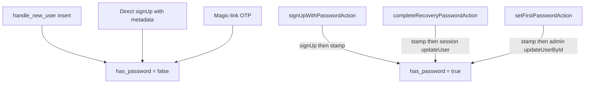

# Epic 2 — Make has_password server-authoritative

> **Track progress:** as you complete each step, update the corresponding `todos` entry's `status` to `completed` in this plan's frontmatter.

> **Precondition:** `git status --porcelain --untracked-files=no` must be empty before the first implementation edit. If dirty, halt and ask the user to commit or stash. (Untracked files, e.g. the active plan file in `.cursor/plans/`, are not a halt.) The epic must land as a single commit containing only this epic's work.

Epic 1’s grant migration and audit edits are still uncommitted. Commit or stash that work first — this epic must not sweep it in.

The flag is a security control ([ADR-0012](docs/adr/ADR-0012-first-password-elevated-write-gated-on-flag.md)). After this epic, client metadata cannot set it, and every in-app password write that should flip it does so on the same awaited server path that wrote the password.



## Why this shape

- **S013:** [`handle_new_user`](supabase/migrations/20260827223154_profiles_has_password.sql) currently reads `raw_user_meta_data`. That is client-supplied. Default the insert to `false` and drop `data: { has_password: true }` from [`sign-up-form.tsx`](src/components/sign-up-form.tsx).
- **Password sign-up still needs a stamp** or every in-app password account would show Set Password (the S013 leftover, as the default). Confirm-link stamping is not viable: [`confirm-signup.html`](supabase/templates/confirm-signup.html) uses `type=email`, and that same template is the first-time magic-link path. `auth.users` cannot tell a chosen password from the platform hash.
- **S008:** [`update-password-form.tsx`](src/components/update-password-form.tsx) currently `void markHasPasswordAction()` and navigates on the next line. Fold the password write and the stamp into one server action. Await it. Navigate only on `success: true`.
- **Recovery must use the session client** `updateUser({ password })`, not `auth.admin.updateUserById`. A recovery session is exempt from Secure password change; a normal session is not. Using the admin API here would let any signed-in caller set a password without the current one.

## Out of scope

- A `check:*` scanner for unpaired client `updateUser({ password })` (S008 named it as a later consideration; after this epic the only remaining client password write is Change Password with `current_password`, which does not stamp).
- Moving Change Password in [`profile-password-section.tsx`](src/app/(app)/_components/profile/profile-password-section.tsx) off the client.
- Stamping on [`/auth/confirm`](src/app/auth/confirm/route.ts).
- S009, F169 (recovery `getUser` email failure), and any other audit item.

## Step 1 — Trigger always inserts false

Follow [create-migration](.cursor/skills/create-migration/SKILL.md): first line `-- Generated using the create-migration skill`; UTC timestamp from `date -u +%Y%m%d%H%M%S`, strictly after `20260828141556`.

File: `supabase/migrations/{timestamp}_handle_new_user_has_password_default_false.sql`

Header comment block per `supabase-sql.mdc` § Style: purpose (default `has_password` to false regardless of client metadata), affected objects (`public.handle_new_user`), RLS: none.

`create or replace` [`handle_new_user`](supabase/migrations/20260827223154_profiles_has_password.sql) so the insert is `(new.id, false)` — do not read `raw_user_meta_data`. Re-apply `revoke all … from public / anon / authenticated` in the same file (`CREATE OR REPLACE` would otherwise restore client EXECUTE). No column change, no RLS change, no `pnpm db:types`.

Write the file and continue to Step 2. **Do not halt here for `pnpm db:push`** — nothing in Steps 2–6 executes against the trigger, and stalling mid-epic strands an uncommitted migration in the working tree against this epic's single-commit precondition. The push is a human step after the commit; see § Handoff.

## Step 2 — Shared auth-error mapping for server actions

[`extractAuthFormError`](src/utils/extract-auth-form-error.ts) imports `clientLog` (`'use client'`), so server actions cannot use it. Split a logging-free mapper (overrides, OTP split, fallback-first — including `user_already_exists` staying unmapped so sign-up does not leak account existence) into e.g. [`src/utils/map-auth-error.ts`](src/utils/map-auth-error.ts). The client wrapper keeps the fallback `clientLog`. Server actions call the mapper and `appLog.error` on unmapped codes.

**The mapper must return whether the code was mapped** — e.g. `{ error: AppError; mapped: boolean }` — not just the `AppError`. Both wrappers gate their fallback log on exactly that fact, and inferring it by comparing the returned message against `AUTH_ERROR_FALLBACK_MESSAGE` couples logging to copy.

Move existing unit cases that pin the mapping onto the new module; keep the client-wrapper tests for the log side.

## Step 3 — Password sign-up is a server action that stamps

New `'use server'` module under the auth route group: [`src/app/auth/_lib/sign-up/actions.ts`](src/app/auth/_lib/sign-up/actions.ts) (unauthenticated surface — do not add this to [`profile/actions.ts`](src/app/(app)/_lib/profile/actions.ts)).

The surface folder and the `actions.ts` filename are both load-bearing, not cosmetic. `project-standards.mdc` § Utilities & Helpers Location: nested under `_lib/` means one surface owns it, flat means the route group does — and `auth/_lib/auth-error-messages.ts` is already the flat, group-shared case. The filename matters because `forms.mdc`, `error-handling.mdc`, and `notifications.mdc` all attach on `src/**/actions.ts` / `src/app/**/actions.ts`; a file named `sign-up-action.ts` loads none of the three on any future edit.

- Zod at the boundary: email + password (`MIN_PASSWORD_LENGTH`). Repeat-password stays client-only.
- `createClient()` → `auth.signUp({ email, password, options: { emailRedirectTo } })` with `emailRedirectTo` from `getSiteUrl().origin + APP_HOME` (not `window.location.origin`). No `options.data`.
- **`emailRedirectTo` changes behavior, not just its source.** `getSiteUrl()` prefers `NEXT_PUBLIC_SITE_URL` over the deployment host, so a preview deploy carrying the production value will send confirmation links to production rather than to itself. Local dev is unchanged (both resolve `http://localhost:3000` when the var is unset). Required by AGENTS.md § Hard constraints — `window` does not exist server-side and `check:seo-base-url` bars any other resolver — so this is a consequence to expect in testing, not a choice to revisit.
- Map AuthError through the shared mapper; never return a raw Supabase message.
- **Stamp only a real new user.** If `data.user` is missing, or `identities` is empty (GoTrue’s existing-user anti-enumeration payload), return `{ success: true }` and do **not** stamp — an empty-identities body can carry a real id, and stamping it would flip a victim magic-link account to Change Password.
- Otherwise service-client `update { has_password: true }` on that id. Stamp failure after a successful `signUp` returns a fault envelope (never `success: true` on a partial write). The form does not navigate; the confirmation email may already have been sent — copy must not tell them to retry sign-up (that path is `user_already_exists` / fallback).
- **Name the stamp-failure recovery path.** A failed stamp leaves a real password with `has_password = false`, and sign-up cannot re-stamp it: a retry hits the empty-`identities` branch above, which skips stamping by design. The account then sits in exactly the S013 state this epic closes, and self-heals only through Set Password — the reauth-free elevated write. Log the orphaned user id at `appLog.error` with the `set-first-password`-style tag so the row is findable, and state in this plan (and in the ADR) that manual repair is the recovery path. Do not add an automatic re-stamp on sign-in; that is a new write path and belongs to its own decision.
- Add this file to the ESLint server-only allowlist in [`eslint.config.mjs`](eslint.config.mjs) (service client + `appLog`), matching [`profile/actions.ts`](src/app/(app)/_lib/profile/actions.ts).

[`sign-up-form.tsx`](src/components/sign-up-form.tsx): drop `createClient().signUp` and the metadata stamp. Match passwords on the client, `await signUpWithPasswordAction`, navigate to `/auth/sign-up-success` only on success, otherwise `AppErrorSurface` on the envelope.

## Step 4 — Recovery is one awaited server path

Replace `markHasPasswordAction` with `completeRecoveryPasswordAction` in [`profile/actions.ts`](src/app/(app)/_lib/profile/actions.ts).

This surface — unlike sign-up in Step 3 — belongs here: the caller holds a recovery session, the action reads `getUser()` and writes the caller's own `profiles` row, and it replaces `markHasPasswordAction`, which already lives in this file and is called from the same form. Sign-up has no session and no owner to scope to, which is why it does not.

Steps:

1. `getUser()` — operational `UNAUTHORIZED` if none.
2. Parse password through the existing [`parseSetFirstPasswordInput`](src/app/(app)/_lib/profile/first-password-schema.ts) (same floor).
3. **Flag first**, then session `supabase.auth.updateUser({ password })` (the recovery session is what makes this legal under Secure password change). Flag-first matches `setFirstPasswordAction` and ADR-0012: a failed password write leaves Change Password with recovery-by-email still available.
4. Password failure: map via the shared mapper (weak / same-password stay operational); log faults.
5. `revalidatePath` on `/(app)` **and** `/admin` layouts — matching `setFirstPasswordAction` exactly. Two actions doing the same job with different revalidation is the likelier bug source; a spurious invalidation costs one re-render.

   This closes only the **divergence** half of F170. Its other half — whether the `/admin` revalidation has any consumer at all, which the audit could not find — is unanswered here. See Step 5 for how F170 is recorded.
6. Return `{ success: true, data: { redirectTo: getPostAuthRedirectPath(user.app_metadata) } }`.

Delete `markHasPasswordAction`.

[`update-password-form.tsx`](src/components/update-password-form.tsx): drop the client `updateUser` and the fire-and-forget call. `await completeRecoveryPasswordAction({ password })`. On failure, `setFormError` from the envelope and **do not** `router.push` / `router.refresh`. On success, `router.refresh()` then `router.push(result.data.redirectTo)`.

## Step 5 — ADR, rules, audit close-out

- **Rewrite [ADR-0012](docs/adr/ADR-0012-first-password-elevated-write-gated-on-flag.md) in place.** Do **not** write an ADR-0013 and do **not** set a `Superseded by` status. The recorded decision is unchanged — a first password is still set by an elevated server action gated on `profiles.has_password` — and what moved is only 0012's account of what remained open. Splitting that across two records would duplicate the elevated-write rationale and mark the canonical copy dead. Amending in place keeps the number, so every inbound reference in `SECURITY_AUDIT.md`, `TECH_DEBT_AUDIT.md`, and `security.mdc` survives untouched.

  The rewrite keeps the existing decision and trade-off, and replaces the closing drift paragraph with the completed picture: the trigger always inserts `false`; the three in-app write paths that stamp `true` are the sign-up action, `setFirstPasswordAction`, and the recovery action; confirm-link stamping was rejected because `confirm-signup.html` uses `type=email`, shared with the first-time magic-link path, so `auth.users` cannot distinguish a chosen password from the platform hash. Record the two residual costs: a direct-API `signUp` outside the app still leaves the column `false`, and a stamp that fails after a successful `signUp` needs manual repair (Step 3).

  This edit **overrides** [adr/README.md](docs/adr/README.md) § Immutability, which is left as written. The override is logged in [WORKFLOW_BACKLOG.md](docs/WORKFLOW_BACKLOG.md) § ADR immutability — do not edit `adr/README.md` or `DOC_RULES.md` in this epic.
- [`security.mdc`](.cursor/rules/security.mdc) § Secret key: add the sign-up stamp (and keep first-password). Recovery does **not** use the secret key for the password write.
- [`error-handling.mdc`](.cursor/rules/error-handling.mdc) § Auth form errors: the list of forms sanitizing through `extractAuthFormError` no longer includes `sign-up-form` or `update-password-form` — both now map server-side. State that server actions map through the shared logging-free mapper and log unmapped codes via `appLog.error`, while `clientLog.error('auth-form-error', …)` remains the client-side fallback path.
- Run `/sync-repo-docs` after the rule edits.
- [SECURITY_AUDIT.md](SECURITY_AUDIT.md): move **S008** and **S013** to Resolved (2026-08-28) with a pending-verification line until the manual checks run. Exec summary: replace the S008 Medium bullet with a `Resolved this window` bullet; open counts `2 Medium, 7 Low` → `1 Medium, 6 Low`. Keep the S008 recovery bullet under Human / tooling follow-ups until verified; add an S013 line (direct `signUp` with metadata leaves the column false; in-app sign-up after confirm shows Change Password).
- [SECURITY_AUDIT.md](SECURITY_AUDIT.md) inventory, same pass — these go stale otherwise: § Surface map "Server actions" row (action count and the `markHasPasswordAction` → `completeRecoveryPasswordAction` swap, plus the new sign-up action) and "Admin / privileged" row (four service-client call sites → five); § Verified OK W5, which says service-client imports are "limited to four server modules." Note in W5 that the fifth is the first service-client call site reachable **without** authentication, and that its only reachable write targets the account the caller just created.
- [TECH_DEBT_AUDIT.md](TECH_DEBT_AUDIT.md): **F170 stays open.** It is `Needs decision` and its open question — whether the `/admin` revalidation has any consumer — is not answered by this epic. Update the finding text to record that the divergence half is closed (recovery now matches `setFirstPasswordAction`) and narrow it to the remaining question; leave the § Open questions entry in place. Do not move it to Resolved.

## Step 6 — Tests

Minimum that would catch a real miss:

- [`actions.unit.test.ts`](src/app/(app)/_lib/profile/actions.unit.test.ts) — replace `markHasPasswordAction` cases with `completeRecoveryPasswordAction`: unauthorized; happy path flag-then-`updateUser` (not admin); password failure after flag write is not `success: true`; mapper-covered AuthError is operational and does not navigate (assert envelope). Mock session `auth.updateUser`.
- New `src/app/auth/_lib/sign-up/actions.unit.test.ts` — unauthorized not applicable; validation; `signUp` error mapped; empty `identities` does not stamp and still succeeds; happy path stamps; stamp failure after `signUp` is a fault **and** logs the orphaned user id (Step 3's recovery path depends on that line existing).
- [`sign-up-form.integration.test.tsx`](src/components/sign-up-form.integration.test.tsx) — calls the action, does **not** pass `options.data.has_password`; success still goes to `/auth/sign-up-success`; action failure renders the envelope and does not navigate.
- [`update-password-form.integration.test.tsx`](src/components/update-password-form.integration.test.tsx) — no client `updateUser`; awaits the action; success redirects from `redirectTo`; failure shows `AppErrorSurface` and does **not** `push`.

Do not add a showroom test for the trigger SQL.

## Verification

Quality bar: `pnpm pre-push`. Stop on failure. That is the whole agent-side gate — every behavior below needs a live trigger, so it belongs to the human after `pnpm db:push`.

## Manual-testing checklist (for you, after `pnpm db:push` — trigger body only; skip `pnpm db:types`)

1. Direct/API sign-up with `data: { has_password: true }` — profile row is `has_password = false`.
2. In-app password sign-up → confirm email → profile accordion is **Change Password** with a current-password field.
3. Magic-link (no password) → accordion is **Set Password**.
4. Recovery from a magic-link account: save new password → land signed in → accordion is **Change Password**.
5. Existing password account: Change Password with current password still works (unchanged client path).
6. Sign-up confirmation email points at the host you signed up on — see the `emailRedirectTo` note in Step 3 if it does not.

No hand-injected stamp failure: the fault-envelope and no-navigate behavior is pinned by the unit and integration tests in Step 6, and breaking the service update in a live environment to re-check it is not worth the undo risk.

## Close-out

See **Commit epic** and **Handoff** below.

### Commit epic

Authorized by this approved plan:

1. Review diff; stage only files in scope for this epic.
2. Conventional commit with an `Epic:` trailer — this is the only thing `code-review` uses to find the commit:

```
fix(auth): make has_password server-authoritative

Epic: has-password-server-authoritative
```

3. Commit (request `git_write`). If pre-commit fails, fix and retry (do not amend).
4. Verify `git status --porcelain --untracked-files=no` is empty after commit.

**Do not push.**

### Handoff

Report the epic is committed, then list what's left for the user. This is the **only** `pnpm db:push` point in the epic — Step 1 writes the migration file and does not stop for it.

1. Review the migration SQL, then run `pnpm db:push` (no `pnpm db:types` — the trigger body changed, not the schema).
2. Work through the manual-testing checklist above.
3. Fix and commit anything broken.

Do **not** offer `/mark-epic-complete`. It resolves its target from the first untagged epic in the active phase's PRD, and this epic is ad hoc — every phase on ROADMAP reads `Shipped` and no PRD is `Active`, so the skill halts on its second precondition. Close out by reporting the commit SHA and the audit files touched, and leave it there.
