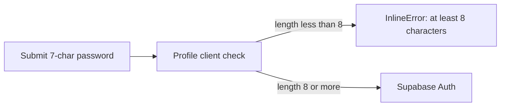

# Epic 5 — Mirror the password minimum (S009, partial)

> **Track progress:** as you complete each step, update the corresponding `todos` entry's `status` to `completed` in this plan's frontmatter.

> **Precondition:** `git status --porcelain --untracked-files=no` must be empty before the first implementation edit. If dirty, halt and ask the user to commit or stash. (Untracked files, e.g. the active plan file in `.cursor/plans/`, are not a halt.) Confirm the current branch is the same one Epics 1–4 landed on; if it is not, halt and ask. The epic must land as a single commit containing only this epic's work.

Ad hoc security-audit epic (no Active PRD), same series as Epics 1–4. Do not offer `/mark-epic-complete`.

This is the length-mirror half of S009 only. Leaked-password protection stays on [BACKLOG.md](BACKLOG.md) (paid-plan gate). Composition rules stay dropped (they break magic-link signup — already warned in README).



## Why this shape

- The dashboard is already 8 ([BACKLOG.md](BACKLOG.md)). [`src/constants/auth.ts`](src/constants/auth.ts) still says 6, so the app is the weak side.
- [`profile-password-section.tsx`](src/app/(app)/_components/profile/profile-password-section.tsx) already checks `MIN_PASSWORD_LENGTH` before `updateUser`. Raising the constant is what makes a 7-character password fail **client-side** with the existing InlineError copy — that is the success criterion.
- Sign-up and first-password/recovery server schemas already import the same constant, so they move with it. No new validation code.
- The dashboard setting is not in the repo. A spinoff inherits none of it. Kickoff must say so; README Initial setup is the durable sibling (kickoff **Keeps** that section).

## Out of scope

- F114 (sign-up / recovery `useState` forms do not apply the length check client-side). A 7-character sign-up still reaches the server action, where zod rejects it before Supabase. Do not add those checks here.
- F152 itself (the reference preview keeps its own local constant rather than importing `@/constants/auth`). Only the literal value moves in this epic — see Step 1.
- Leaked-password protection, composition rules, `config.toml` password policy, raising past 8.
- Asking kickoff to grill a number. 8 is settled. Kickoff instructs; it does not re-decide.

## Step 1 — Constant and comment

In [`src/constants/auth.ts`](src/constants/auth.ts):

- Set `MIN_PASSWORD_LENGTH = 8`.
- Give it its own JSDoc naming the dashboard as source of truth: **Authentication → Settings → Password Requirements**, dashboard is authoritative.
- Move the constant out from between the OTP exports. Note the existing `/** Mirror of Supabase Dashboard → Authentication settings … */` is a JSDoc bound to `AUTH_OTP_CODE_LENGTH` alone, not a file-level comment — moving `MIN_PASSWORD_LENGTH` out would leave `AUTH_OTP_LIFETIME_MINUTES` and `AUTH_OTP_MIN_SEND_INTERVAL_SECONDS` undocumented. Promote it to a real file-level comment covering the OTP group (Authentication → Providers → Email), so each of the two dashboard screens is named where its constants live.

No other production call sites need edits. [`sign-up/schema.ts`](src/app/auth/_lib/sign-up/schema.ts), [`first-password-schema.ts`](src/app/(app)/_lib/profile/first-password-schema.ts), and the profile section already import the constant.

Also in [`reference-profile-settings-preview.tsx`](src/app/(marketing)/reference/_components/reference-profile-settings-preview.tsx): change the local `const MIN_PASSWORD_LENGTH = 6` to `8`. `/reference` is a public page whose password demo would otherwise render "at least 6 characters" while the app enforces 8, and every spinoff inherits that. Value only — the duplicate-constant debt (F152) stays open.

## Step 2 — Pin the 7-character client rejection

Update [`profile-password-section.integration.test.tsx`](src/app/(app)/_components/profile/profile-password-section.integration.test.tsx): the short-password case currently types `123` and asserts `/at least 6 characters/i`.

- Type a **literal** 7-character password in both fields (e.g. `1234567`).
- Assert a **literal** `/at least 8 characters/i`.
- Keep `mockUpdateUser` / `setFirstPasswordAction` not called.

Both values are literals on purpose. Deriving the input from `MIN_PASSWORD_LENGTH` and the expected message from the same constant makes the test self-referential — it would pass at 6, 8, or 12, and would have passed before this change, so it guards nothing this epic does. Literals mean a silent revert to 6 fails the suite, and a future deliberate policy change is a two-line edit here, which is correct.

Do not add a new schema unit test — the existing action tests already use the constant (`'password123'` is still valid).

## Step 3 — Kickoff step and README line

**project-kickoff** ([`docs/claude-skills/project-kickoff.skill`](docs/claude-skills/project-kickoff.skill) — zip of `project-kickoff/SKILL.md`, `outputs.md`, `instructions-template.md`):

- In `outputs.md`, after the six file writes and before the instructions-block close, insert this step **verbatim** — do not paraphrase or re-word it:

  > **Set the password minimum in the new project's Supabase dashboard.** Go to Authentication → Settings → Password Requirements and set the minimum password length to match `MIN_PASSWORD_LENGTH` in `src/constants/auth.ts` (8). The dashboard is authoritative and is not part of the clone, so a new project inherits none of this setting.

- In `SKILL.md` **Done when**: add a condition that the handoff named that dashboard step.

The copy above is the reviewed text; composing your own wording here is out of scope, because the skill-authoring standard that governs it is Claude-side and not loaded in this session. The `SKILL.md` **Done when** line is one clause matching the surrounding style — keep it short.

Do not add this to the required floor (that is for grilled identity facts). Unpack, edit, re-zip with the same `project-kickoff/` prefix. Do not run `skill-creator` unless it is already on the machine. Because the committed artifact is a zip, print the changed `outputs.md` step and the new `SKILL.md` line to the terminal after re-zipping — the diff itself is binary and unreviewable.

**README** ([`README.md`](README.md) Initial setup, next to the OTP settings bullet):

- **Password minimum** — Authentication → Settings → Password Requirements. Must match `MIN_PASSWORD_LENGTH` in `src/constants/auth.ts` (8). Seminova's dashboard is 8 as of 2026-08-28; spinoffs must set it. Point at the existing character-requirements warning (composition rules break magic-link signup).

Kickoff **Keeps** Initial setup, so this line is what a spinoff actually inherits in the repo. The skill change is the chat reminder that the dashboard itself is not cloned.

Then `/sync-repo-docs` (README setup change). Expect no DESIGN.md / rules-index edit.

## Step 4 — Audit (partial S009)

[`SECURITY_AUDIT.md`](SECURITY_AUDIT.md):

- Rewrite the exec-summary Medium bullet: length floor is now 8 and mirrored; remaining S009 is leaked-password protection (blocked on paid plan). Confirm the `Open: 1 Medium, 4 Low` count still reads true.
- S009: update description (`MIN_PASSWORD_LENGTH = 8`), note the 6 → 8 mirror landed this window. Status **Deferred** (leaked-password gated on paid; composition already rejected). Recommendation no longer asks for a length PM call.
- S009 severity: the original Medium was driven mostly by the 6-character floor. Re-grade against what actually remains (leaked-password protection only), or leave it Medium with one clause saying why it still holds. Do not leave the grade unexamined.
- S009: record the length decision so a future audit does not re-open it — 8 was chosen to mirror the dashboard, over this finding's own "12 preferred for a template others inherit." One clause in the S009 row.
- Open questions: the line reads “S009 and S015 need a PM decision before anyone writes code.” Rewrite it to S015 only — do not delete the line.
- Human follow-up: rewrite the S009 confirmation bullet to a one-line confirm that the live dashboard minimum is 8 and matches the constant, dropping the “whether to raise it” framing. **Keep the second half intact** — whether `auth.admin.updateUserById` (the first-password path) applies the project's password policy is a separate unverified question and survives this epic.

In [`BACKLOG.md`](BACKLOG.md) “Password security baseline”, trim the **Per-project, not just code** bullet: its three asks (a `project-kickoff` step, a README setup line, a comment on the constant naming the dashboard as source of truth) all ship in this epic. Leave the rest of the entry alone — the baseline itself is still open. Do not close F114 / F152.

Last synced: 2026-08-28.

## Step 5 — Quality bar and commit

`pnpm pre-push`. Stop on failure.

Authorized commit (same trailer shape as Epics 2–4):

```
fix(auth): mirror dashboard password minimum of 8

Epic: mirror-password-minimum
```

Do not push. Do not offer `/mark-epic-complete`.

## Manual-testing checklist (after commit, with dev server)

1. Signed in, Profile → Change Password (or Set Password). Type 7 matching characters in new + confirm. Submit. Inline message: **Password must be at least 8 characters.** Network tab: no Supabase Auth request. That is the success criterion.
2. Same form, 8 matching characters plus the current password if shown. Submit succeeds (or fails only on a wrong current password — not on length).
3. `/reference` → Forms section → profile settings preview → password accordion. Type 7 characters; the demo message reads **at least 8 characters**, matching the app.
4. Confirm [`docs/claude-skills/project-kickoff.skill`](docs/claude-skills/project-kickoff.skill) unzipped `outputs.md` contains the dashboard step, worded as written in Step 3.

No `db:push`. Dashboard is already 8; this epic does not ask you to change it.

**You, after merge:** re-upload `project-kickoff.skill` in Claude Desktop (Customize → Skills). Installed skills are account-side copies; the repo file does not update them.
